# Instalasi MySQL
## Menggunakan Termux
1 . Berikan akses Termux ke memori internal
**Termux-setup-storage**
PBB pg

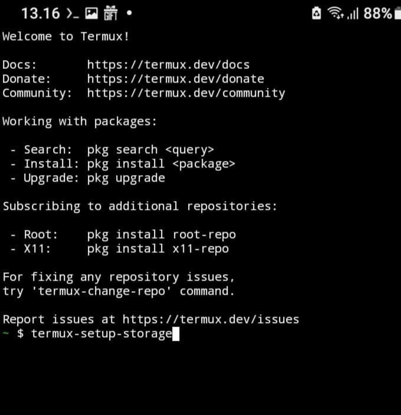

2 . Muncul pop-up untuk meminta izin akses ke memori 
internal klik izinkan/allow acces. 
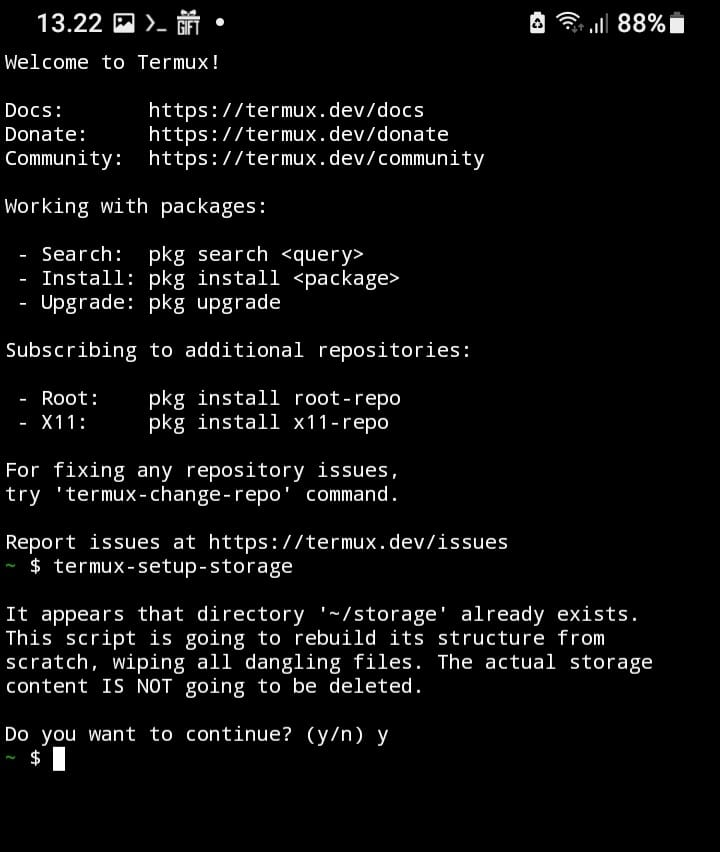

3 . Lakukan update dan sekaligus upgrade paket
**Pkg update && upgrade -y**

4 . Jika ada konfirmasi untuk melanjutkan instalasi. Silahkan klik **y** dan enter
5 . Instal aplikasi MariaDB
**Pkg install mariadb**
6 . Memberikan akses aman ke MySQL
**Mysqld_safe**
7 . Hentikan proses
**CTRL+Z**
8 . Masuk ke akun admin
**MySQL -u root**


## Referensi video YouTube 
https://youtu.be/rT93qlWBhoQ?si=icUNByWK57GIuo0v

# Penggunaan Awal Mysql
Query
`MySQl -u root -p`

Hasil
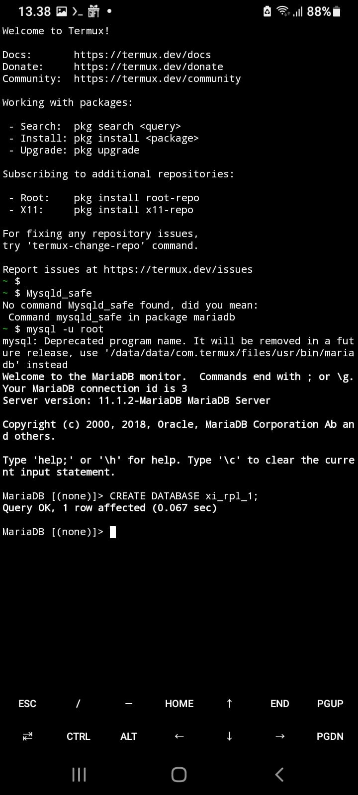
Analisis
- MySQL =melibatkan penyimpanan, pengambilan, dan manipulasi data dalam basis data. 
- -u = untuk menentukan nama pengguna (username) saat melakukan operasi yang melibatkan koneksi ke server database.
- root = nama pengguna atau user name 
- -p = adalah pasword untuk memasukkan kata sandi. 

>[!info]-
Kesimpulan
`mysql -u root -p` digunakan untuk mengakses server MySQL dengan menggunakan pengguna root dan meminta pengguna untuk memasukkan kata sandi.

# Data Base
## Buat Data Base

### Struktur
```
Create database [nama_database];
```
### Contoh
```
create database xi_rpl_1;
```


- `Create`:  digunakan untuk membuat objek baru dalam basis data, seperti tabel, database, atau indeks.
- `database`: sebuah data base yang ingin kita buat. 
- `xi_rpl_1`: nama database yang telah di buat. 
- `;`: menandakan akhir dari perintah yang diberikan.
Kesimpulan:
`create database xi_rpl_1;` digunakan untuk membuat sebuah database baru dengan sebuah nama `"xi_rpl_1"`
Dan diakhiri tanda titik koma. 

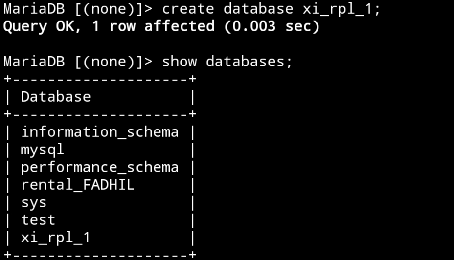

## Tampilkan database 
### Struktur
```
SHOW DATABASES;
```

- `SHOW`: untuk menampilkan informasi database yang telah dibuat. 
- `DATABASES`: adalah kata kunci tambahan yang menandakan bahwa kita ingin menampilkan database yang telah dibuat.
- `;`: menandakan akhir dari perintah yang diberikan.
Kesimpulan:
`SHOW DATABASES` yang digunakan untuk menampilkan daftar semua database yang  telah dibuat dan diakhiri tanda titik koma. 
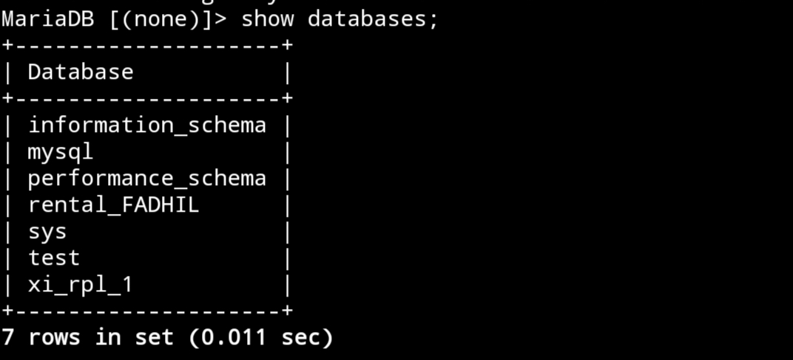
## Hapus database 
### Struktur
```
DROP DATABASE [NAMA_DATABASE];
```
### Contoh
```
DROP DATABASE xi_rpl_1;
```
- `DROP` :  Sebuah Perintah untuk menghapus sesuatu. 
- `DATABASE`: Menandakan kita ingin menghapus sebuah data base. 
- `xi_rpl_1` : Sebuah nama data base yang ingin di hapus. 
- `;`: menandakan akhir dari perintah yang diberikan. 
Kesimpulan:
perintah `"DROP DATABASE xi_rpl_1;"` digunakan untuk menghapus sebuah database yang bernama `"xi_rpl_1"` dan diakhiri tanda titik koma. 
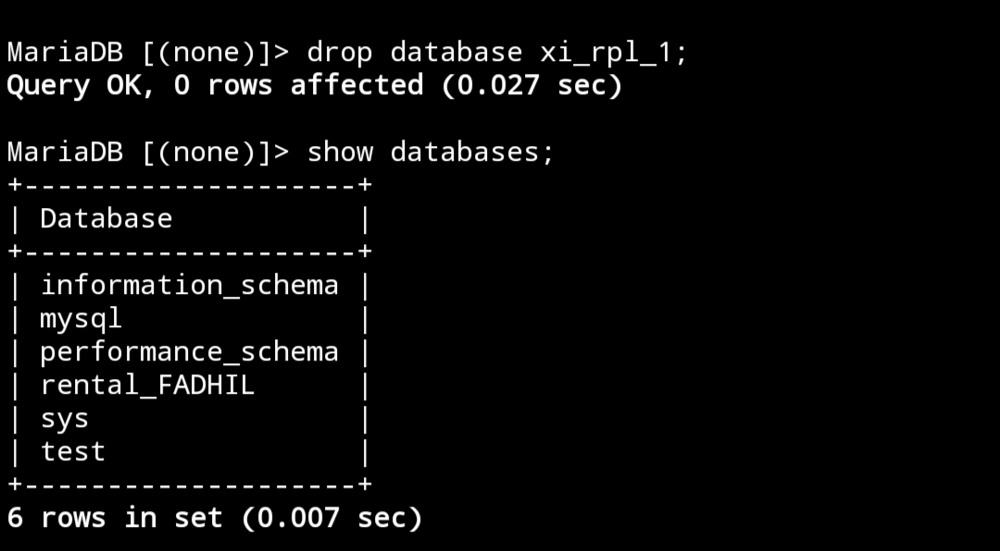

Perbedaan nya terletak sebelum dihapus dimana sebelum dihapus ada data base xi_rpl_1 setelah dihapus data base tersebut tidak ada. 
## gunakan database 
### Struktur
```
USE [nama_database];
```
### Contoh:
```
USE xi_rpl_1;
```
- `USE`: Perintah yang digunakan untuk memilih atau beralih ke sebuah database tertentu.
- `xi_rpl_1` : adalah nama database yang ingin kita gunakan atau aktifkan. 
- `;`: menandakan akhir dari perintah yang diberikan. 
Kesimpulan:
`USE xi_rpl_1;` digunakan untuk memilih atau beralih ke database yang bernama `xi_rpl_1` dan diakhiri tanda titik koma. 
**HASiL** : 

 

# Tipe data
## Angka
Integer (bilangan bulat) dan Floating-point (bilangan desimal). Integer digunakan untuk nilai bulat seperti 1, 10, atau -5, sementara Floating-point digunakan untuk nilai desimal seperti 3.14 atau -0.5.
## Teks
- `VARCHAR` : digunakan untuk menyimpan teks dengan panjang variabel, seperti nama, alamat, email. 
- `CHAR` : digunakan untuk menyimpan teks dengan panjang  seperti kode pos
- `Text` :digunakan untuk teks panjang seperti deskripsi atau catatan
## Tanggal
`DATE` :  digunakan untuk menyimpan tanggal seperti  2024-01-28
`TIME` : digunakan untuk menyimpan waktu seperti 15:30:22
`DATETIME` : digunakan untuk menyimpan tanggal dan waktu
Seperti "2024-01-28  15:30:22 "
## Bolean 
`Bolean` atau `bool` : digunakan untuk menyimpan nilai benar  (true ) atau salah (false). 

## Tipe Data Pilihan
## Enum 
Enum: Sekumpulan nilai yang hanya bisa kita memilih satu. Seperti jenis kelamin, dan kelas. 

## Set 
SET: Menyimpan satu set nilai dari daftar yang telah ditentukan sebelumnya. Nilai-nilai dalam SET diurutkan sesuai dengan urutan deklarasinya.

# Tabel 

## Buat tabel

### Struktur
```
Create database rental_FADHIL;`
create table pelanggan (id_pelanggan int(4) primary key not null, nama_depan varchar(25) not null, nama_belakang varchar(25), no_telpon char(12) unique);`
```

**Penjelasan**
- `create table pelanggan` : adalah code yang digunakan untuk membuat sebuah tabel baru dan pelanggan 
adalah nama tabel nya
- `id_pelanggan`, `nama_depan`, `nama_belakang`, `no_telpon` merupakan judul kolom
- `int(4)` merupakan tipe data angka dan 4 adalah jumlah maksimal inputan
-  `varchar(25)` merupakan tipe data yang Menyimpan string karakter dengan panjang variabel (variable-length) maksimal dan 25 adalah jumlah maksimal inputan. 
-  char(12) merupakan tipe data yang menyimpan string karakter tetap (fixed-length) dengan panjang n dan 12 adalah jumlah maksimal inputan
- `primary key` sebagai identitas yang untuk membedakan setiap baris yang ada didalam suatu tabel
-  `unique` untuk memastikan bahwa setiap baris data yang terdapat dalam suatu tabel bersifat unik (tidak sama). 
Kesimpulan:
`CREATE TABLE Pelanggan"` digunakan untuk membuat tabel baru bernama `"Pelanggan"` dengan empat kolom: `id_pelanggan, nama_depan, nama_belakang, dan no_telpon`, bersama dengan batasan-batasan yang ditetapkan untuk masing-masing kolom.


## Struktur tabel
Query:
```
Create database rental_FADHIL;
Desc Pelanggan;
```
**Penjelasan**

- `Create`:  digunakan untuk membuat objek baru dalam basis data, seperti tabel, database, atau indeks.
- `database`: sebuah data base yang ingin kita buat. 
- `rental_FADHIL` : adalah nama yang yang kita ketik untuk database yang ingin kita buat. perintah ini, kita bisa membuat sebuah wadah untuk menyimpan tabel, data, dan objek lainnya. 
- `;`: menandakan akhir dari perintah yang diberikan. 
- `Desc` :adalah singkatan dari `"DESCRIBE"` atau `"DESCRIBE TABLE"`.  digunakan untuk menampilkan deskripsi atau struktur tabel yang spesifik.
- `Pelanggan`: adalah nama tabel yang ingin kita jelaskan strukturnya.  kita ingin mengetahui informasi mengenai struktur tabel `"Pelanggan".`
Kesimpulan:
`CREATE DATABASE rental_FADHIL;"` digunakan untuk membuat database baru dengan nama `"rental_FADHIL"`, dan perintah `"DESC Pelanggan;"` digunakan untuk menampilkan struktur tabel `"Pelanggan"` yang ada dalam database. 


## Menampilkan Daftar Tabel
### Struktur
```
Show tables
```

**Penjelasan**
 - `SHOW`: untuk menampilkan informasi database yang telah dibuat. 
 - `DATABASES`: adalah kata kunci tambahan yang menandakan bahwa kita ingin menampilkan database yang telah dibuat.
 - `;`: menandakan akhir dari perintah yang diberikan.
Kesimpulan:
`SHOW DATABASES` yang digunakan untuk menampilkan daftar semua database yang  telah dibuat dan diakhiri tanda titik koma. 


## QNA 

>[!info]- Mengapa hanya kolom id_pelanggan yang menggunakan constrains PRIMARY KEY? 
>Untuk membedakan id Pelanggan  yang sama, mencegah duplikasi, dan mempermudah pencarian data. 

>[! Info]- Mengapa pada kolom no_telp yang menggunakan tipe data char bukan varchar? 
>
Tipe data char menyimpan data dalam karakter panjang lebih efisien. pencarian pada kolom tipe data `CHAR` dapat lebih cepat


>[! Info]- Mengapa hanya kolom no_telp yang menggunakan constrains UNiQUE? 
>Karna no_telp tidak ada yang sama semua pasti berbeda dan nilainya unik maka menggunakan constrains unique artinya data dalam tabel id_telpon berbeda tidak ada yang sama. 


>[! Info]- Mengapa kolom no_telp tidak memakai constrains NOT NULL ,  sementara kolom lainnya menggunakan constrains tersebut? 
>Nomor telpon dianggap opsional. nomor telepon hanya menjadi wajib saat pengguna melakukan langkah-langkah tertentu, Anda mungkin tidak ingin mengharuskan pengguna mengisinya pada tahap awal.

>[! Info]- perbedaan PRIMERY KEY dan UNIQUE 
>PRIMERY KEY untuk membedakan data yang sama dan hanya boleh 1 dan tidak boleh tidak ada. 
Kalau UNiQUE sebuah kolom yang memiliki data yang berbeda atau tidak sama unique boleh 1,2,3 Dan seterusnya dan boleh tidak ada. 
>

# Insert
## Insert 1 Data 

### Struktur
```
Insert into [nama tabel]
Values(nilai 1,nilai 2,nilai 3..)
```

### Contoh 
```
insert into Pelanggan
values(1, "Ahmad", "Satya", "089587652345")
```

**Penjelasan**
- `Insert into`:  Digunakan untuk memasukkan data baru kedalam tabel. 
- `Pelanggan` : Nama tabel yang akan Kita memasukkan data. 
- `Values` : kata kunci yang menandakan bahwa kita akan menyediakan nilai-nilai yang ingin disisipkan ke dalam tabel.
- `(1, "Ahmad", "Satya", "089587652345")`: adalah nilai-nilai yang akan dimasukkan ke dalam tabel `"Pelanggan"`. Urutannya adalah `(1) id_pelanggan`, `(" Ahmad)nama depan`  `("Satya")nama_belakang`, dan `("089587652345")no_telp`.
Kesimpulan:
perintah `"INSERT INTO Pelanggan VALUES(1, 'Ahmad', 'Satya', '089587652345')"` digunakan untuk menyisipkan data pelanggan baru ke dalam tabel `"Pelanggan"` dengan nilai tertentu untuk setiap kolomnya.
**Hasil**


## Insert >1 data

### Struktur
```
Insert into [nama tabel]
Values
(2, "FGHI","IHGF","08**")
(3, "JKLM","MAKE"," 08**")
```

### Contoh
```
insert into Pelanggan 
values(1, 'Ahmad', 'Satya', '089587652345'), (2, 'muh', 'Fadli', '088863628263'),
```


**Penjelasan**

- `Insert into`:  Digunakan untuk memasukkan data baru kedalam tabel. 
- `Pelanggan` : Nama tabel yang akan Kita memasukkan data. 
- `Values` : kata kunci yang menandakan bahwa kita akan menyediakan nilai-nilai . 
-  `(1, "Ahmad", "Satya", "089587652345")`: adalah nilai-nilai untuk baris pertama yang akan dimasukkan ke dalam tabel `"Pelanggan"`. Urutannya adalah `(1) id_pelanggan`, `(" Ahmad")nama depan`  `("Satya")nama_belakang`, dan `("089587652345")no_telp`.
- `(2, "muh", "Fadli", "088863628263")`: adalah nilai-nilai untuk baris kedua yang akan dimasukkan ke dalam tabel `"Pelanggan"`. Urutannya adalah `(2) id_pelanggan`, `("muh")nama depan`  `("Fadli")nama_belakang`, dan `("088863628263")no_telp`.
**Kesimpulan**:
perintah ini, kita menyisipkan dua baris data baru ke dalam tabel "Pelanggan". Setiap baris memiliki nilai-nilai tertentu untuk setiap kolomnya.
**Hasil**


## Menyebut Kolom
### Struktur
```
Insert into [nama_tabel](kolom1,kolom2,kolom3)
Values(nilai1, nilai2, nilai3,..)
```
### Contoh
```
insert into pelanggan (id_pelanggan, nama_depan) values (4,"Ardi") ;
```
**Penjelasan**
- `Insert into`:  Digunakan untuk memasukkan data baru kedalam tabel. 
- `pelanggan`: adalah nama tabel yang ingin kita memilih data. Untuk melihat data dari tabel `"Pelanggan"`.
- `(nama_depan, id)`: adalah daftar kolom yang ingin kita isi dengan nilai. kita ingin mengisi kolom `"nama_depan" dan "id"`.
- `Values (4, " Ardi")`:  adalah bagian dari pernyataan yang menentukan nilai yang akan disisipkan ke dalam tabel. , contoh kita ini menyisipkan nilai `4` untuk kolom ``"id_pelanggan"`` dan nilai `Ardi` untuk kolom `nama_depan`
**KESIMPULAN**
Perintah tersebut akan menyisipkan data baru ke dalam tabel ``"pelanggan"``, dengan nilai `4` untuk kolom ``"id_pelanggan"`` dan nilai `Ardi`untuk kolom `"nama_depan"`.

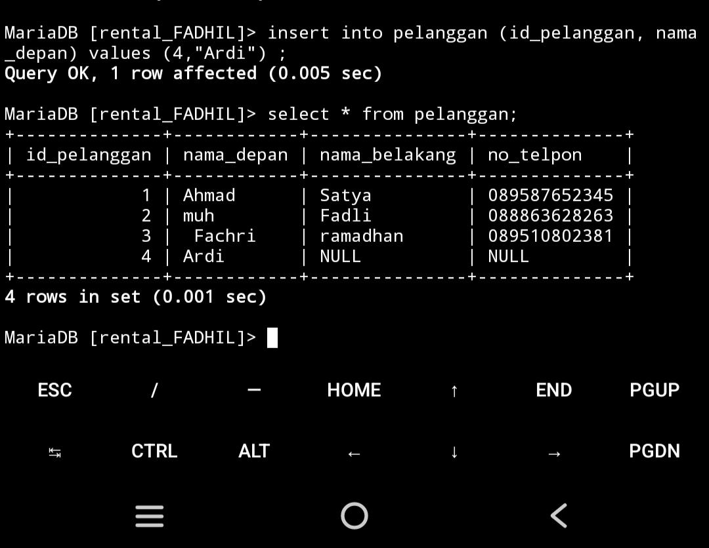

# Select
## Seluruh Data

### Struktur 
```
Select * From [nama_tabel];
```

### Contoh
```
Select * From Pelanggan;
```

**Penjelasan**
- `SELECT`: adalah  perintah yang digunakan untuk memilih data dari sebuah tabel. 
- `*`: Tanda bintang (asterisk) merupakan wildcard yang digunakan dalam perintah `"SELECT"` untuk memilih semua kolom dari tabel yang ditentukan.
- `FROM`: adalah perintah yang menunjukkan sumber data dari mana kita ingin memilih data. 
- `Pelanggan`: adalah nama tabel yang ingin kita memilih data. Untuk melihat data dari tabel `"Pelanggan"`.
**Kesimpulan**:
perintah `"SELECT * FROM Pelanggan"` digunakan untuk memilih semua data dari tabel "Pelanggan". 
**Hasil**
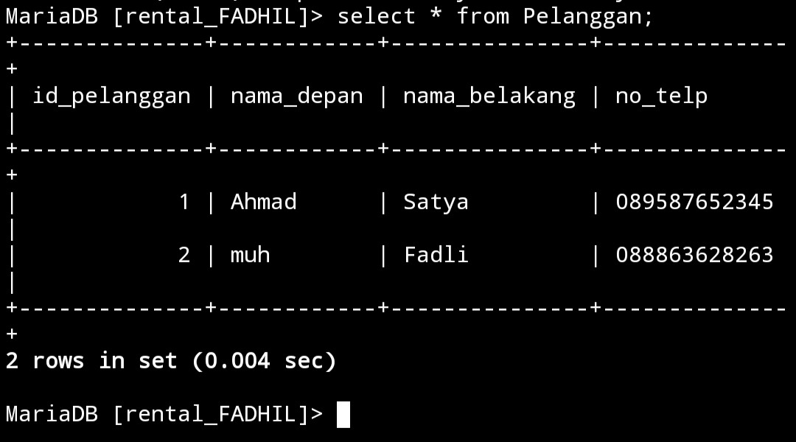

## Data Kolom Tertentu. 
### Struktur
```
Select [nama_kolom1], [nama_kolom2],.. [Nama_kolom_n] from [nama_tabel];
```

### Contoh
```
Select nama_depan From pelanggan;
```

**Penjelasan**
- `SELECT`: adalah  perintah yang digunakan untuk memilih data dari sebuah tabel.
- `nama_depan` : adalah nama kolom yang  kita pilih dari tabel `"Pelanggan"`. Dan dapat memilih satu atau lebih kolom untuk ditampilkan dalam hasil query.
- `From`: adalah perintah yang menunjukkan sumber data dari mana kita ingin memilih data. 
- `pelanggan`: adalah nama tabel yang ingin kita memilih data. Untuk melihat data dari tabel `"Pelanggan"`.
**Kesimpulan**:
perintah `"SELECT nama_depan FROM pelanggan"` digunakan untuk memilih nilai dari kolom `"nama_depan"` dari tabel `"Pelanggan"`.
**Hasil**


## Klausa WHERE 

### Struktur
```
Select [nama_kolom/*] From [nama_tabel] WHERE[kondisi];

```

### Contoh
```
Select id_Pelanggan,nama_belakang from Pelanggan where id_Pelanggan=2;
```


**Penjelasan**
- `SELECT`: adalah  perintah yang digunakan untuk memilih data dari sebuah tabel.
- `id_Pelanggan, nama_belakang`: adalah nama kolom yang  kita pilih dari tabel `"Pelanggan"`. kita ingin memilih nilai dari kolom `"id_Pelanggan" dan "nama_belakang"`.
- `From`: adalah perintah yang menunjukkan sumber data dari mana kita ingin memilih data. 
- `pelanggan`: adalah nama tabel yang ingin kita memilih data. Untuk melihat data dari tabel `"Pelanggan"`.
- `WHERE`: adalah perintah yang digunakan untuk memberikan kondisi untuk pemilihan data. Hanya baris yang memenuhi kondisi yang ditentukan yang akan dipilih.
- `id_Pelanggan=2`: adalah kondisi yang diberikan dalam perintah `"WHERE"`.Kita ingin memilih baris-baris di mana nilai kolom `"id_Pelanggan" sama dengan 2.`
- `;`: menandakan akhir dari perintah yang diberikan. 
**Kesimpulan**:
perintah `"SELECT id_Pelanggan, nama_belakang FROM Pelanggan WHERE id_Pelanggan=2"` digunakan untuk memilih nilai dari kolom `"id_Pelanggan"` dan `"nama_belakang"` dari tabel `"Pelanggan"` di mana nilai kolom `"id_Pelanggan"` sama dengan `2`. Hanya satu baris data yang akan dipilih sesuai dengan kondisi yang ditentukan.


# Update
## Struktur
```
UPDATE nama_tabel  SET nama_kolom  WHERE kondisi;

```
### Contoh
```
UPDATE Pelanggan SET no_telp="089510802381" WHERE id_pelanggan="1";
```


**Penjelasan**:
- `UPDATE`: adalah perintah yang digunakan untuk mengupdate atau memperbarui data yang sudah ada dalam sebuah tabel.
- `Pelanggan`: adalah nama tabel yang akan diupdate. 
- `SET`: adalah perintah  yang menunjukkan kolom mana yang akan diperbarui dan nilai baru apa yang akan dimasukkan ke kolom `no_telp`.
- `no_telp =089510802381:` adalah bagian dari `SET` yang menentukan kolom yang akan diperbarui `(no_telp)`dan nilai baru yang akan dimasukkan ke kolom `no_telp ` `(089510802381)` adalah nomor telepon baru yang akan dimasukkan. 
- `WHERE`: adalah perintah yang digunakan untuk memberikan kondisi untuk memilih baris-baris yang akan diupdate.
- `Id_pelanggan='1'`:  adalah bagian dari `WHERE` yang menentukan kondisi untuk memilih baris mana yang akan diupdate. Seperti kita memilih baris yang memiliki nilai `id_pelanggan sama dengan 1.`
**Kesimpulan**:
perintah `"UPDATE Pelanggan SET no_telp='089510802381' WHERE id_pelanggan='1'"` digunakan untuk memperbarui nilai kolom `"no_telp"`menjadi `089510802381` untuk baris dalam tabel `"Pelanggan"` di mana nilai kolom ``
`"id_pelanggan" sama dengan 1.`


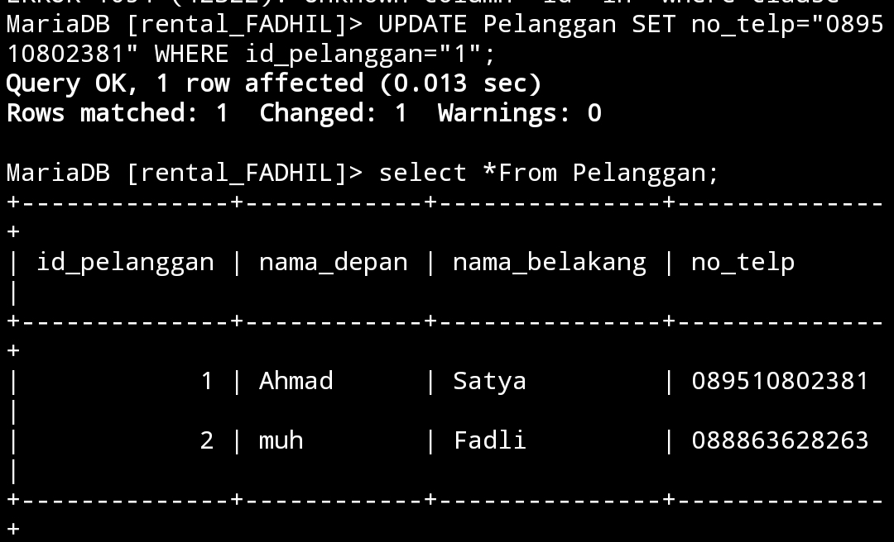

# Delete 
## Struktur
```
DELETE from nama_tabel where kondisi;
```

### Contoh
```
delete from Pelanggan where id_pelanggan =3;
```

**Penjelasan**:
- `DELETE FROM`: adalah  perintah  yang menandakan bahwa kita ingin menghapus baris atau data dari sebuah tabel.
- `Pelanggan`: adalah nama tabel yang ingin kita hapus datanya. 
- `WHERE`: adalah perintah yang digunakan untuk memberikan kondisi untuk memilih baris yang akan dihapus.
- `id_pelanggan = 3`:  adalah kondisi yang diberikan dalam perintah `"WHERE"`. Seperti ingin menghapus baris-baris di mana nilai kolom `"id_pelanggan" sama dengan 3`.
**Kesimpulan**
 Perintah `DELETE FROM Pelanggan WHERE id_pelanggan = 3` digunakan untuk menghapus baris-baris dari tabel `Pelanggan` di mana nilai kolom `id_pelanggan" sama dengan 3`.

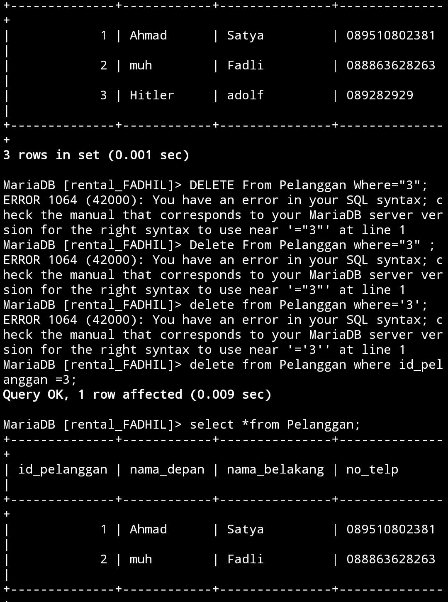


## Hapus Table
### Struktur
```
DROP TABLE [nama_tabel];
```

### Contoh
```
DROP TABLE PELANGGAN
```

**Penjelasan**
- `DROP TABLE` : adalah perintah yang digunakan untuk menghapus sebuah tabel dari database. 
- `Pelanggan`: adalah nama tabel yang ingin kita hapus dari database. Dengan menggunakan perintah ini, kitaakan menghapus seluruh struktur dan data yang terkait dengan tabel `Pelanggan` dari database.
**Kesimpulan**
Perintah `DROP TABLE Pelanggan` digunakan untuk menghapus tabel `Pelanggan` secara permanen dari database.

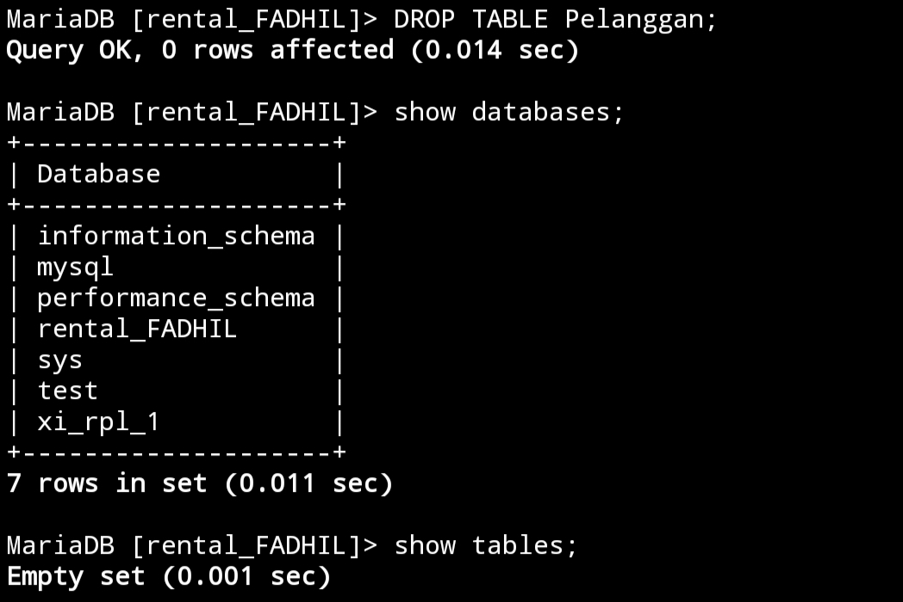

# Tabel 
## Membuat Tabel
###  Contoh Query
```
create table mobil (
    id_mobil int(2) primary key not null, 
     no_plat varchar(10) unique not null, 
     no_mesin varchar(10) unique not null, 
     warna varchar(10) not null, 
     pemilik varchar(25) not null, 
     peminjam varchar(25) , 
     harga_rental int(10) );
```

**Penjelasan**
- `CREATE TABLE`: adalah perintah yang digunakan untuk membuat tabel baru dalam database. 
- `mobil`: adalah nama tabel yang akan dibuat.
- `id_mobil int(2) primary key not null`: Kolom untuk `ID mobil` dengan tipe data `INTEGER`, panjang maksimum `2 digit`, sebagai `PRIMARY KEY`, yang tidak boleh kosong.
- `no_plat varchar(10) unique not null`: Kolom untuk nomor plat mobil dengan tipe data `VARCHAR`, panjang maksimum `10 karakter`, sebagai `UNIQUE`, yang tidak boleh kosong.
- `no_mesin varchar(10) unique not null`: Kolom untuk nomor mesin mobil dengan tipe data `VARCHAR`, panjang maksimum `10 karakter`, sebagai `UNIQUE`, yang tidak boleh kosong.
- `warna varchar(10) not null`: Kolom untuk warna mobil dengan tipe data `VARCHAR`, panjang maksimum `10 karakter`, yang tidak boleh kosong. 
- `pemilik varchar(25) not null`: Kolom untuk nama pemilik mobil dengan tipe data `VARCHAR`, panjang maksimum `25 karakter`, yang tidak boleh kosong.
- `peminjam varchar(25)`: Kolom untuk nama peminjam mobil dengan tipe data VARCHAR, panjang maksimum `25 karakter`. 
- `harga_rental int(10)`: Kolom untuk harga rental mobil dengan tipe data `INTEGER`, panjang maksimum `10 digit`. 
**Kesimpulan**
Perintah `CREATE TABLE mobil` digunakan untuk membuat tabel baru bernama `mobil` dengan tujuh kolom: `id_mobil, no_plat, no_mesin, warna, pemilik, peminjam, dan harga_rental` , bersama dengan batasan-batasan yang ditetapkan untuk masing-masing kolom.
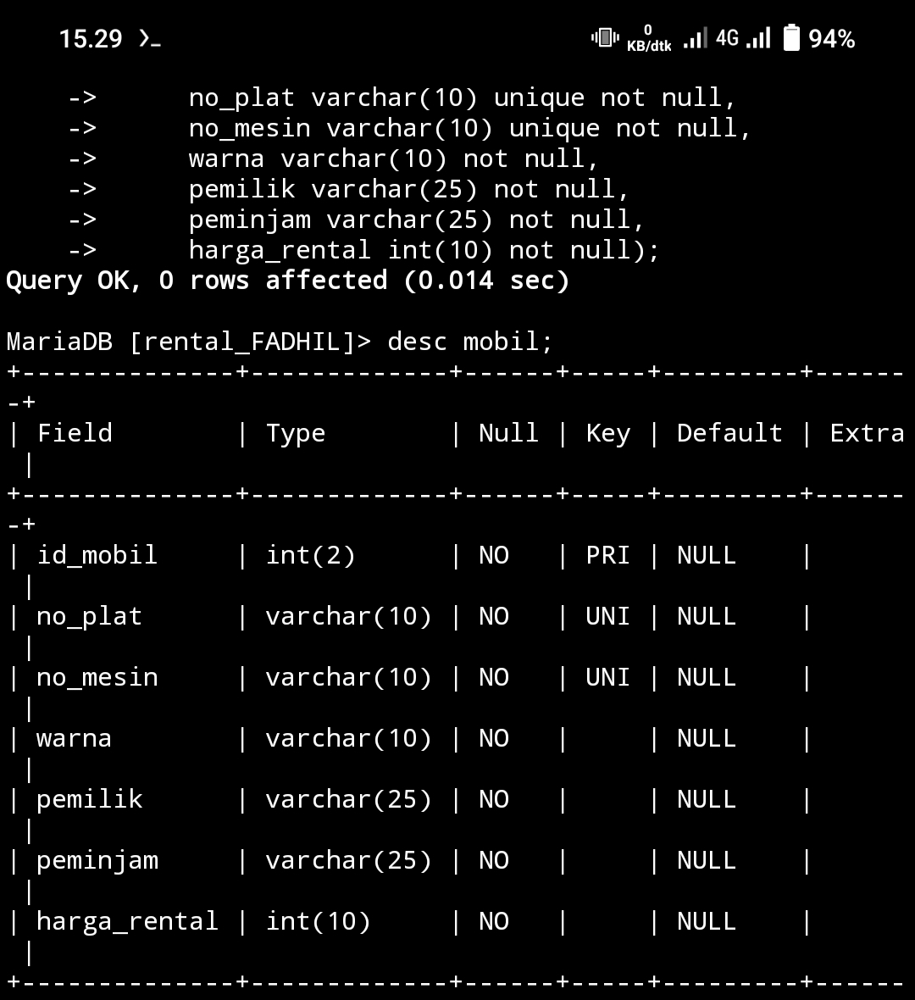

## Masukkan Data 
### Contoh Query
```
Insert into mobil values (1, "DD 2650 XY", "ACX3568","Hitam","Ibrahim","Afdal",50000) , (2, "DD 2440 AX","BCS1120","Merah"," Ibrahim","Elia",100000) , (3, "B 1611 QC"," LSQ1112","Silver","Baim","Anty",50000) , (4, "DD 2901 JK","UQL1029","Hitam","Ibe", Null, 150000) , (5,  "DD 2210 LS", "CJH1011","Hitam","Ibe", NULL, 100000) ;
```

**Penjelasan**
- `Insert into mobil`: adalah perintah yang digunakan untuk menyisipkan data baru ke dalam tabel `mobil`.
- `values`: adalah kata kunci dalam pernyataan SQL yang menunjukkan nilai-nilai yang akan disisipkan ke dalam tabel.
-  `(1, "DD 2650 XY", "ACX3568", "Hitam", "Ibrahim", "Afdal", 50000)`: adalah nilai-nilai yang akan disisipkan ke dalam baris pertama tabel `mobil`. Urutan nilainya sesuai dengan urutan kolom-kolom dalam tabel. Contoh nilai pertama `(1)` adalah untuk kolom `id_mobil`, `DD 2650 XY` adalah untuk kolom `no_plat`, `ACX3568`adalah untuk kolom `no_mesin`, `Hitam` adalah untuk kolom `warna`, `Ibrahim` adalah untuk kolom `pemilik`, `Afdal` adalah untuk kolom `peminjam`, dan `50000` adalah untuk kolom `harga_rental`.
- `(2, "DD 2440 AX", "BCS1120", "Merah", "Ibrahim", "Elia", 100000)`: adalah nilai-nilai yang akan disisipkan ke dalam baris kedua tabel `mobil`. Urutan nilainya sesuai dengan urutan kolom-kolom dalam tabel. Contoh nilai kedua `(2)` adalah untuk kolom `id_mobil`, `DD 2650 XY`adalah untuk kolom `no_plat`, `ACX3568` adalah untuk kolom `no_mesin`, `Merah` adalah untuk kolom `warna`, `Ibrahim` adalah untuk kolom `pemilik`, `Elia` adalah untuk kolom `peminjam`, dan `100000` adalah untuk kolom `harga_rental`.
- `(3, "B 1611 QC","LSQ111","Silver","Baim","Anty"," 50000")` : adalah nilai-nilai yang akan disisipkan ke dalam baris ketiga tabel `mobil`. Urutan nilainya sesuai dengan urutan kolom-kolom dalam tabel. Contoh nilai ketiga `(3)` adalah untuk kolom `id_mobil`, `B 1611 QC`adalah untuk kolom `no_plat`, `LSQ111` adalah untuk kolom `no_mesin`, `Silver` adalah untuk kolom `warna`, `Baim` adalah untuk kolom `pemilik`, `Anty` adalah untuk kolom `peminjam`, dan `50000` adalah untuk kolom `harga_rental`.
- `(4, "DD 2901 JK","UQL1029","Hitam","Ibe", NULL, 150000)`: adalah nilai-nilai yang akan disisipkan ke dalam baris keempat tabel `mobil`. Urutan nilainya sesuai dengan urutan kolom-kolom dalam tabel. Contoh nilai keempat `(4)` adalah untuk kolom `id_mobil`, `DD 2901 JK`adalah untuk kolom `no_plat`, `UQL1029` adalah untuk kolom `no_mesin`, `Hitam` adalah untuk kolom `warna`, `Ibe` adalah untuk kolom `pemilik`, Kolom `peminjam` memiliki nilai `NULL`, yang menunjukkan bahwa tidak ada informasi peminjam yang diberikan untuk mobil ini. , dan `50000` adalah untuk kolom `harga_rental`.
- `(5,  "DD 2210 LS", "CJH1011","Hitam","Ibe", NULL, 100000)`: adalah nilai-nilai yang akan disisipkan ke dalam baris kelima tabel mobil. Urutan nilainya sesuai dengan urutan kolom-kolom dalam tabel. Contoh nilai kelima  `(5)` adalah untuk kolom `id_mobil`, `DD 2210 JK` adalah untuk kolom `no_plat`, `CJH1011` adalah untuk kolom `no_mesin`, `Hitam` adalah untuk kolom `warna`, `Ibe` adalah untuk `kolom pemilik`, `Kolom peminjam` memiliki nilai `NULL`, yang menunjukkan bahwa tidak ada informasi `peminjam` yang diberikan untuk mobil ini. dan `100000` adalah untuk kolom `harga_rental`.
**Kesimpulan**
`INSERT INTO mobil VALUES`, kita menyisipkan beberapa baris data ke dalam tabel `mobil`. Setiap baris data mewakili informasi tentang sebuah `mobil`, seperti `nomor plat, nomor mesin, warna, pemilik, peminjam (jika ada), dan harga rental`. 

