# Pengertian Basis 
Basis dapat di artikel sebagai tempat atau wadah untuk menyimpan data mentah.

# Pengertian Data 
Data adalah sekumpulan data atau informasi yang tersimpan di komputer atau di manapun

# Kesimpulan 
Basis data adalah kumpulan informasi yang di simpan di dalam komputer secara sistematik sehingga dapat di periksa menggunakan suatu program komputer untuk memperoleh informasi dari Basis data tersebut. 

Basis data adalah data mentah yang tersimpan secara sistematik di dalam suatu wadah atau tempat 

# Perangan Basis Data
- Supermarket pengelolaan Harga barang yang input kasir 
- Whatsapp Menyimpan nomor pengguna yang input user yang 
- Pabrik mengelola jumlah produksi stok persediaan barang pengemasan lalu di kirim di agent nanti agent memberikan informasi tentang apa yang di jual warna apa saja dan nanti customer bisa memilih mau beli barang kayak bagaimana.


# Hirarki 
Basis data adalah sekumpulan informasi yang disimpan di dalam komputer secara sistematik sehingga dapat di periksa menggunakan suatu program komputer untuk memperoleh informasi dari basis data tersebut.

| No | Pemain Barca  | Asal negara  | Posisi    |
| -- | ------------- | ------------ | --------- |
| 1  | Messi         | Argentina    | Penyerang |
| 2  | Puyol         | Spanyol      | Bek       |
| 3  | Xavi          | Spanyol      | Gelandang |
| 4  | Suarez        | Uruguay      | Penyerang |

Tabel diatas memiliki 
- Baris yaitu yang lurus kesamping atau horizontal dimana berisi informasi dalam suatu tabel contoh no, pemain barca , asal negara,dan posisi 
- Kolom yaitu yang lurus Kebawah dimana berisi informasi dari suatu baris. Contoh no=1, pemain barca= Messi,  asal negara= Argentina, posisi= Penyerang sampai kebawah atau suarez 
- record adalah kumpulan data terkait untuk satu entitas dalam basis data. Yang merujuk pada no, pemain barca, asal negara.
- Karakter yaitu yang ada dalam suatu tabel seperti karakter, angka.
- item data atau field isi dari tabel yang di buat contoh nya 
  Tabel pemain  Barca item data dalam kolom pemain barca yaitu Messi.


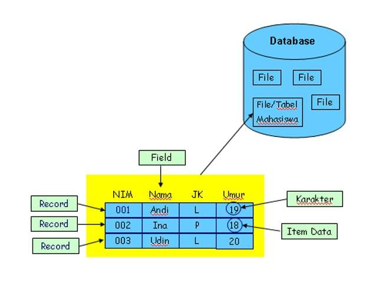

## Pengertian 
- Field adalah bagian terkecil dari sebuah record yang menyimpan data spesifik atau atribut tertentu. 
- Record  adalah kumpulan nilai atau informasi yang terkait satu sama lain dan mewakili satu entitas tunggal. 
- karakter biasanya tertuju pada unit data yang menyimpan simbol tunggal, seperti huruf, angka, atau karakter khusus. 
- Item data  atau field isi dari tabel yang di buat contohnya 
  Tabel pemain  Barca item data dalam kolom pemain barca yaitu Messi.


# Instalasi MySQL
## Menggunakan Termux
1 . Berikan akses Termux ke memori internal
**Termux-setup-storage**
PBB pg

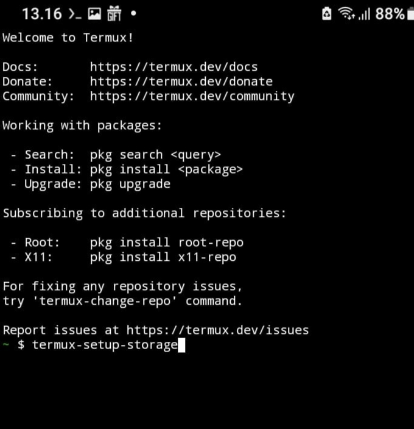

2 . Muncul pop-up untuk meminta izin akses ke memori 
internal klik izinkan/allow acces. 
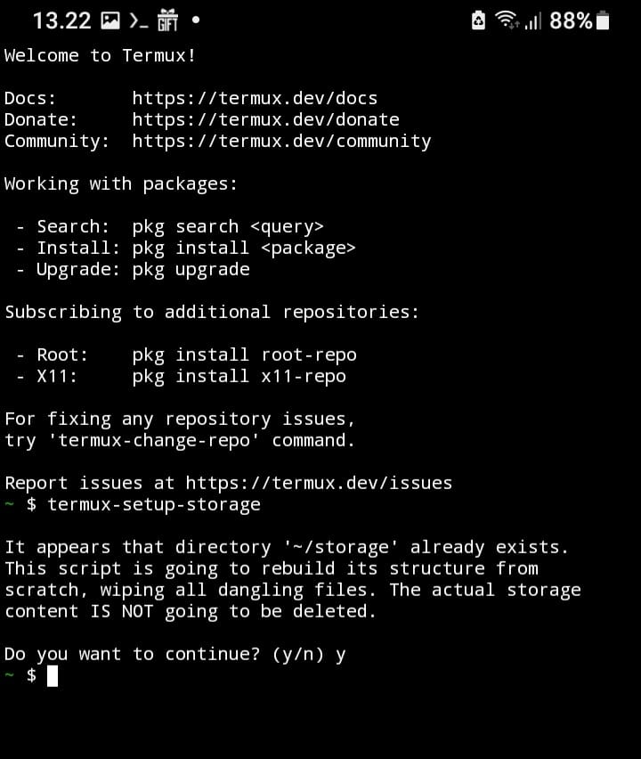

3 . Lakukan update dan sekaligus upgrade paket
**Pkg update && upgrade -y**
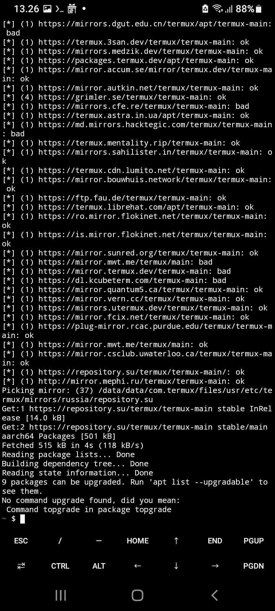
4 . Jika ada konfirmasi untuk melanjutkan instalasi. Silahkan klik **y** dan enter
5 . Instal aplikasi MariaDB
**Pkg install mariadb**
6 . Memberikan akses aman ke MySQL
**Mysqld_safe**
7 . Hentikan proses
**CTRL+Z**
8 . Masuk ke akun admin
**MySQL -u root**
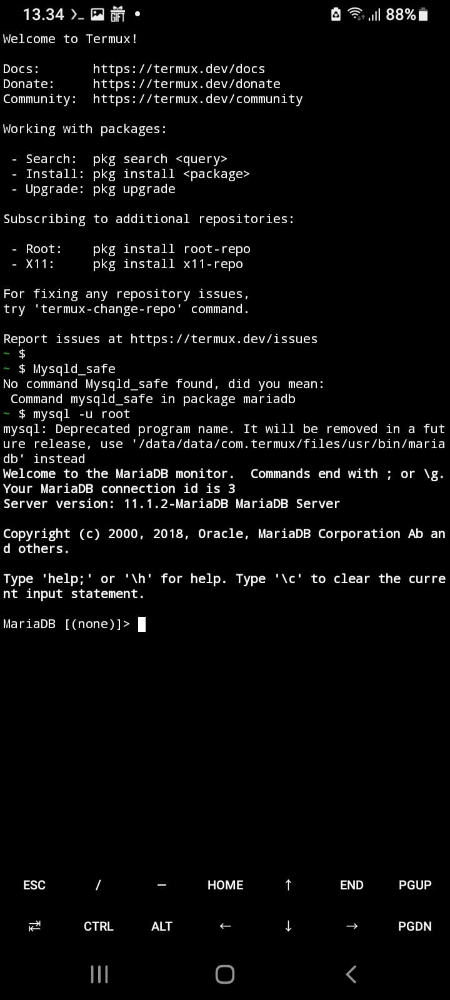

## Referensi video YouTube 
https://youtu.be/rT93qlWBhoQ?si=icUNByWK57GIuo0v

# Penggunaan Awal Mysql
Query
`MySQl -u root -p`

Hasil
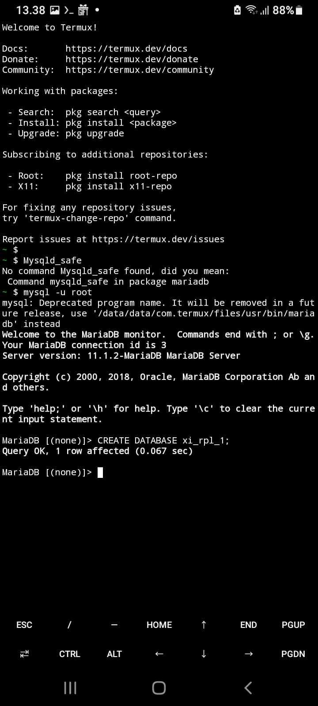
Analisis
- MySQL =melibatkan penyimpanan, pengambilan, dan manipulasi data dalam basis data. 
- -u = untuk menentukan nama pengguna (username) saat melakukan operasi yang melibatkan koneksi ke server database.
- root = nama pengguna atau user name 
- -p = adalah pasword untuk memasukkan kata sandi. 

>[!info]-
Kesimpulan
`mysql -u root -p` digunakan untuk mengakses server MySQL dengan menggunakan pengguna root dan meminta pengguna untuk memasukkan kata sandi.

# Data Base
## Buat Data Base

### Struktur
```
Create database [nama_database];
```
### Contoh
```
create database xi_rpl_1;
```


- `Create`:  digunakan untuk membuat objek baru dalam basis data, seperti tabel, database, atau indeks.
- `database`: sebuah data base yang ingin kita buat. 
- `xi_rpl_1`: nama database yang telah di buat. 
- `;`: menandakan akhir dari perintah yang diberikan.
Kesimpulan:
`create database xi_rpl_1;` digunakan untuk membuat sebuah database baru dengan sebuah nama `"xi_rpl_1"`
Dan diakhiri tanda titik koma. 

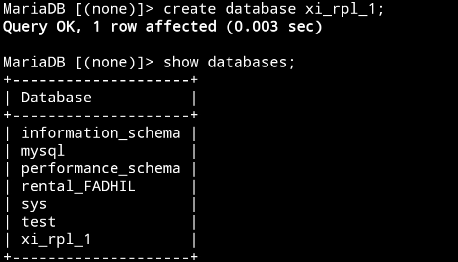

## Tampilkan database 
### Struktur
```
SHOW DATABASES;
```

- `SHOW`: untuk menampilkan informasi database yang telah dibuat. 
- `DATABASES`: adalah kata kunci tambahan yang menandakan bahwa kita ingin menampilkan database yang telah dibuat.
- `;`: menandakan akhir dari perintah yang diberikan.
Kesimpulan:
`SHOW DATABASES` yang digunakan untuk menampilkan daftar semua database yang  telah dibuat dan diakhiri tanda titik koma. 
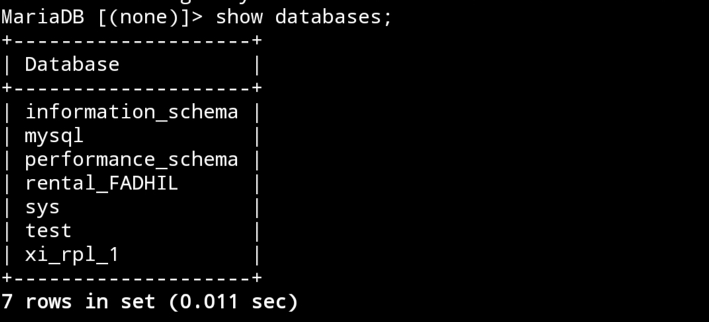
## Hapus database 
### Struktur
```
DROP DATABASE [NAMA_DATABASE];
```
### Contoh
```
DROP DATABASE xi_rpl_1;
```
- `DROP` :  Sebuah Perintah untuk menghapus sesuatu. 
- `DATABASE`: Menandakan kita ingin menghapus sebuah data base. 
- `xi_rpl_1` : Sebuah nama data base yang ingin di hapus. 
- `;`: menandakan akhir dari perintah yang diberikan. 
Kesimpulan:
perintah `"DROP DATABASE xi_rpl_1;"` digunakan untuk menghapus sebuah database yang bernama `"xi_rpl_1"` dan diakhiri tanda titik koma. 
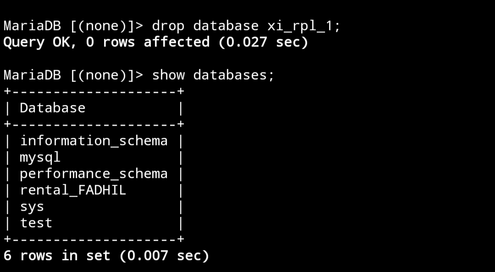

Perbedaan nya terletak sebelum dihapus dimana sebelum dihapus ada data base xi_rpl_1 setelah dihapus data base tersebut tidak ada. 
## gunakan database 
### Struktur
```
USE [nama_database];
```
### Contoh:
```
USE xi_rpl_1;
```
- `USE`: Perintah yang digunakan untuk memilih atau beralih ke sebuah database tertentu.
- `xi_rpl_1` : adalah nama database yang ingin kita gunakan atau aktifkan. 
- `;`: menandakan akhir dari perintah yang diberikan. 
Kesimpulan:
`USE xi_rpl_1;` digunakan untuk memilih atau beralih ke database yang bernama `xi_rpl_1` dan diakhiri tanda titik koma. 
**HASiL** : 

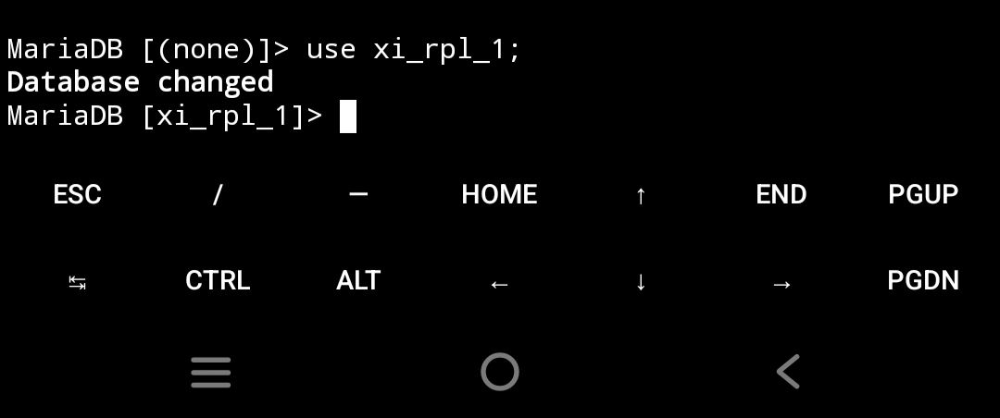 

# Tipe data
## Angka
Integer (bilangan bulat) dan Floating-point (bilangan desimal). Integer digunakan untuk nilai bulat seperti 1, 10, atau -5, sementara Floating-point digunakan untuk nilai desimal seperti 3.14 atau -0.5.
## Teks
- `VARCHAR` : digunakan untuk menyimpan teks dengan panjang variabel, seperti nama, alamat, email. 
- `CHAR` : digunakan untuk menyimpan teks dengan panjang  seperti kode pos
- `Text` :digunakan untuk teks panjang seperti deskripsi atau catatan
## Tanggal
`DATE` :  digunakan untuk menyimpan tanggal seperti  2024-01-28
`TIME` : digunakan untuk menyimpan waktu seperti 15:30:22
`DATETIME` : digunakan untuk menyimpan tanggal dan waktu
Seperti "2024-01-28  15:30:22 "
## Bolean 
`Bolean` atau `bool` : digunakan untuk menyimpan nilai benar  (true ) atau salah (false). 

## Tipe Data Pilihan
## Enum 
Enum: Sekumpulan nilai yang hanya bisa kita memilih satu. Seperti jenis kelamin, dan kelas. 

## Set 
SET: Menyimpan satu set nilai dari daftar yang telah ditentukan sebelumnya. Nilai-nilai dalam SET diurutkan sesuai dengan urutan deklarasinya.

# Tabel 

## Buat tabel

### Struktur
```
Create database rental_FADHIL;`
create table pelanggan (id_pelanggan int(4) primary key not null, nama_depan varchar(25) not null, nama_belakang varchar(25), no_telpon char(12) unique);`
```

**Penjelasan**
- `create table pelanggan` : adalah code yang digunakan untuk membuat sebuah tabel baru dan pelanggan 
adalah nama tabel nya
- `id_pelanggan`, `nama_depan`, `nama_belakang`, `no_telpon` merupakan judul kolom
- `int(4)` merupakan tipe data angka dan 4 adalah jumlah maksimal inputan
-  `varchar(25)` merupakan tipe data yang Menyimpan string karakter dengan panjang variabel (variable-length) maksimal dan 25 adalah jumlah maksimal inputan. 
-  char(12) merupakan tipe data yang menyimpan string karakter tetap (fixed-length) dengan panjang n dan 12 adalah jumlah maksimal inputan
- `primary key` sebagai identitas yang untuk membedakan setiap baris yang ada didalam suatu tabel
-  `unique` untuk memastikan bahwa setiap baris data yang terdapat dalam suatu tabel bersifat unik (tidak sama). 
Kesimpulan:
`CREATE TABLE Pelanggan"` digunakan untuk membuat tabel baru bernama `"Pelanggan"` dengan empat kolom: `id_pelanggan, nama_depan, nama_belakang, dan no_telpon`, bersama dengan batasan-batasan yang ditetapkan untuk masing-masing kolom.
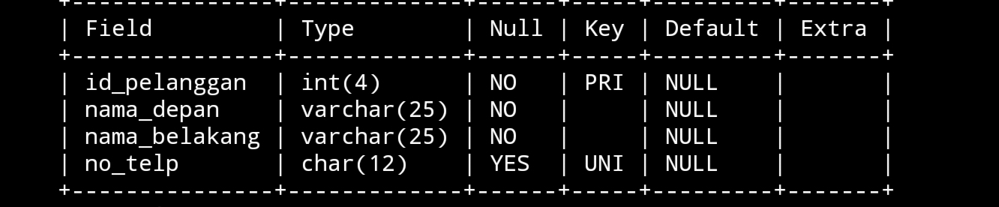

## Struktur tabel
Query:
```
Create database rental_FADHIL;
Desc Pelanggan;
```
**Penjelasan**

- `Create`:  digunakan untuk membuat objek baru dalam basis data, seperti tabel, database, atau indeks.
- `database`: sebuah data base yang ingin kita buat. 
- `rental_FADHIL` : adalah nama yang yang kita ketik untuk database yang ingin kita buat. perintah ini, kita bisa membuat sebuah wadah untuk menyimpan tabel, data, dan objek lainnya. 
- `;`: menandakan akhir dari perintah yang diberikan. 
- `Desc` :adalah singkatan dari `"DESCRIBE"` atau `"DESCRIBE TABLE"`.  digunakan untuk menampilkan deskripsi atau struktur tabel yang spesifik.
- `Pelanggan`: adalah nama tabel yang ingin kita jelaskan strukturnya.  kita ingin mengetahui informasi mengenai struktur tabel `"Pelanggan".`
Kesimpulan:
`CREATE DATABASE rental_FADHIL;"` digunakan untuk membuat database baru dengan nama `"rental_FADHIL"`, dan perintah `"DESC Pelanggan;"` digunakan untuk menampilkan struktur tabel `"Pelanggan"` yang ada dalam database. 


## Menampilkan Daftar Tabel
### Struktur
```
Show tables
```

**Penjelasan**
 - `SHOW`: untuk menampilkan informasi database yang telah dibuat. 
 - `DATABASES`: adalah kata kunci tambahan yang menandakan bahwa kita ingin menampilkan database yang telah dibuat.
 - `;`: menandakan akhir dari perintah yang diberikan.
Kesimpulan:
`SHOW DATABASES` yang digunakan untuk menampilkan daftar semua database yang  telah dibuat dan diakhiri tanda titik koma. 
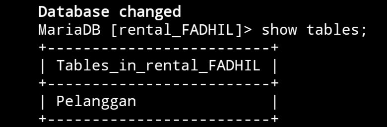

## QNA 

>[!info]- Mengapa hanya kolom id_pelanggan yang menggunakan constrains PRIMARY KEY? 
>Untuk membedakan id Pelanggan  yang sama, mencegah duplikasi, dan mempermudah pencarian data. 

>[! Info]- Mengapa pada kolom no_telp yang menggunakan tipe data char bukan varchar? 
>
Tipe data char menyimpan data dalam karakter panjang lebih efisien. pencarian pada kolom tipe data `CHAR` dapat lebih cepat


>[! Info]- Mengapa hanya kolom no_telp yang menggunakan constrains UNiQUE? 
>Karna no_telp tidak ada yang sama semua pasti berbeda dan nilainya unik maka menggunakan constrains unique artinya data dalam tabel id_telpon berbeda tidak ada yang sama. 


>[! Info]- Mengapa kolom no_telp tidak memakai constrains NOT NULL ,  sementara kolom lainnya menggunakan constrains tersebut? 
>Nomor telpon dianggap opsional. nomor telepon hanya menjadi wajib saat pengguna melakukan langkah-langkah tertentu, Anda mungkin tidak ingin mengharuskan pengguna mengisinya pada tahap awal.

>[! Info]- perbedaan PRIMERY KEY dan UNIQUE 
>PRIMERY KEY untuk membedakan data yang sama dan hanya boleh 1 dan tidak boleh tidak ada. 
Kalau UNiQUE sebuah kolom yang memiliki data yang berbeda atau tidak sama unique boleh 1,2,3 Dan seterusnya dan boleh tidak ada. 
>

# Insert
## Insert 1 Data 

### Struktur
```
Insert into [nama tabel]
Values(nilai 1,nilai 2,nilai 3..)
```

### Contoh 
```
insert into Pelanggan
values(1, "Ahmad", "Satya", "089587652345")
```

**Penjelasan**
- `Insert into`:  Digunakan untuk memasukkan data baru kedalam tabel. 
- `Pelanggan` : Nama tabel yang akan Kita memasukkan data. 
- `Values` : kata kunci yang menandakan bahwa kita akan menyediakan nilai-nilai yang ingin disisipkan ke dalam tabel.
- `(1, "Ahmad", "Satya", "089587652345")`: adalah nilai-nilai yang akan dimasukkan ke dalam tabel `"Pelanggan"`. Urutannya adalah `(1) id_pelanggan`, `(" Ahmad)nama depan`  `("Satya")nama_belakang`, dan `("089587652345")no_telp`.
Kesimpulan:
perintah `"INSERT INTO Pelanggan VALUES(1, 'Ahmad', 'Satya', '089587652345')"` digunakan untuk menyisipkan data pelanggan baru ke dalam tabel `"Pelanggan"` dengan nilai tertentu untuk setiap kolomnya.
**Hasil**
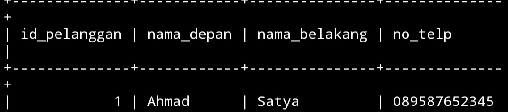

## Insert >1 data

### Struktur
```
Insert into [nama tabel]
Values
(2, "FGHI","IHGF","08**")
(3, "JKLM","MAKE"," 08**")
```

### Contoh
```
insert into Pelanggan 
values(1, 'Ahmad', 'Satya', '089587652345'), (2, 'muh', 'Fadli', '088863628263'),
```


**Penjelasan**

- `Insert into`:  Digunakan untuk memasukkan data baru kedalam tabel. 
- `Pelanggan` : Nama tabel yang akan Kita memasukkan data. 
- `Values` : kata kunci yang menandakan bahwa kita akan menyediakan nilai-nilai . 
-  `(1, "Ahmad", "Satya", "089587652345")`: adalah nilai-nilai untuk baris pertama yang akan dimasukkan ke dalam tabel `"Pelanggan"`. Urutannya adalah `(1) id_pelanggan`, `(" Ahmad")nama depan`  `("Satya")nama_belakang`, dan `("089587652345")no_telp`.
- `(2, "muh", "Fadli", "088863628263")`: adalah nilai-nilai untuk baris kedua yang akan dimasukkan ke dalam tabel `"Pelanggan"`. Urutannya adalah `(2) id_pelanggan`, `("muh")nama depan`  `("Fadli")nama_belakang`, dan `("088863628263")no_telp`.
**Kesimpulan**:
perintah ini, kita menyisipkan dua baris data baru ke dalam tabel "Pelanggan". Setiap baris memiliki nilai-nilai tertentu untuk setiap kolomnya.
**Hasil**
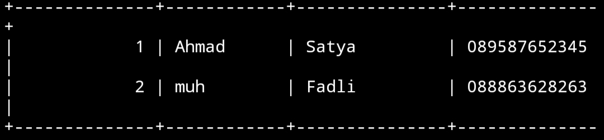

## Menyebut Kolom
### Struktur
```
Insert into [nama_tabel](kolom1,kolom2,kolom3)
Values(nilai1, nilai2, nilai3,..)
```
### Contoh
```
insert into pelanggan (id_pelanggan, nama_depan) values (4,"Ardi") ;
```
**Penjelasan**
- `Insert into`:  Digunakan untuk memasukkan data baru kedalam tabel. 
- `pelanggan`: adalah nama tabel yang ingin kita memilih data. Untuk melihat data dari tabel `"Pelanggan"`.
- `(nama_depan, id)`: adalah daftar kolom yang ingin kita isi dengan nilai. kita ingin mengisi kolom `"nama_depan" dan "id"`.
- `Values (4, " Ardi")`:  adalah bagian dari pernyataan yang menentukan nilai yang akan disisipkan ke dalam tabel. , contoh kita ini menyisipkan nilai `4` untuk kolom ``"id_pelanggan"`` dan nilai `Ardi` untuk kolom `nama_depan`
**KESIMPULAN**
Perintah tersebut akan menyisipkan data baru ke dalam tabel ``"pelanggan"``, dengan nilai `4` untuk kolom ``"id_pelanggan"`` dan nilai `Ardi`untuk kolom `"nama_depan"`.

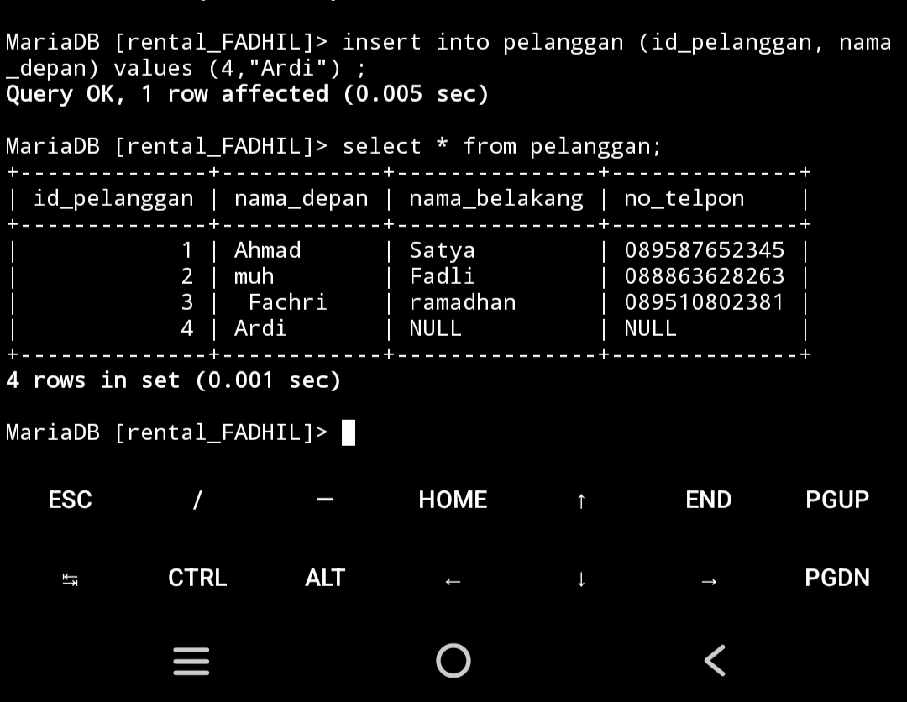

# Select
## Seluruh Data

### Struktur 
```
Select * From [nama_tabel];
```

### Contoh
```
Select * From Pelanggan;
```

**Penjelasan**
- `SELECT`: adalah  perintah yang digunakan untuk memilih data dari sebuah tabel. 
- `*`: Tanda bintang (asterisk) merupakan wildcard yang digunakan dalam perintah `"SELECT"` untuk memilih semua kolom dari tabel yang ditentukan.
- `FROM`: adalah perintah yang menunjukkan sumber data dari mana kita ingin memilih data. 
- `Pelanggan`: adalah nama tabel yang ingin kita memilih data. Untuk melihat data dari tabel `"Pelanggan"`.
**Kesimpulan**:
perintah `"SELECT * FROM Pelanggan"` digunakan untuk memilih semua data dari tabel "Pelanggan". 
**Hasil**
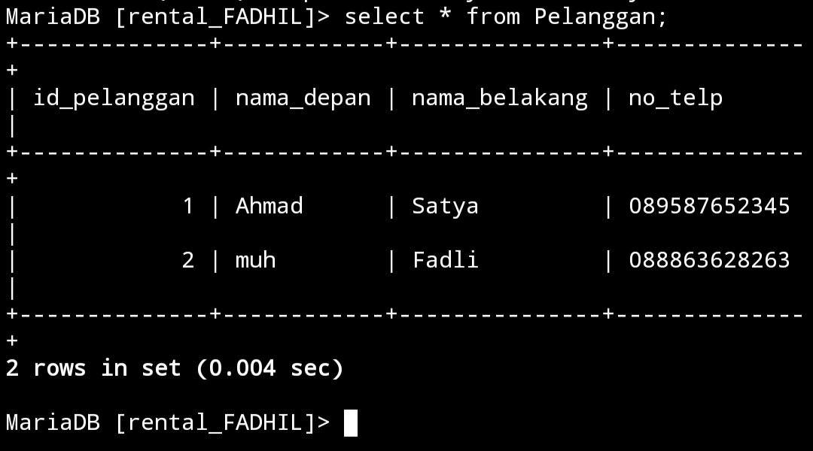

## Data Kolom Tertentu. 
### Struktur
```
Select [nama_kolom1], [nama_kolom2],.. [Nama_kolom_n] from [nama_tabel];
```

### Contoh
```
Select nama_depan From pelanggan;
```

**Penjelasan**
- `SELECT`: adalah  perintah yang digunakan untuk memilih data dari sebuah tabel.
- `nama_depan` : adalah nama kolom yang  kita pilih dari tabel `"Pelanggan"`. Dan dapat memilih satu atau lebih kolom untuk ditampilkan dalam hasil query.
- `From`: adalah perintah yang menunjukkan sumber data dari mana kita ingin memilih data. 
- `pelanggan`: adalah nama tabel yang ingin kita memilih data. Untuk melihat data dari tabel `"Pelanggan"`.
**Kesimpulan**:
perintah `"SELECT nama_depan FROM pelanggan"` digunakan untuk memilih nilai dari kolom `"nama_depan"` dari tabel `"Pelanggan"`.
**Hasil**
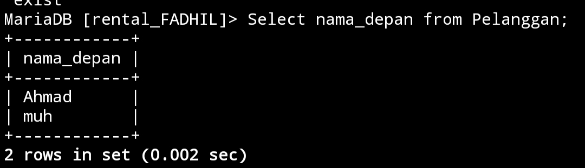

## Klausa WHERE 

### Struktur
```
Select [nama_kolom/*] From [nama_tabel] WHERE[kondisi];

```

### Contoh
```
Select id_Pelanggan,nama_belakang from Pelanggan where id_Pelanggan=2;
```


**Penjelasan**
- `SELECT`: adalah  perintah yang digunakan untuk memilih data dari sebuah tabel.
- `id_Pelanggan, nama_belakang`: adalah nama kolom yang  kita pilih dari tabel `"Pelanggan"`. kita ingin memilih nilai dari kolom `"id_Pelanggan" dan "nama_belakang"`.
- `From`: adalah perintah yang menunjukkan sumber data dari mana kita ingin memilih data. 
- `pelanggan`: adalah nama tabel yang ingin kita memilih data. Untuk melihat data dari tabel `"Pelanggan"`.
- `WHERE`: adalah perintah yang digunakan untuk memberikan kondisi untuk pemilihan data. Hanya baris yang memenuhi kondisi yang ditentukan yang akan dipilih.
- `id_Pelanggan=2`: adalah kondisi yang diberikan dalam perintah `"WHERE"`.Kita ingin memilih baris-baris di mana nilai kolom `"id_Pelanggan" sama dengan 2.`
- `;`: menandakan akhir dari perintah yang diberikan. 
**Kesimpulan**:
perintah `"SELECT id_Pelanggan, nama_belakang FROM Pelanggan WHERE id_Pelanggan=2"` digunakan untuk memilih nilai dari kolom `"id_Pelanggan"` dan `"nama_belakang"` dari tabel `"Pelanggan"` di mana nilai kolom `"id_Pelanggan"` sama dengan `2`. Hanya satu baris data yang akan dipilih sesuai dengan kondisi yang ditentukan.
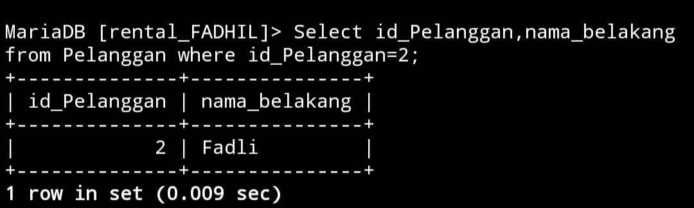

# Update
## Struktur
```
UPDATE nama_tabel  SET nama_kolom  WHERE kondisi;

```
### Contoh
```
UPDATE Pelanggan SET no_telp="089510802381" WHERE id_pelanggan="1";
```


**Penjelasan**:
- `UPDATE`: adalah perintah yang digunakan untuk mengupdate atau memperbarui data yang sudah ada dalam sebuah tabel.
- `Pelanggan`: adalah nama tabel yang akan diupdate. 
- `SET`: adalah perintah  yang menunjukkan kolom mana yang akan diperbarui dan nilai baru apa yang akan dimasukkan ke kolom `no_telp`.
- `no_telp =089510802381:` adalah bagian dari `SET` yang menentukan kolom yang akan diperbarui `(no_telp)`dan nilai baru yang akan dimasukkan ke kolom `no_telp ` `(089510802381)` adalah nomor telepon baru yang akan dimasukkan. 
- `WHERE`: adalah perintah yang digunakan untuk memberikan kondisi untuk memilih baris-baris yang akan diupdate.
- `Id_pelanggan='1'`:  adalah bagian dari `WHERE` yang menentukan kondisi untuk memilih baris mana yang akan diupdate. Seperti kita memilih baris yang memiliki nilai `id_pelanggan sama dengan 1.`
**Kesimpulan**:
perintah `"UPDATE Pelanggan SET no_telp='089510802381' WHERE id_pelanggan='1'"` digunakan untuk memperbarui nilai kolom `"no_telp"`menjadi `089510802381` untuk baris dalam tabel `"Pelanggan"` di mana nilai kolom ``
`"id_pelanggan" sama dengan 1.`


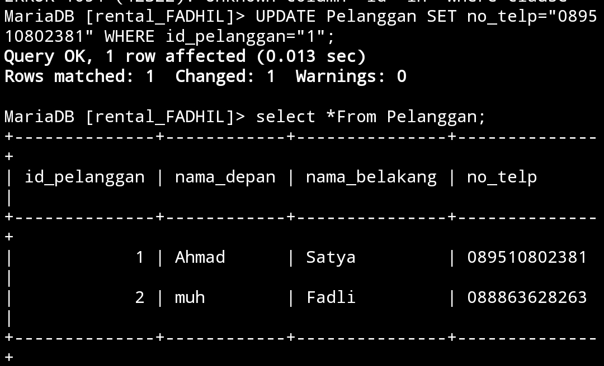

# Delete 
## Struktur
```
DELETE from nama_tabel where kondisi;
```

### Contoh
```
delete from Pelanggan where id_pelanggan =3;
```

**Penjelasan**:
- `DELETE FROM`: adalah  perintah  yang menandakan bahwa kita ingin menghapus baris atau data dari sebuah tabel.
- `Pelanggan`: adalah nama tabel yang ingin kita hapus datanya. 
- `WHERE`: adalah perintah yang digunakan untuk memberikan kondisi untuk memilih baris yang akan dihapus.
- `id_pelanggan = 3`:  adalah kondisi yang diberikan dalam perintah `"WHERE"`. Seperti ingin menghapus baris-baris di mana nilai kolom `"id_pelanggan" sama dengan 3`.
**Kesimpulan**
 Perintah `DELETE FROM Pelanggan WHERE id_pelanggan = 3` digunakan untuk menghapus baris-baris dari tabel `Pelanggan` di mana nilai kolom `id_pelanggan" sama dengan 3`.

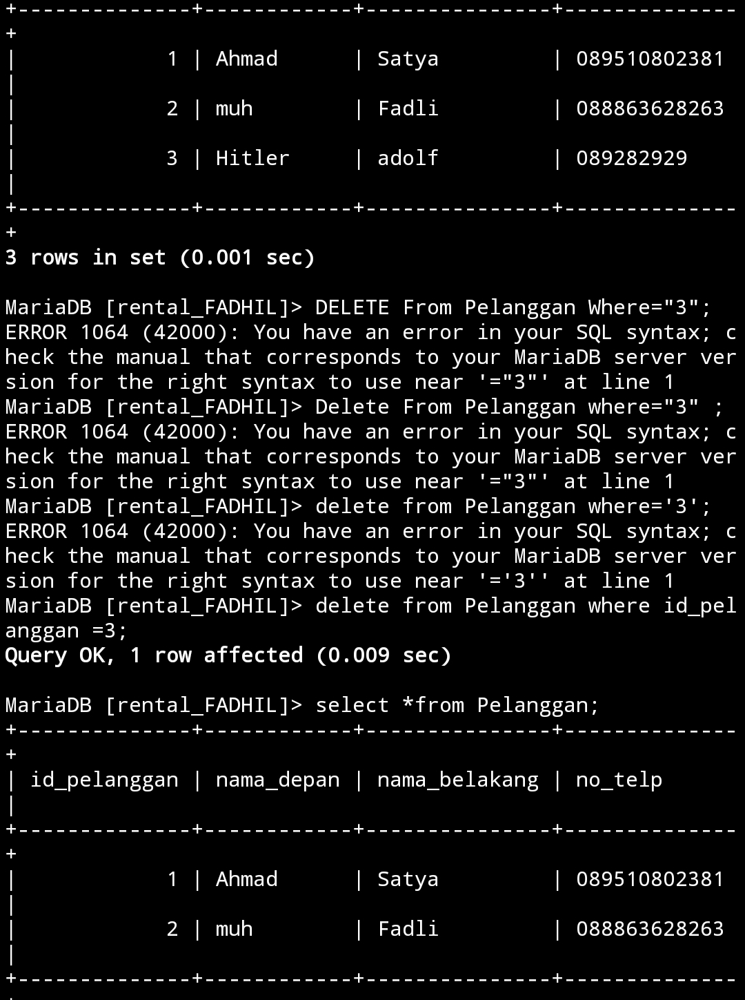

## Hapus Table
### Struktur
```
DROP TABLE [nama_tabel];
```

### Contoh
```
DROP TABLE PELANGGAN
```

**Penjelasan**
- `DROP TABLE` : adalah perintah yang digunakan untuk menghapus sebuah tabel dari database. 
- `Pelanggan`: adalah nama tabel yang ingin kita hapus dari database. Dengan menggunakan perintah ini, kitaakan menghapus seluruh struktur dan data yang terkait dengan tabel `Pelanggan` dari database.
**Kesimpulan**
Perintah `DROP TABLE Pelanggan` digunakan untuk menghapus tabel `Pelanggan` secara permanen dari database.

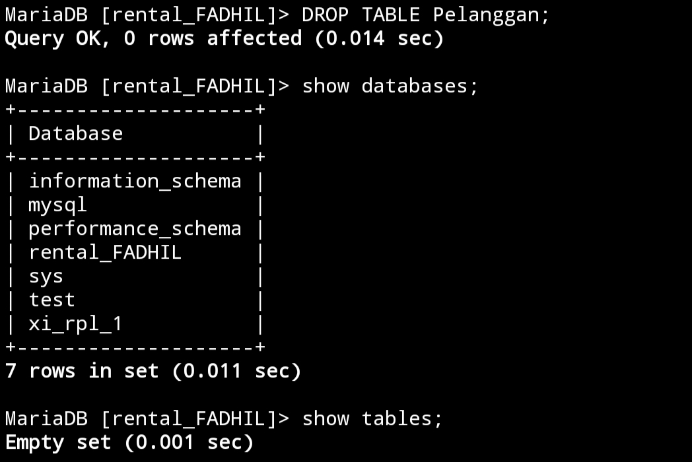

# Tabel 
## Membuat Tabel
###  Contoh Query
```
create table mobil (
    id_mobil int(2) primary key not null, 
     no_plat varchar(10) unique not null, 
     no_mesin varchar(10) unique not null, 
     warna varchar(10) not null, 
     pemilik varchar(25) not null, 
     peminjam varchar(25) , 
     harga_rental int(10) );
```

**Penjelasan**
- `CREATE TABLE`: adalah perintah yang digunakan untuk membuat tabel baru dalam database. 
- `mobil`: adalah nama tabel yang akan dibuat.
- `id_mobil int(2) primary key not null`: Kolom untuk `ID mobil` dengan tipe data `INTEGER`, panjang maksimum `2 digit`, sebagai `PRIMARY KEY`, yang tidak boleh kosong.
- `no_plat varchar(10) unique not null`: Kolom untuk nomor plat mobil dengan tipe data `VARCHAR`, panjang maksimum `10 karakter`, sebagai `UNIQUE`, yang tidak boleh kosong.
- `no_mesin varchar(10) unique not null`: Kolom untuk nomor mesin mobil dengan tipe data `VARCHAR`, panjang maksimum `10 karakter`, sebagai `UNIQUE`, yang tidak boleh kosong.
- `warna varchar(10) not null`: Kolom untuk warna mobil dengan tipe data `VARCHAR`, panjang maksimum `10 karakter`, yang tidak boleh kosong. 
- `pemilik varchar(25) not null`: Kolom untuk nama pemilik mobil dengan tipe data `VARCHAR`, panjang maksimum `25 karakter`, yang tidak boleh kosong.
- `peminjam varchar(25)`: Kolom untuk nama peminjam mobil dengan tipe data VARCHAR, panjang maksimum `25 karakter`. 
- `harga_rental int(10)`: Kolom untuk harga rental mobil dengan tipe data `INTEGER`, panjang maksimum `10 digit`. 
**Kesimpulan**
Perintah `CREATE TABLE mobil` digunakan untuk membuat tabel baru bernama `mobil` dengan tujuh kolom: `id_mobil, no_plat, no_mesin, warna, pemilik, peminjam, dan harga_rental` , bersama dengan batasan-batasan yang ditetapkan untuk masing-masing kolom.
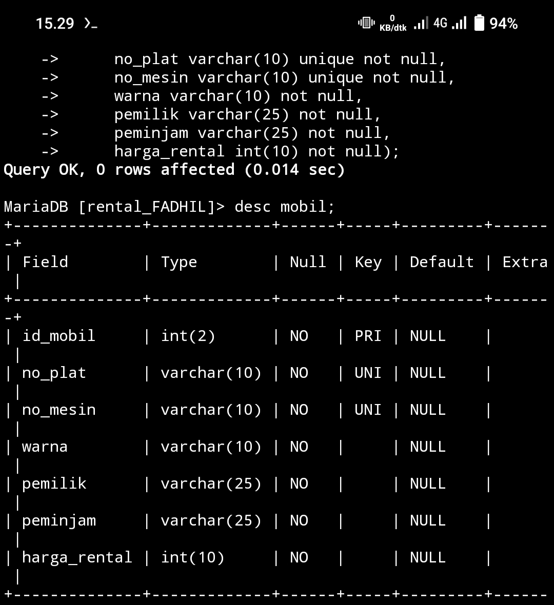

## Masukkan Data 
### Contoh Query
```
Insert into mobil values (1, "DD 2650 XY", "ACX3568","Hitam","Ibrahim","Afdal",50000) , (2, "DD 2440 AX","BCS1120","Merah"," Ibrahim","Elia",100000) , (3, "B 1611 QC"," LSQ1112","Silver","Baim","Anty",50000) , (4, "DD 2901 JK","UQL1029","Hitam","Ibe", Null, 150000) , (5,  "DD 2210 LS", "CJH1011","Hitam","Ibe", NULL, 100000) ;
```

**Penjelasan**
- `Insert into mobil`: adalah perintah yang digunakan untuk menyisipkan data baru ke dalam tabel `mobil`.
- `values`: adalah kata kunci dalam pernyataan SQL yang menunjukkan nilai-nilai yang akan disisipkan ke dalam tabel.
-  `(1, "DD 2650 XY", "ACX3568", "Hitam", "Ibrahim", "Afdal", 50000)`: adalah nilai-nilai yang akan disisipkan ke dalam baris pertama tabel `mobil`. Urutan nilainya sesuai dengan urutan kolom-kolom dalam tabel. Contoh nilai pertama `(1)` adalah untuk kolom `id_mobil`, `DD 2650 XY` adalah untuk kolom `no_plat`, `ACX3568`adalah untuk kolom `no_mesin`, `Hitam` adalah untuk kolom `warna`, `Ibrahim` adalah untuk kolom `pemilik`, `Afdal` adalah untuk kolom `peminjam`, dan `50000` adalah untuk kolom `harga_rental`.
- `(2, "DD 2440 AX", "BCS1120", "Merah", "Ibrahim", "Elia", 100000)`: adalah nilai-nilai yang akan disisipkan ke dalam baris kedua tabel `mobil`. Urutan nilainya sesuai dengan urutan kolom-kolom dalam tabel. Contoh nilai kedua `(2)` adalah untuk kolom `id_mobil`, `DD 2650 XY`adalah untuk kolom `no_plat`, `ACX3568` adalah untuk kolom `no_mesin`, `Merah` adalah untuk kolom `warna`, `Ibrahim` adalah untuk kolom `pemilik`, `Elia` adalah untuk kolom `peminjam`, dan `100000` adalah untuk kolom `harga_rental`.
- `(3, "B 1611 QC","LSQ111","Silver","Baim","Anty"," 50000")` : adalah nilai-nilai yang akan disisipkan ke dalam baris ketiga tabel `mobil`. Urutan nilainya sesuai dengan urutan kolom-kolom dalam tabel. Contoh nilai ketiga `(3)` adalah untuk kolom `id_mobil`, `B 1611 QC`adalah untuk kolom `no_plat`, `LSQ111` adalah untuk kolom `no_mesin`, `Silver` adalah untuk kolom `warna`, `Baim` adalah untuk kolom `pemilik`, `Anty` adalah untuk kolom `peminjam`, dan `50000` adalah untuk kolom `harga_rental`.
- `(4, "DD 2901 JK","UQL1029","Hitam","Ibe", NULL, 150000)`: adalah nilai-nilai yang akan disisipkan ke dalam baris keempat tabel `mobil`. Urutan nilainya sesuai dengan urutan kolom-kolom dalam tabel. Contoh nilai keempat `(4)` adalah untuk kolom `id_mobil`, `DD 2901 JK`adalah untuk kolom `no_plat`, `UQL1029` adalah untuk kolom `no_mesin`, `Hitam` adalah untuk kolom `warna`, `Ibe` adalah untuk kolom `pemilik`, Kolom `peminjam` memiliki nilai `NULL`, yang menunjukkan bahwa tidak ada informasi peminjam yang diberikan untuk mobil ini. , dan `50000` adalah untuk kolom `harga_rental`.
- `(5,  "DD 2210 LS", "CJH1011","Hitam","Ibe", NULL, 100000)`: adalah nilai-nilai yang akan disisipkan ke dalam baris kelima tabel mobil. Urutan nilainya sesuai dengan urutan kolom-kolom dalam tabel. Contoh nilai kelima  `(5)` adalah untuk kolom `id_mobil`, `DD 2210 JK` adalah untuk kolom `no_plat`, `CJH1011` adalah untuk kolom `no_mesin`, `Hitam` adalah untuk kolom `warna`, `Ibe` adalah untuk `kolom pemilik`, `Kolom peminjam` memiliki nilai `NULL`, yang menunjukkan bahwa tidak ada informasi `peminjam` yang diberikan untuk mobil ini. dan `100000` adalah untuk kolom `harga_rental`.
**Kesimpulan**
`INSERT INTO mobil VALUES`, kita menyisipkan beberapa baris data ke dalam tabel `mobil`. Setiap baris data mewakili informasi tentang sebuah `mobil`, seperti `nomor plat, nomor mesin, warna, pemilik, peminjam (jika ada), dan harga rental`. 
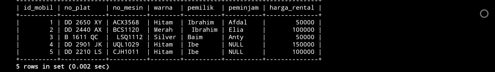
