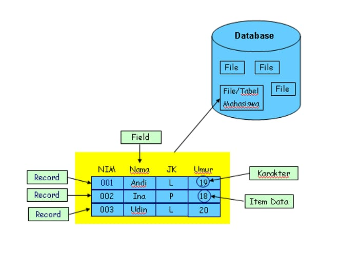

# Pengertian Basis 
Basis dapat di artikel sebagai tempat atau wadah untuk menyimpan data mentah.

# Pengertian Data 
Data adalah sekumpulan data atau informasi yang tersimpan di komputer atau di manapun

# Kesimpulan 
Basis data adalah kumpulan informasi yang di simpan di dalam komputer secara sistematik sehingga dapat di periksa menggunakan suatu program komputer untuk memperoleh informasi dari Basis data tersebut. 

Basis data adalah data mentah yang tersimpan secara sistematik di dalam suatu wadah atau tempat 

# Perangan Basis Data
- Supermarket pengelolaan Harga barang yang input kasir 
- Whatsapp Menyimpan nomor pengguna yang input user yang 
- Pabrik mengelola jumlah produksi stok persediaan barang pengemasan lalu di kirim di agent nanti agent memberikan informasi tentang apa yang di jual warna apa saja dan nanti customer bisa memilih mau beli barang kayak bagaimana.

# Hirarki 
Basis data adalah sekumpulan informasi yang disimpan di dalam komputer secara sistematik sehingga dapat di periksa menggunakan suatu program komputer untuk memperoleh informasi dari basis data tersebut.

| No | Pemain Barca  | Asal negara  | Posisi    |
| -- | ------------- | ------------ | --------- |
| 1  | Messi         | Argentina    | Penyerang |
| 2  | Puyol         | Spanyol      | Bek       |
| 3  | Xavi          | Spanyol      | Gelandang |
| 4  | Suarez        | Uruguay      | Penyerang |

Tabel diatas memiliki 
- Baris yaitu yang lurus kesamping atau horizontal dimana berisi informasi dalam suatu tabel contoh no, pemain barca , asal negara,dan posisi 
- Kolom yaitu yang lurus Kebawah dimana berisi informasi dari suatu baris. Contoh no=1, pemain barca= Messi,  asal negara= Argentina, posisi= Penyerang sampai kebawah atau suarez 
- record adalah kumpulan data terkait untuk satu entitas dalam basis data. Yang merujuk pada no, pemain barca, asal negara.
- Karakter yaitu yang ada dalam suatu tabel seperti karakter, angka.
- item data atau field isi dari tabel yang di buat contoh nya 
  Tabel pemain  Barca item data dalam kolom pemain barca yaitu Messi.

 
## Pengertian 
- Field adalah bagian terkecil dari sebuah record yang menyimpan data spesifik atau atribut tertentu. 
- Record  adalah kumpulan nilai atau informasi yang terkait satu sama lain dan mewakili satu entitas tunggal. 
- karakter biasanya tertuju pada unit data yang menyimpan simbol tunggal, seperti huruf, angka, atau karakter khusus. 
- Item data  atau field isi dari tabel yang di buat contohnya 
  Tabel pemain  Barca item data dalam kolom pemain barca yaitu Messi.
