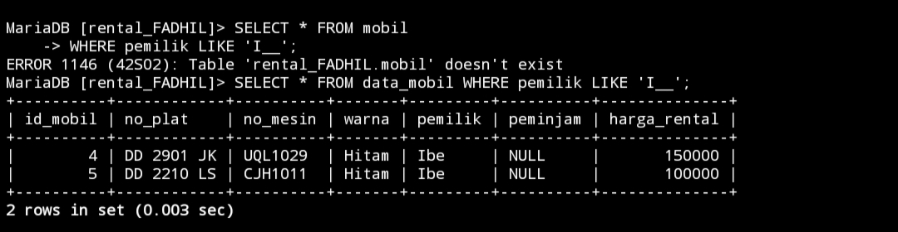
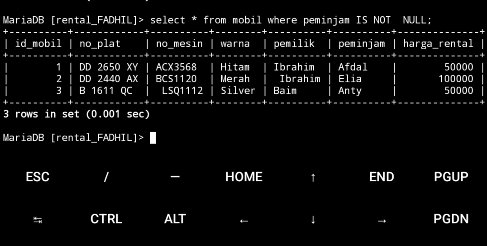
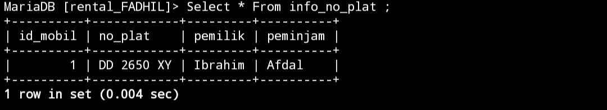
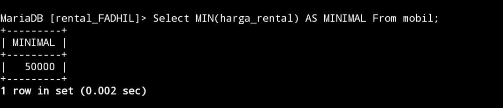

# Select lanjutan
## AND
### Struktur
```mysql
Select kolom4,kolom5 from [nama_tabel] where kolom warna="isi kolom warna" And kolom pemilik="isi kolom pemilik"
```
### Contoh
```mysql
select warna,pemilik From mobil where warna="Hitam" AND pemilik="Ibrahim";
```
### Analisis
- `SELECT warna, pemilik `:  adalah bagian dari perintah `SELECT` yang menentukan kolom mana yang akan ditampilkan dalam hasil query contoh memilih kolom `warna` dan `pemilik` dari tabel `mobil`. 
- `FROM mobil`: adalah bagian dari perintah  `FROM` yang menunjukkan tabel mana yang akan diambil dari data tabel `mobil`.
- `WHERE warna="Hitam" AND pemilik="Ibrahim"`: adalah bagian dari perintah `WHERE` yang memberikan kriteria untuk data yang akan dipilih. Kriteria tersebut adalah `warna mobil` adalah `hitam` dan `pemilik mobil` adalah `Ibrahim`.
### Kesimpulan
Perintah  `SELECT warna, pemilik FROM mobil WHERE warna='Hitam' AND pemilik='Ibrahim';` digunakan untuk mengambil informasi tentang mobil yang memiliki warna ``"Hitam"`` dan dimiliki oleh `"Ibrahim"`. 


## OR
### Struktur
```mysql
Select kolom4,kolom5 from [nama_tabel] where kolom warna="isi kolom warna" And kolom pemilik="isi kolom pemilik"
```
### Contoh
```Mysql 
select warna,pemilik From mobil where warna="Hitam" or pemilik="Ibrahim";
```
### Analisis
- `SELECT warna, pemilik `:  adalah bagian dari perintah `SELECT` yang menentukan kolom mana yang akan ditampilkan dalam hasil query contoh memilih kolom `warna` dan `pemilik` dari tabel `mobil`. 
- `FROM mobil`: adalah bagian dari perintah  `FROM` yang menunjukkan tabel mana yang akan diambil dari data tabel `mobil`.
- `WHERE warna="Hitam" OR pemilik="Ibrahim"`: adalah bagian dari perintah `WHERE` yang memberikan kriteria untuk data yang akan dipilih. Kriteria tersebut adalah `warna mobil` adalah `hitam` dan `pemilik mobil` adalah `Ibrahim`.
### KESIMPULAN
 Perintah  `SELECT warna, pemilik FROM mobil WHERE warna='Hitam' AND pemilik='Ibrahim';` digunakan untuk mengambil informasi tentang mobil yang memiliki warna ``"Hitam"`` dan dimiliki oleh `"Ibrahim"`. 


## BETWEEN  AND
### Struktur
```mysql
Select * From nama_tabel where kolom harga_rental between nilai 1 and nilai 2;
```
### Contoh
```mysql
select * from mobil where harga_rental between 100000 and 200000;
```
**PENJELASAN**

- `SELECT`:  adalah bagian dari pernyataan `SELECT` yang menentukan mengambil semua kolom dari tabel `mobil`.
- `FROM mobil`: adalah bagian dari perintah  `FROM` yang menunjukkan tabel mana yang akan diambil dari data tabel `mobil`.
- `WHERE harga_rental BETWEEN 100000 AND 200000`: adalah bagian dari pernyataan `WHERE`  yang memberikan kriteria untuk data yang akan dipilih. Kriteria tersebut adalah kolom `harga_rental` yang berada kisaran antara `100.000 dan 200.000`.
**KESIMPULAN**
Perintah `SELECT * FROM mobil WHERE harga_rental BETWEEN 100000 AND 200000;` digunakan untuk mengambil semua kolom dari `tabel mobil`di mana nilai kolom `harga_rental` yang berada kisaran antara `100.000` dan `200.000.`


## NOT BETWEEN
### Struktur
```mysql
Select * From nama_tabel where kolom harga_rental not between nilai 1 and nilai 2;
```
### Contoh
```mysql
select * from mobil where harga_rental not between 100000 and 200000;
```
### Analisis
- `SELECT`:  adalah bagian dari pernyataan `SELECT` yang menentukan mengambil semua kolom dari tabel `mobil`.
- `FROM mobil`: adalah bagian dari perintah  `FROM` yang menunjukkan tabel mana yang akan diambil dari data tabel `mobil`.
- `WHERE harga_rental NOT BETWEEN 100000 AND 200000`: adalah bagian dari pernyataan `WHERE`  yang memberikan kriteria untuk data yang akan dipilih. Kriteria tersebut adalah kolom `harga_rental` yang tidak berada kisaran antara `100.000 dan 200.000`.
### KESIMPULAN
Perintah `SELECT * FROM mobil WHERE harga_rental BETWEEN 100000 AND 200000;` digunakan untuk mengambil semua kolom dari `tabel mobil`di mana nilai kolom `harga_rental` yang tidak berada kisaran antara `100.000` dan `200.000.


## <=
### Struktur
```mysql
Select * From nama_tabel where kolom harga <= nilai 1
```

### Contoh
```mysql
select * from mobil where harga_rental <=50000;
```
### Analisis
- `SELECT`:  adalah bagian dari pernyataan `SELECT` yang menentukan mengambil semua kolom dari tabel `mobil`.
- `FROM mobil`: adalah bagian dari perintah  `FROM` yang menunjukkan tabel mana yang akan diambil dari data tabel `mobil`. 
- `WHERE harga_rental <= 50000`: adalah bagian dari pernyataan `WHERE` yang memberikan kriteria data yang akan dipilih. Kriteria tersebut adalah kolom `harga_mobil` kurang atau sama dengan `50.000`.
### Kesimpulan
Perintah `SELECT * FROM mobil WHERE harga_rental <= 50000;` digunakan untuk mengambil semua data dari tabel `mobil` di mana harga rental mobil kurang dari atau sama dengan `50.000`.


##  =>
### Struktur
```mysql
Select * From nama_tabel where kolom harga_rental >= 50000;
```
### Contoh
```Mysql
select * from mobil where harga_rental >=50000;
```
### Analisis
- `SELECT`:  adalah bagian dari pernyataan `SELECT` yang   menentukan mengambil semua kolom dari tabel `mobil`.
- `FROM mobil`: adalah bagian dari perintah  `FROM` yang menunjukkan tabel mana yang akan diambil dari data tabel `mobil`.
- `WHERE harga_rental >= 50000`: adalah bagian dari pernyataan `WHERE` yang memberikan kriteria data yang akan dipilih. Kriteria tersebut adalah kolom `harga_rental` lebih besar dari atau sama dengan `50.000`.
### Kesimpulan
Perintah `SELECT * FROM mobil WHERE harga_rental >= 50000;` digunakan untuk mengambil semua data dari tabel `mobil` di mana harga rental mobil lebih besar dari atau sama dengan `50.000`.


##  <> ATAU  !=
### Struktur
```mysql
Select * From nama_tabel where kolom harga_rental <> atau != nilai 1 ;
```
### Contoh
```mysql
select * from mobil where harga_rental <> 50000;
Select * from mobil where harga_rental != 50000!;
```
### Analisis Perintah 1
- `SELECT`:  adalah bagian dari pernyataan SELECT yang   menentukan mengambil semua kolom dari tabel mobil.
- `FROM mobil`: adalah bagian dari perintah  `FROM` yang menunjukkan tabel mana yang akan diambil dari data tabel `mobil`.
- `WHERE harga_rental <> 50000`: adalah bagian dari pernyataan `WHERE` yang memberikan kriteria  data yang akan dipilih. Kriteria tersebut adalah kolom `harga_rental` tidak sama dengan `50.000`.
### Analisis Perintah 2
 - `SELECT`:  adalah bagian dari pernyataan `SELECT` yang   menentukan mengambil semua kolom dari tabel `mobil`.
- `FROM mobil`: adalah bagian dari perintah  `FROM` yang menunjukkan tabel mana yang akan diambil dari data tabel `mobil`.
- `WHERE harga_rental != 50000`: adalah cara lain untuk menyatakan kriteria yang sama dengan pernyataan sebelumnya. `Operator !=` digunakan untuk menunjukkan ketidaksamaan, sehingga menampilkan data kolom `harga_rental` tidak sama dengan `50.000`.
### Kesimpulan
Kesimpulan dari kedua pernyataan tersebut adalah bahwa hasilnya  berisi semua informasi tentang `mobil` yang memiliki `harga_rental` tidak sama dengan `50.000`.


## Tantangan
### Struktur
```Mysql
SELECT nama
    -> FROM nama_tabel
    -> WHERE username = 'kondisi_nama' AND kondisi_password = 'nilai ';
```
### Query 
```Mysql
 SELECT nama
    -> FROM Akun
    -> WHERE username = 'admin' AND password =         '12345';

```
### Analisis
- `SELECT`: adalah perintah yang digunakan untuk memilih data dari satu atau lebih tabel dalam database.
- `nama`: adalah nama kolom yang ingin kita tampilkan dari tabel.
- `FROM`: adalah kata kunci yang digunakan untuk menunjukkan dari tabel mana data akan diambil.
- `Akun`: adalah nama tabel dari mana kita akan mengambil data.
- `WHERE`: adalah klausa yang digunakan untuk menentukan kondisi yang harus dipenuhi oleh baris yang akan dipilih.
- `username = 'admin'`: adalah kondisi pertama yang harus dipenuhi, yaitu kolom `username` harus memiliki nilai 'admin'.
- `AND`: adalah operator logika yang digunakan untuk menambahkan lebih banyak kondisi.
- `password = '12345'`: adalah kondisi kedua yang harus dipenuhi, yaitu kolom `password` harus memiliki nilai '12345'.
- `;`: menandakan akhir dari perintah SQL.
### Kesimpulan
`Query SELECT nama FROM Akun WHERE username = 'admin' AND password = '12345';`digunakan untuk memilih dan menampilkan kolom nama dari tabel Akun di mana nilai kolom `username` adalah `'admin'`dan nilai kolom `password`adalah `'12345'`. Perintah ini diakhiri dengan tanda titik koma (;).

### Hasil


## IN 
### Struktur
```Mysql
Select *  from nama_tabel where kolom_pemilik IN (nilai kolom pemilik)
```

### Contoh
```Mysql
Select * from mobil where pemilik IN ("Ibrahim","Baim")
```
### Analisis 
- `SELECT`:  adalah bagian dari pernyataan `SELECT` yang menentukan mengambil semua kolom dari tabel `mobil`.
- `FROM mobil`: adalah bagian dari perintah  `FROM` yang menunjukkan tabel mana yang akan diambil dari data tabel `mobil`.
- `WHERE pemilik`: dalam pernyataan SQL digunakan untuk menyaring baris data berdasarkan nilai kolom `pemilik`.
- `IN ("Ibrahim", "Baim")`: adalah kondisi yang kita tentukan menggunakan operator `IN`.  berarti kita hanya ingin baris-baris di mana nilai kolom `pemilik` adalah `Ibrahim` atau `Baim`.
### Kesimpulan
perintah  `Select * from mobil where pemilik IN ("Ibrahim","Baim")`akan menampilkan semua kolom dari tabel `mobil` di mana nilai kolom `pemilik` adalah `Ibrahim`atau `Baim`.


## IN + AND
### Struktur
```Mysql
Select * from nama_tabel
Where warna IN (nilai kolom_warna)
And harga_rental = nilai harga ;
```
### Contoh
```Mysql
Select * from mobil 
Where warna IN ("Hitam","Silver")
And harga_rental = 50000;
```
### Analisis
- `SELECT`:  adalah bagian dari pernyataan `SELECT` yang menentukan mengambil semua kolom dari tabel `mobil`.
- `FROM mobil`: adalah bagian dari perintah  `FROM` yang menunjukkan tabel mana yang akan diambil dari data tabel `mobil`.
- `WHERE warna IN ("Hitam","Silver")`: adalah bagian dari perintah `WHERE` yang memberikan kriteria  data yang akan dipilih. Kriteria tersebut adalah `kolom_warna` yang bernilai `("Hitam","Silver")`. 
- `AND harga_rental = 50000`: adalah bagian tambahan dari perintah `WHERE` yang memberikan kriteria tambahan data yang akan dipilih. Kriteria tersebut adalah menampilkan data kolom `harga_rental` adalah `50000`.
### Kesimpulan
Perintah tersebut akan menampilkan semua kolom untuk setiap entri di tabel ``"mobil"`` di mana warna mobil adalah `Hitam' atau 'Silver'` dan harga `rental_mobil` adalah `50.000`.


## IN + OR
### Struktur
```Mysql
Select * from nama_tabel
Where warna IN (nilai kolom_warna)
And harga_rental = nilai harga ;
```
### Contoh
```Mysql
Select * from mobil
Where warna IN ("Hitam","Silver")
OR Harga_rental = 50000;
```
### Analisis
- `SELECT`:  adalah bagian dari pernyataan `SELECT` yang menentukan mengambil semua kolom dari tabel `mobil`.
- `FROM mobil`: adalah bagian dari perintah  `FROM` yang menunjukkan tabel mana yang akan diambil dari data tabel `mobil`.
- `WHERE warna IN ("Hitam","Silver")`: adalah bagian dari perintah `WHERE` yang memberikan kriteria  data yang akan dipilih. Kriteria tersebut adalah `kolom_warna` yang bernilai `("Hitam","Silver")`. 
- `OR harga_rental = 50000`: adalah bagian tambahan dari perintah `WHERE` yang memberikan kriteria tambahan  data yang akan dipilih. Kriteria tersebut adalah menampilkan data kolom `harga_rental` adalah `50000`.Dengan menggunakan operator `OR`, kita memastikan bahwa entri yang memenuhi salah satu dari dua kriteria ini akan dipilih.
### Kesimpulan
Perintah tersebut akan menampilkan semua kolom untuk setiap entri di tabel `mobil`di mana warna mobil adalah `Hitam atau Silver`, atau harga rental mobil adalah `50.000`. 


## IN + AND + OPERATOR
### Struktur
```Mysql
Perintah Pertama
Select * from nama_tabel
Where warna IN (nilai kolom_warna)
And harga_rental > nilai harga ;

Perintah kedua

Select * from nama_tabel
Where warna IN (nilai kolom_warna)
And harga_rental < nilai harga ;


```
### Contoh
```Mysql
Select * from mobil 
Where warna IN ("Hitam","Silver")
And harga_rental > 50000

Select * from mobil 
Where warna IN ("Hitam","Silver")
And harga_rental < 100000
```
### Analisis
- `SELECT`:  adalah bagian dari pernyataan `SELECT` yang menentukan mengambil semua kolom dari tabel `mobil`.
- `FROM mobil`: adalah bagian dari perintah  `FROM` yang menunjukkan tabel mana yang akan diambil dari data tabel `mobil`.
- `WHERE warna IN ("Hitam","Silver")`: adalah bagian dari perintah `WHERE` yang memberikan kriteria  data yang akan dipilih. Kriteria tersebut adalah `kolom_warna` yang bernilai `("Hitam","Silver")`. 
- `AND harga_rental > 50000`: Kriteria tambahan ini memilih baris-baris di mana nilai kolom `"harga_rental"`lebih besar dari `50.000`.
- `AND harga_rental < 100000`: Kriteria tambahan ini memilih baris-baris di mana nilai kolom `"harga_rental"` kurang dari `100.000`.
### Kesimpulan
Perintah tersebut untuk mengambil data dari tabel `"mobil"`dengan kriteria yang sama terkait warna dan berbeda di kolom `harga_rental mobil`. Perintah pertama memilih mobil dengan `harga_rental`lebih dari `50000`. Perintah kedua memilih mobil dengan `harga_rental` kurang dari `100000`.

# LIKE

## LIKE %Ib
### Struktur 
```Mysql
Select * from nama_tabel where kolom_pemilik LIKE "nilai Ib%"
```

### Contoh 
```Mysql
Select * From mobil 
Where pemilik LIKE "Ib%";
```
### Analisis
- `SELECT`:  adalah bagian dari pernyataan `SELECT` yang menentukan mengambil semua kolom dari tabel `mobil`.
- `FROM mobil`: adalah bagian dari perintah  `FROM` yang menunjukkan tabel mana yang akan diambil dari data tabel `mobil`.
- `WHERE pemilik LIKE "Ib%"`: adalah kondisi yang menggunakan operator `LIKE`. `LIKE` digunakan untuk mencocokkan pola string.  Dimana nanti akan menampilkan nilai dari kolom `pemilik` yang huruf namanya berawalan dari `IB`. 
### Kesimpulan
perintah `Select * From mobil where pemilik LIKE Ib%`: akan menampilkan semua kolom dari tabel `mobil` di mana nilai kolom `pemilik` dimulai dengan `Ib`.


## LIKE  %M

### Struktur
```Mysql
Select * from nama_tabel where kolom_pemilik LIKE "nilai%m"
```

### Contoh
```Mysql
Select * from mobil
Where pemilik LIKE "%M"

```
### Analisis
- `SELECT`:  adalah bagian dari pernyataan `SELECT` yang menentukan mengambil semua kolom dari tabel `mobil`.
- `FROM mobil`: adalah bagian dari perintah  `FROM` yang menunjukkan tabel mana yang akan diambil dari data tabel `mobil`.
- `WHERE pemilik LIKE "%M"`: adalah kondisi yang menggunakan operator `LIKE`. `LIKE`     digunakan untuk mencocokkan pola string. Dimana nanti akan menampilkan nilai dari kolom `pemilik` yang huruf namanya diakhiri `M`.
### Kesimpulan
Perintah `Select * from mobil Where pemilik LIKE "%M"`: 
akan menampilkan semua kolom dari tabel-tabel `mobil` di mana nilai kolom `pemilik` diakhiri dengan `M`.


## LIKE B%M

### Struktur
```Mysql
Select * from nama_tabel where kolom_pemilik LIKE " Nilaib%m"
```
### Contoh
```Mysql
Select * from mobil 
Where pemilik LIKE "b%m"
```
### Analisis
- `SELECT`:  adalah bagian dari pernyataan `SELECT` yang menentukan mengambil semua kolom dari tabel `mobil`.
- `FROM mobil`: adalah bagian dari perintah  `FROM` yang menunjukkan tabel mana yang akan diambil dari data tabel `mobil`.
- `WHERE pemilik LIKE "b%m"`: adalah kondisi yang  menggunakan operator `LIKE`. `b` adalah karakter yang harus ada di awal nilai kolom `pemilik`, `%m`adalah wildcard yang cocok dengan nol atau lebih karakter sebelum `m`.
### Kesimpulan
perintah `Select * from mobil Where pemilik LIKE "b%m"`: akan menampilkan semua kolom dari tabel `mobil` di mana nilai kolom `pemilik` dimulai dengan `b` dan diikuti oleh karakter apa pun sebelum `m`.


## Like i__
### Struktur
```Mysql
select * From nama_tabel 
where nama_kolom Like 'nilai i__'
```
### Contoh
```Mysql
SELECT * FROM mobil
 WHERE pemilik LIKE 'I__';
```
### Analisis
- `SELECT * FROM data_mobil`: untuk menampilkan semua data dari tabel `mobil`.
- `WHERE pemilik LIKE 'I__';`: adalahpemilik yang dimulai dengan huruf 'I' diikuti oleh dua karakter tambahan.
- `;`: menandakan akhir dari perintah yang diberikan
### Kesimpulan
`SELECT * FROM mobil WHERE pemilik LIKE 'I__';`digunakan untuk menampilkan semua data dari tabel mobil di mana kolom pemilik memiliki nilai yang dimulai dengan huruf 'I' dan diikuti oleh dua karakter lainnya, dan diakhiri tanda titik koma
### Hasil


## Like ____
### Struktur
```Mysql
select * From nama_tabel
where nama_kolom like 'nilai___';

```
### Contoh
```Mysql
SELECT * FROM data_mobil
WHERE pemilik LIKE '___';
```
### Analisis
- `SELECT * FROM mobil`: untuk menampilkan semua data dari tabel mobil.
- `WHERE pemilik LIKE '___'`: adalah klausa yang menandakan bahwa kita ingin menyaring baris berdasarkan kolom pemilik yang memiliki tepat tiga karakter apa pun.
- `;`: menandakan akhir dari perintah yang diberikan
### Kesimpulan
`SELECT * FROM mobil WHERE pemilik LIKE '___';`digunakan untuk menampilkan semua data dari tabel mobil di mana kolom pemilik memiliki nilai yang terdiri dari tepat tiga karakter apa pun, dan diakhiri tanda titik koma.
### Hasil

## Mencari berdasarkan total karakter

## Kombinasi
### Struktur
```Mysql
Select * from nama_tabel where kolom_pemilik LIKE " nilai 1%" ;
```

### Contoh
```Mysql
select * from mobil  where pemilik LIKE "__r%" ;
```
### Analisis
- `SELECT`:  adalah bagian dari pernyataan `SELECT` yang menentukan mengambil semua kolom dari tabel `mobil`.
- `FROM mobil`: adalah bagian dari perintah  `FROM` yang menunjukkan tabel mana yang akan diambil dari data tabel `mobil`.
- `WHERE pemilik LIKE "__r%"`:  adalah bagian dari pernyataan `WHERE` yang memberikan kriteria data yang akan dipilih. Kriteria tersebut adalah nilai `kolom pemilik`menyatakan bahwa kita ingin data di mana nilai `kolom "pemilik"` dimulai dengan dua karakter apa pun (yang digantikan oleh dua garis bawah), diikuti oleh huruf `r`, dan diikuti oleh nol atau lebih karakter apa pun (yang digantikan oleh %).
### Kesimpulan
Perintah `select * from mobil  where pemilik LIKE"__r%"`; : akan menampilkan semua kolom untuk setiap entri di tabel `"mobil"` di mana nama pemilik mobil dimulai dengan dua karakter apa pun, diikuti oleh huruf `r`, dan diikuti oleh nol atau lebih karakter apa pun.
**Hasil**


## Kombinasi
### Struktur
```Mysql
Select * from nama_tabel where Kolom_pemilil LIKE "_b%" ;
```
### Contoh
```Mysql
select * from mobil  where pemilik LIKE "_b%" ;
```
### Analisis
 - `SELECT`:  adalah bagian dari pernyataan `SELECT` yang menentukan mengambil semua kolom dari tabel `mobil`.
- `FROM mobil`: adalah bagian dari perintah  `FROM` yang menunjukkan tabel mana yang akan diambil dari data tabel `mobil`.
- `where pemilik LIKE "_b%"`:  adalah bagian dari pernyataan `WHERE` yang memberikan kriteria data yang akan dipilih. Kriteria tersebut adalah nilai `kolom pemilik`menyatakan bahwa kita ingin data di mana nilai `kolom "pemilik"` dimulai dengan dua karakter apa pun (yang digantikan oleh dua garis bawah), diikuti oleh huruf `"b"`, dan diikuti oleh nol atau lebih karakter apa pun (yang digantikan oleh '%').
### Kesimpulan
Perintah `select * from mobil  where pemilik LIKE"__b%"`; : akan menampilkan semua kolom untuk setiap entri di tabel `mobil` di mana nama pemilik mobil dimulai dengan dua karakter apa pun, diikuti oleh huruf `b`, dan diikuti oleh nol atau lebih karakter apa pun.
Hasil

## NOT LIKE 
### Struktur
```Mysql
Select * from nama_tabel where kolom_peminjam NOT LIKE " Nilai a%"
``` 

### Contoh
```Mysql
Select * from mobil where peminjam NOT LIKE "a%";
```
### Analisis
- `SELECT`:  adalah bagian dari pernyataan `SELECT` yang menentukan mengambil semua kolom dari tabel `mobil`.
- `FROM mobil`: adalah bagian dari perintah  `FROM` yang menunjukkan tabel mana yang akan diambil dari data tabel `mobil`.
- `WHERE peminjam NOT LIKE "a%"`: adalah kondisi yang  menggunakan operator `LIKE`. `"a%"` adalah pola yang harus dicocokkan. karena menggunakan operator `NOT LIKE`,  berarti akan menampilkan nilai kolom `peminjam` yang tidak dimulai dengan huruf `a`.
### Kesimpulan
Perintah `Select * from mobil where peminjam NOT LIKE "a%"` : akan menampilkan semua kolom dari tabel `mobil` di mana nilai kolom `peminjam` tidak dimulai dengan huruf `"a"`.


# NULL & NOT NULL
## NULL
### Struktur
```Mysql
Select * from nama_tabel where kolom_peminjam IS NULL ;
```
### Contoh 
```Mysql
select * from mobil where peminjam IS NULL;
```
### Analisis
 - `SELECT`:  adalah bagian dari pernyataan `SELECT` yang menentukan mengambil semua kolom dari tabel `mobil`.
 - `FROM mobil`: adalah bagian dari perintah  `FROM` yang menunjukkan tabel mana yang akan diambil dari data tabel `mobil
 - `where peminjam IS NULL` : adalah klausa `WHERE` yang digunakan untuk menyaring baris data berdasarkan kriteria tertentu. menggunakan kondisi `peminjam IS NULL`, yang mana kita ingin baris yang memiliki nilai `NULL` di kolom `peminjam`.
### Kesimpulan
`SELECT * FROM mobil WHERE peminjam IS NULL;`digunakan untuk mengambil data dari tabel `mobil` di mana kolom `peminjam` memiliki nilai `NULL`.
**Hasil**


## NOT NULL 
### Struktur
```Mysql
Select * from nama_tabel where kolom_peminjam IS NOT NULL ;
```
### Contoh
```Mysql
select * from mobil where peminjam IS NOT  NULL;
```
### Analisis
 - `SELECT`:  adalah bagian dari pernyataan `SELECT` yang menentukan mengambil semua kolom dari tabel `mobil`.
- `FROM mobil`: adalah bagian dari perintah  `FROM` yang menunjukkan tabel mana yang akan diambil dari data tabel `mobil
- `WHERE peminjam IS NOT NULL`: adalah klausa `WHERE` yang digunakan untuk menyaring baris data berdasarkan kriteria tertentu. menggunakan kondisi `peminjam IS NOT NULL`, yang berarti kita  ingin baris yang memiliki nilai tidak `NULL` di kolom `peminjam`.
### Kesimpulan
`SELECT * FROM mobil WHERE peminjam IS NOT NULL;` digunakan untuk mengambil data dari tabel `mobil` di mana kolom `peminjam` memiliki nilai yang tidak `NULL`. 
**Hasil**
 
# ORDER BY 
## ASC
### Struktur
```Mysql
Select * from nama_tabel ORDER BY kolom_pemilik ASC ;
```
### Contoh
```Mysql
select * from mobil ORDER BY pemilik ASC ;
```
### Analisis
 - `SELECT`:  adalah bagian dari pernyataan `SELECT` yang menentukan mengambil semua kolom dari tabel `mobil`.
- `FROM mobil`: adalah bagian dari perintah  `FROM` yang menunjukkan tabel mana yang akan diambil dari data tabel `mobil`.
- `ORDER BY pemilik ASC`: adalah klausa `ORDER BY`yang digunakan untuk mengurutkan hasil kueri berdasarkan nilai kolom `pemilik` secara berurutan `(ASC)`. Kata kunci `ASC`menunjukkan urutan pengurutan secara ascending, yang berarti dari yang terkecil ke yang terbesar.
### Kesimpulan
`SELECT * FROM mobil ORDER BY pemilik ASC;`digunakan untuk mengambil semua data dari tabel `mobil`dan mengurutkannya berdasarkan kolom `pemilik` secara berurutan dari yang terkecil ke yang terbesar (ascendi)
**Hasil**

## DESC
### Struktur
```Mysql
Select * from nama_tabel ORDER BY Kolom_peminjam DESC ;
```
### Contoh
```Mysql
select * from mobil ORDER BY peminjam DESC ;
```
### Analisis
 - `SELECT`:  adalah bagian dari pernyataan `SELECT` yang menentukan mengambil semua kolom dari tabel `mobil`.
- `FROM mobil`: adalah bagian dari perintah  `FROM` yang menunjukkan tabel mana yang akan diambil dari data tabel `mobil
- `ORDER BY peminjam DESC`:  adalah klausa `ORDER BY` yang digunakan untuk mengurutkan hasil kueri berdasarkan nilai kolom `peminjam` secara berurutan dari yang terbesar ke yang terkecil `(DESC)`. Kata kunci `DESC` menunjukkan urutan pengurutan secara descending, yang berarti dari yang terbesar ke yang terkecil.
### Kesimpulan
`SELECT * FROM mobil ORDER BY peminjam DESC`; digunakan untuk mengambil semua data dari tabel `mobil`dan mengurutkannya berdasarkan kolom `peminjam` secara berurutan dari yang terbesar ke yang terkecil (descending).

**Hasil**


## Limit 
### Struktur
```Mysql
select * From nama_tabel Where kondisi kolom_warna ORDER BY kolom_harga ASC LIMIT 2;
```
### Contoh
```Mysql
SELECT * FROM mobil WHERE warna = 'Hitam' ORDER BY harga ASC LIMIT 2;
```
### Analisis
- `SELECT *`: Memilih semua kolom dari tabel `data_mobil`.
- `FROM data_mobil`: Menentukan tabel `data_mobil` sebagai sumber data.
- `WHERE warna = 'Hitam'`: Menyaring baris yang memiliki nilai kolom `warna` sama dengan 'Hitam'.
- `ORDER BY harga_rental ASC`: Mengurutkan hasil berdasarkan kolom `harga_rental` dalam urutan menaik (ASC: ascending).
- `LIMIT 2`: Membatasi hasil yang dikembalikan maksimal 2 baris.
### Kesimpulan
`SELECT * FROM mobil WHERE warna = 'Hitam' ORDER BY harga ASC LIMIT 2;`digunakan untuk mencari semua mobil yang berwarna hitam dari tabel data_mobil dan mengurutkannya berdasarkan harga rental terendah terlebih dahulu. Dari hasil yang diurutkan tersebut, hanya dua mobil dengan harga rental terendah yang akan ditampilkan.
### Hasil 

# DISTINCT
### Struktur
```Mysql
Perintah Pertama
Select DISTINCT (Kolom_pemilik) from nama tabel;

Perintah Kedua
Select DISTINCT (Kolom harga_rental) from nama tabel ORDER BY kolom harga_rental DESC ;
```
### Contoh
```Mysql
Perintah Pertama
Select DISTINCT (pemilik) from mobil ;

Perintah Kedua 
Select DISTINCT (harga_rental) from mobil ORDER BY harga_rental DESC  ;

```
### Analisis 1
 - `SELECT DISTINCT`: Mengambil nilai unik dari kolom `pemilik` dalam tabel `mobil`.
 - `pemilik`: Nama kolom yang akan diambil nilai uniknya.
 - `FROM mobil`: adalah bagian dari perintah  `FROM` yang menunjukkan tabel mana yang akan diambil dari data tabel `mobil`.
### Analisis 2
- `SELECT DISTINCT`: Mengambil nilai unik dari kolom `harga_rental` dalam tabel `mobil`.
- `harga_rental`: Nama kolom yang akan diambil nilai uniknya.
- `FROM mobil`: adalah bagian dari perintah  `FROM` yang menunjukkan tabel mana yang akan diambil dari data tabel `mobil`.
- `ORDER BY harga_rental DESC`: Mengurutkan hasil berdasarkan kolom `harga_rental` secara descending.
### Kesimpulan
**Perintah** **1**
`SELECT DISTINCT (pemilik) FROM mobil;` menghasilkan daftar semua pemilik mobil yang unik dari tabel `mobil`. Dengan menggunakan klausa `DISTINCT`, perintah ini memastikan bahwa tidak ada duplikat dari nama pemilik mobil yang dikembalikan.
**Perintah 2**
`SELECT DISTINCT (harga_rental) FROM mobil ORDER BY harga_rental DESC;` menghasilkan daftar `harga rental`mobil yang unik dari tabel `mobil`, yang diurutkan secara descending dari harga tertinggi ke terendah.
**Hasil** 


# CONCAT, CONCAT_WS, AS
## CONCAT
### Struktur
```Mysql
Select CONCAT(kolom_pemilik,kolom_warna) From nama_tabel ;
```
### Contoh
```Mysql
Select CONCAT(pemilik,warna) From mobil;
```
### Analisis
- `SELECT`: Digunakan untuk memilih kolom atau ekspresi dari tabel database.
- `CONCAT()`: untuk menggabungkan kolom dengan kolom atau menggabungkan dua atau lebih string menjadi satu string. Seperti menggabungkan nilai dari kolom `pemilik` dan `warna`.
- `pemilik`: Nama kolom yang berisi informasi tentang pemilik mobil.
- `warna`: Nama kolom yang berisi informasi tentang warna mobil.
- `FROM mobil`: Menunjukkan bahwa data diambil dari tabel bernama "mobil".
### Kesimpulan
`SELECT CONCAT(pemilik, warna) FROM mobil;`: digunakan untuk mengambil nilai dari kolom pemilik dan warna dari setiap baris dalam tabel mobil, lalu menggabungkannya menjadi satu string.
### Hasil 


## CONCAT_WS
### Struktur
```Mysql
Select CONCAT_WS("Separator -",kolom_no_plat,kolom_no_mesin,kolom_id_mobil) From nama_tabel ;
```
### Contoh
```Mysql
Select CONCAT_WS ("-",no_plat,no_mesin,id_mobil) From mobil ;
```
### Analisis
- `SELECT`: Digunakan untuk memilih kolom atau ekspresi dari tabel database.
- `CONCAT_WS()`: Digunakan untuk menggabungkan nilai-nilai tertentu menjadi satu string dengan menggunakan separator tertentu. Contoh separator yang digunakan adalah tanda strip `(-)`.
- `"-"`: adalah separator yang digunakan dalam fungsi `CONCAT_WS()` untuk memisahkan nilai-nilai yang digabungkan.
- `no_plat`: Nama kolom yang berisi nomor plat mobil.
- `no_mesin`: Nama kolom yang berisi nomor mesin mobil.
- `id_mobil`: Nama kolom yang berisi ID unik untuk setiap mobil.
- `FROM mobil`: Menunjukkan bahwa data diambil dari tabel bernama "mobil".
### Kesimpulan
`SELECT CONCAT_WS("-", no_plat, no_mesin, id_mobil) FROM mobil;`digunakan untuk mengambil nilai dari kolom `no_plat, no_mesin, dan id_mobil` dari setiap baris dalam tabel `mobil`, lalu menggabungkannya menjadi satu string dengan menggunakan separator tanda strip (-) sebagai pemisah.
### Hasil


## CONCAT AS
### Struktur
```Mysql
Select CONCAT_WS("Separator +",Kolom_pemilik,kolom_peminjam) AS nama_alias From nama_tabel;
```
### Contoh
```Mysql
Select CONCAT_WS("+",pemilik,peminjam) AS COLLAB From mobil ;
```
### Analisis
- `SELECT`: Digunakan untuk memilih kolom atau ekspresi dari tabel database.
- `CONCAT_WS()`: Digunakan untuk menggabungkan nilai-nilai tertentu menjadi satu string dengan menggunakan separator tertentu. Contoh separator yang digunakan adalah tanda tambah (+).
- `"+":` adalah separator yang digunakan dalam fungsi `CONCAT_WS()` untuk memisahkan nilai-nilai yang digabungkan.
- `pemilik`: Nama kolom yang berisi informasi tentang pemilik mobil.
- `peminjam`: Nama kolom yang berisi informasi tentang peminjam mobil.
- `AS COLLAB`: Memberi alias "COLLAB" pada hasil penggabungan, Memperbarui nama kolom sehingga hasilnya akan disebut `"COLLAB"`.
- `FROM mobil`: Menunjukkan bahwa data diambil dari tabel bernama "mobil".
### Kesimpulan
`SELECT CONCAT_WS("+", pemilik, peminjam) AS COLLAB FROM mobil;` digunakan untuk mengambil nilai dari kolom `pemilik` dan `peminjam` dari setiap baris dalam tabel `mobil`, lalu menggabungkannya menjadi satu string dengan menggunakan separator tanda tambah (+) sebagai pemisah.

### Hasil 

# VIEW 
## Membuat Tabel Virtual
### Struktur
```Mysql
CREATE VIEW Nama_view AS
-> Select kolom_id_mobil,kolom_no_plat,kolom_pemilik,kolom_peminjam
-> From nama_tabel
-> Where kolom_pemilik = "Nilai_kolom_pemilik";
```
### Contoh
```Mysql
   ​CREATE VIEW info_no_plat AS
    -> Select id_mobil,no_plat,pemilik,peminjam
    -> From mobil
    -> Where pemilik = "Ibrahim" ;
```
### Analisis
- `CREATE VIEW info_no_plat AS`:  adalah perintah untuk membuat sebuah view baru dalam basis data dengan nama `"info_no_plat"`.
- `SELECT id_mobil, no_plat, pemilik, peminjam`: Ini adalah perintah untuk memilih kolom `id_mobil`, `no_plat`, `pemilik`, dan `peminjam` dari tabel `mobil`.
- `FROM mobil`: Menunjukkan bahwa data diambil dari tabel bernama "mobil".
- `WHERE pemilik = "Ibrahim";` : adalah klausa yang menyaring baris-baris dari tabel mobil dimana nilai kolom pemilik adalah "Ibrahim".
### Kesimpulan
`CREATE VIEW info_no_plat AS SELECT id_mobil, no_plat, pemilik, peminjam FROM mobil WHERE pemilik = "Ibrahim"; ` digunakan untuk membuat sebuah view baru dalam basis data dengan nama "info_no_plat". akan menampilkan informasi tentang mobil-mobil yang dimiliki oleh "Ibrahim", termasuk id mobil, nomor plat, pemilik, dan peminjam.
### Hasil


## Menampilkan Tabel Virtual
### Struktur
```Mysql
Select * From nama_View;
```
### Contoh
```Mysql
Select * From info_no_plat ;
```
### Analisis
- `SELECT *`: adalah perintah untuk memilih semua kolom dari tabel atau view.
- `FROM info_no_plat`: Menunjukkan bahwa data diambil dari view bernama "info_no_plat" yang telah dibuat sebelumnya.
### Kesimpulan
`SELECT * FROM info_no_plat;` digunakan untuk mengambil semua informasi tentang mobil-mobil yang dimiliki oleh "Ibrahim" dari view `info_no_plat`, termasuk id mobil, nomor plat, pemilik, dan peminjam.
### Hasil


## Menghapus Tabel Virtual
### Struktur
```Mysql
DROP VIEW nama_view ;
```
### Contoh
```Mysql
Drop View Info_no_plat ;
```
### Analisis
- `DROP VIEW`: adalah perintah SQL yang digunakan untuk menghapus sebuah view dari database.
- `Info_no_plat` : adalah nama view yang ingin dihapus. Contoh kita menghapus view yang disebut `Info_no_plat`
### Kesimpulan
`DROP VIEW Info_no_plat;` digunakan untuk menghapus sebuah view dari database dengan nama `info_no_plat`. 
### Hasil


## Mobil Promo 
### Struktur
```Mysql
Perintah Pertama
CREATE nama_ViEW
-> AS Select kolom_no_plat, kolom_harga_rental
-> From nama_tabel
Where kolom_harga_rental > nilai kolom_harga_rental ;

Perintah Kedua
Select * From nama_VIEW ;
```
### Contoh
```Mysql
Perintah Pertama
CREATE VIEW mobil_promo
-> AS Select no_plat, harga_rental
-> From mobil 
Where harga_rental > 100000 ;

Perintah Kedua 
Select * From mobil_promo ;
```
### Analisis
**Perintah Pertama**
- `CREATE VIEW mobil_promo`: adalah perintah untuk membuat sebuah view baru dalam basis data dengan nama `"mobil_promo"`.
- `AS`: Digunakan untuk menetapkan definisi view, yang berikutnya akan menjadi hasil dari perintah SELECT.
- `SELECT no_plat, harga_rental`: adalah perintah untuk memilih `kolom no_plat` dan `harga_rental` dari tabel `mobil`.
- `FROM mobil`: Menunjukkan bahwa data diambil dari tabel bernama `mobil`.
- `WHERE harga_rental > 100000`: adalah kondisi dimana akan menampilkan nilai kolom harga_rental lebih dari `100000`.
**Perintah Kedua**
- `SELECT *`: adalah perintah untuk memilih semua kolom dari `view atau tabel`.
- `FROM mobil_promo`: Menunjukkan bahwa data diambil dari view yang disebut `mobil_promo`, yang telah dibuat sebelumnya.
### Kesimpulan
**Perintah Pertama**
`CREATE VIEW mobil_promo AS SELECT no_plat, harga_rental FROM mobil WHERE harga_rental > 100000;` digunakan untuk membuat view baru dengan nama `mobil_promo`. `View`akan menampilkan `nomor plat dan harga rental mobil` dari tabel `mobil`dimana `harga rentalnya`lebih dari `100000`.
**Perintah Kedua**
`SELECT * FROM mobil_promo;` digunakan untuk menampilkan semua data dari `view "mobil_promo"`yang telah dibuat sebelumnya. `view "mobil_promo"` menghasilkan daftar `mobil`yang memiliki `harga rental`di atas `100000`, dan akan menampilkan semua data dari `view mobil`. 
### Hasil 


# Tantangan Login 
>[! Info]- 1. Buatkan tabel Visual dan tampilkan isi data yang mana peminjamnya NULL minimal kolom yang tampil peminjam dan no_plat 
## Contoh 
```Mysql
CREATE VIEW mobil_Tanpa_peminjam AS
    -> Select no_plat,peminjam
    -> From mobil
    -> WHERE peminjam IS NULL ;

    select * From mobil_Tanpa_peminjam ;
```
### Analisis
- `CREATE VIEW mobil_Tanpa_peminjam AS`: adalah perintah untuk membuat sebuah `view` baru dalam basis data dengan nama `mobil_Tanpa_peminjam`.
- `SELECT no_plat, peminjam`: adalah perintah untuk memilih dua kolom, yaitu `no_plat dan peminjam`, dari tabel `mobil`.
- `FROM mobil`: Menunjukkan bahwa data diambil dari tabel bernama `mobil`.
- `WHERE peminjam IS NULL`:  adalah klausa WHERE yang menyaring baris-baris dari tabel mobil dimana nilai `kolom peminjam` adalah `NULL`.

- `SELECT *`: adalah perintah untuk memilih semua kolom dari `view atau tabel`.
- `FROM mobil_Tanpa_peminjam`: Menunjukkan bahwa data diambil dari view yang disebut `mobil_Tanpa_peminjam`, yang telah dibuat sebelumnya.
### Kesimpulan 
`CREATE VIEW mobil_Tanpa_peminjam AS Select no_plat, peminjam From mobil WHERE peminjam IS NULL;` digunakan untuk membuat sebuah `view` baru bernama `mobil_Tanpa_peminjam`. `Viewnya` berisi dua kolom, yaitu `no_plat` dan `peminjam`, yang diambil dari tabel `mobil` Hanya baris-baris yang memiliki nilai `NULL` pada kolom `peminjam` yang dimasukkan ke dalam `view`. 

`SELECT * FROM mobil_Tanpa_peminjam;` digunakan untuk menampilkan semua data dari `view mobil_Tanpa_peminjam`, yang telah dibuat sebelumnya dengan kriteria yang bernilai `NULL`. 
### Hasil 


>[!info] 2. Update atau ganti salah satu data peminjam dari tabel mobil dengan nilai NULL tampilkan isi data pada tabel Virtual hasilnya harus ada tiga data pada tabel Virtual
## Contoh
```Mysql
UPDATE mobil
    -> SET peminjam = NULL
    -> where peminjam =  'Elia' ;

select * From mobil_Tanpa_peminjam ;
```
### analisis
- `UPDATE mobil`: adalah perintah untuk memperbarui data dalam tabel yang disebut `mobil`.
- `SET peminjam= NULL`: menetapkan nilai kolom peminjam menjadi `NULL`.
- `WHERE peminjam= 'Elia'`: adalah klausa WHERE yang membatasi update hanya pada baris-baris dimana nilai kolom peminjam adalah `'Elia'`. Maksudnya perubahan hanya akan berlaku untuk baris-baris yang memiliki peminjam dengan nama `'Elia'`.

- `SELECT *`: adalah perintah untuk memilih semua kolom dari view atau tabel.
- `FROM mobil_Tanpa_peminjam`: Menunjukkan bahwa data diambil dari `view` yang disebut `mobil_Tanpa_peminjam"`, yang telah dibuat sebelumnya.
### Kesimpulan
`UPDATE mobil SET peminjam = NULL WHERE peminjam = 'Elia';`nilai pada kolom `peminjam` pada tabel `mobil`yang memiliki nilai `'Elia'` akan diubah menjadi `NULL`.
Kesimpulannya, perintah digunakan untuk menghapus atau mengubah nilai `peminjam` menjadi `NULL` untuk semua entri di tabel `mobil` dimana `peminjam`memiliki nilai `'Elia'`.

`SELECT * FROM mobil_Tanpa_peminjam;` digunakan untuk menampilkan semua data dari `view mobil_Tanpa_peminjam`, yang telah dibuat sebelumnya dengan mengubah atau menghapus nilai `peminjam` menjadi `NULL` untuk tabel `mobil` dimana peminjam memiliki nilai `Elia`.
### Hasil 


>[!info] 3. Berikan Kesimpulan mengapa tabel Virtual 1,2 ini dibuat? 
> - View dapat digunakan untuk menyaring data yang sesuai dengan kriteria tertentu, seperti menampilkan entri yang memiliki nilai NULL pada kolom tertentu atau mengubah salah satu data peminjam menjadi NULL. memberikan pandangan yang jelas tentang mobil yang tersedia untuk disewakan atau yang belum dipinjam.
> - Dengan membuat view dapat membatasi akses ke data sensitif atau kolom tertentu dari tabel yang mungkin tidak perlu diakses oleh semua pengguna.
> - Dengan membuat view untuk kueri yang sering digunakan,dapat menghindari pengulangan kode SQL yang sama di beberapa tempat dalam aplikasi atau prosedur penyimpanan.
> 


# AGREGASI

## SUM 
### Struktur query
```Mysql
SELECT SUM(nama_kolom) AS total
From nama_tabel
WHERE Kondisi_opsional;
```
### Contoh query
```Mysql
Select SUM(harga_rental) From mobil;
```
### Analisis
- `Select SUM(harga_rental)`: adakah perintah untuk menghitung total nilai-nilai dari kolom `harga_rental`.
-  `FROM mobil`: Menunjukkan bahwa data diambil dari tabel bernama `mobil`.
### Kesimpulan
Perintah `Select SUM(harga_rental) From mobil;`  digunakan untuk  menghitung total  nilai-nilai dari kolom `harga_rental` pada tabel `mobil`. 

### Hasil


## Count
### Struktur query
```Mysql
Select COUNT(*) AS jumlah 
From nama_tabel 
Where kondisi_opsional;
```
### Contoh query 
```Mysql
Select COUNT(pemilik) From mobil;

Select COUNT(peminjam) From mobil;
```
### Analisis
- `Select COUNT(pemilik) From mobil;`: adalah perintah untuk menghitung jumlah baris dalam tabel `mobil` dimana nilai kolom pemilik tidak `NULL`.
- `FROM mobil`: Menunjukkan bahwa data diambil dari tabel bernama `mobil`.

- `Select COUNT(peminjam) From mobil;`: adalah perintah untuk menghitung jumlah baris dalam tabel `mobil` dimana nilai kolom `peminjam` tidak `NULL`.
- `FROM mobil`: Menunjukkan bahwa data diambil dari tabel bernama `mobil`.
### Kesimpulan

`SELECT COUNT(pemilik) FROM mobil;` menghitung jumlah baris dalam tabel `mobil` dimana nilai kolom `pemilik` tidak `NULL`, memberikan gambaran tentang jumlah pemilik mobil yang terdaftar dalam tabel.

`SELECT COUNT(peminjam) FROM mobil;` menghitung jumlah baris dalam tabel `mobil` dimana nilai kolom `peminjam` tidak `NULL`, memberikan gambaran tentang jumlah pemilik mobil yang terdaftar dalam tabel.
### Hasil 


## MIN 
### Struktur query
```Mysql
Select MI(nama_kolom) AS nilai_minimum
From nama_tabel
Where kondisi_opsional;
```
### Contoh query
```Mysql
Select MIN(harga_rental) AS minimal From mobil;
```
### Analisis
- `Select MIN(harga_rental) AS minimal` : digunakan untuk memilih nilai terkecil dari kolom `harga_rental` pada tabel `mobil`,  `AS` digunakan untuk memberikan nama atau alias `minimal` adalah namanya . 
- `From mobil`:   Menunjukkan bahwa data diambil dari tabel bernama `mobil`.
### Kesimpulan 
Perintah `Select MIN(harga_rental) AS minimal From mobil` Digunakan untuk menampilkan nilai terkecil dari kolom `harga_rental` dalam tabel `mobil`, hasilnya membrikan informasi `harga_rental` terkecil atau terendah dalam tabel `mobil` dengan memberikan alias `MINIMAL`. 
### Hasil

## MAX 
### Struktur query
```Mysql
Select MAX(nama_kolom) AS nilai_maksimum
From nama_tabel 
Where kondisi_opsional;
```
### Contoh query
```Mysql
Select MAX(harga_rental) AS MAXIMAL From mobil;
```
### Analisis
- `Select MAX(harga_rental) AS MAXIMAL`: Digunakan untuk memilih nilai terbesar dari kolom `harga_rental` pada tabel `mobil`, `AS` digunakan untuk memberikan nama atau alias dan `MAXIMAL` namanya. 
- `From mobil`: Menunjukkan bahwa data diambil dari tabel bernama `mobil`.
### Kesimpulan
Perintah `Select MIN(harga_rental) AS MAXIMAL From mobil` Digunakan untuk menampilkan nilai terbesar dari kolom `harga_rental` dalam tabel `mobil`, hasilnya memberikan informasi `harga_rental`terbesar dalam tabel `mobil` dengan memberikan alias `MAXIMAL`. 
### Hasil


## AVG 
### Struktur query
```Mysql
Select AVG(nama_kolom) AS rata-rata
From nama_tabel
Where kondisi_opsional;
```
### Contoh query
```Mysql
Select AVG(harga_rental) AS RATA_RATA From mobil;
```
### Analisis
- `Select AVG(harga_rental) AS RATA_RATA`: Digunakan untuk menghitung nilai rata-rata dari kolom `harga_rental` pada tabel `mobil`, `AS` digunakan untuk memberikan nama atau alias dan `RATA_RATA` adalah namanya. 
- `From mobil`: Menunjukkan bahwa data diambil dari tabel bernama `mobil`.
### Kesimpulan
Perintah `Select MIN(harga_rental) AS MAXIMAL From mobil` Digunakan untuk menampilkan nilai `RATA_RATA`dari kolom `harga_rental` dalam tabel `mobil`, hasilnya memberikan informasi Nilai `RATA_RATA` dari kolom `harga_rental`  dalam tabel `mobil` dengan memberikan alias `RATA_RATA`. 
### Hasil


