# Web Dinamis
Pembagian jenis website di bagi menjadi dua bagian yaitu web statis dan web dinamis. Web statis adalah website yang hanya menampilkan sebuah output dari hasil program yang telah diketikkan sedangkan web dinamis adalah sebuah web yang lebih kompleks karena kita dapat memberi input pada website dan website tersebut dapat menyimpan data yang kita masukkan.
# PHP
PHP (Hypertext Preprocessor) adalah sebuah bahasa skrip dengan fungsi umum yang terutama digunakan untuk pengembangan sebuah web dinamis ataupun website interaktif. PHP juga mendukung banyak jenis database seperti MySQL, PostgreSQL dan Oracle sehingga pembangunan sebuah website dapat menjadi lebih kompleks.

## Penggunaan Awal PHP 
untuk penggunaan awal PHP kita harus mengikuti langkah langkah berikut.
1) Buka XAMPP lalu aktifkan "MySQL" dan "Apache". 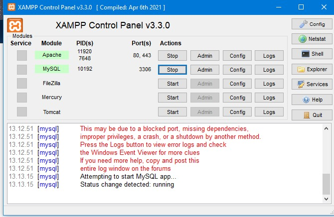
2) Masuk ke directory C.
   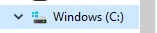
3) Buka folder XAMPP lalu buka folder Htdocs. 
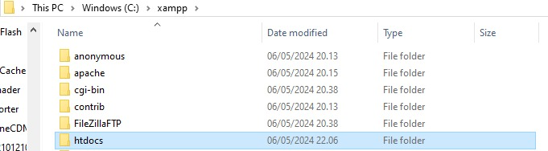
4) Buat folder dengan nama yang anda inginkan.
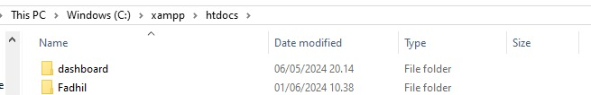
5) Kemudian Masuk ke VSCode lalu klik "Open Folder" dan pilih folder yang telah anda buat.
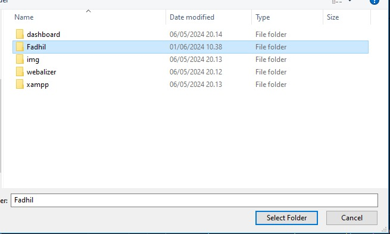

6) Buat Dokumen dengan ekstensi "php".
   
 
 7) Untuk mengetikkan program php,  selalu dibuka dengan "`<?php`" dan di akhiri dengan `?>`.
   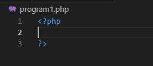
8) Anda telah dapat membuat kode program PHP sesuai dengan keinginan anda.

## Echo & Komentar 
Dalam php kita dapat mengetikkan sesuatu dengan kode "echo" dan menambahkan membuat sebuah komentar di penulisan program untuk penjelasan lebih lanjutnya akan dijelaskan di bawah ini. Dalam penulisan echo terdapat dua cara yaitu dengan kutip satu dan kutip dua, lalu untuk perbedaan antara keduanya akan dijelaskan lebih lanjut dibawah ini.
### Echo kutip satu
Untuk penulisan echo dengan kutip satu hasil yang akan tampil adalah seluruh yang ditulis di dalamnya dan hasil yang tampil akan terhitung sebagai string, walaupun ada variable yang dituliskan di dalam kutipnya. Untuk contoh programnya akan seperti berikut.
```php
echo 'Jumlah meja di kelas '. $meja . ' buah';
    echo "<br>";
```
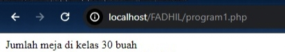
### Echo kutip dua
Sedangkan untuk penulisan kutip dua akan menampilkan hasil dari variable maupun konstanta walapaun ditulis dalam kutip yang sama. Dan untuk contoh cara pengaplikasiannya akan seperti dibawah ini.
```php
echo "Shalat dlu, nabilang pak $wali_kelas dan $ketua_kelas";
    echo "<br>";
    echo "Kalau tidak, diracca' sama ketua gang $ketua_geng";
    echo "<br>";
```
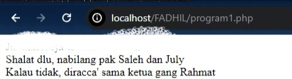
### Komentar
Lalu untuk membuat komentar dalam kode program kita, kita dapat menggunakan dua cara yaitu `//` untuk komentar satu baris dan `/* */` untuk komentar multi baris. Dan untuk cara pengaplikasiaanya akan seperti di bawah ini
```php
//ini komentar satu baris
/*ini komentar
multi baris*/
```

## Variable & Konstanta
Dalam php kita dapat menuliskan variable dan kosntanta untuk menyimpan data yang akan digunakan kedepannya, untuk penjelasan lebih lanjutnya akan dijelaskan di bawah ini.
### Variable
Untuk penulisan variable kita awali dengan `$` lalu menuliskan nama variable nya dan menuliskan nilainya setelahnya dan di akhiri dengan `;`. Untuk contoh penggunaannya akan seperti di bawah ini.
```php 
 $meja = 30;
    $tk_kelas = "XI";
    $ketua_kelas = "July";
    $wali_kelas = "Saleh";
```
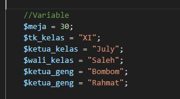

### Konstanta
Untuk konstanta berfungsi untuk menetapkan nilai dari sebuah data agar tidak dapat di ganti ganti kedepannya. Lalu untuk cara penulisannya akan seperti di bawah ini.
```php
const KEPSEK = "Herwelis";
define ('kelas', 'RPL 1');
```
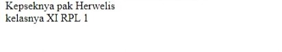
## Operator 
Operator dalam pemrograman adalah simbol atau tanda yang digunakan untuk melakukan operasi tertentu pada satu atau lebih nilai atau variabel. Operator digunakan untuk melakukan operasi matematika, perbandingan, logika, atau manipulasi nilai.
### Aritmatika
Operator Aritmatika: Digunakan untuk melakukan operasi matematika seperti penjumlahan, pengurangan, perkalian, dan pembagian. Contoh: `+, -, *, /, % (modulus)`.
#### Kode Program
```Php
<!DOCTYPE html>
<html>
<head>
    <title>Kalkulator Lengkap</title>
</head>
<body>
    <h1>Kalkulator Lengkap</h1>
    <form method="post">
        <input type="number" name="num1" required placeholder="Angka Pertama"><br><br>
        <input type="number" name="num2" required placeholder="Angka Kedua"><br><br>
        <input type="submit" value="Hitung">
    </form>

    <?php
    if ($_SERVER["REQUEST_METHOD"] == "POST") {
        $num1 = $_POST['num1'];
        $num2 = $_POST['num2'];

        $tambah = $num1 + $num2;
        $kurang = $num1 - $num2;
        $kali = $num1 * $num2;
        $bagi = ($num2 != 0) ? $num1 / $num2 : 'undefined (division by zero)';
        $modulus = ($num2 != 0) ? $num1 % $num2 : 'undefined (division by zero)';

        echo "<h2>Hasil:</h2>";
        echo "<p>$num1 + $num2 = $tambah</p>";
        echo "<p>$num1 - $num2 = $kurang</p>";
        echo "<p>$num1 * $num2 = $kali</p>";
        echo "<p>$num1 / $num2 = $bagi</p>";
        echo "<p>$num1 % $num2 = $modulus</p>";
    }
    ?>
</body>
</html>
```
#### Analisis
- `<!DOCTYPE html>`: Mendefinisikan tipe dokumen HTML yang digunakan.
- `<html>`: Menandai awal elemen HTML.
- `<head>`: Bagian kepala dokumen HTML yang berisi informasi metadata, seperti judul halaman.
- `<title>Kalkulator Lengkap</title>`: Menetapkan judul halaman web menjadi "Kalkulator Lengkap".
- `</head>`: Penutup untuk elemen kepala dokumen.
- `<body>`: Bagian utama dari dokumen HTML yang berisi konten yang akan ditampilkan kepada pengguna.
- `<h1>Kalkulator Lengkap</h1>`: Menampilkan judul utama halaman web sebagai "Kalkulator Lengkap".
- `<form method="post">`: Membuat sebuah form dengan metode POST, yang berarti data formulir akan dikirimkan ke halaman yang sama untuk diproses.
- `<input type="number" name="num1" required placeholder="Angka Pertama"><br><br>`: Menampilkan input pertama untuk pengguna memasukkan angka pertama. required menandakan bahwa input diperlukan, dan placeholder memberikan petunjuk kepada pengguna tentang apa yang diharapkan.
- `<input type="number" name="num2" required placeholder="Angka Kedua"><br><br>`: Menampilkan input kedua untuk pengguna memasukkan angka kedua dengan properti yang sama seperti input pertama.
- `<input type="submit" value="Hitung">`: Tombol submit yang akan mengirimkan formulir ketika diklik.
- `<?php ... ?>`: Awal dan akhir dari blok kode PHP yang digunakan untuk memproses data formulir yang dikirimkan.
- `if ($_SERVER["REQUEST_METHOD"] == "POST") { ... }`: Memeriksa apakah formulir dikirimkan menggunakan metode POST.
- `$num1 = $_POST['num1'];`: Mengambil nilai dari input pertama yang dikirimkan melalui formulir.
- `$num2 = $_POST['num2'];`: Mengambil nilai dari input kedua yang dikirimkan melalui formulir.
- `Operasi aritmatika`: Menambahkan, mengurangkan, mengalikan, membagi, dan menghitung modulus dari dua angka yang dimasukkan.
- `echo "<h2>Hasil:</h2>";`: Menampilkan teks "Hasil:" sebagai judul kedua.
- `echo "<p>$num1 + $num2 = $tambah</p>";`: Menampilkan hasil penambahan dari dua angka.
- `echo "<p>$num1 - $num2 = $kurang</p>";`: Menampilkan hasil pengurangan dari dua angka.
- `echo "<p>$num1 * $num2 = $kali</p>";`: Menampilkan hasil perkalian dari dua angka.
- `echo "<p>$num1 / $num2 = $bagi</p>";`: Menampilkan hasil pembagian dari dua angka.
- `echo "<p>$num1 % $num2 = $modulus</p>";`: Menampilkan hasil modulus dari dua angka.
- `?>`: Akhir dari blok kode PHP.
- `</body>`: Penutup dari elemen body.
- `</html>`: Penutup dari elemen HTML.
#### Kesimpulan
- Operator aritmatika digunakan untuk melakukan operasi matematika pada dua nilai.
- `Operator penambahan (+)`digunakan untuk menambahkan dua nilai.
- `Operator pengurangan (-)`digunakan untuk mengurangkan dua nilai.
- `Operator perkalian (*)` digunakan untuk mengalikan dua nilai.
- `Operator pembagian (/)`digunakan untuk membagi dua nilai.in
- `Operator modulus (%)`digunakan untuk menghitung sisa pembagian dari pembagian dua nilai.
Kalkulator ini memungkinkan pengguna untuk dengan cepat dan mudah melakukan operasi matematika dasar antara dua angka dan melihat hasilnya secara langsung.
#### Hasil 
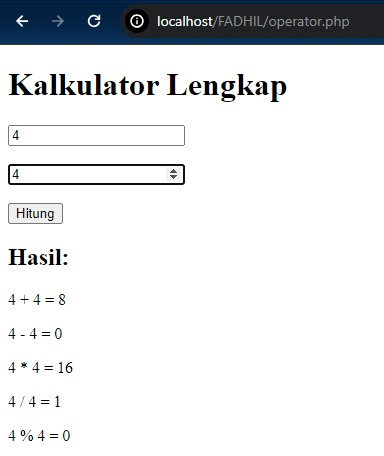

### Perbandingan
### kode 
```php
<!DOCTYPE html>
<html>
<head>
    <title>Kalkulator Perbandingan</title>
</head>
<body>
    <h1>Kalkulator Perbandingan</h1>
    <form method="post">
        <input type="number" name="num1" required placeholder="Angka Pertama"><br><br>
        <input type="number" name="num2" required placeholder="Angka Kedua"><br><br>
        <input type="submit" value="Bandingkan">
    </form>

    <?php
    if ($_SERVER["REQUEST_METHOD"] == "POST") {
        $num1 = $_POST['num1'];
        $num2 = $_POST['num2'];

        $lebihBesar = $num1 > $num2 ? 'true' : 'false';
        $lebihKecil = $num1 < $num2 ? 'true' : 'false';
        $samaDengan = $num1 == $num2 ? 'true' : 'false';
        $tidakSamaDengan = $num1 != $num2 ? 'true' : 'false';
        $lebihBesarSamaDengan = $num1 >= $num2 ? 'true' : 'false';
        $lebihKecilSamaDengan = $num1 <= $num2 ? 'true' : 'false';

        echo "<h2>Hasil Perbandingan:</h2>";
        echo "<p>$num1 > $num2 = $lebihBesar</p>";
        echo "<p>$num1 < $num2 = $lebihKecil</p>";
        echo "<p>$num1 == $num2 = $samaDengan</p>";
        echo "<p>$num1 != $num2 = $tidakSamaDengan</p>";
        echo "<p>$num1 >= $num2 = $lebihBesarSamaDengan</p>";
        echo "<p>$num1 <= $num2 = $lebihKecilSamaDengan</p>";
    }
    ?>
</body>
</html>
```
### Analisis
- `<!DOCTYPE html>`: Mendefinisikan tipe dokumen HTML yang digunakan.
- `<html>`: Menandai awal elemen HTML.
- `<head>`: Bagian kepala dokumen HTML yang berisi informasi metadata, seperti judul halaman.
- `<title>Kalkulator Perbandingan</title>`: Menetapkan judul halaman web menjadi "Kalkulator Perbandingan".
- `</head>`: Penutup untuk elemen kepala dokumen.
- `<body>`: Bagian utama dari dokumen HTML yang berisi konten yang akan ditampilkan kepada pengguna.
- `<h1>Kalkulator Perbandingan</h1>`: Menampilkan judul utama halaman web sebagai "Kalkulator Perbandingan".
- `<form method="post">`: Membuat sebuah form dengan metode POST, yang berarti data formulir akan dikirimkan ke halaman yang sama untuk diproses.
- `<input type="number" name="num1" required placeholder="Angka Pertama"><br><br>`: Menampilkan input pertama untuk pengguna memasukkan angka pertama. required menandakan bahwa input diperlukan, dan placeholder memberikan petunjuk kepada pengguna tentang apa yang diharapkan.
- `<input type="number" name="num2" required placeholder="Angka Kedua"><br><br>`: Menampilkan input kedua untuk pengguna memasukkan angka kedua dengan properti yang sama seperti input pertama.
- `<input type="submit" value="Bandingkan">`: Tombol submit yang akan mengirimkan formulir ketika diklik.
- `<?php ... ?>`: Awal dan akhir dari blok kode PHP yang digunakan untuk memproses data formulir yang dikirimkan.
- `if ($_SERVER["REQUEST_METHOD"] == "POST") { ... }`: Memeriksa apakah formulir dikirimkan menggunakan metode POST.
- `$num1 = $_POST['num1'];`: Mengambil nilai dari input pertama yang dikirimkan melalui formulir.
- `$num2 = $_POST['num2'];`: Mengambil nilai dari input kedua yang dikirimkan melalui formulir.
- `Operasi perbandingan`: Membandingkan dua angka dan menetapkan hasil ke variabel-variabel yang sesuai.
- `echo "<h2>Hasil Perbandingan:</h2>";`: Menampilkan teks "Hasil Perbandingan:" sebagai judul kedua.
- `echo "<p>$num1 > $num2 = $lebihBesar</p>";`: Menampilkan hasil perbandingan bahwa angka pertama lebih besar dari angka kedua.
- `echo "<p>$num1 < $num2 = $lebihKecil</p>";`: Menampilkan hasil perbandingan bahwa angka pertama lebih kecil dari angka kedua.
- `echo "<p>$num1 == $num2 = $samaDengan</p>";`: Menampilkan hasil perbandingan bahwa angka pertama sama dengan angka kedua.
- `echo "<p>$num1 != $num2 = $tidakSamaDengan</p>";`: Menampilkan hasil perbandingan bahwa angka pertama tidak sama dengan angka kedua.
- `echo "<p>$num1 >= $num2 = $lebihBesarSamaDengan</p>";`: Menampilkan hasil perbandingan bahwa angka pertama lebih besar dari atau sama dengan angka kedua.
- `echo "<p>$num1 <= $num2 = $lebihKecilSamaDengan</p>";`: Menampilkan hasil perbandingan bahwa angka pertama lebih kecil dari atau sama dengan angka kedua.
- `?>`: Akhir dari blok kode PHP.
- `</body>`: Penutup dari elemen body.
- `</html>`: Penutup dari elemen HTML.
### Kesimpulan
- Operator perbandingan digunakan untuk membandingkan dua nilai dan menghasilkan nilai boolean (true atau false) berdasarkan hasil perbandingan.
- `Operator '>'` digunakan untuk memeriksa apakah nilai pertama lebih besar dari nilai kedua.
- `Operator '<'` digunakan untuk memeriksa apakah nilai pertama lebih kecil dari nilai kedua.
- `Operator '=='` digunakan untuk memeriksa apakah nilai pertama sama dengan nilai kedua.
- `Operator '!='` digunakan untuk memeriksa apakah nilai pertama tidak sama dengan nilai kedua.
- `Operator '>='`digunakan untuk memeriksa apakah nilai pertama lebih besar dari atau sama dengan nilai kedua.
- `Operator '<='`digunakan untuk memeriksa apakah nilai pertama lebih kecil dari atau sama dengan nilai kedua.
### Hasil 
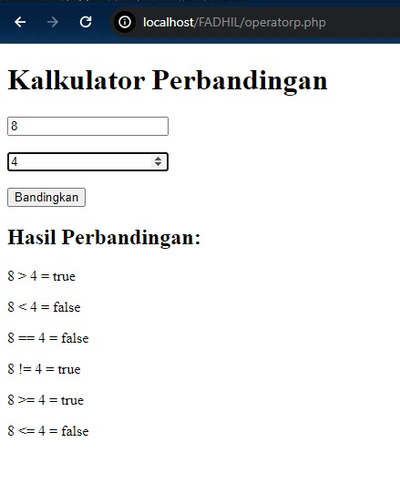
### Logika 
### Kode 
```php
<!DOCTYPE html>
<html>
<head>
    <title>Kalkulator Logika</title>
</head>
<body>
    <h1>Kalkulator Logika</h1>
    <form method="post">
        <label for="num1">Angka Pertama (0 atau 1):</label>
        <input type="number" id="num1" name="num1" min="0" max="1" required><br><br>

        <label for="num2">Angka Kedua (0 atau 1):</label>
        <input type="number" id="num2" name="num2" min="0" max="1" required><br><br>

        <input type="submit" value="Hitung">
    </form>

    <?php
    if ($_SERVER["REQUEST_METHOD"] == "POST") {
        $num1 = intval($_POST['num1']);
        $num2 = intval($_POST['num2']);

        $and = ($num1 && $num2) ? '1' : '0';
        $or = ($num1 || $num2) ? '1' : '0';
        $notNum1 = (!$num1) ? '1' : '0';
        $notNum2 = (!$num2) ? '1' : '0';

        echo "<h2>Hasil Logika:</h2>";
        echo "<p>$num1 AND $num2 = $and</p>";
        echo "<p>$num1 OR $num2 = $or</p>";
        echo "<p>NOT $num1 = $notNum1</p>";
        echo "<p>NOT $num2 = $notNum2</p>";
    }
    ?>
</body>
</html>
```
### Analisis
- `<!DOCTYPE html>`: Mendefinisikan tipe dokumen HTML yang digunakan.
- `<html>`: Menandai awal elemen HTML.
- `<head>`: Bagian kepala dokumen HTML yang berisi informasi metadata, seperti judul halaman.
- `<title>Kalkulator Logika</title>`: Menetapkan judul halaman web menjadi "Kalkulator Logika".
- `</head>`: Penutup untuk elemen kepala dokumen.
- `<body>`: Bagian utama dari dokumen HTML yang berisi konten yang akan ditampilkan kepada pengguna.
- `<h1>Kalkulator Logika</h1>`: Menampilkan judul utama halaman web sebagai "Kalkulator Logika".
- `<form method="post">`: Membuat sebuah form dengan metode POST, yang berarti data formulir akan dikirimkan ke halaman yang sama untuk diproses.
- `<label for="num1">Angka Pertama (0 atau 1):</label>`: Menampilkan label untuk input pertama, memberikan instruksi kepada pengguna tentang apa yang diharapkan.
- `<input type="number" id="num1" name="num1" min="0" max="1" required><br><br>`: Menampilkan input pertama yang hanya menerima angka 0 atau 1, dengan properti required menandakan bahwa input diperlukan.
- `<label for="num2">Angka Kedua (0 atau 1):</label>`: Menampilkan label untuk input kedua, memberikan instruksi kepada pengguna tentang apa yang diharapkan.
- `<input type="number" id="num2" name="num2" min="0" max="1" required><br><br>`: Menampilkan input kedua yang hanya menerima angka 0 atau 1, dengan properti required menandakan bahwa input diperlukan.
- `<input type="submit" value="Hitung">`: Tombol submit yang akan mengirimkan formulir ketika diklik.
- `<?php ... ?>`: Awal dan akhir dari blok kode PHP yang digunakan untuk memproses data formulir yang dikirimkan.
- `if ($_SERVER["REQUEST_METHOD"] == "POST") { ... }`: Memeriksa apakah formulir dikirimkan menggunakan metode POST.
- `$num1 = intval($_POST['num1']);`: Mengambil nilai dari input pertama yang dikirimkan melalui formulir dan mengonversinya ke tipe data integer.
- `$num2 = intval($_POST['num2']);`: Mengambil nilai dari input kedua yang dikirimkan melalui formulir dan mengonversinya ke tipe data integer.
- `Operasi logika`: Melakukan operasi logika AND, OR, dan NOT pada dua angka yang dimasukkan.
- `echo "<h2>Hasil Logika:</h2>";`: Menampilkan teks "Hasil Logika:" sebagai judul kedua.
- Menampilkan hasil operasi logika untuk AND, OR, dan NOT antara kedua angka yang dimasukkan.
- `?>`: Akhir dari blok kode PHP.
- `</body>`: Penutup dari elemen body.
- `</html>`: Penutup dari elemen HTML.
#### Kesimpulan
Kalkulator Logika ini memungkinkan pengguna untuk memasukkan dua angka biner (0 atau 1) dan melakukan operasi logika dasar, yaitu AND, OR, dan NOT. Setelah pengguna memasukkan dua angka, kalkulator akan menampilkan hasil dari operasi logika yang dilakukan antara kedua angka tersebut. Ini adalah alat yang sederhana namun berguna untuk memahami prinsip-prinsip dasar dari logika boolean.
### Hasil 
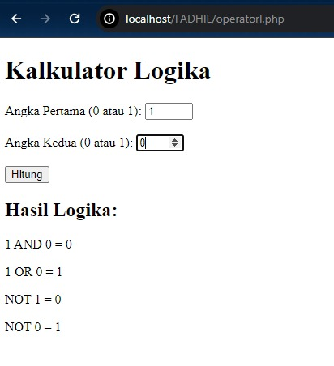

## Conditional Statement
### Penjelasan
Conditional statements dalam PHP digunakan untuk membuat keputusan berdasarkan kondisi tertentu. Ada beberapa jenis conditional statements yang umum digunakan: IF, IF-ELSE, IF-ELSE IF-ELSE dan Switch-case
### IF
**If Statement**: Digunakan untuk mengevaluasi suatu kondisi dan menjalankan blok kode jika kondisinya benar.
#### Struktur
```PHP
if (kondisi) {
    // kode yang akan dijalankan jika kondisi benar
}

```
#### Program
```PHP
<?php
$nilai = 85;

if ($nilai >= 75) {
    echo "Selamat, Anda lulus!";
}
?>
```
#### Hasil 
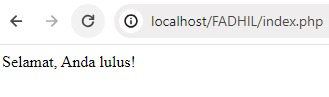
#### Analisis
- `<?php`:adalah tag pembuka untuk menandai bahwa kita akan memulai blok kode PHP.
- `$nilai = 85;`:adalah deklarasi variabel `$nilai` yang diinisialisasi dengan nilai 85.Variabel  digunakan untuk menyimpan nilai yang akan diperiksa dalam struktur kondisional nanti.
- `if ($nilai >= 75) {`:adalah struktur kontrol `if` dalam PHP.Kondisi di dalam tanda kurung, yaitu `$nilai >= 75`, memeriksa apakah nilai variabel `$nilai` lebih besar atau sama dengan 75.Jika kondisi bernilai true, maka blok kode di dalamnya akan dieksekusi.
- `echo "Selamat, Anda lulus!";`:adalah perintah `echo` yang akan mencetak teks "Selamat, Anda lulus!". Pesan akan dicetak jika kondisi di dalam if (nilai $nilai lebih besar atau sama dengan 75) terpenuhi.
- `}`:adalah penutup dari blok kode `if`.
- `?>`: adalah tag penutup 
#### Kesimpulan
Kode diatas menggunakan struktur kontrol if untuk memeriksa nilai variabel `$nilai`.jika nilai variabel `$nilai` adalah 85, maka pesan "Selamat, Anda lulus!" akan dicetak, karena nilai tersebut lebih besar atau sama dengan 75.
### IF-ELSE 
Mirip dengan if statement, namun juga memiliki blok kode alternatif yang akan dijalankan jika kondisi tidak benar.
#### Struktur
```PHP
if (kondisi) {
    // kode yang akan dijalankan jika kondisi benar
} else {
    // kode yang akan dijalankan jika kondisi salah
}

```
#### Program
```PHP
<?php
$bilangan = 11;

if ($bilangan % 2 == 0) {
    echo "$bilangan adalah bilangan genap.";
} else {
    echo "$bilangan adalah bilangan ganjil.";
}
?>
```
#### Hasil
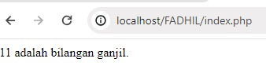
#### Analisis
- `<?php`:adalah tag pembuka untuk menandai bahwa kita akan memulai blok kode PHP.
- `$bilangan = 11;:`adalah deklarasi variabel $bilangan yang diinisialisasi dengan nilai 11.Variabel ini akan digunakan untuk menyimpan bilangan yang akan diperiksa.
- `if ($bilangan % 2 == 0) {:`adalah struktur kontrol if dalam PHP.Kondisi di dalam tanda kurung, yaitu $bilangan % 2 == 0, memeriksa apakah sisa pembagian $bilangan dengan 2 sama dengan 0.Jika kondisi ini bernilai true, maka blok kode di dalamnya akan dieksekusi, yang berarti bilangan tersebut adalah genap.
- `echo "$bilangan adalah bilangan genap.";:`adalah perintah echo yang mencetak teks yang menyatakan bahwa bilangan tersebut adalah genap.
- `else {:`Jika kondisi pada if di baris sebelumnya tidak terpenuhi (nilai $bilangan bukanlah genap), maka blok kode dalam else akan dieksekusi.
- `echo "$bilangan adalah bilangan ganjil.";`:adalah perintah echo yang mencetak teks yang menyatakan bahwa bilangan tersebut adalah ganjil.
- `}`:adalah penutup dari blok kode else.
- `?>`:adalah tag penutup 
#### Kesimpulan
kesimpulan dari kode tersebut adalah untuk memeriksa apakah sebuah bilangan adalah genap atau ganjil dan mencetak hasilnya sesuai dengan kondisi yang ada.
### IF-ELSE IF-ELSE
If-else if-else adalah struktur kontrol dalam pemrograman yang digunakan untuk mengevaluasi beberapa kondisi secara berurutan. Program akan mengevaluasi setiap kondisi dari atas ke bawah, dan hanya menjalankan blok kode yang terkait dengan kondisi yang pertama kali terpenuhi. 
#### Struktur
```PHP
if (kondisi1) {
    // kode yang akan dijalankan jika kondisi1 benar
} elseif (kondisi2) {
    // kode yang akan dijalankan jika kondisi2 benar
} else {
    // kode yang akan dijalankan jika semua kondisi salah
}

```
#### Program
```PHP
<?php
$nilai = 86;

if ($nilai >= 80) {
    echo "Nilai Anda A.";
} elseif ($nilai >= 70) {
    echo "Nilai Anda B.";
} elseif ($nilai >= 60) {
    echo "Nilai Anda C.";
} else {
    echo "Nilai Anda D.";
}
?>

```
#### Hasil 
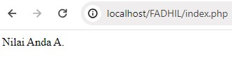
#### Analisis
Tag pembuka PHP.
- `$nilai = 86;`:Mendefinisikan variabel `$nilai` dengan nilai 86. Variabel akan digunakan untuk mengevaluasi kondisi-kondisi berikutnya.
- `if ($nilai >= 80) {`:Memulai struktur kontrol `if` untuk memeriksa nilai `$nilai`.Jika nilai $nilai lebih besar atau sama dengan 80, blok kode dalam kurung kurawal akan dieksekusi.
- `echo "Nilai Anda A.";`:Jika kondisi pada baris sebelumnya terpenuhi, maka pesan "Nilai Anda A." akan dicetak.
- `elseif ($nilai >= 70) {`:Jika kondisi pada `if` sebelumnya tidak terpenuhi, maka kita menggunakan `elseif` untuk memeriksa kondisi berikutnya.Jika nilai $nilai lebih besar atau sama dengan 70, blok kode dalam kurung kurawal ini akan dieksekusi.
- `echo "Nilai Anda B.";`: Jika kondisi pada baris sebelumnya terpenuhi, maka pesan "Nilai Anda B." akan dicetak.
- `elseif ($nilai >= 60) {`:adalah `elseif` kedua untuk memeriksa kondisi berikutnya.Jika nilai $nilai lebih besar atau sama dengan 60, blok kode dalam kurung kurawal ini akan dieksekusi.
- `echo "Nilai Anda C.";`:Jika kondisi pada baris sebelumnya terpenuhi, maka pesan "Nilai Anda C." akan dicetak.
- `else {`: ​​Jika kondisi pada elseif sebelumnya tidak terpenuhi, maka kita menggunakan else sebagai kondisi terakhir.  - Blok kode dalam kurung kurawal akan dieksekusi jika tidak ada kondisi sebelumnya yang terpenuhi.
- `echo "Nilai Anda D.";`:Jika tidak ada kondisi sebelumnya yang terpenuhi, maka pesan "Nilai Anda D." akan dicetak.
- `?>`: Tag penutup PHP.
#### Kesimpulan
kesimpulan dari kode tersebut adalah untuk menentukan kategori nilai berdasarkan skala A, B, C, atau D berdasarkan nilai yang diberikan. Ini menunjukkan cara menggunakan struktur if-elseif-else untuk mengevaluasi beberapa kondisi berurutan.
### SWITCH-CASE
Switch-case adalah struktur kontrol dalam pemrograman yang digunakan untuk mengevaluasi sebuah ekspresi tunggal terhadap serangkaian nilai yang mungkin. 
#### Struktur
```PHP
switch (ekspresi) {
    case nilai1:
        // kode yang akan dijalankan jika ekspresi sama dengan nilai1
        break;
    case nilai2:
        // kode yang akan dijalankan jika ekspresi sama dengan nilai2
        break;
    default:
        // kode yang akan dijalankan jika tidak ada case yang sesuai
}

```
#### Program
```PHP
<?php
$hari = 3;

switch ($hari) {
    case 1:
        echo "Hari ini adalah Senin.";
        break;
    case 2:
        echo "Hari ini adalah Selasa.";
        break;
    case 3:
        echo "Hari ini adalah Rabu.";
        break;
    case 4:
        echo "Hari ini adalah Kamis.";
        break;
    case 5:
        echo "Hari ini adalah Jumat.";
        break;
    case 6:
        echo "Hari ini adalah Sabtu.";
        break;
    case 7:
        echo "Hari ini adalah Minggu.";
        break;
    default:
        echo "Angka yang dimasukkan tidak valid.";
}
?>
```
#### Hasil
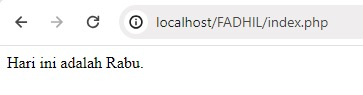
#### Analisis
- `<?php`:Tag pembuka PHP.
- `$hari = 3;`: ​​Mendefinisikan variabel $hari dengan nilai 3.
 Variabel ini akan digunakan untuk menentukan hari yang akan dicetak.
- `switch ($hari) {`: Memulai struktur kontrol switch untuk mengevaluasi nilai variabel $hari.
- `case 1:`: adalah kasus pertama dalam struktur `switch`. ​Jika nilai $hari sama dengan 1, blok kode dalam kasus ini akan dieksekusi. Dalam kasus ini, pesan "Hari ini adalah Senin." akan dicetak.
- `break;`: Pernyataan break digunakan untuk menghentikan eksekusi dari struktur switch.Setelah break, kontrol akan keluar dari struktur switch.
- `case 2:`:adalah kasus kedua dalam struktur switch.
Jika nilai $hari sama dengan 2, blok kode dalam kasus ini akan dieksekusi.Dalam kasus ini, pesan "Hari ini adalah Selasa." akan dicetak.
- `default:`:adalah bagian default dari struktur switch.
Jika tidak ada kasus yang cocok dengan nilai $hari, blok kode dalam bagian ini akan dieksekusi.Dalam kasus ini, pesan "Angka yang dimasukkan tidak valid." akan dicetak.
- `?>`:Tag penutup PHP.
#### Kesimpulan
Kesimpulan dari kode tersebut adalah untuk mencetak hari berdasarkan nilai yang diberikan dalam variabel `$hari` menggunakan struktur kontrol `switch-case`. Jika nilai tidak cocok dengan salah satu kasus yang telah ditentukan, pesan default akan dicetak.

## ARRAY 
Array adalah struktur data yang digunakan dalam pemrograman untuk menyimpan kumpulan nilai atau elemen di bawah satu nama variabel.
### Array 1 dimensi
Array satu dimensi adalah struktur data yang menyimpan sekelompok nilai atau elemen dalam urutan satu dimensi. 
#### Struktur
```PHP
$nilai = array(10, 20, 30, 40, 50);

```
#### Program
```PHP
<?php
$hari = array("Senin", "Selasa", "Rabu", "Kamis", "Jumat", "Sabtu", "Minggu");

// Menampilkan nama-nama hari dalam seminggu
echo "Hari dalam seminggu:\n";
foreach ($hari as $nama_hari) {
    echo $nama_hari . "\n";
}
?>
```
#### Hasil
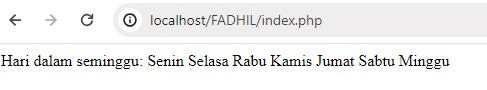
#### Analisis
- `<?php`:Tag pembuka PHP.
- `$hari = array("Senin", "Selasa", "Rabu", "Kamis", "Jumat", "Sabtu", "Minggu");`:adalah deklarasi variabel `$hari` yang berisi sebuah array dengan nama-nama hari dalam seminggu. Setiap nama hari disimpan sebagai elemen dalam array.
- `echo "Hari dalam seminggu:\n";`: ​​adalah pernyataan echo untuk mencetak teks "Hari dalam seminggu:" ke layar. \n digunakan untuk menambahkan baris baru setelah teks tersebut dicetak.
- `foreach ($hari as $nama_hari) {`:adalah loop foreach yang digunakan untuk melakukan iterasi melalui setiap elemen dalam array `$hari`.Setiap elemen akan disimpan dalam variabel $nama_hari pada setiap iterasi.
- `echo $nama_hari . "\n";`:Pada setiap iterasi, nama hari saat ini yang disimpan dalam variabel $nama_hari akan dicetak ke layar.`\n` digunakan untuk menambahkan baris baru setelah setiap nama hari dicetak.
- `}`:Penutup dari loop foreach.
- `?>`:Tag penutup PHP.
#### Kesimpulan
Kesimpulan dari kode tersebut adalah untuk menampilkan nama-nama hari dalam seminggu dengan menggunakan loop foreach untuk iterasi melalui array $hari. Setiap nama hari kemudian dicetak satu per satu ke layar.
### Array Asosiatif
Array asosiatif adalah struktur data dalam pemrograman yang menggunakan pasangan kunci-nilai untuk menyimpan data.
#### Struktur
```PHP
$siswa = array("nama" => "Fadhil", "umur" => 17, "kelas" => "XI");

```
#### Program 
```PHP

<?php
// Array asosiatif untuk menyimpan informasi Pemain
$Pemain = array(
    array("nama" => "Roy Keane", "Harga" => 300000), 
    array("nama" => "Stefano", "Harga" => 450000),
    array("nama" => "Cafu",  "Harga" => 400000),
    
);

// Menampilkan informasi Pemain
echo "Harga Pemain:\n";
foreach ($Pemain as $P) {
    echo "Nama: " . $P["nama"] . " Harga: $" . $P["Harga"] . "<br>";
}
?
```
#### Hasil 
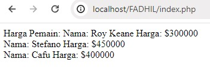
#### Analisis
- `<?php`: Tag pembuka PHP.
- `$Pemain = array(...);`: ​​adalah deklarasi array asosiatif $Pemain.Setiap elemen array adalah array lain yang memiliki dua kunci: "nama" dan "Harga".
- `echo "Harga Pemain:\n";`:adalah pernyataan echo untuk mencetak teks "Harga Pemain:" ke layar.`\n` digunakan untuk menambahkan baris baru setelah teks tersebut dicetak.
- `foreach ($Pemain as $P) {`:adalah loop foreach yang digunakan untuk mengiterasi melalui setiap elemen dalam array `$Pemain`. Pada setiap iterasi, nilai dari elemen saat ini disimpan dalam variabel $P.
- `echo "Nama: " . $P["nama"] . " Harga: $" . $P["Harga"] . "<br>";`: Pada setiap iterasi, nama dan harga pemain saat ini yang disimpan dalam variabel $P akan dicetak ke layar.
- `"Nama: " . $P["nama"]` mengambil nilai kunci "nama" dari elemen saat ini dalam array `$Pemain`.
- `" Harga: $" . $P["Harga"]` mengambil nilai kunci "Harga" dari elemen saat ini dalam array `$Pemain`.
- `<br>` digunakan untuk menambahkan baris baru setelah setiap informasi pemain dicetak.
- `}`:Penutup dari loop foreach.
- `?>`:Tag penutup PHP.
#### Kesimpulan
kode tersebut bertujuan untuk menampilkan informasi tentang pemain, termasuk nama dan harga mereka, menggunakan loop foreach untuk mengiterasi melalui array asosiatif `$Pemain`.


### Array Multidimensi
Array multidimensi adalah struktur data dalam pemrograman yang memiliki dua atau lebih dimensi, yang artinya array tersebut terdiri dari array di dalam array.
#### Struktur😂
```PHP
$matriks = array(
    array(1, 2, 3),
    array(4, 5, 6),
    array(7, 8, 9)
);

```
#### Program 
```PHP

<?php
// Array multidimensi untuk menyimpan daftar kontak
$daftar_kontak = array(
    array("nama" => "Kashmiri", "telepon" => "089768787880", "email" => "Kashmiri@gmail.com"),
    array("nama" => "Mail", "telepon" => "098765432321", "email" => "mail22@gmail.com"),
    array("nama" => "Muhammad Sumbul ", "telepon" => "099887675463", "email" => "bob@example.com")
);

// Menampilkan daftar kontak
echo "Daftar Kontak:\n";
foreach ($daftar_kontak as $kontak) {
    echo "Nama: " . $kontak["nama"] . ", Telepon: " . $kontak["telepon"] . ", Email: " . $kontak["email"] . "<br>";
}
?>
```
#### Hasil
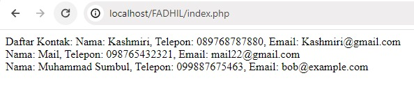
#### Analisis
- `<?php`:Tag pembuka PHP.
- `$daftar_kontak = array(...);`:adalah deklarasi array multidimensi `$daftar_kontak`.Setiap elemen array adalah array lain yang memiliki tiga kunci: "nama", "telepon", dan "email".
- `echo "Daftar Kontak:\n";`: ​​adalah pernyataan echo untuk mencetak teks "Daftar Kontak:" ke layar. `\n`digunakan untuk menambahkan baris baru setelah teks tersebut dicetak.
- `foreach ($daftar_kontak as $kontak) {`:adalah loop foreach yang digunakan untuk mengiterasi melalui setiap elemen dalam array `$daftar_kontak`.Pada setiap iterasi, nilai dari elemen saat ini disimpan dalam variabel $kontak.
- `echo "Nama: " . $kontak["nama"] . ", Telepon: " . $kontak["telepon"] . ", Email: " . $kontak["email"] . "<br>";`:Pada setiap iterasi, nama, telepon, dan email dari kontak saat ini yang disimpan dalam variabel `$kontak` akan dicetak ke layar.
- `"Nama: " . $kontak["nama"]` mengambil nilai kunci "nama" dari elemen saat ini dalam array `$daftar_kontak`.
- `"Telepon: " . $kontak["telepon"]` mengambil nilai kunci "telepon" dari elemen saat ini dalam array `$daftar_kontak`.
- `"Email: " . $kontak["email"]` mengambil nilai kunci "email" dari elemen saat ini dalam array `$daftar_kontak`.
- `<br>` digunakan untuk menambahkan baris baru setelah setiap informasi kontak dicetak.
- `}`: Penutup dari loop foreach.
- `?>`:Tag penutup PHP.
#### Kesimpulan
kode tersebut bertujuan untuk menampilkan daftar kontak yang disimpan dalam array multidimensi `$daftar_kontak`. Setiap kontak ditampilkan dengan menggunakan loop foreach untuk mengiterasi melalui array tersebut.

## Var_dump
`var_dump()` adalah sebuah fungsi dalam PHP yang digunakan untuk menampilkan informasi detail tentang satu atau lebih variabel, termasuk tipe data dan nilai-nilai yang dimilikinya. Fungsi ini sering digunakan untuk debugging dan pengembangan kode PHP.
### Struktur
```PHP
var_dump($variabel);

```

### Program
```PHP
<?php
// Array asosiatif
$person = array(
    'name' => 'Fadhil',
    'age' => 17,
    'email' => 'ffadli@gmail.com'
);

// Array multidimensi
$Pemain= [
    [
        'name' => 'Ronaldinho',
        'age' => 44,
        'email' => 'Ronal988@gmail.com'
    ],
    [
        'name' => 'Beckham',
        'age' => 49,
        'email' => 'Beckham787@gmail.com'
    ]
];

// Menampilkan isi array asosiatif menggunakan var_dump
echo "<pre>Array Asosiatif:<br>";
var_dump($person);
echo "</pre><br>";

// Menampilkan isi array multidimensi menggunakan var_dump
echo "<pre>Array Multidimensi:<br>";
var_dump($Pemain);
echo "</pre><br>";
?
```
### Hasil 
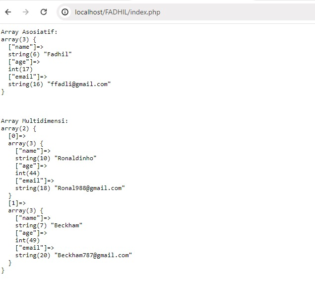
### Analisis
- `<?php`:Tag pembuka PHP
- `$person = array(  ​'name' => 'Fadhil',  'age' => 17,'email' => 'ffadli@gmail.com') `; : Membuat sebuah array asosiatif dengan variabel `$person`.Array ini memiliki tiga pasangan kunci-nilai: 'name' dengan nilai 'Fadhil', 'age' dengan nilai 17, dan 'email' dengan nilai `'ffadli@gmail.com'`.
- `$Pemain= [['name' => 'Ronaldinho',  ​'age' => 44, ​'email' => 'Ronal988@gmail.com' ​],​[ ​'name' => 'Beckham',  ​'age' => 49,    'email' => 'Beckham787@gmail.com']];`: Membuat sebuah array multidimensi dengan variabel $Pemain.Array ini memiliki dua elemen, masing-masing merupakan array asosiatif yang mewakili informasi tentang pemain sepak bola.Setiap array asosiatif dalam array induk mewakili satu pemain dengan kunci 'name', 'age', dan 'email'.
- `echo "<pre>Array Asosiatif:<br>";var_dump($person);echo "</pre>";`: Menggunakan echo untuk mencetak teks "Array Asosiatif:" di layar.Menggunakan var_dump untuk menampilkan isi dari array $person dengan format yang lebih mudah dibaca menggunakan tag `<pre>`untuk mempertahankan format teks.
- `echo "<pre>Array Multidimensi:<br>";var_dump($Pemain);echo "</pre>";`: Menggunakan echo untuk mencetak teks "Array Multidimensi:" di layar.Menggunakan var_dump untuk menampilkan isi dari array $Pemain dengan format yang lebih mudah dibaca menggunakan tag `<pre>` untuk mempertahankan format teks.
-  `?>`:Tag penutup PHP.
### Kesimpulan
Membuat array asosiatif yang berisi informasi tentang seseorang, seperti nama, usia, dan email.Membuat array multidimensi yang berisi informasi tentang pemain sepak bola, seperti nama, usia, dan email, untuk beberapa pemain.
Menampilkan isi dari array asosiatif dan multidimensi menggunakan `var_dump()`untuk memeriksa struktur dan nilai-nilai di dalamnya.
## Looping (Pembagian)
Looping pembagian adalah proses iterasi yang digunakan untuk membagi serangkaian bilangan dengan bilangan tertentu.
### For 
For loop adalah struktur kontrol dalam pemrograman yang digunakan untuk melakukan iterasi atau pengulangan sejumlah tertentu dalam kode.
#### Struktur
```PHP
for (inisialisasi; kondisi; increment/decrement) {
    // kode yang akan diulang
}

```
#### Program
```PHP
<?php
for ($i = 0; $i <= 10; $i += 2) {
    echo $i . " ";
}
?>

```
#### Analisis
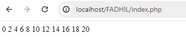
#### Analisis
- `<?php`:Tag pembuka PHP.
- `for ($i = 0; $i <= 10; $i += 2) {`:adalah pernyataan for loop. ​Variabel $i dideklarasikan dan diinisialisasi dengan nilai 0. ​Iterasi loop akan dilakukan selama nilai $i kurang dari atau sama dengan 10.Setiap kali iterasi dilakukan, nilai $i akan ditambah 2.
- `echo $i . " ";`:adalah pernyataan echo yang mencetak nilai variabel `$i` ke layar, diikuti oleh spasi. Pada setiap iterasi, nilai $i akan dicetak.
- `}`:Penutup dari loop for.
- `?>`:adalah tag penutup PHP.
#### Kesimpulan
kode tersebut bertujuan untuk mencetak angka dari 0 hingga 10 dengan selang 2, yaitu 0, 2, 4, 6, 8, dan 10. Hal ini dilakukan menggunakan loop for dengan pengaturan kondisi awal `$i = 0`, kondisi penghentian iterasi `$i <= 10`, dan langkah peningkatan `$i += 2`.
### While
While loop adalah struktur kontrol dalam pemrograman yang digunakan untuk melakukan iterasi atau pengulangan selama kondisi tertentu terpenuhi. 
#### Struktur
```PHP
while (kondisi) {
    // kode yang akan diulang
}

```
#### Program
```PHP
<?php
$i = 15;
while ($i >= 1) {
    echo $i . " ";
    $i--;
}
?>

```
#### Hasil 
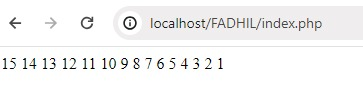
#### Analisis
- `<?php`:Tag pembuka PHP.
- `$i = 15;`:Inisialisasi variabel $i dengan nilai 15.
Variabel  akan digunakan sebagai perhitungan dalam loop.
- `while ($i >= 1) {`:Pernyataan while loop.Iterasi loop akan dilakukan selama nilai variabel $i lebih besar atau sama dengan 1.
- `echo $i . " ";`:Perintah echo untuk mencetak nilai variabel $i ke layar, diikuti oleh spasi.Pada setiap iterasi, nilai variabel $i akan dicetak.
- `$i--;`:Pernyataan ini mengurangi nilai variabel $i setiap kali iterasi dilakukan.ini dilakukan untuk mengurangi nilai $i secara bertahap hingga mencapai 1.
- `}`:Penutup dari while loop.
- `?>`:Tag penutup PHP.
#### Kesimpulan
keseluruhan kode tersebut bertujuan untuk mencetak angka dari 15 hingga 1 dengan menggunakan while loop. Pada setiap iterasi, nilai variabel `$i` akan dicetak ke layar dan kemudian dikurangi satu. Iterasi akan terus dilakukan hingga nilai `$i` mencapai 1.
### Do-While
Do-while loop adalah struktur kontrol dalam pemrograman yang mirip dengan while loop, namun dengan perbedaan bahwa do-while loop akan menjalankan blok kode setidaknya satu kali, bahkan jika kondisi awalnya salah. 
#### Struktur
```PHP
do {
    // kode yang akan diulang
} while (kondisi);

```
#### Program
```PHP
<?php
$i = 1;
do {
    echo $i . " ";
    $i++;
} while ($i <= 12);
?>

```
#### Hasil 
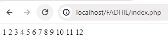
#### Analisis
- `<?php`:Tag pembuka PHP.
- `$i = 1;`:Inisialisasi variabel `$i` dengan nilai 1.Variabel ini akan digunakan sebagai perhitungan dalam loop.
- `do {`:Pernyataan do-while loop.Blok kode di dalam kurung kurawal akan dieksekusi sekali, bahkan jika kondisi di while salah.
- `echo $i . " ";`: ​​Perintah echo untuk mencetak nilai variabel $i ke layar, diikuti oleh spasi.Pada setiap iterasi, nilai variabel $i akan dicetak.
- `$i++;`: ​​Pernyataan ini menambah nilai variabel $i setiap kali iterasi dilakukan.dilakukan untuk meningkatkan nilai $i secara bertahap.
- `} while ($i <= 12);`: adalah bagian while loop dari do-while loop.Iterasi loop akan dilakukan selama nilai variabel $i kurang dari atau sama dengan 12.
- `?>`:Tag penutup PHP.
#### Kesimpulan
kode tersebut bertujuan untuk mencetak angka dari 1 hingga 12 menggunakan do-while loop. Pada setiap iterasi, nilai variabel `$i` akan dicetak ke layar dan kemudian akan ditambah satu. Iterasi akan terus dilakukan hingga nilai `$i` mencapai atau melebihi 12.
### Foreach 
Foreach adalah struktur pengulangan yang digunakan dalam pemrograman untuk mengulang melalui setiap elemen dalam sebuah array atau objek iterable. 
#### Struktur
```PHP
foreach ($array as $value) {
    // kode yang akan diulang untuk setiap nilai dalam array
}

```
#### Program
```PHP
<?php
$angka = array(1, 2, 3, 4, 5, 6, 7, 8, 9, 10);

foreach ($angka as $nilai) {
    echo $nilai . " ";
}
?>

```
#### Hasil 
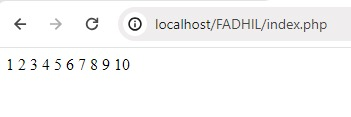
#### Analisis
- `<?php`:Tag pembuka PHP.
- `angka = array(1, 2, 3, 4, 5, 6, 7, 8, 9, 10);`: Mendefinisikan sebuah array dengan nama `$angka` yang berisi angka dari 1 hingga 10.
- `foreach ($angka as $nilai) { ... }`: Konstruksi foreach loop digunakan untuk mengiterasi setiap elemen dalam array `$angka`. Pada setiap iterasi, nilai dari elemen saat ini disimpan dalam variabel `$nilai`.
- `echo $nilai . " ";`: Setiap nilai dari array `$angka` dicetak ke output dengan ditambahkan spasi setelahnya.
-  `?>`:Tag penutup PHP.
#### Kesimpulan
kode tersebut bertujuan untuk mencetak angka dari 1 hingga 10 menggunakan Foreach.Setiap nilai dari array `$angka` di cetak ke output akan di tambahkan spasi setelahnya. 

## PHP Form 

### Get Method
Metode GET adalah salah satu metode pengiriman data dari form HTML ke server untuk diproses oleh skrip PHP. 
### Struktur
```PHP
<?php
// Mendapatkan nilai parameter dari URL
$parameter1 = $_GET['parameter1'];
$parameter2 = $_GET['parameter2'];

// Lakukan pemrosesan sesuai kebutuhan
// ...

// Tampilkan hasil atau lakukan tindakan lain
// ...
?>

```
### Program
```PHP
<?php
// Periksa apakah metode permintaan adalah GET
if ($_SERVER['REQUEST_METHOD'] === 'GET') {
    // Periksa apakah parameter "nama" ada dalam URL
    if (isset($_GET['nama'])) {
        $nama = $_GET['nama'];
        echo "Nama: " . $nama . "<br>";
    } else {
        echo "Parameter 'nama' tidak ditemukan.<br>";
    }

    // Periksa apakah parameter "umur" ada dalam URL
    if (isset($_GET['umur'])) {
        $umur = $_GET['umur'];
        echo "Umur: " . $umur . "<br>";
    } else {
        echo "Parameter 'umur' tidak ditemukan.<br>";
    }

    // Periksa apakah nilai "nama" adalah "Fadhil" dan nilai "umur" adalah 17
    if (isset($nama) && isset($umur) && $nama === "Fadhil" && $umur === "17") {
        echo "Nama Fadhil dengan umur 17.<br>";
    } else {
        echo "Nama atau umur tidak sesuai dengan yang diharapkan.<br>";
    }
}
?>
```
### Hasil 
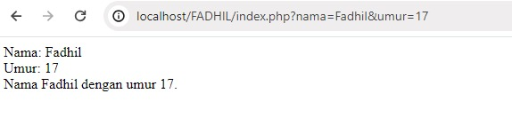
### Analisis
- `<?php`:Tag pembuka PHP.
- `if ($_SERVER['REQUEST_METHOD'] === 'GET') {`: Memeriksa apakah metode permintaan yang digunakan adalah GET.
- `if (isset($_GET['nama'])) {`: Memeriksa apakah parameter "nama" ada dalam URL.
- `$nama = $_GET['nama'];`: Menyimpan nilai parameter "nama" ke dalam variabel $nama.
- `echo "Nama: " . $nama . "<br>";`: Menampilkan nilai "nama" yang disimpan dalam variabel $nama.
- `} else {`: Menangani kasus ketika parameter "nama" tidak ada dalam URL.
- `echo "Parameter 'nama' tidak ditemukan.<br>";`: Menampilkan pesan bahwa parameter "nama" tidak ditemukan dalam URL.
- Pengecekan parameter "umur", penanganannya, dan tampilannya memiliki pola yang sama dengan penanganan parameter "nama".
- `if (isset($nama) && isset($umur) && $nama === "Fadhil" && $umur === "17") {`: Memeriksa apakah nilai "nama" adalah "Fadhil" dan nilai "umur" adalah "17".
- `echo "Nama Fadhil dengan umur 17.<br>";`: Menampilkan pesan jika nilai "nama" dan "umur" sesuai dengan yang diharapkan.
- `} else {`: Menangani kasus ketika nilai "nama" atau "umur" tidak sesuai dengan yang diharapkan.
- `echo "Nama atau umur tidak sesuai dengan yang diharapkan.<br>";`: Menampilkan pesan bahwa nilai "nama" atau "umur" tidak sesuai dengan yang diharapkan.
- Penutup struktur kontrol untuk setiap blok if dan else.
- `?>`:Tag penutup PHP.
### Kesimpulan 
kode tersebut adalah sebuah skrip PHP yang digunakan untuk memproses parameter yang dikirimkan melalui URL dengan metode GET, kemudian memberikan respons sesuai dengan kondisi yang ditentukan berdasarkan nilai parameter.
### Post Method
POST Method dapat digunakan untuk mengirimkan data dari formulir HTML ke server. PHP menyediakan variabel global $_POST yang dapat digunakan untuk mengakses data yang dikirimkan melalui metode POST.
### Struktur
```PHP
<form method="POST" action="proses.php">
    <!-- Konten formulir -->
</form>
```
### Program
```HTML
<!DOCTYPE html>
<html>
<head>
    <title>Formulir POST</title>
</head>
<body>
    <form method="POST" action="index.php">
        <label for="nama">Nama:</label>
        <input type="text" name="nama" id="nama">
        <input type="submit" value="Submit">
    </form>
</body>
</html>
```

```PHP
<?php
if ($_SERVER["REQUEST_METHOD"] == "POST") {
    $nama = $_POST["nama"]; // Mengakses data "nama" dari $_POST

    echo "Halo, " . $nama . "! Data telah berhasil dikirim.";
}
?>

```
### Hasil
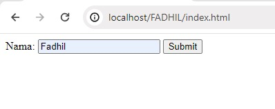
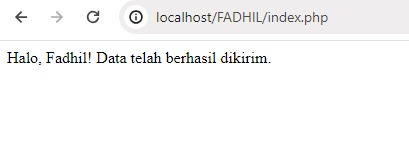
### Analisis
- `<html>`: Tag pembuka untuk elemen HTML.
- `<head>`: Bagian kepala dokumen HTML yang berisi informasi tambahan seperti judul halaman, meta tag, dan tautan ke berkas eksternal.
- `<title>Formulir POST</title>`: Ini adalah judul halaman yang akan ditampilkan di bilah judul atau tab peramban.
- `</head>`: Tag penutup untuk bagian kepala dokumen HTML.
- `<body>: Bagian utama dari dokumen HTML yang berisi konten yang akan ditampilkan kepada pengguna.
- `<form method="POST" action="proses.php">...</form>`: adalah elemen form.
- `method="POST"`: Menentukan bahwa data formulir akan dikirim menggunakan metode POST.
  `action="index.php"`: Menentukan ke mana data formulir akan dikirim saat formulir disubmit, yaitu ke file index.php.
- <label for="nama">Nama:</label>: adalah label yang berhubungan dengan input field. Pengguna akan melihat teks "Nama:" di sebelah input field.
- `<input type="text" name="nama" id="nama">`: adalah input field di mana pengguna dapat memasukkan nama mereka.
- `type="text"`: Menentukan bahwa ini adalah input field teks.
- `name="nama"`: Memberi nama pada input field sehingga data yang dimasukkan dapat diidentifikasi di file index.php.
- `id="nama"`: Memberi id pada input field yang dapat digunakan untuk tujuan styling atau scripting.
- `<input type="submit" value="Submit">`: adalah tombol submit yang akan diklik oleh pengguna untuk mengirimkan formulir.
- `$_SERVER["REQUEST_METHOD"] == "POST"`: Memeriksa apakah metode permintaan yang digunakan adalah POST.
- `$nama = $_POST["nama"];`: Mengambil nilai yang dikirim melalui formulir dengan metode POST.
- `echo "Halo, " . $nama . "! Data telah berhasil dikirim.";`: Mencetak pesan ke layar dengan nilai nama yang dikirimkan melalui 
### Kesimpulan
Dua kode tersebut bekerja sama untuk mengambil data yang dikirim melalui formulir HTML dengan metode POST, dan kemudian menampilkan pesan sambutan yang mencakup nama yang dikirimkan. Ini memungkinkan pengguna untuk mengirimkan data melalui formulir dan melihat responsnya. 
## Function 
Fungsi (function) dalam pemrograman adalah blok kode yang dirancang untuk melakukan tugas tertentu secara terpisah dari bagian utama program. 
### Struktur
```PHP
function sapa()
{
    echo "Halo, selamat datang!";
}

sapa();
```
### Program
```PHP
<?php
function sapa($nama)
{
    echo "Halo, $nama! Selamat datang!";
}

$namaPengguna = "John";
sapa($namaPengguna);
?>
```

### Hasil 
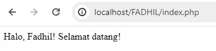
### Analisis
- `<?php`:Tag pembuka PHP.
- `function sapa($nama) `: adalah deklarasi fungsi bernama sapa yang menerima satu parameter yaitu $nama. Blok kode fungsi dimulai dengan tanda kurung kurawal {.
- `echo "Halo, $nama! Selamat datang!";`: Di dalam fungsi, terdapat pernyataan echo yang mencetak pesan sapaan yang mencakup nilai dari parameter $nama.
- `$namaPengguna = "Fadhil";`: Mendefinisikan variabel $namaPengguna dengan nilai "Fadhil". Variabel ini akan digunakan sebagai argumen saat memanggil fungsi sapa.
- `sapa($namaPengguna);`: Memanggil fungsi sapa() dengan argumen yang diberikan, yaitu nilai dari variabel $namaPengguna.
 - `?>`:Tag penutup PHP.

### Kesimpulan
 program ini mendefinisikan sebuah fungsi sapa yang menyapa pengguna dengan nama yang diberikan, dan kemudian memanggil fungsi tersebut dengan menggunakan variabel $namaPengguna yang telah ditetapkan sebelumnya. Output dari program ini adalah pesan sapaan "Halo, Fadhil! Selamat datang!".

