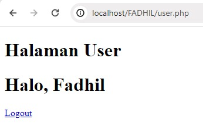

# Koneksi Database
## Query
```PHP
<?php

//koneksi ke database
$koneksi = mysqli_connect('localhost', 'root', '', 'rental_fadhil');

if ($koneksi) {
    echo "<br> koneksi aman <br>";
} else {
    echo "error, tidak bisa koneksi ke database";
}
?>
```
### Analisis
- `<?php`: Pembuka script PHP.
- `// koneksi ke database`: Komentar untuk menjelaskan tujuan bagian kode berikutnya.
- `mysqli_connect('localhost', 'root', '', 'rental_fadhil')`: Fungsi untuk menghubungkan ke database MySQL:
 - `'localhost'`: Alamat server database (di sini adalah server lokal).
- `'root'`: Username untuk login ke MySQL.
- `''`: Password untuk login ke MySQL (di sini tidak ada password).
- `'rental_fadhil'`: Nama database yang ingin dihubungkan.
- `$koneksi`: Variabel yang menyimpan hasil koneksi ke database.
- `if ($koneksi) { ... } else { ... }`: Struktur kontrol untuk memeriksa apakah koneksi berhasil.
- `echo "<br> koneksi aman <br>";`: Menampilkan pesan jika koneksi berhasil.
- `echo "error, tidak bisa koneksi ke database";`: Menampilkan pesan jika koneksi gagal.
- `?>`: Penutup script PHP.
### Kesimpulan
kode PHP diatas digunakan untuk menghubungkan ke database MySQL bernama rental_fadhil. Jika koneksi berhasil, akan menampilkan pesan "koneksi aman", jika gagal akan menampilkan pesan "error, tidak bisa koneksi ke database".
### Hasil


# Tampilkan Data
## Query
```php
<?php
// Koneksi ke database
$koneksi = mysqli_connect('localhost', 'root', '', 'rental_fadhil');

if ($koneksi) {
    echo "<br>koneksi aman<br>";
} else {
    echo "Error, tidak bisa koneksi ke database";
    exit;
}

// Query untuk mengambil data mobil beserta pemiliknya
$query = "SELECT no_plat, pemilik FROM mobil";
$result = mysqli_query($koneksi, $query);

// Cek apakah query berhasil
if ($result) {
    $select = mysqli_fetch_all($result, MYSQLI_ASSOC);

    echo 'Berikut mobil-mobil beserta pemiliknya<br>';

    if (!empty($select)) {
        $a = 1;
        foreach ($select as $key => $data) {
            echo $a++ . ". " . htmlspecialchars($data['no_plat']) . " : " . htmlspecialchars($data['pemilik']) . '<br>';
        }
    } else {
        echo "Tidak ada data mobil yang tersedia.<br>";
    }
} else {
    echo "Error: " . mysqli_error($koneksi);
}

// Tutup koneksi ke database
mysqli_close($koneksi);
?>

```
### Analisis
- `<?php`: Pembuka script PHP.
- `// Koneksi ke database`: Komentar untuk menjelaskan tujuan bagian kode berikutnya.
- `mysqli_connect('localhost', 'root', '', 'rental_fadhil')`: Fungsi untuk menghubungkan ke database MySQL:
- `'localhost'`: Alamat server database (di sini adalah server lokal).
- `'root'`: Username untuk login ke MySQL.
- `''`: Password untuk login ke MySQL (di sini tidak ada password).
- `'rental_fadhil'`: Nama database yang ingin dihubungkan.
- `$koneksi`: Variabel yang menyimpan hasil koneksi ke database.
- `if ($koneksi) { ... } else { ... }`: Struktur kontrol untuk memeriksa apakah koneksi berhasil.
- `echo "<br>koneksi aman<br>";`: Menampilkan pesan jika koneksi berhasil.
- `echo "Error, tidak bisa koneksi ke database"; exit;`: Menampilkan pesan jika koneksi gagal dan menghentikan eksekusi script.
- `//Query untuk mengambil data mobil beserta pemiliknya`: Komentar untuk menjelaskan bagian kode berikutnya.
- `$query = "SELECT no_plat, pemilik FROM mobil";`: Query untuk mengambil data nomor plat dan pemilik dari tabel mobil.
- `$result = mysqli_query($koneksi, $query);`: Menjalankan query dan menyimpan hasilnya.
- `if ($result) { ... } else { ... }`: Struktur kontrol untuk memeriksa apakah query berhasil dijalankan.
- `$select = mysqli_fetch_all($result, MYSQLI_ASSOC);`: Mengambil semua hasil query dalam bentuk array asosiatif.
- `echo 'Berikut mobil-mobil beserta pemiliknya<br>';`: Menampilkan pesan.
- `if (!empty($select)) { ... } else { ... }`: Memeriksa apakah hasil query tidak kosong.
- `$a = 1; foreach ($select as $key => $data) { ... }`: Loop untuk menampilkan data mobil dan pemilik.
- `htmlspecialchars($data['no_plat'])`: Mengamankan output dengan mengkonversi karakter spesial HTML.
- `echo "Tidak ada data mobil yang tersedia.<br>";`: Menampilkan pesan jika tidak ada data mobil.
- `echo "Error: " . mysqli_error($koneksi);`: Menampilkan pesan kesalahan jika query gagal dijalankan.
- `mysqli_close($koneksi);`: Menutup koneksi ke database.
- `?>`: Penutup script PHP.
### Kesimpulan
Kode PHP di atas menghubungkan ke database rental_fadhil, menjalankan query untuk mengambil data mobil beserta pemiliknya, dan menampilkan hasilnya. Jika koneksi atau query gagal, akan menampilkan pesan kesalahan yang sesuai. Setelah selesai, koneksi ke database ditutup.

### Hasil


# Tambahkan Data 
## Query
```Php
<?php
include 'database.php';

if ($_SERVER["REQUEST_METHOD"] == "POST") {
    $no_plat = $_POST['no_plat'];
    $no_mesin = $_POST['no_mesin'];
    $warna = $_POST['warna'];
    $pemilik = $_POST['pemilik'];
    $peminjam = $_POST['peminjam'];
    $harga_rental = $_POST['harga_rental'];

    $query = "INSERT INTO mobil (no_plat, no_mesin, warna, pemilik, peminjam, harga_rental) VALUES ('$no_plat', '$no_mesin', '$warna', '$pemilik', '$peminjam', '$harga_rental')";
    
    if (mysqli_query($koneksi, $query)) {
        header("Location: index.php");
    } else {
        echo "Error: " . $query . "<br>" . mysqli_error($koneksi);
    }
}
?>

<!DOCTYPE html>
<html>
<head>
    <title>Tambah Data Mobil</title>
</head>
<body>
    <h1>Tambah Data Mobil</h1>
    <form method="post" action="tambah.php">
        <label>No Plat:</label><br>
        <input type="text" name="no_plat"><br>
        <label>No Mesin:</label><br>
        <input type="text" name="no_mesin"><br>
        <label>Warna:</label><br>
        <input type="text" name="warna"><br>
        <label>Pemilik:</label><br>
        <input type="text" name="pemilik"><br>
        <label>Peminjam:</label><br>
        <input type="text" name="peminjam"><br>
        <label>Harga Rental:</label><br>
        <input type="number" name="harga_rental"><br>
        <input type="submit" value="Tambah">
    </form>
</body>
</html>
```
### Analisis PHP
- `include 'database.php';`: Menyertakan file `database.php` yang berisi konfigurasi koneksi ke database.
- `if ($_SERVER["REQUEST_METHOD"] == "POST") { ... }`: Mengecek apakah request yang diterima adalah metode POST.
- `$_POST['no_plat']`, `$_POST['no_mesin']`, `$_POST['warna']`, `$_POST['pemilik']`, `$_POST['peminjam']`, `$_POST['harga_rental']`: Mengambil data yang dikirim melalui form.
- `INSERT INTO mobil (no_plat, no_mesin, warna, pemilik, peminjam, harga_rental) VALUES (...)`: Query untuk memasukkan data ke dalam tabel `mobil`.
- `if (mysqli_query($koneksi, $query)) { ... } else { ... }`: Mengeksekusi query dan mengecek apakah berhasil atau tidak.
- `header("Location: index.php");`: Mengarahkan pengguna ke halaman `index.php` jika data berhasil dimasukkan.
- `echo "Error: " . $query . "<br>" . mysqli_error($koneksi);`: Menampilkan pesan error jika query gagal.
### Analisis HTML
- `!DOCTYPE html>`: Menentukan bahwa dokumen ini adalah dokumen HTML5.
- `<html>...</html>`: Elemen root dari dokumen HTML.
- `<head>...</head>`: Bagian dokumen HTML yang berisi informasi meta, judul dokumen, link ke stylesheet, dll.
- `<title>Tambah Data Mobil</title>`: Judul halaman yang ditampilkan di tab browser.
- `<body>...</body>`: Bagian dokumen HTML yang berisi konten halaman.
- `<h1>Tambah Data Mobil</h1>`: Heading level 1 untuk judul halaman.
- `<form method="post" action="tambah.php">...</form>`: Formulir untuk mengirim data menggunakan metode POST ke file `tambah.php`.
- `<label>...</label><br>`: Label untuk setiap input form.
- `<input type="text" name="...">`: Input text untuk memasukkan data.
- `<input type="number" name="harga_rental">`: Input number untuk memasukkan data harga rental.
- `<input type="submit" value="Tambah">`: Tombol submit untuk mengirimkan data form
### Kesimpulan
Kode PHP dan HTML di atas digunakan untuk membuat form yang memungkinkan pengguna menambahkan data mobil ke dalam database. Data yang dimasukkan melalui form akan dikirim ke file tambah.php menggunakan metode POST, kemudian disimpan dalam tabel mobil di database rental_fadhil. Jika data berhasil dimasukkan, pengguna akan diarahkan kembali ke halaman index.php. Jika terjadi kesalahan, pesan error akan ditampilkan.
### Hasil


# Ubah Data 
## Query
```php
<?php
include 'database.php';

if (isset($_GET['id'])) {
    $id = $_GET['id'];
    $result = mysqli_query($koneksi, "SELECT * FROM mobil WHERE id_mobil = $id");
    $data = mysqli_fetch_assoc($result);
}

if ($_SERVER["REQUEST_METHOD"] == "POST") {
    $id = $_POST['id_mobil'];
    $no_plat = $_POST['no_plat'];
    $no_mesin = $_POST['no_mesin'];
    $warna = $_POST['warna'];
    $pemilik = $_POST['pemilik'];
    $peminjam = $_POST['peminjam'];
    $harga_rental = $_POST['harga_rental'];

    $sql = "UPDATE mobil SET no_plat = '$no_plat', no_mesin = '$no_mesin', warna = '$warna', pemilik = '$pemilik', peminjam = '$peminjam', harga_rental = '$harga_rental' WHERE id_mobil = $id";

    if (mysqli_query($koneksi, $sql)) {
        echo "Data berhasil diubah";
    } else {
        echo "Error: " . mysqli_error($koneksi);
    }

    header("Location: index.php");
    exit();
}
?>

<!DOCTYPE html>
<html>
<head>
    <title>Ubah Data Mobil</title>
</head>
<body>
    <h1>Ubah Data Mobil</h1>
    <form method="post" action="">
        <input type="hidden" name="id_mobil" value="<?php echo $data['id_mobil']; ?>">
        No Plat: <input type="text" name="no_plat" value="<?php echo $data['no_plat']; ?>"><br>
        No Mesin: <input type="text" name="no_mesin" value="<?php echo $data['no_mesin']; ?>"><br>
        Warna: <input type="text" name="warna" value="<?php echo $data['warna']; ?>"><br>
        Pemilik: <input type="text" name="pemilik" value="<?php echo $data['pemilik']; ?>"><br>
        Peminjam: <input type="text" name="peminjam" value="<?php echo $data['peminjam']; ?>"><br>
        Harga Rental: <input type="number" name="harga_rental" value="<?php echo $data['harga_rental']; ?>"><br>
        <input type="submit" value="Ubah">
    </form>
</body>
</html>
```
### Analisis PHP
- `include 'database.php';`: Menyertakan file `database.php` yang berisi konfigurasi koneksi ke database.
- `if (isset($_GET['id'])) { ... }`: Mengecek apakah parameter `id` ada di URL.
- `$_GET['id']`: Mengambil nilai `id` dari URL.
- `mysqli_query($koneksi, "SELECT * FROM mobil WHERE id_mobil = $id")`: Query untuk mengambil data dari tabel `mobil` berdasarkan `id_mobil`.
- `mysqli_fetch_assoc($result)`: Mengambil hasil query dalam bentuk array asosiatif.
- `if ($_SERVER["REQUEST_METHOD"] == "POST") { ... }`: Mengecek apakah request yang diterima adalah metode POST.
- `$_POST['id_mobil']`, `$_POST['no_plat']`, `$_POST['no_mesin']`, `$_POST['warna']`, `$_POST['pemilik']`, `$_POST['peminjam']`, `$_POST['harga_rental']`: Mengambil data yang dikirim melalui form.
- `UPDATE mobil SET no_plat = ..., no_mesin = ..., warna = ..., pemilik = ..., peminjam = ..., harga_rental = ... WHERE id_mobil = $id`: Query untuk meng-update data di tabel `mobil` berdasarkan `id_mobil`.
- `if (mysqli_query($koneksi, $sql)) { ... } else { ... }`: Mengeksekusi query dan mengecek apakah berhasil atau tidak.
- `header("Location: index.php");`: Mengarahkan pengguna ke halaman `index.php` jika data berhasil di-update.
- `exit();`: Menghentikan eksekusi script setelah pengalihan halaman.
### Analisis HTML
- `<!DOCTYPE html>`: Menentukan bahwa dokumen ini adalah dokumen HTML5.
- `<html>...</html>`: Elemen root dari dokumen HTML.
- `<head>...</head>`: Bagian dokumen HTML yang berisi informasi meta, judul dokumen, link ke stylesheet, dll.
- `<title>Ubah Data Mobil</title>`: Judul halaman yang ditampilkan di tab browser.
- `<body>...</body>`: Bagian dokumen HTML yang berisi konten halaman.
- `<h1>Ubah Data Mobil</h1>`: Heading level 1 untuk judul halaman.
- `<form method="post" action="">...</form>`: Formulir untuk mengirim data menggunakan metode POST. Action dikosongkan untuk mengirim data ke halaman yang sama.
- `<input type="hidden" name="id_mobil" value="<?php echo htmlspecialchars($data['id_mobil']); ?>">`: Input tersembunyi untuk mengirim `id_mobil` tanpa menampilkannya di form.
- `htmlspecialchars($data['...'])`: Mengamankan output dengan mengkonversi karakter spesial HTML.
- `<input type="text" name="no_plat" value="<?php echo htmlspecialchars($data['no_plat']); ?>"><br>`: Input text untuk memasukkan dan menampilkan data no_plat.
- `<input type="submit" value="Ubah">`: Tombol submit untuk mengirimkan data form.
### Kesimpulan
Kode PHP dan HTML di atas digunakan untuk mengubah data mobil yang ada di database. Data yang ada diambil berdasarkan `id_mobil`, dan ditampilkan dalam form untuk diedit. Setelah data diubah dan form disubmit, data akan di-update di database dan pengguna akan diarahkan kembali ke halaman `index.php`. Jika terjadi kesalahan, pesan error akan ditampilkan.
### Hasil 


# Hapus Data 
## Query
```php
<?php
include 'database.php'; // Pastikan file database.php ada dan bisa di-include

if (isset($_GET['id'])) {
    $id = $_GET['id'];

    // Jalankan query DELETE
    $sql = "DELETE FROM mobil WHERE id_mobil = $id";

    if (mysqli_query($koneksi, $sql)) {
        echo "Data berhasil dihapus";
    } else {
        echo "Error: " . mysqli_error($koneksi);
    }

    // Redirect ke halaman utama setelah menghapus data
    header("Location: database.php");
    exit();
} else {
    echo "ID tidak ditemukan";
}
?>
```
###  Analisis
- `include 'database.php';`: Menyertakan file database.php yang berisi konfigurasi koneksi ke database.
- `if (isset($_GET['id'])) { ... }`: Mengecek apakah parameter id ada di URL. Jika id ada, maka blok kode di dalamnya akan dieksekusi.
- `$id = $_GET['id'];`: Mengambil nilai id dari URL dan menyimpannya dalam variabel $id.
- `$sql = "DELETE FROM mobil WHERE id_mobil = $id";`: Membuat query untuk menghapus data dari tabel mobil berdasarkan id_mobil.
- `if (mysqli_query($koneksi, $sql)) { ... } else { ... }`: Menjalankan query dan mengecek apakah berhasil. Jika berhasil, pesan "Data berhasil dihapus" akan ditampilkan. Jika terjadi kesalahan, pesan error dari MySQL akan ditampilkan.
- `header("Location: index.php");`: Mengarahkan pengguna ke halaman index.php setelah data dihapus.
- `exit();`: Menghentikan eksekusi script setelah pengalihan halaman.
- `else { echo "ID tidak ditemukan"; }`: Menampilkan pesan error jika parameter id tidak ada di URL.
### Kesimpulan
Kode PHP di atas digunakan untuk menghapus data mobil dari database berdasarkan `id_mobil` yang diterima melalui parameter URL `id`. Jika `id` ada dan query berhasil dijalankan, data akan dihapus dan pengguna akan diarahkan kembali ke halaman `index.php`. Jika `id` tidak ditemukan atau terjadi kesalahan dalam query, pesan error akan ditampilkan. Pastikan bahwa file `database.php` sudah ada dan terhubung dengan database dengan benar.
### Hasil


# Session/Login
## Query Login
```php
<?php

session_start();

if (isset($_POST['submit'])) {
    $username = $_POST['username'];
    $password = $_POST['password'];

    $koneksi = mysqli_connect('localhost', 'root', '', 'pemilu_test') or die('error koneksi');

    $result = mysqli_query($koneksi, "SELECT * FROM user 
                            WHERE username = '$username' AND password = '$password'");

    $data = mysqli_fetch_assoc($result);

    if (isset($data)) {
        $_SESSION['username'] = $data['username'];
        $_SESSION['nama'] = $data['nama'];
        $_SESSION['status'] = 'login';
        header('Location: user.php');
    } else {
        echo "Username dan Password Salah";
    }
}


?>
<!DOCTYPE html>
<html>

<head>
    <title>Login Session</title>
</head>

<body>

    <form method="post">
        <label>Username</label>
        <input type="text" name="username">
        <br>
        <label>Password</label>
        <input type="text" name="password">
        <br>
        <button type="submit" name="submit">Login</button>
    </form>

</body>

</html>
```
## Query Log out
```php
<?php
session_start();

session_destroy();
session_unset();

header('Location: login.php');
```
### Analisis Login
 - `session_start();`: Memulai sesi PHP untuk menyimpan data sesi pengguna.
- `if (isset($_POST['submit'])) { ... }`: Mengecek apakah tombol submit telah ditekan.
- `$username = $_POST['username'];` dan `$password = $_POST['password'];`: Mengambil nilai username dan password dari form.
- `$koneksi = mysqli_connect('localhost', 'root', '', 'pemilu_test') or die('error koneksi');`: Membuat koneksi ke database pemilu_test.
- `$result = mysqli_query($koneksi, "SELECT * FROM user WHERE username = '$username' AND password = '$password'");`: Menjalankan query untuk memeriksa apakah username dan password yang dimasukkan cocok dengan data di database.
- `$data = mysqli_fetch_assoc($result);`: Mengambil hasil query dalam bentuk array asosiatif.
- `if (isset($data)) { ... } else { ... }`: Mengecek apakah data ditemukan. Jika ya, menyimpan informasi pengguna dalam sesi dan mengarahkan ke user.php. Jika tidak, menampilkan pesan error.
- `$_SESSION['username'] = $data['username'];`, `$_SESSION['nama'] = $data['nama'];`, `$_SESSION['status'] = 'login';`: Menyimpan informasi pengguna dalam sesi.
- `header('Location: user.php');`: Mengarahkan pengguna ke halaman user.php setelah login berhasil.
- `exit();`: Menghentikan eksekusi skrip setelah pengalihan halaman.
### Analisis HTML
- `<!DOCTYPE html>`: Menentukan bahwa dokumen ini adalah dokumen HTML5.
- `<html>...</html>`: Elemen root dari dokumen HTML.
- `<head>...</head>`: Bagian dokumen HTML yang berisi informasi meta, judul dokumen, link ke stylesheet, dll.
- `<title>Login Session</title>`: Judul halaman yang ditampilkan di tab browser.
- `<body>...</body>`: Bagian dokumen HTML yang berisi konten halaman.
- `<form method="post">...</form>`: Formulir untuk mengirim data menggunakan metode POST.
- `<label>Username</label> dan <label>Password</label>`: Label untuk input username dan password.
- `<input type="text" name="username"> dan <input type="text" name="password">`: Input text untuk memasukkan username dan password.
- `<button type="submit" name="submit">Login</button>`: Tombol submit untuk mengirimkan data form.
### Kesimpulan Login
Kode PHP dan HTML di atas digunakan untuk melakukan login dengan session. Saat tombol submit ditekan, form mengirimkan username dan password ke server. Server kemudian memeriksa apakah username dan password cocok dengan data di database. Jika cocok, informasi pengguna disimpan dalam session dan pengguna diarahkan ke halaman `user.php`. Jika tidak, pesan error ditampilkan. Pastikan untuk menggunakan metode hashing untuk menyimpan password dalam database untuk keamanan yang lebih baik.
### Analisis Log out 
- `session_start();`: Memulai sesi PHP. Ini diperlukan untuk mengakses variabel sesi yang akan dihancurkan atau dihapus.
- `session_destroy();`: Menghancurkan semua data sesi yang ada. Ini mengakhiri sesi dan menghapus semua data yang tersimpan di dalamnya.
- `session_unset();`: Menghapus semua variabel sesi yang ada. Walaupun session_destroy() sudah cukup untuk menghapus data sesi, session_unset() memastikan bahwa semua variabel sesi juga dihapus.
- `header('Location: login.php');`: Mengarahkan pengguna ke halaman login.php setelah sesi dihancurkan. Ini memungkinkan pengguna untuk login kembali atau diarahkan ke halaman login setelah logout.
- `exit();`: Menghentikan eksekusi skrip setelah pengalihan halaman. Ini memastikan bahwa tidak ada kode lain yang dijalankan setelah header().
### Kesimpulan Logout
Kode PHP diatas digunakan untuk melakukan logout dari sesi pengguna. Kode ini memulai sesi, menghancurkan semua data sesi, menghapus semua variabel sesi, dan kemudian mengarahkan pengguna ke halaman login (login.php). Dengan menggunakan session_destroy() dan session_unset(), semua data yang terkait dengan sesi pengguna dihapus, memastikan bahwa pengguna benar-benar logout. Setelah itu, pengguna diarahkan ke halaman login untuk login kembali atau melakukan tindakan lain yang diperlukan.
### Hasil


# Upload dan Download
## Query Download 
```PHP
<?php
include "koneksi.php";  // Menyertakan file koneksi ke database

$query = mysqli_query($koneksi, 'SELECT * FROM mobil');  // Menjalankan query untuk mengambil semua data dari tabel 'mobil'

$data = [];
$data[] = ["id_mobil", "no_plat", "no_mesin", "warna", "pemilik", "peminjam", "harga_rental"];  // Menambahkan header kolom ke array data

while ($row = mysqli_fetch_assoc($query)) {  // Mengambil setiap baris hasil query sebagai array asosiatif
    $data[] = [
        $row['id_mobil'],
        $row['no_plat'],
        $row['no_mesin'],
        $row['warna'],
        $row['pemilik'],
        $row['peminjam'],
        $row['harga_rental']
    ];
}

$namafile = "excel_data.xls";  // Nama file Excel yang akan didownload
header("Content-Type: application/vnd.ms-excel");  // Mengatur header untuk file Excel
header("Content-Disposition: attachment;filename=\"$namafile\"");  // Mengatur header untuk mendownload file dengan nama yang ditentukan
header("Cache-Control: max-age=0");  // Mengatur cache control

$output = fopen("php://output", "w");  // Membuka output file untuk ditulis

foreach ($data as $row) {  // Menulis setiap baris data ke output
    fputcsv($output, $row, "\t");  // Menulis baris data ke file dengan pemisah tab
}

fclose($output);  // Menutup output file
exit;  // Menghentikan eksekusi skrip
?>


```
### Analisis Download
- `include "koneksi.php";`: Menyertakan file koneksi.php untuk koneksi ke database.
- `$query = mysqli_query($koneksi, 'SELECT * FROM mobil');`: Menjalankan query untuk mengambil semua data dari tabel mobil.
- `$data = [];`: Menginisialisasi array kosong untuk menyimpan data.
- `$data[] = ["id_mobil", "no_plat", "no_mesin", "warna", "pemilik", "peminjam", "harga_rental"];`: Menambahkan header kolom ke array data.
- `while ($row = mysqli_fetch_assoc($query)) { ... }``
- : Mengambil setiap baris hasil query sebagai array asosiatif dan menambahkannya ke array data.
- `$namafile = "excel_data.xls";`: Menentukan nama file Excel yang akan didownload.
- `header("Content-Type: application/vnd.ms-excel");` Mengatur header untuk file Excel.
- `header("Content-Disposition: attachment;filename=\"$namafile\"");`: Mengatur header untuk mendownload file dengan nama yang ditentukan.
- `header("Cache-Control: max-age=0");`: Mengatur cache control.
- `$output = fopen("php://output", "w");`: Membuka output file untuk ditulis.
- `foreach ($data as $row) { fputcsv($output, $row, "\t"); }`: Menulis setiap baris data ke output file dengan pemisah tab.
- `fclose($output);`: Menutup output file.
- `exit;`: Menghentikan eksekusi skrip.
### Kesimpulan Download
Kode PHP di atas digunakan untuk mengekspor data dari tabel mobil di database ke file Excel. Kode ini mengambil data dari database, menyimpannya dalam array, dan menuliskannya ke file dengan format Excel menggunakan fputcsv() dengan pemisah tab. Pastikan untuk memperbaiki sintaks array dalam blok while untuk menghindari kesalahan.
### Hasil 


## Query Upload
```php
<!DOCTYPE html>
<html lang="en">

<head>
    <meta charset="UTF-8">
    <meta name="viewport" content="width=device-width, initial-scale=1.0">
    <title>index tabel</title>
</head>

<body>

    <h2>Data Mobil</h2>
    <a href="tambah.php">+Tambah Data Baru</a><br><br>
    <p>
        <a href="ekspor.php">Eksport Excel</a>
    </p>
    <table border="5">
        <tr>
            <th>id_mobil</th>
            <th>Gambar</th>
            <th>no_plat</th>
            <th>no_mesin</th>
            <th>warna</th>
            <th>pemilik</th>
            <th>peminjam</th>
            <th>harga_rental</th>
            <th>aksi</th>
        </tr>

        <?php
        include "koneksi.php";
        $i = 1;
        $query = mysqli_query($koneksi, "SELECT * FROM mobil");
        while ($data = mysqli_fetch_array($query)) {
            ?>

            <tr>

                <td><?php echo $i; ?></td>
                <td>
                    " width="100">
                </td>

                <td><?php echo $data['no_plat']; ?></td>
                <td><?php echo $data['no_mesin']; ?></td>
                <td><?php echo $data['warna']; ?></td>
                <td><?php echo $data['pemilik']; ?></td>
                <td><?php echo $data['peminjam']; ?></td>
                <td><?php echo $data['harga_rental']; ?></td>
                
                

                <td>
                    <a href="update.php?id=<?= $data['id_mobil']; ?>">Ubah</a> |
                    <a href="delete.php?id=<?= $data['id_mobil']; ?>">Hapus</a> |
                </td>
            </tr>
            <?php
            $i++;
        }
        ?>
    </table>
</body>

</html>
```
### Analisis Upload
- `<!DOCTYPE html>`: Menetapkan jenis dokumen sebagai HTML5.
- `<html lang="en">`: Tag pembuka untuk elemen HTML dengan atribut bahasa Inggris.
- `<head>`: Bagian untuk metadata dokumen.
- `<meta charset="UTF-8">`: Menetapkan karakter encoding ke UTF-8.
- `<meta name="viewport" content="width=device-width, initial-scale=1.0">`: Memastikan halaman web dapat ditampilkan dengan baik pada perangkat mobile.
- `<title>index tabel</title>`: Menetapkan judul halaman yang ditampilkan di tab browser.
- `<h2>Data Mobil</h2>`: Menampilkan judul halaman.
- `<a href="tambah.php">+Tambah Data Baru</a>`: Link untuk menambah data baru.
- `<a href="ekspor.php">Eksport Excel</a>`: Link untuk mengekspor data ke Excel.
- `<table border="5">`: Membuat tabel dengan border tebal 5.
- `<tr> dan <th>`: Tag untuk membuat baris tabel dan header kolom.
- `include "koneksi.php";`: Menyertakan file koneksi ke database.
- `$query = mysqli_query($koneksi, "SELECT * FROM mobil");`: Melakukan query untuk mengambil semua data dari tabel `mobil`.
- `while ($data = mysqli_fetch_array($query))`: Loop untuk iterasi melalui hasil query.
- `<td><?php echo $i; ?></td>`: Menampilkan nomor urut.
- `" width="100">`: Menampilkan gambar mobil dengan lebar 100px.
- `<?php echo $data['no_plat']; ?>`: Menampilkan nomor plat mobil.
- `<?php echo $data['no_mesin']; ?>`: Menampilkan nomor mesin mobil.
- `<?php echo $data['warna']; ?>`: Menampilkan warna mobil.
- `<?php echo $data['pemilik']; ?>`: Menampilkan pemilik mobil.
- `<?php echo $data['peminjam']; ?>`: Menampilkan peminjam mobil.
- `<?php echo $data['harga_rental']; ?>`: Menampilkan harga rental mobil.
- `<a href="update.php?id=<?= $data['id_mobil']; ?>">Ubah</a> | <a href="delete.php?id=<?= $data['id_mobil']; ?>">Hapus</a> |`: Link untuk mengubah atau menghapus data mobil berdasarkan `id_mobil`.
### Kesimpulan
Kode PHP dan HTML di atas berfungsi untuk menampilkan data mobil dari database dalam bentuk tabel HTML. Setiap baris data ditampilkan dalam tabel dengan informasi seperti gambar mobil, nomor plat, nomor mesin, warna, pemilik, peminjam, dan harga rental. Ada juga opsi untuk mengubah atau menghapus data.
### Hasil
