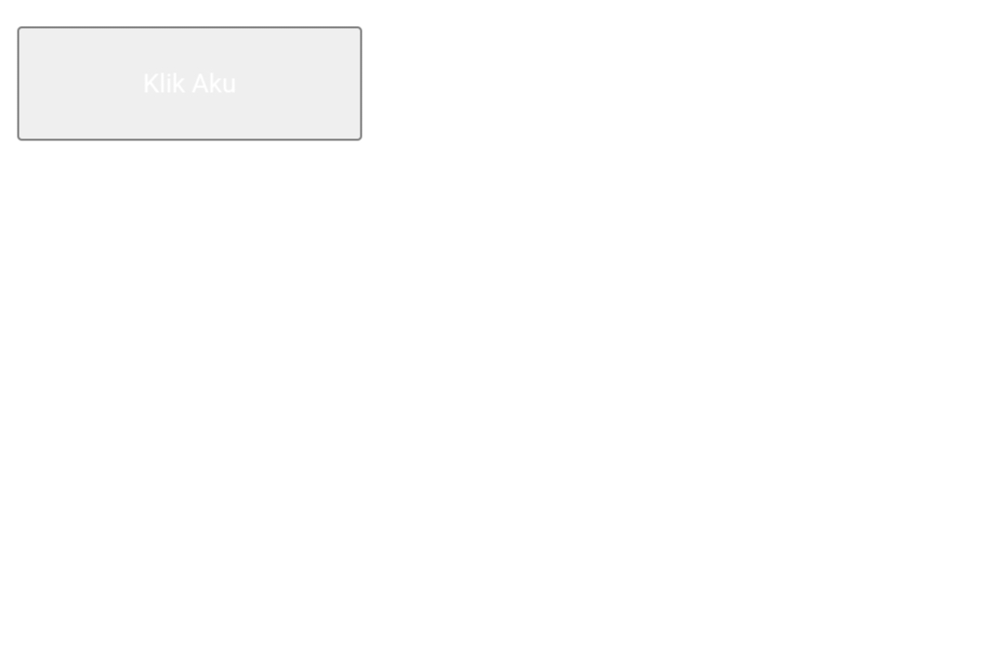
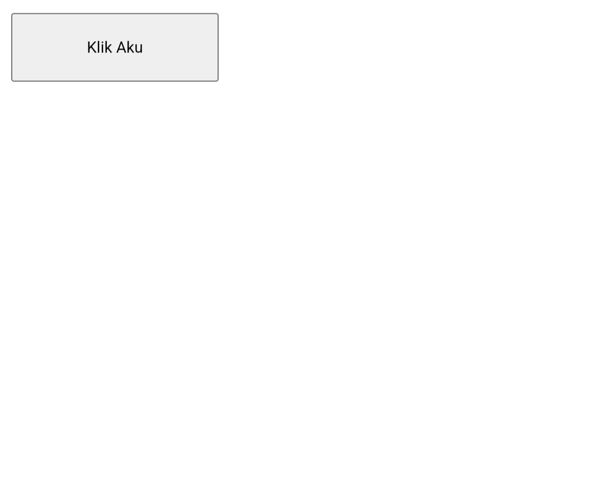
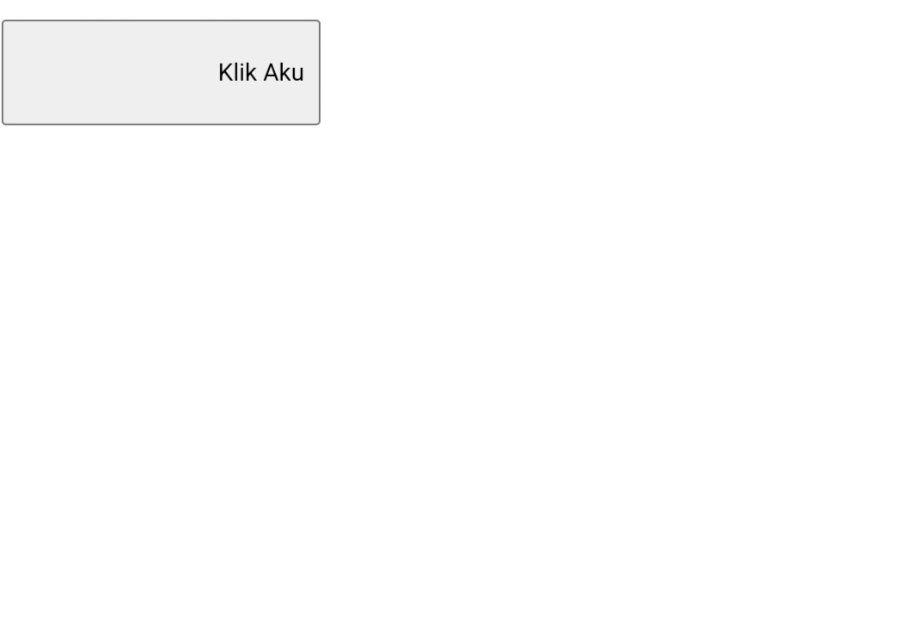
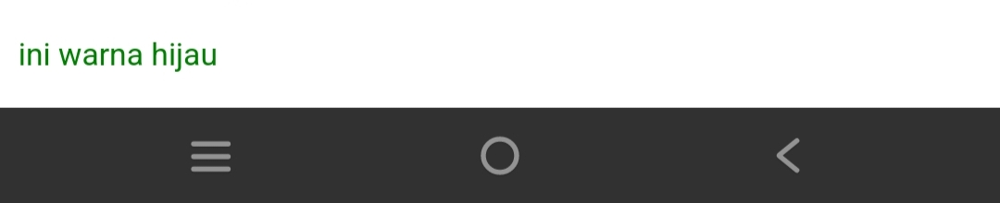

# Percobaan Pertama
## Penjelasan
Perubahan: Teks "WELCOME CSS" pada kedua paragraf akan ditampilkan dalam warna merah.
Penjelasan: Penggunaan aturan gaya CSS (`color: red;`) di dalam tag `<style>` mengubah warna teks pada semua elemen `<p>` menjadi merah.
### Kode 
```HTMl
<!Doctype html>
<html>
  <head>
    <style> 
    p {
      color : red ; 
    }
    </style>
   </head>
   <body>
    <p> WELCOME CSS </p>
    <p> WELCOME CSS </p>
     </body>
</html>

```
### Hasil

#  Percobaan Kedua
## Kode CSS
```
button{
Width:150px;
Height:50px;
Color: white;
text-align: right ;
margin-top :50px;
}
```
## Color
### Before

### After 

Color adalah memberikan warna kepada tulisan yang dimana sebelum di kasih color atau warna tulisan nya berwarna hitam. setelah dikasih color atau warna tulisan klik aku berwarna putih
## TEXT-ALIGN

### Before

### After 


Text-align adalah memberikan perataan kepada teks dimana saat kita menggunakan text-align = right  membuat posisi teks lebih ke samping kanan. 
## margin-top 
### Before

### After


Margin top digunakan untuk menentukan jarak antara batas atas suatu elemen dengan elemen di atasnya.

## Pemanggilan CSS
### Inline 
**Penjelasan**
Tag `<p>` yang memiliki gaya inline yang diterapkan langsung ke dalam elemen tersebut. Gaya tersebut adalah `font-size: 48px;`, yang berarti teks di dalam paragraf akan ditampilkan dengan ukuran font 48 piksel. Gaya ini diterapkan menggunakan atribut style pada elemen `<p>`.
```HTML
<!DOCTYPE html>
<html>
  <head>
    
  </head>
  <body>
    <p style="font-size: 48px;">Welcome CSS!</p>
    
  </body>
  
</html>

```
**Hasil**

### Internal
**Penjelasan**
- `h1`: Menetapkan warna teks biru dan margin atas sebesar `10000 pixel` untuk semua elemen `<h1>` dalam dokumen.
- `.merah`: Menetapkan warna teks merah untuk semua elemen yang memiliki kelas "merah".
- `.biru`: Menetapkan warna teks biru untuk semua elemen yang memiliki kelas "biru".
- `.kuning`: Menetapkan warna teks kuning untuk semua elemen yang memiliki kelas "kuning".
- `#hijau`: Menetapkan warna teks hijau untuk elemen dengan `ID "hijau"`.
- `.teks-besar`: Menetapkan ukuran font sebesar 60 piksel untuk semua elemen yang memiliki kelas "teks-besar".

```CSS
h1 {
  color : blue ;
  margin-top : 10000px ;


}

 .merah { 
  color : red ;
}

.biru{
  color : blue ;
}

.kuning{
  color : yellow ;
}

#hijau {
  color :green ;
}

.teks-besar{
  font-size :60px;
}
```
**Hasil**

### External
**Penjelasan**
`<link rel="stylesheet" href="Style.CSS">`: Menautkan dokumen HTML dengan file CSS eksternal bernama "Style.CSS", sehingga dokumen HTML dapat menerapkan gaya yang didefinisikan dalam file CSS tersebut.
**Code**
```HTML
<!DOCTYPE html>
<html>
  <head>
    <title>CSS</title>
    <link rel="stylesheet" href="Style.CSS">
    
  </head>
  <body>
    
    
     </body>
  
</html>
```
**Hasil**

## Selektor CSS
### Elemen Selector 
**Penjelasan**
`h1`: Ini adalah elemen selector yang menargetkan semua elemen `<h1>` dalam dokumen HTML untuk menerapkan aturan gaya tertentu, seperti warna teks biru dan margin atas sebesar 10000 piksel.
**Code**
```HTML
<h1>Halo RPL 1</h1>
h1 {
  color: blue;
  margin-top: 10000px;
}


```
**Hasil**

### Class Selector
**Penjelasan**
- `<!DOCTYPE html>`: Mendefinisikan tipe dokumen sebagai HTML versi 5. 
- `<html>`: Menandakan awal dan akhir dari dokumen HTML.
- `<head>`: Berisi informasi tambahan tentang dokumen HTML, seperti judul dan tautan ke file CSS.    
- `<title>CSS</title>`: Menentukan judul dokumen yang akan ditampilkan di tab browser.
- `<link rel="stylesheet" href="Style.CSS">`: Menautkan dokumen HTML dengan file CSS eksternal bernama "Style.CSS", sehingga dokumen HTML dapat menerapkan gaya yang didefinisikan dalam file CSS tersebut.
- `<body>`: Berisi konten yang akan ditampilkan kepada pengguna.  
- `<p class="biru"> ini warna biru </p>`: Elemen ini hanya memiliki satu kelas CSS, yaitu "biru". Oleh karena itu, elemen tersebut akan menerapkan gaya yang telah ditentukan untuk kelas "biru" dalam file CSS atau dalam bagian gaya internal/inline yang berkaitan dengan kelas tersebut. Dan memberikan warna biru. 

**Code**
```HTML
 <!DOCTYPE html>
 <html>
  <head>
    <title>CSS</title>
    <link rel="stylesheet" href="Style.CSS">
    
  </head>
  <body>
    
    
    <p class="biru" >ini warna biru </p>
    
     </body>
  
</html>


```
**Hasil**
 


### ID Selector
**Penjelasan**
- `<!DOCTYPE html>`: Mendefinisikan tipe dokumen sebagai HTML versi 5. 
- `<html>`: Menandakan awal dan akhir dari dokumen HTML.
- `<head>`: Berisi informasi tambahan tentang dokumen HTML, seperti judul dan tautan ke file CSS.    
- `<title>CSS</title>`: Menentukan judul dokumen yang akan ditampilkan di tab browser.
- `<link rel="stylesheet" href="Style.CSS">`: Menautkan dokumen HTML dengan file CSS eksternal bernama "Style.CSS", sehingga dokumen HTML dapat menerapkan gaya yang didefinisikan dalam file CSS tersebut.
- `<body>`: Berisi konten yang akan ditampilkan kepada pengguna.  
- Elemen `<p id="hijau"> ini warna hijau </p>` memiliki atribut `id` yang menentukan identitas uniknya dalam dokumen HTML. Dengan demikian, fungsi dari atribut `id` ini adalah untuk memberikan cara yang unik untuk merujuk atau menargetkan elemen tersebut dalam CSS. Dan memberikan warna hijau pada teks. 
**Code**
```HTML
<!DOCTYPE html>
<html>
  <head>
    <title>CSS</title>
    
    <link rel="stylesheet" href="Style.CSS">
    
  </head>
  <body>
    <p style="font-size: 48px;">Welcome CSS!</p>
    <h1>Halo RPL 1</h1>
    
    <p id="hijau" > ini warna hijau </p>
  </body>
  
</html>

```
**Hasil**


