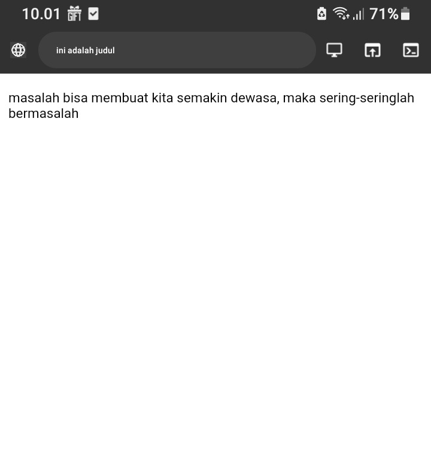
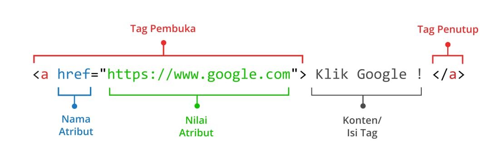
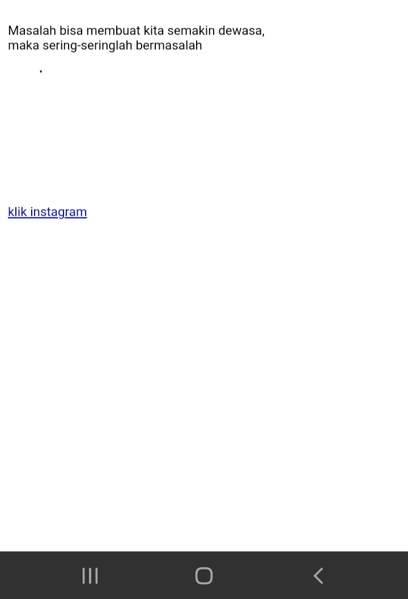
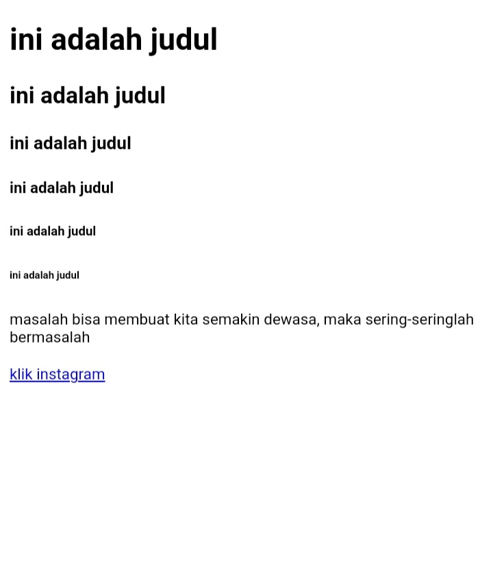
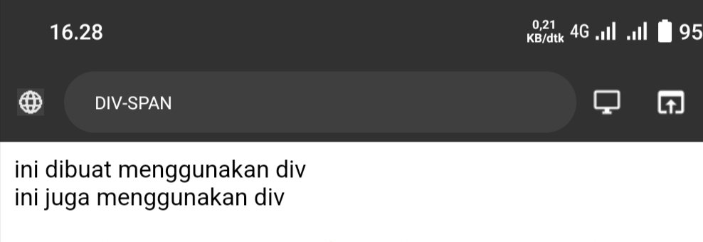

# Struktur Dasar
**Penjelasan**:

Struktur dasar HTML mencakup elemen-elemen dasar yang membentuk kerangka sebuah dokumen HTML.

- Tag `<DOCTYPE html>` memberitahu web bahwa dokumen HTML adalah versi 5
- Tag pembuka `<html>` menandai awal sebuah dokumen HTML sampai dengan tag penutup `</html>`
- Tag pembuka `<head>` berisi informasi tentang halaman HTML sampai dengan tag penutup `</head>` ,biasanya dalam tag head terdapat tag `<title>` untuk memberikan informasi judul halaman HTML
- Apapun tag yang berada di antara tag pembuka `<body>` sampai dengan tag penutup `</body>` akan tampil di web browser.
**Contoh Code**:
```HTML

<!DOCTYPE html>
<html>
    <head>
       <title> ini adalah kata kata motivasi  
       </title>
       </head>
       <body>
            
         <p> Masalah bisa membuat kita semakin dewasa,  maka sering-seringlah bermasalah </p>
         
       </body>
</html>
```
**Hasil Program:**
 

# Anatomi Elemen 
**Penjelasan**:
Anatomi elemen dalam konteks HTML merujuk pada bagian-bagian yang membentuk suatu elemen HTML individual.
___
## Tag Pembuka dan Tag Penutup 
**Penjelasan**:
- Tag Pembuka (`<tag>`):  Memulai elemen dan menentukan jenis elemen yang digunakan. Misalnya, `<p>` untuk paragraf atau `<h1>` untuk heading level 1.
- **Tag Penutup (`</tag>`):** Menandai akhir dari elemen dan memberitahu browser bahwa elemen tersebut berakhir di sini. Tag penutup memiliki format yang sama dengan tag pembuka, tetapi memiliki tanda garis miring (/) sebelum nama tag.
___
## Atribut Tag
**Penjelasan**:
Atribut Tag adalah  informasi tambahan yang diberikan kepada suatu elemen untuk mengonfigurasi atau menyesuaikan elemen tersebut. Setiap atribut terdiri dari nama dan nilai, dipisahkan oleh tanda sama dengan (=).
____
## Isi konten
**Penjelasan**:

Isi (Content):  Informasi atau teks yang terdapat di dalam elemen tersebut. Misalnya, dalam elemen paragraf (`<p>`), isi berupa teks paragraf.

- Tag pembuka Menandai awal dari elemen yang berisi informasi dan di tutup oleh tag penutup contoh `<a `
Tag pembuka dan `</a>`tag penting 
- href adalah nama atribut yang digunakan dalam tag ` <a>` untuk menentukan alamat URL atau tautan yang akan diakses ketika tautan diklik.
- `"https://www.google.com"` Ini adalah nilai dari atribut href. Nilai ini adalah URL lengkap yang menentukan tujuan tautan. Dalam contoh ini, tautan akan mengarahkan pengguna ke situs web Google karena URL-nya adalah `"https://www.google.com".`
- Klik Google" adalah konten isi dari tag  `<a>.` Ini adalah teks atau elemen lain yang akan menjadi bagian dari tautan tersebut. Ketika teks ini diklik, kita akan diarahkan ke situs web Google.
**Contoh** **hasil**:

 

**Penjelasan**
- Tag pembuka Menandai awal dari elemen yang berisi informasi dan di tutup oleh tag penutup contoh `<a `
Tag pembuka dan `</a>`tag penting 
- href adalah nama atribut yang digunakan dalam tag ` <a>` untuk menentukan alamat URL atau tautan yang akan diakses ketika tautan diklik.
- `"http://instagram.com"` Ini adalah nilai dari atribut href. Nilai ini adalah URL lengkap yang menentukan tujuan tautan. Dalam contoh ini, tautan akan mengarahkan pengguna ke situs web Google karena URL-nya adalah `"http://instagram.com".`
- Klik instagram" adalah konten isi dari tag  `<a>.` Ini adalah teks atau elemen lain yang akan menjadi bagian dari tautan tersebut. Ketika teks ini diklik, kita akan diarahkan ke situs web instagram.
**Contoh Code**:
```HTML
<!DOCTYPE html>
<html>
    <head>
       <title> ini adalah judul </title>
       </head>
       <body>
          
        <p> masalah bisa membuat kita semakin dewasa, maka sering-seringlah bermasalah </p>
         <a href= "Http://instagram.com/_f4di1"> klik instagram </a>
         
       </body>
</html>

```
**Hasil Program**:


**** 

# Tag Dasar
## Heading 
**Penjelasan**
Heading dalam HTML merujuk pada elemen-elemen yang digunakan untuk menandai judul atau heading pada halaman web.Dimana Heading terdiri dari H1 sampai H6.
Jika kita ketik h1 makan ukuran font atau teks nya akan lebih besar.dan jika kita ketik h2 sampai h6, semakin naik angka nya semakin ukuran font dan Teks kecil.
**Contoh Code**:
```HTML
<!DOCTYPE html>
<html>
    <head>
       <title> ini adalah judul </title>
       </head>
       <body>
         
         <h1> ini sebuah judul</h1>
         <h2> ini adalah judul</h2>
         <h3> ini adalah judul</h3>
         <h4> ini adalah judul</h4>
         <h5> ini adalah judul</h5>
         <h6> ini adalah judil</h6>
    
       </body>
</html>

```
**Hasil Program**:
 
____ 
## Teks paragraf 
**Penjelasan**
P= Digunakan menandai awal dan akhir dari suatu paragraf.
B= Digunakan memberi penekanan pada teks dengan membuatnya bold(tebal)
U= Digunakan untuk memberikan garis bawah pada teks
I= Digunakan untuk membuat teks menjadi miring 
Br= Digunakan untuk membuat baris baru dimana awal cuma satu baris tapi di kasih br menjadi dua baris 
**Contoh Code**:
```HTML
<!DOCTYPE html>
<html>
    <head>
       <title> ini adalah kata kata motivasi  </title>
       </head>
       <body>

         <p> Masalah bisa membuat kita semakin dewasa,<br>  maka sering-seringlah bermasalah </p>
         <p> <b> Masalah bisa membuat kita semakin dewasa, maka sering-seringlah bermasalah </b> </p> 
         <p> <u>  Masalah bisa membuat kita semakin dewasa, maka sering-seringlah bermasalah </u> </p>
         <p> <i > Masalah bisa membuat kita semakin dewasa, maka sering-seringlah bermasalah </i> </p>

       </body>
</html>

```
**Hasil Program**:

____


## DIV  & SPAN
### `<DIV>`
`<div>` (division) adalah elemen blok yang digunakan untuk mengelompokkan konten HTML ke dalam sebuah kotak atau wadah. Memblok satu area dengan tanda baris baru setelahnya. 
**Code**
```HTML 
<!DOCKTYPE HTML>
 <html>
   <head>
     <title> DIV-SPAN</title>
   </head>
   <body>
     <div>  ini dibuat menggunakan div </div>
     <div> ini juga menggunakan div </div>
       </body>
 </html>
 

```
**HASIL**


### `<span>`
`<span>` adalah elemen inline yang digunakan untuk menerapkan gaya atau memberikan identitas kepada sebagian teks dalam satu baris.Tidak memblok satu area dan tidak membuat baris baru artinya teksnya tersambung.
**Code**
```HTML
<!DOCKTYPE HTML>
 <html>
   <head>
   <title> DIV-SPAN</title>
   </head>
   <body>
     <span> ini dibuat menggunakan span</span>
     <span> ini juga menggunakan span </span>
   </body>
 </html>
 
```
**HASIL**


## Atribut Align
**Penjelasan**
Atribut `Align` digunakan untuk mengatur perataan teks pada halaman HTML elemen `<p>` dapat menggunakan nilai atribut `align="left"` akan menghasilkan paragraf dengan perataan teks di sebelah kiri. Nilai atribut `align="right"` Akan menghasilkan paragraf dengan perataan teks di sebelah kanan. Nilai atribut`align="center"` akan meAlign8ilkan paragraf dengan perataan teks di tengah. Dan nilai atribut `align="justify"` akan menghasilkan paragraf dengan perataan teks pada sisi kiri dan sisi kanan.
**Contoh Code**:
```HTML

<!DOCKTYPE Html>
<html>
   <head>
     <title> ini   </title>
     
   </head>
   <body>
   
     <h3> html adalah memjadi bahasa fundamental untuk web development di ciptakan oleh tim berneer lee untuk memudahkan pembacaan dokumen yang di format </h3>
     <p align= "left">
       lorem ipsum dolor sit amet consectetur adipisicing elit, officils ut lure qui
     </p>
     <p align="right ">
      lorem ipsum dolor sit amet consectetur adipisicing elit,
      officils ut lure qui
     </p>
    <p aligns="<center"> </p>


 </body>

 </html>

```
Hasil Program**:


____________
## Komentar
**Penjelasan**
HTML juga mempunyai tag khusus untuk komentar untuk membuat komentar di HTML. Kita menggunakan awalan `<!--` dan Penutup `-->`.
Komentar **tidak akan ditampilkan** pada halaman website namun programmer biasanya menggunakan komentar untuk memperjelas kode program. 
**Contoh Code**:
```HTML
<!DOCKTYPE Html>
<html>
   <head>
     <title> ini   </title>
     
   </head>
   <body>
<!-- ` ini komentar, tidak akan tampil di browser -- >
`<p>` ini bukan komentar dan akan tampil di browser `</P>` 

</body>
</html>


```
**Hasil Program**:
![gambar]Aset/(F.A.JPG)

_______
## List
**Penjelasan**
List adalah fungsi dalam HTML yang digunakan untuk menampilkan daftar dari sesuatu dalam HTML tag list terdiri
Dari 2 jenis  `<ol>` **ordered list** (berurutan) dan `<ul>` **unordered  list** (tidak berurutan) ordered list akan ditampilkan dengan angka atau huruf sedangkan unordered list dengan bulatan atau kotak ataupun simbol lainnya. 
Untuk menampilkan list dalam HTML dapat menggunakan tag `<li>`-`</li>` namun perlu dengan menyisipkan elemen `<ol>`.... `</ol>` atau `<ul>`... `</ul>` kedalam elemen `<li>`tersebut untuk membuat daftar list. 
**Contoh Code**:
```HTML
<!DOCKTYPE Html>
<html>
   <head>
     <title> ini   </title>
<body>

 <h1> list perabotan XI RPL 1 </h1>
     <p> <h1> barang barang  </h1> </p>
     <ul> 
        <Li> Sapu <Li>
        <li> meja  </li>
        <LI> papan tulis </LI>
        <li> kipas </li>
     </ul>
     <h1> ABSEN XI RPL 1 </h1>
      <ol>
        <li> abd rahman </li>
        <li> angga </li>
        <li> ahsan </li>
        
        
      </ol>
      

 </body>

 </html>

```
**Hasil Program**:


_____
## Link
**Penjelasan**
Link dapat ditemukan di hampir semua halaman web. Link/tautan memungkinkan sebuah teks yang ketika di-klik akan pindah ke halaman lainnya. HTML menggunakan tag `<a>` untuk keperluan ini. Link ditulis dengan `<a>` yang merupakan singkatan dari anchor (jangkar). 
Setiap tag `<a>` setidaknya memiliki sebuah atribut `href`
Dimana `href` berisi alamat yang dituju. `href` adalah singkatan dari hypertext reference. 
Atribut penting lainnya dari tag `<a>` adalah `target` Atribut target menentukan tempat untuk membuka dokumen yang ditautkan. Atribut `target` memiliki beberapa nilai salah satunya `_blank` yang berfungi untuk membuka tautan di tab baru
**Contoh Code**:
```HTML
<!DOCKTYPE Html>
<html>
   <head>
     <title> ini   </title>
     
   </head>
   <body>

      <h3> Menggunakan tag anchor </h3>
      <a href="https://www.google.com"target="_blank"> klik disini untuk ke google l</a><br>
      <a href="halaman_lain.html">klik disini untuk ke halaman lain yang saya buat!</a>
 
 
 </body>
       
 </html>
```
**Hasil Program**:


_____
## Multimedia
### Gambar
**Penjelasan**
- Dalam tag untuk menampilkan gambar tedapat tag `` ini adalah tag kosong hanya berisi atribut. Dan tidak punya tag penutup.atribut `src` untuk menentukan URL(alamat web) yang akan di tampilkan. Alt  adalah singkatan dari alternative text atau teks alternatif. atribut "alt" digunakan untuk memberikan deskripsi atau teks alternatif untuk elemen gambar `()`. Tekstual ini muncul jika gambar tidak dapat dimuat atau untuk membantu pengguna yang menggunakan pembaca layar, sehingga mereka dapat memahami konten visual yang mungkin tidak dapat mereka lihat.
- Terdapat juga atribut `widht` dan `height` untuk mengatur lebar dan tinggi gambar. Pixel standar satuan ukuran gambar untuk html versi 5.
- `R. JPG` adalah nama gambar dan jenis ekstensi file gambar yang kita akan tampilkan
 ** Contoh code**:
```HTML
<!DOCKTYPE Html>
<html>
   <head>
     <title> ini   </title>
     
   </head>
   <body>

   </body>
 </html>

```
**Hasil Program**:
 
 


### Video
**Penjelasan**
- Dalam tag untuk menampilkan video terdapat tag `<video` ini adalah tag kosong yang hanya berisi atribut. Dan mempunyai tag penutup.atribut `src` untuk menentukan URL(alamat web) yang akan di tampilkan.
- `CERAMAH . mp4` adalah nama video dan jenis ekstensi file yang berisi video yang akan tampilkan. 
- `Controls` di gunakan untuk menambahkan kontrol pemutaran kepada pengguna. Dengan menambahkan `controls`, kita dapat mengontrol pemutaran video seperti memulai atau menghentikan pemutaran, mengatur volume. 
- `autoplay` digunakan untuk memulai pemutaran otomatis suatu  video dan  `muted` digunakan untuk pemutaran video keadaan dibisukan (tanpa suara).
- Terdapat juga atribut `widht` dan `height` untuk mengatur lebar dan tinggi video. Pixel standar satuan ukuran video untuk html versi 5

**Contoh Code**:
```HTML
<!DOCKTYPE Html>
<html>
   <head>
     <title> ini   </title>
     
   </head>
   <body>

 
 <video src="./CERAMAH.mp4" controls autoplay muted  widht="300px" height= "300px"></video>
 </body>
       
 </html>
```
**Hasil Program**:
 

____
### Audio
**Penjelasan**
- Dalam tag untuk menampilkan audio terdapat tag `<audio` ini adalah tag kosong yang hanya berisi atribut. Dan mempunyai tag penutup.atribut `src` untuk menentukan URL(alamat web) yang akan di tampilkan.
- `F.mp3`adalah nama audio dan jenis ekstensi file yang berisi audio yang akan tampilkan. 
- `controls` di gunakan untuk menambahkan kontrol pemutaran kepada pengguna. Dengan menambahkan `controls`, kita dapat mengontrol pemutaran audio seperti memulai atau menghentikan pemutaran, mengatur volume. 

**Contoh Code**:
```HTML
<!DOCKTYPE Html>
<html>
   <head>
     <title> ini   </title>
     
   </head>
   <body>

 
       <audio src="F.mp3 "controls> </audio>
</body>
 </html>
```
**Hasil Program**:


____
### IFRAME
**Penjelasan**
- Dalam tag untuk menampilkan web ke dalam web terdapat tag `<Iframe` ini adalah tag kosong yang hanya berisi atribut. Dan mempunyai tag penutup.atribut `src` untuk menentukan URL(alamat web) yang akan di tampilkan.
- `https://id.m.wikipedia.org/wiki/Soeharto` ini adalah link web yang akan kita masukkan ke dalam web yang akan kita buat. 
- Terdapat juga atribut `widht` dan `height` untuk mengatur lebar dan tinggi web yang akan masukan ke dalam web. Pixel standar satuan ukuran video untuk html versi 5.


**Contoh Code**:
```HTML
<!DOCKTYPE Html>
<html>
   <head>
     <title> ini   </title>
     
   </head>
   <body>

       <iframe src= "https://id.m.wikipedia.org/wiki/Soeharto"
       widht="1400px" height="600px"></iframe>
    </body>
 </html>
```
**Hasil Program**:


________

### Table
**Penjelasan**
Tabel dalam HTML didefinisikan dengan tag `<table>`
- Setiap baris tabel didefinisikan dengan tag `<tr>`
- header (judul) tabel didefinisikan dengan tag `<th>` secara default header tabel memiliki   teks tabel dan berada di tengah 
- Data tabel/sel didefinisikan dengan tag `<td>` karena sel merupakan bagian terkecil dari tabel maka dari itu tag ini selalu berada di dalam tag `<tr>`
>[!info]- Penjelasan Table
>Perhatian bahwa pada tag `<table>` terdapat sebuah atribut `border`. Atribut `border` digunakan untuk memberikan nilai garis tepi dari tabel. Nilai ini dalam ukuran pixel. `border="1"` berarti kita menginstruksikan kepada web browser bahwa tabel tersebut akan memiliki garis tepi sebesar 1 pixel. Jika tidak ditambahkan secara default tabel tidak memiliki garis tepi. 
- `rowspan` Merupakan atribut HTML yang berfungi untuk menggabungkan beberapa baris kebawah seperti 4. Garis kebawah 4.
- `colspan`  atau column span merupakan atribut HTML yang berfungi untuk menggabungkan beberapa kolom (kesamping) 
- `width`  berfungi untuk mengatur tinggi tabel yang didefinisikan dalam satuan pixel secara dafult
- `height` berfungi untuk mengatur tinggi tabel yang nilainya didefinisikan dalam satuan pixel secara default. 
- `align` berfungi untuk mengatur perataan teks pada tabel. Nilai atribut yang dapat diberikan yaitu `left` untuk perataan teks ke kiri `right` untuk perataan teks ke kanan dan `center` untuk perataan teks ke tengah. 
>[!info]- Penjelasan table
> Perhatian Pada konten elemen `<td>` yang berisi Ardi, Fadhil, Fadli hanya terdapat dua elemen `<td>` dibawah. Hal ini dikarenakan konten elemen `<td>` sebelumnya yaitu `SMKN 7 MAKASSAR`  pada data `Fachri` mengandung atribut `rowspan` dengan nilai `2`  yang secara otomatis mengisi data di bawahnya yakni data `ardi,fadhil,Fadli`.nilai `4` menunjukkan bahwa ada  4 baris yang digabungkan menjadi satu. 
 Konsep ini juga sama dengan apa  yang terjadi pada ` <th rowspan="2"> Nama </th> ` dan `  <th colspan="2"> Asal Sekolah </th>  ` bagian smp
       
**Contoh Code**:
```HTML
<!DOCKTYPE Html>
<html>
   <head>
     <title> ini   </title>
     
   </head>
      <body>
       <table border="1"
       <tr>
       
       <th rowspan="2"> Nama </th>
       <th colspan="2"> Asal Sekolah </th>
       
       </tr>
       <tr>
       <th widht="100"> Asal SMK </th>
       <th widht="100"> Asal SMP </th>
       </tr>
       <tr>
         <td> Fachri </td>
         <td rowspan="4"> SMKN 7 MAKASSAR </td>
         <td> MTSN 1 </td>
       </tr>
       <tr>
         <td> Ardi </td>
         <td> SMP 52 MAKASSAR</td>
       </tr>
       <tr>
         <td> Fadhil </td>
         <td rowspan="2">SMPN 47 MAKASSAR </td>
       </tr>
       <tr>
         <td> Fadli </td>
         
       </tr>
       </body>
 </html>

```
**Hasil Program**:

____
**Penjelasan**
Tabel dalam HTML didefinisikan dengan tag `<table>`
- Setiap baris tabel didefinisikan dengan tag `<tr>` dan juga terdapat tag `<th`  yang berfungi membuat teks berada di tengah dan membuat menjadi boldbold dan juga terdapat `rowspan` digunakan untuk menggabungkan dua baris menjadi 1 baris. 
- di dalam tag `<th` terdapat `bgcolor="green"` berfungi untuk memberikan warna `bgcolor` code perintah `green` warna yang akan tampil. 
- terdapat juga `width` yang berfungi membuat baris menjadi lebar  dan `60` ukuran besaran dan `px` ukuran standar besaran. 
- `senin, selasa, april, juni, rabu, kamis, mei.` hanya sebuah item data. 
- `rowspan` berfungsi menggabungkan dua kolom menjadi 1.
- `Align` berfungi untuk mengatur perataan teks pada tabel. Dan `center` untuk perataan teks ke Tengah. 
 **Contoh Code**:
```HTML
<!DOCTYPE html>
<html>
  <head> <title> ini </title></head>
  <body>
    <table border="1;"
      
     <tr>
     
       <th bgcolor="green" rowspan="2" >Nama Hari  </th>
       <th bgcolor="green" rowspan="2" >Nama Bulan</th>
       
       </tr>
       
       <tr>
       <td width="60px" >Senin </td> 
       <td width="60px" >Selasa</td>
       <td width="60px"> April </td>
       <td width="60px" align="center" rowspan="4"> Juni</td>
       </tr>
       <td>Rabu </td>
       <td> Kamis </td>
       <td> Mei</td>
    </table>
  </body>
</html>


```
**Hasil Program:**

_____
## Form
**Penjelasan**
Elemen `<form>` HTML digunakan untuk mendefinisikan form yang digunakan untuk mengumpulkan inputan dari pengguna website. Tag ini di gunakan untuk mengkoleksi inputan dari user. Konsep ini sama seperti konsep formulir didunia nyata. 

>[!info]- Penjelasan Form 
Dengan kata lain tag `<form>` merepresentasikan sebuah "Formulir" dimana satu formulir bisa memiliki banyak kolom isian.


Form HTML berisikan elemen elemen`form` lainya. Elemen `Form` digunakan untuk mmenampung macam-macam elemen yang berkaitan dengan sebuah `Form` seperti `text`, 
`Fields`, `checkbox`, `radio button`, tombol `submit` dan banyak lagi yang dapat diedit kemudian di tulis untuk dikirim pada sebuah server untuk selanjutnya diproses guna mendapatkan informasi tertentu dari atau untuk user. 
Umumnya sebuah website selalu memiliki fitur form, contoh paling umum yang sering kita temui adalah seperti form login, form sign up, form komentar di suatu blog/media.
____
### **Input**
**Penjelasan**
Elemen `Input` adalah elemen `Form` yang paling penting. Elemen `<input>` dapat ditampilkan dalam beberapa cara, tergantung pada nilai atribut `type` yang digunakan. 
Berikut adalah beberapa contoh Nilai dari atribut `type`:
- `text` digunakan untuk mengambil isian berupa **teks** . Contohnya seperti nama. 
- `password` digunakan untuk mengambil isian berupa **kata sandi** atau sesuatu yang bersifat rahasia. Tipe ini akan mengubah semua karakter yang diketikkan  kedalam karakter bulat. 
- `radio` digunakan sebagai kolom isian bertipe **pilihan**
Yang menawarkan beberapa opsi kepada user namun tetapi **hanya satu opsi saja**  yang boleh dipilih. Contohnya seperti jenis kelamin atau agama. 

>[!info]- Penjelasan Input
> Perlu diperhatikan bahwa untuk penggunaan tipe radio yang berkategori set pilihan yang sama mengharuskan nilai name -nya juga sama. 


Opsi default dapat dilakukan dengan menambahkan atribut `<hecked>` pada elemen opsi yang dijadikan sebagai opsi default. 
- `<checkbox` digunakan untuk memberikan **daftar pilihan dalam satu set opsi** . User dapat memilih satu atau bahkan  **lebih dari satu pilihan** pada tipe ini. Hal ini berbeda dengan tipe sebelumnya yaitu `radio` yang hanya memungkinkan user untuk memilih satu pilihan saja. Contoh penggunaan `<checkbox>` seperti daftar makanan kesukaan, daftar olahraga yang tidak disukai dan yang Semisalnya. 

>[! Info]- Penjelasan Checkbox
> perlu diperhatikan bahwa untuk penggunaan tipe `<checkbox>` yang berkategori set pilihan yang sama mengharuskan nilai `name` -nya juga sama. 

- `number` digunakan untuk membatasi isian user hanya pada karakter **numerik** saja. Browser akan menambahkan dua buah tombol atas dan bawah untuk mengubah angka isian. 
Beberapa atribut untuk tipe `Number`:
- `min` - menentukan angka minimal
- `max` - menentukan angka maksimal
- `step` - menentukan kelipatan (nilai yang tidak sesuai kelipatan tidak bisa di-input, dan default dari atribut ini adalah `1`)
- `date` digunakan untuk menberikan isian berupa **tanggal**. Atribut `min` dan `max` dapat pula difungsikan pada tipe ini untuk mengatur tanggal minimal dan tanggal maksimal yang diinginkan. Nilai `min` dan `max` tersebut ditulis dengan format: `YYYY-MM-dd` . 
- `file` digunakan untuk memungkinkan pengguna memuat **file**. Atribut `accept` juga dapat disisipkan pada tipe ini dengan maksud untuk mengatur file apa saja yang boleh di-upload. Beberapa contoh value dari atribut `accept` yaitu:
- `accept="image/png/,image/jpg, image/jpeg"` - untuk file gambar seperti `png`, `jpg`, atau `jpeg`
- `accept=".pdf"` - untuk file pdf
- `accept=".doc, .docx"` - untuk file `doc` atau `docx`
- `accept=".ppt, .pptx"` - untuk file `ppt` atau `pptx`
- `submit` ditampilkan dalam **bentuk tombol untuk mengirim data** pada `<form>` yang menjadi pembungkus nya. Atribut `value` digunakan untuk mengisi teks yang ingin ditampilkan pada tombol. 
- `reset` berguna untuk **mengembalikan state(keadaan)atau data dari suatu form ke nilai awalnya**. Jika nilai awal sebuah input adalah kosong, maka ketika direset ia akan kembali kosong. Tapi jika nilai awalnya sudah terisi sesuatu, maka ketika direset datanya akan kembali seperti yang sudah diset sebelumnya. 
- `Button` berguna untuk membuat **inputan berupa sebuah tombol** . Tombol ini nantinya bisa difungsikan sesuai dengan keinginan dari pengembang web. 
Untuk bacaan tentang materi ini yang dirasa cukup lengkap dan mudah dipahami, silahkan mengunjungi halaman berikut:

HTML Dasar: Tipe Element Input

Membahas tentang berbagai macam isi dari atribut type pada element input. 
____
###  **Label**
**Penjelasan**
Elemen `<label>` memiliki fungsi khusus untuk Melabeli sebuah kolom inputan. Ketika screen reader membaca konten halaman HTML, lalu menemukan sebuah inputan, ia akan membaca label yang bersangkutan. 
Fungsi lain dari tag `<label>` adalah ketika kita mengklik label, maka browser akan meletakkan fokus pada kolom isian yang terhubung dengannya. Syarat yang perlu diperhatikan yaitu dengan menghubungkan sebuah `<label>` dan `<input>` dengan atribut `for` untuk `label` dan atribut `id` pada `<input>` dengan nilai untuk kedua atribut tersebut mesti sama persis. 
____
### **Select**
**Penjelasan**
Elemen `<select>` berguna dalam mendefinisikan sebuah tombol **dropdown** yang dimana user dapat memilih salah satu dari banyak pilihan. 

>[!Info]- Penjelasan Select
>  Elemen `<select>` nantinya berperan sebagai kontainer atau pembungkus dari elemen `<option>` yang berperan sebagai daftar pilihan atau opsi. 

Elemen `<select>` hampir mirip fungsinya dengan `<input type ="radio">` akan tetapi baiknya elemen `<select>` digunakan untuk memilih satu pilihan yang terdapat banyak opsi di dalamnya, sedangkan `<input type ="radio">` lebih baiknya untuk digunakan jika user diarahkan memilih hanya satu pilihan yang opsi pilihannya tidak terlalu banyak. Contoh penggunaan elemen ini seperti memasukkan pilihan berupa asal daerah atau yang semisalnya.
 
Penting untuk diketahui bahwasanya opsi yang aktif secara default adalah adalah opsi yang pertama. Akan tetapi, kita bisa mengatur opsi mana yang aktif secara default dengan menambahkan atribut selected pada suatu `<option>` yang ingin dijadikan sebagai opsi default.
_____

### **Text Area**
**Penjelasan**
Elemen `<textarea>` berguna untuk mengambil inputan user berupa teks yang dapat memuat lebih dari satu baris. Jika dibandingkan dengan elemen `<input>` teks biasa, elemen `<textarea>` memiliki ukuran tinggi yang lebih besar. Element `<textarea>` bisa diisi lebih dari satu baris dengan menekan enter.

Atribut yang dapat digunakan untuk mengatur kuran dari textarea yaitu rows untuk jumlah baris, sedangkan atribut cols untuk lebarnya.
_____
### **Button**
**Penjelasan**
Elemen `<button>` yang berada di dalam sebuah `form` akan otomatis dianggap sama fungsinya seperti `<input type="submit">`. Jika ingin membuat tombol biasa yang tidak men-submit `<form>` dapat dilakukan dengan menambahkan atribut `type="button"`.
**Contoh Code**
```HTML
<h1>Formulir Pendaftaran</h1>
<form action="">
  <div>
    <label for="nama-lengkap"><b>Nama Lengkap:</b></label
    ><br />
    <input
      type="text"
      id="nama-lengkap"
      name="nama_lengkap"
      placeholder="Masukkan nama lengkap"
      required
    />
  </div>
  
  <div>
    <label for="password"><b>Password:</b></label
    ><br />
    <input
      type="password"
      id="password"
      name="password"
      placeholder="Masukkan password"
      required
    />
  </div>
  
  <div>
    <b>Jenis Kelamin:</b><br />
    <input id="lk" type="radio" name="jenis_kelamin" checked />
    <label for="lk">Laki-Laki</label>
    <input id="pr" type="radio" name="jenis_kelamin" />
    <label for="pr">Perempuan</label>
  </div>
  
  <div>
    <label for="isian-usia"><b>Usia:</b></label
    ><br />
    <input
      type="number"
      id="isian-usia"
      name="usia"
      min="17"
      max="25"
      value="19"
      required
    />
    Tahun
  </div>

  <div>
    <label for="tgl-ijazah"><b>Tanggal Ijazah:</b></label> <br />
    <input
      type="date"
      id="tgl-ijazah"
      name="tgl_ijazah"
      min="2021-01-01"
      value="2023-06-20"
      required
    />
  </div>

  <div>
    <label for="opsi-agama"><b>Agama:</b></label
    ><br />
    <select id="opsi-agama" name="agama" required>
      <option disabled>---Pilih Agama----</option>
      <option value="islam">Islam</option>
      <option value="kristen">Kristen</option>
      <option value="katolik">Katolik</option>
      <option value="hindu">Hindu</option>
      <option value="buddha">Buddha</option>
      <option value="atheis" disabled>Atheis</option>
    </select>
  </div>

  <div>
    <label for="alamat"><b>Alamat:</b></label> <br />
    <textarea
      id="alamat"
      name="alamat"
      cols="25"
      rows="5"
      placeholder="Harap masukkan alamat secara lengkap"
      required
    ></textarea>
  </div>

  <div>
    <b>Kemampuan Berbahasa Asing:*</b><br />
    <input type="checkbox" id="inggris" name="bahasa_asing" />
    <label for="inggris">Inggris</label>
    <input type="checkbox" id="arab" name="bahasa_asing" />
    <label for="arab">Arab</label>
    <input type="checkbox" id="jepang" name="bahasa_asing" />
    <label for="jepang">Jepang</label>
  </div>

  <div>
    <label for="isian-foto"><b>Foto 4x6:*</b></label
    ><br />
    <input
      type="file"
      id="isian-foto"
      name="foto"
      accept="image/png,image/jpg,image/jpeg"
    />
  </div>

  <br />
  <input type="submit" value="Kirim" />
  <input type="reset" value="Batal" />
  <i>*opsional (tidak wajib diisi)</i>
</form>


```
**Hasil Program**:
 

Beberapa atribut yang digunakan pada contoh di atas yang perlu untuk diperjelas yaitu sebagai berikut:
- `name` - digunakan sebagai nama variabel yang akan diproses oleh web server (contoh menggunakan PHP).
- `required` - digunakan untuk memastikan bahwa pengguna harus memasukkan nilai pada input tersebut sebelum dapat melakukan proses submit formulir.
- `placeholder` - menuliskan teks pada elemen input. Placeholder sangat bermanfaat untuk memberikan teks bantuan kepada user untuk inputan _form_ yang kompleks.
- `value` - menentukan nilai awal dari sebuah elemen input.
- `disabled` - digunakan untuk menonaktifkan inputan pada elemen yang diberi atribut ini.
____
### **Bagaimana Cara Memproses Form?**

Ketika sebuah `<form>` disubmit, baik menggunakan elemen `<button>` mau pun `<input type="submit">`, browser akan mengirimkan data tersebut kepada URL yang didefinisikan pada atribut `action` di dalam tag `form`.

Ada pun jika atribut `action` tidak didefinisikan, maka *browser* akan menggunakan URL sekarang sebagai tujuan pengiriman data.

Contoh:

```html

**<form** action**=**"/proses-pendaftaran"**>**
  ...
**</form>**
```

Pada contoh di atas, ketika form di-*submit*, *browser* akan mengirimkan data yang ada  menuju URL `/proses-pendaftaran`.

___
**Apa yang terjadi pada URL `/proses-pendaftaran`?**


Pada URL tersebut terdapat sebuah aplikasi/program yang berjalan di *server* (bukan di *browser*). Tugas dari program tersebut adalah mengelola data yang dikirim seperti misalnya menyimpan data tersebut ke dalam sebuah *database*.

Bahasa yang umum digunakan di dalam server adalah python, nodejs, PHP, dan lain sebagainya.

Untuk mendapatkan gambaran lebih jelas, sebenarnya akan dijelaskan pada modul selanjutnya yang berkaitan dengan materi PHP atau juga bisa dengan membaca tutorial berikut:

____
**Penjelasan**:

- `<label for="nama">nama:</label>` Tag label digunakan untuk memberikan deskripsi atau label terhadap elemen formulir.
- `<input type="teks" id="nama">` Tag input memberikan area input untuk memasukkan teks. Atribut `type="teks"` menunjukkan  input teks. Atribut `id="nama"` Untuk memasukkan nama. 
-  `<label for="password">password:</label>` tag label digunakan untuk memberikan deskripsi atau label terhadap elemen formulir. 
- `<input type="password" id="password">` tag input memberikan area input untuk memasukkan teks. Atribut `type="password"` menunjukkan input teks. Atribut `id="nama"` untuk memasukkan password. 
- ` <label>jeis kelamin:</label> ` tag label digunakan untuk memberikan deskripsi atau label terhadap elemen formulir. 
- `<input type="radio" name checked="jk">`: tag input dengan tipe "radio", menunjukkan bahwa ini adalah radio button. Atribut `name` dengan nilai `"jk"` mengelompokkan radio button ini bersama sehingga hanya satu dari mereka yang dapat dipilih. Atribut `checked` digunakan untuk memilih otomatis tanpa di klik lagi. 
- `<label>laki-laki</label>`: Ini adalah label untuk radio button "laki-laki".
- - `<input type="radio" name ="jk">`: tag input dengan tipe "radio", menunjukkan bahwa ini adalah radio button. Atribut `name` dengan nilai `"jk"` mengelompokkan radio button ini bersama sehingga hanya satu dari mereka yang dapat dipilih. Berbeda dengan yang diatas memiliki atribut `checked` sedangkan kode dibawah tidak pakai sehingga manual harus di klik. 
- `<label>perempuan </label>`: Ini adalah label untuk radio button "perempuan".
-  `<input type="checkbox" id="web">web`: Ini adalah checkbox pertama dengan atribut `id` yang bernilai "web". Checkbox digunakan untuk memungkinkan memilih web. 
-  `<input type="checkbox" id="mobile">mobile`: Ini adalah checkbox kedua dengan atribut `id` yang bernilai "mobile". Checkbox digunakan untuk memungkinkan memilih mobile. 
-  `<input type="checkbox" id="desktop">desktop`: Ini adalah checkbox ketiga dengan atribut `id` yang bernilai "desktop". Checkbox digunakan untuk memungkinkan memilih desktop. 
- `<input type="submit" value="kirim">`:  tombol "submit" yang ketika diklik , akan mengirimkan data formulir ke server untuk diproses lebih lanjut. Atribut `value` dengan nilai "kirim" akan muncul ke tampilan website. 
- `<input type="reset" value="ulang">`: tombol "reset" yang.ketika diklik , akan mengembalikan nilai formulir ke nilai awalnya atau menghapus semua input yang telah dimasukkan . Atribut `value` dengan nilai "ulang" akan muncul ke tampilan website. 
- `<br>` untuk membuat baris baru. 


**Code**:
```HTML
<!DOCTYPE html>
<html>
  <head>
    <title>From</title>
  </head>
  <body>
    <form>
      <label for="nama">nama:</label>
      <input type="teks" id="nama">
      <br><br>
      <label for="password">password:</label>
      <input type="password" id="password">
      <br><br>
      
      <label>jeis kelamin:</label>
      <input type="radio" name checked ="jk">
      <label>laki-laki</label>
      <input type="radio" name="jk">
      <label>perempuan</label>
      <br><br>
      
      <input type="checkbox" id="web">web
      <input type="checkbox" id="mobile">mobile
      <input type="checkbox" id="desktop">desktop
      <br><br>
      
      <input type="submit" value="kirim">
      <input type="reset" value="ulang">
    </from>
  </body>
</html>

```
**Hasil Program:**


____

**Penjelasan**

- `<label for="nama">nama:</label>` Tag label digunakan untuk memberikan deskripsi atau label terhadap elemen formulir.
- `<input type="teks" id="nama">` Tag input memberikan area input untuk memasukkan teks. Atribut `type="teks"` menunjukkan  input teks. Atribut `id="nama"` Untuk memasukkan nama. 
- `<label for="alamat">alamat:</label>` Tag label digunakan untuk memberikan deskripsi atau label terhadap elemen formulir.
- `<input type="teks" id="alamat">` tag input memberikan area input untuk memasukkan teks. Atribut `type="teks"` menunjukkan input teks. Atribut `id="nama"` untuk memasukkan alamat
-  `<label for="password">password:</label>` tag label digunakan untuk memberikan deskripsi atau label terhadap elemen formulir. 
- `<input type="password" id="password">` tag input memberikan area input untuk memasukkan teks. Atribut `type="password"` menunjukkan input teks. Atribut `id="nama"` untuk memasukkan password. 
- ` <label>jeis kelamin:</label> ` tag label digunakan untuk memberikan deskripsi atau label terhadap elemen formulir. 
- `<input type="radio" name checked="jk">`: tag input dengan tipe "radio", menunjukkan bahwa ini adalah radio button. Atribut `name` dengan nilai `"jk"` mengelompokkan radio button ini bersama sehingga hanya satu dari mereka yang dapat dipilih. 
- `<label>laki-laki</label>`: Ini adalah label untuk radio button "laki-laki".
-  `<input type="radio" name ="jk">`: tag input dengan tipe "radio", menunjukkan bahwa ini adalah radio button. Atribut `name` dengan nilai `"jk"` mengelompokkan radio button ini bersama sehingga hanya satu dari mereka yang dapat dipilih. 
- `<label>perempuan </label>:` Ini adalah label untuk radio button "perempuan".
- `<label>bahasa pemrograman yang di kuasai </label> ` tag label digunakan untuk memberikan deskripsi atau label terhadap elemen formulir. 
- `<input type="checkbox" id="web">web`: Ini adalah checkbox pertama dengan atribut `id` yang bernilai "web". Checkbox digunakan untuk memungkinkan memilih web. 
-  `<input type="checkbox" id="mobile">mobile`: Ini adalah checkbox kedua dengan atribut `id` yang bernilai "mobile". Checkbox digunakan untuk memungkinkan memilih mobile. 
-  `<input type="checkbox" id="desktop">desktop`: Ini adalah checkbox ketiga dengan atribut `id` yang bernilai "desktop". Checkbox digunakan untuk memungkinkan memilih desktop.
- `<label> kota asal </label>` tag label digunakan untuk memberikan deskripsi atau label terhadap elemen formulir. 
- `<select>`: Tag ini menandai awal dari elemen dropdown atau menu dropdown. Semua opsi yang dapat dipilih akan ditempatkan di dalam tag ini.
-  `<option value="makassar">makassar</option>`: Ini adalah opsi pertama dalam dropdown. Atribut `value` menentukan nilai yang akan dikirimkan ke server saat opsi ini dipilih. Dalam hal ini, nilai "makassar" akan dikirim.  
- `<option value="bone">bone</option>`: Ini adalah opsi kedua dengan nilai "bone".  
-  `<option value="gowa">gowa</option>`: Ini adalah opsi ketiga dengan nilai "gowa".  
- `<option value="sinjai">sinjai</option>`: Ini adalah opsi keempat dengan nilai "sinjai".    
- `</select>`: Tag penutup menandakan akhir dari elemen dropdown.
- `<label for="pesan anda">pesan anda: </label>`  tag label digunakan untuk memberikan deskripsi atau label terhadap elemen formulir. 
- `<textarea ="teks" id="pesan anda" cols="20"`  tag `textarea` digunakan untuk membuat area input teks yang lebih besar dan cocok untuk memasukkan teks yang lebih panjang, seperti pesan atau komentar. Atribut `id` dengan nilai "pesan anda" memungkinkan label terhubung dengan elemen ini. Atribut `cols` dan `rows` mengatur lebar dan tinggi area teks dalam jumlah kolom dan baris. 
-  `<input type="submit" value="proses">`:  tombol "submit" yang ketika diklik , akan mengirimkan data formulir ke server untuk diproses lebih lanjut. Atribut `value` dengan nilai "proses" akan muncul ke tampilan website. 
- `<br>` untuk membuat baris baru. 
**Contoh Code**:
```HTML
<from>
      <label for="nama">nama:</label>
      <input type="teks" id="nama"required>
      <br>
      <label for="alamat">alamat:</label>
      <input type="teks" id="alamat">
      <br>
      <label for="password">password: </label>
      <input type="passwird" id="password">
      <br>
      <label>Jenis kelamin </label>
      <input type="radio" name="jk">
      <label> laki laki </label>
      <input type="radio" name="jk">
      <label> Perempuan </label>
      <br>
      <label>bahasa pemrograman yang di kuasai </label>
      <input type="checkbox" id="web">Web
      <input type="checkbox" id="Mobile">Mobile
      <input type="checkbox" id="Dekstop">Dekstop
      
      <label> kota asal : </label>
      <select>
      <option value="makassar">makassar</option>
      <option value="bone">bone</option>
      <option value="gowa">gowa</option>
      <option value="sinjai">sinjai</option>
      </select>
      <br> 
      <br>
      <label for="pesan anda">pesan anda: </label>
      <textarea ="teks" id="pesan anda" cols="20" rows="10"></textarea>
      <br>
     <br>
      <input type="submit" value="proses"
      </from>

```
**Hasil Program**

