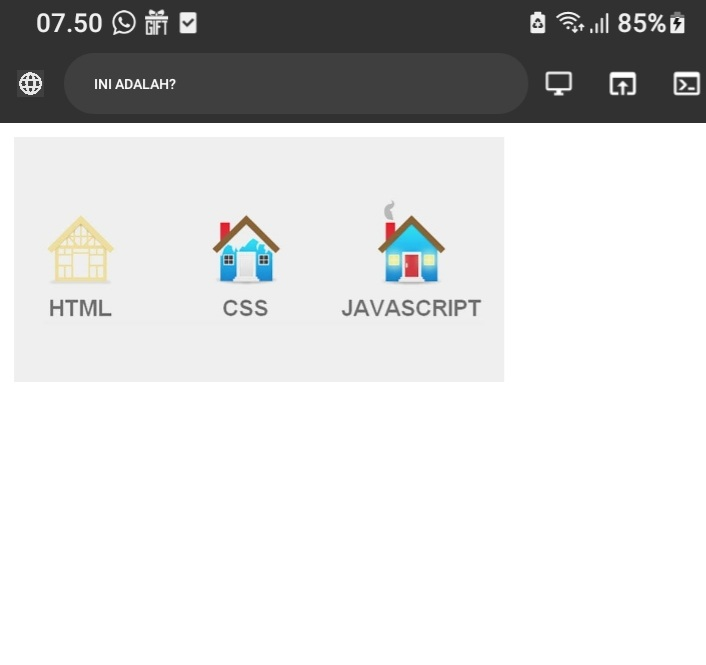

# PENGANTAR_WEB

**Pengantar web adalah bagian dari suatu halaman web yang memberikan informasi awal atau konteks singkat mengenai isi halaman tersebut. 

## DAFTAR MATERI
1. DEFINISI WEB
Web adalah singkatan dari "World Wide Web," sebuah sistem informasi global yang terhubung melalui internet.
2. PENGERTIAN WEB
Web adalah sistem informasi global di internet yang memungkinkan akses dan pertukaran berbagai sumber daya, seperti halaman web, gambar, dan dokumen.
3. TUJUAN WEB
Tujuan web adalah menyediakan akses cepat dan efisien ke berbagai informasi,
## TEMAN KELOMPOK 
- Nabil
- Ardi
- Fachri
- Rehan 
## CEKLIS

- [x] BAIK
+ [x] terbaik 

> [!faq]


# HTML
HTML adalah bahasa markup yang digunakan untuk membuat dan merancang halaman web.  
`<html>`

# CSS
```CSS
Body{
Background-color:White;

}

```


## Pengertian web 
Web adalah singkatan dari world wide web (WWW) yang merupakan bagian dari Internet yang terdiri dari halaman-halaman yang dapat di akses melalui browser web.

# Sejarah Web
Pada tahun 1990-an seorang insinyur bernama Tim Berners-Lee. memperkenalkan konsep sistem yang
memungkinkan dokumen terhubung melalui internet. Dia juga menciptakan protocol HTTP (Hyper Text Transfer Protocol) sebagai jembatan antara server dan client untuk pertukaran data. 

#  HTML

HTML (Hypertext Markup Language) menjadi bahasa fundamental untuk web development, diciptakan oleh Tim Berners-Lee untuk memudahkan pembacaan dokumen yang diformat. Browser pertama yang diciptakannya, World Wide Web (www), juga menjadi bagian integral dari perkembangan web.
struktur dasar HTML seperti tulang tubuh manusia. Setiap file HTML dianggap sebagai satu halaman atau tubuh, dimulai dengan tag HTML dan di akhiri tag HTML, yang terdiri dari bagian head dan body. Bagian head menyimpan informasi yang diperlukan oleh halaman, seperti judul yang muncul di tab browser, sementara bagian body berisi komponen-komponen seperti teks, gambar, tabel, dan link.
Berikut Kode HTML:
```html
<html>
    <head>
        <title>title HTML</title>
    </head>
    <body>
        <p>Hello, Dunia</p>
     </body>
</html>
```
# CSS
Pada tahun 1994, Cascading Style Sheets (CSS) diperkenalkan oleh Håkon Wium Lie untuk memisahkan tata letak dan struktur HTML, memudahkan pemeliharaan dan styling halaman web. CSS memungkinkan pengguna untuk memberikan identitas dan gaya kepada setiap komponen HTML, baik secara umum maupun spesifik.

Penggunaan HTML dan CSS sangat penting dalam pengembangan web. Dan menyarankan untuk untuk terus mengembangkan keterampilan dengan mempelajari framework dan bahasa pemrograman seperti java script.

# Kesimpulan 

Web, singkatan dari World Wide Web (WWW), merupakan bagian dari Internet yang terdiri dari halaman-halaman yang dapat diakses melalui browser web. Sejarah web dimulai pada tahun 1990-an dengan Tim Berners-Lee yang memperkenalkan konsep sistem dokumen terhubung melalui internet, juga menciptakan protokol HTTP sebagai jembatan antara server dan client. HTML, bahasa fundamental untuk pengembangan web, diciptakan oleh Berners-Lee untuk memudahkan pembacaan dokumen yang diformat, dengan struktur dasar mirip tulang tubuh manusia. Pada tahun 1994, CSS diperkenalkan untuk memisahkan tata letak dan struktur HTML, memudahkan pemeliharaan dan styling halaman web. Kombinasi HTML, CSS, dan pengembangan keterampilan dengan mempelajari framework serta bahasa pemrograman seperti JavaScript menjadi kunci penting dalam pengembangan web modern.

 
# HTML

Gambar pertama mengibaratkan HTML di mana cuma  berbentuk pondasi sama dengan HTML cuma berbentuk struktur belum ada warna atau memberikan interaksi.

# CSS
Gambar kedua mengibaratkan CSS. Dimana CSS berfungsi menghiasi website. Sama seperti gambar kedua yang sudah di hiasi seperti ada warna, pintu, jendela, dan cerobong asap.

# JAVASCRIPT 
Gambar ketiga mengibaratkan Javascript. Dimana Javascript berfungsi memberikan interaksi sama dengan Gambar ketiga yang di berikan interaksi seperti keluar asap, lampu nyala atau saklar on, pintu tertutup .

