# Materi Tailwind
## Perkenalan Kelompok
**Kelompok AFF**
- Ahmad Anugrah Satya
- Fachri Ramadhan
- Muhammad Fadhil Amir 

## Penjelasan Materi
Kami dari kelompok AFF mendapatkan materi eksplorasi css bagian Tailwind dan tujuan dari pembuatan file obsidian ini ialah untuk memberikan hasil dari kerja kelompok kami, adapun isi dari *penjelasan materi* ini akan terbagi menjadi instalasi, kostumisasi css, penggunaan component, dan responsive web. Untuk penjelasan lebih jelasnya akan di paparkan di bawah ini.
### Penjelasan Tailwind

### Instalasi Tailwindcss
1. Buatkan File Index.html
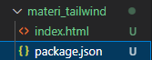


2. Pastikan  Sudah Menginstall Tailwind CSS, Live Preview Dan Post CSS
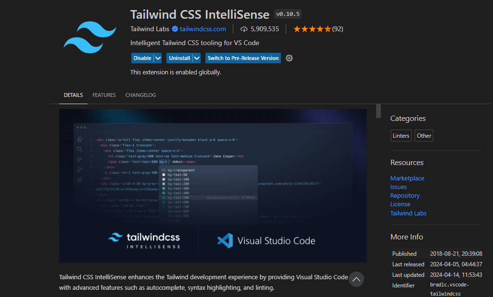
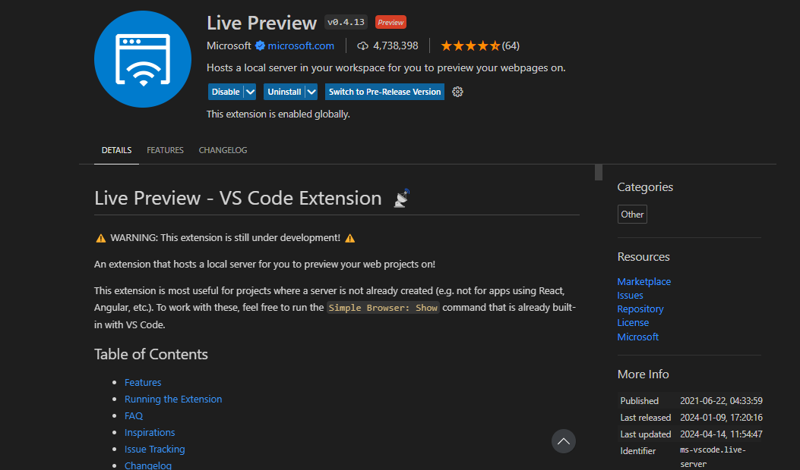
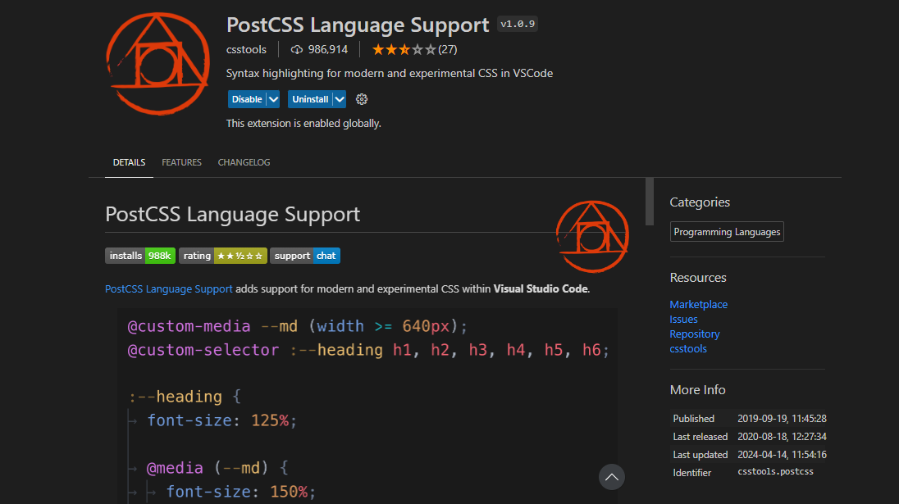
3. Buatkan Struktur HTML Sederhana 
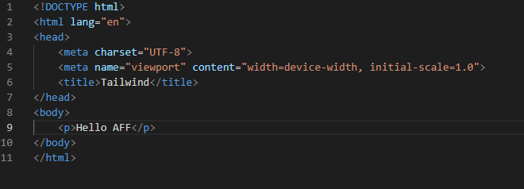


4. Masuk ke gitbash lalu ketik Kode Dibawah ini 
```
git init -y
```
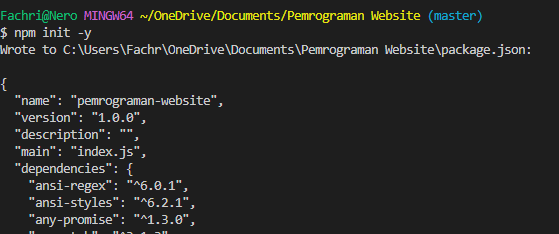


5. Lalu  Ketik install -d tailwindcss
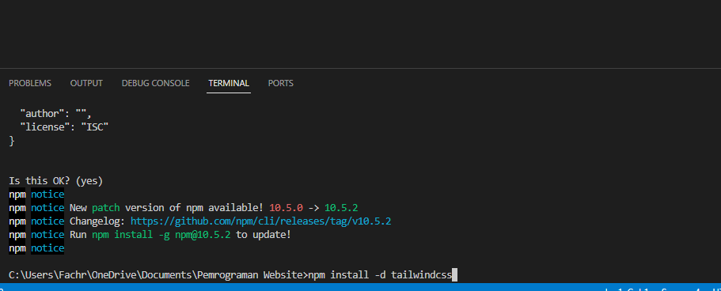


>[!info]- Penjelasan 
Masuk Ke Terminal Lalu Ketik `npm init -y`, `- y` ini berfungsi untuk mengisi secara otomatis yang ingin diisi dan membuat file  (package.json) 

Hasil yang tampil akan seperti berikut :
![[Screenshot 2024-04-15 132539 2.png]]
npm  isntall -d tailwindcss berfungsi untuk menginstall tailwindcss dan juga direkomendasikan untuk menggunakan -D (Rekomendasi ini berasal dari website aslinya)


6.  Masuk ke tailwind.config.js 
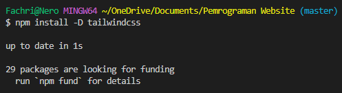

dibagian content ketik `["./public/**/*.{html,js}"]`


7. Masuk ke input.css lalu ketik kode dibawah ini
```bash
@tailwind base;
@tailwind component;
@tailwind utilities;
```
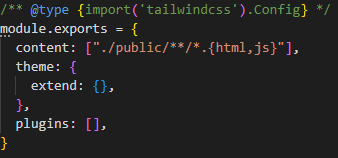


8.  Ketik  Kode Di Bawah ini
```
npx tailwindcss -i ./src/input.css -o ./public/css/style.css --watch
```

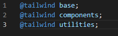


### Kostumisasi CSS 

#### THEME 

**Kode Program CSS**
```css
extend: {
      fontFamily: {
        'body': ['Roboto', 'sans-serif'],
        'heading': ['Montserrat', 'sans-serif'],
      },
      spacing: {
        '72': '18rem',
        '84': '21rem',
      },
      backgroundImage:{
        "anime" : "url(../aset/anime_1.png)"
      },
    }
```

>[!info] 
> - `fontFamily`: Bagian ini digunakan untuk menentukan jenis font yang akan digunakan dalam proyek. Kita mendefinisikan dua jenis font: `body` dan `heading`, masing-masing memiliki daftar font dengan preferensi tertentu. Jika font pertama tidak tersedia, font kedua dalam daftar akan digunakan.
> - `spacing`: Digunakan untuk menambahkan atau memodifikasi ukuran jarak (spacing) yang tersedia. Kita mendefinisikan dua ukuran tambahan di sini, yaitu `72` dan `84`, yang masing-masing setara dengan 18 rem dan 21 rem.
> - `backgroundImage`: Ini adalah bagian dari konfigurasi yang digunakan untuk menambahkan gambar latar belakang. Kita memberi nama gambar tersebut sebagai `anime` dan menyertakan path ke gambar tersebut menggunakan properti `url()`. Pastikan bahwa path ke gambar tersebut sesuai dengan struktur direktori proyek Anda.

#### KONFIGURASI 
**Kode Program CSS**
```css
theme: {
    
    fontFamily: {
      sans: ['Graphik', 'sans-serif'],
      serif: ['Merriweather', 'serif'],
      mono: ['ui-monospace', 'SFMono-Regular',]
    },
    extend: {
      spacing: {
        '8xl': '96rem',
        '9xl': '128rem',
      },
      borderRadius: {
        '4xl': '2rem',
      }
    }
```

>[!info]
>- `fontFamily`: Bagian ini digunakan untuk mendefinisikan jenis font yang akan digunakan dalam proyek, baik itu untuk jenis font sans-serif (`sans`) atau serif (`serif`). Setiap jenis font didefinisikan dengan daftar font yang diinginkan. Jika font pertama tidak tersedia, font kedua dalam daftar akan digunakan sebagai cadangan.
>- `extend`: Ini adalah bagian dari konfigurasi yang digunakan untuk menambahkan atau memperpanjang konfigurasi tema yang telah ada sebelumnya. Dalam kasus ini, kita menambahkan beberapa nilai tambahan untuk `spacing` dan `borderRadius`.
>- `spacing`: Digunakan untuk menambahkan atau memodifikasi ukuran jarak (spacing) yang tersedia. Di sini, kita menambahkan dua ukuran tambahan, yaitu `8xl` dan `9xl`, yang masing-masing setara dengan 96 rem dan 128 rem.
>- `borderRadius`: Digunakan untuk menambahkan atau memodifikasi ukuran radius sudut (border radius) yang tersedia. Dalam kasus ini, kita menambahkan satu nilai tambahan, yaitu 
>- `4xl`, yang setara dengan 2 rem.

**Referensi Font Tailwind : [Font Family - Tailwind CSS](https://tailwindcss.com/docs/font-family)**

#### Color Objek Syntax
**Kode Program CSS**
```css
theme: {
    colors: {
      transparent: 'transparent',
      current: 'currentColor',
      'white': '#ffffff',
      'tahiti': {
        100: '#cffafe',
        200: '#a5f3fc',
        300: '#67e8f9',
        400: '#22d3ee',
        500: '#06b6d4',
        600: '#0891b2',
        700: '#0e7490',
        800: '#155e75',
        900: '#164e63',
      },
      // ...
    },
  },
```

>[!info]
>- theme: Ini adalah objek utama yang berisi konfigurasi tema Tailwind CSS.
>- colors: Ini adalah bagian dari tema yang mendefinisikan palet warna yang dapat Anda gunakan dalam proyek Anda.
>- transparent: Ini adalah warna transparan yang dapat digunakan sebagai nilai pada properti warna.
>- current: Ini adalah warna saat ini yang dapat digunakan sebagai nilai pada properti warna.
>- 'white': '#ffffff': Ini mendefinisikan warna putih dengan kode heksadesimal #ffffff.
>- tahiti': Ini adalah nama untuk palet warna yang Anda definisikan, dalam hal ini, palet warna yang disebut "tahiti".
>- '100': '#cffafe': Ini adalah warna dengan tingkat kecerahan 100 pada palet "tahiti" dengan kode heksadesimal #cffafe.
>- '200': '#a5f3fc': Ini adalah warna dengan tingkat kecerahan 200 pada palet "tahiti" dengan kode heksadesimal #a5f3fc.

**Referensi Color Tailwind : [Customizing Colors - Tailwind CSS](https://tailwindcss.com/docs/customizing-colors)**
#### Using Custom Color
**Kode Program CSS**
```css
theme: {
    colors: {
      transparent: 'transparent',
      current: 'currentColor',
      'white': '#ffffff',
      'purple': '#3f3cbb',
      'midnight': '#121063',
      'metal': '#565584',
      'tahiti': '#3ab7bf',
      'silver': '#ecebff',
      'bubble-gum': '#ff77e9',
      'bermuda': '#78dcca',
    },
  },
```

>[!info]
>- theme: Ini adalah objek utama yang berisi konfigurasi tema Tailwind CSS.
>- colors: Ini adalah bagian dari tema yang mendefinisikan palet warna yang dapat Anda gunakan dalam proyek Anda.
>- transparent: Ini adalah warna transparan yang dapat digunakan sebagai nilai pada properti warna.
>- current: Ini adalah warna saat ini yang dapat digunakan sebagai nilai pada properti warna.
>- 'white': '#ffffff': Ini mendefinisikan warna putih dengan kode heksadesimal #ffffff.
>- 'purple': '#3f3cbb': Ini adalah warna ungu dengan kode heksadesimal #3f3cbb.
>- midnight': '#121063': Ini adalah warna midnight blue dengan kode heksadesimal #121063.
>- metal': '#565584': Ini adalah warna metal dengan kode heksadesimal #565584.
>- tahiti': '#3ab7bf': Ini adalah warna tahiti dengan kode heksadesimal #3ab7bf.
>- silver': '#ecebff': Ini adalah warna silver dengan kode heksadesimal #ecebff.
>- bubble-gum': '#ff77e9': Ini adalah warna bubble gum dengan kode heksadesimal #ff77e9.
>- 'bermuda': '#78dcca': Ini adalah warna bermuda dengan kode heksadesimal #78dcca.

**Cara Menambah Warna dan Aturannya**: 
```Bash
class="text-White-700"
```

 

**Referensi Color Tailwind : [Customizing Colors - Tailwind CSS](https://tailwindcss.com/docs/customizing-colors)**
### Penggunaan Komponen
#### Kode Program CSS
```css
<!DOCTYPE html>
<html lang="en">
<head>
    <meta charset="UTF-8">
    <meta name="viewport" content="width=device-width, initial-scale=1.0">
    <title>Document</title>
</head>
<body>
    <div class="container mx-auto ml-1">
        <nav class="p-4 -mt-4">
            <div class="container flex justify-between items-center">
                <span class="flex flex-wrap">
                    
                    <ul class="flex space-x-4 pt-2 pl-2 mt-3 font-bold">
                        <li><a href="#" class="bg-blue-900 text-white rounded-md px-3 py-2 text-sm font-medium m-3" aria-current="page">Home</a></li>
                        <li><a href="#" class="text-blue-900 m-3">About</a></li>
                        <li><a href="#" class="text-blue-900 m-3">Services</a></li>
                        <li><a href="#" class="text-blue-900 m-3">Contact</a></li>
                    </ul>
                </span>
                <div class="p-4 -mr-10 font-bold">
                    <button class="bg-blue-900 text-white rounded-md px-3 py-2 text-sm font-medium m-3 p-4">
                        <a href="#" class="rounded-md">Sign In</a>
                    </button>
                    <button class="bg-transparent text-blue-900 rounded-md px-3 py-2 text-sm font-medium">
                        <a href="#" class="rounded-none">Sign Up</a>
                    </button>
                </div>
            </div>
        </nav>
    </div>
    
</body>
</html>
```
 
> [!info]- Analisis
> `p-4` : untuk memberi jarak (padding) antara objek lain sebesar 4px
> `mt`: untuk memberi jarak objek pada objek di atasnya
>`justify-between`: untuk memberi jarak pada setiap item di container
> `item-center`: untuk menengahkan sebuah item
> `flex-wrap`: untuk mengontrol item item pada container
> `w-10`: untuk memngatur lebar sebuah objek sebesar 10px
> `m-3`: untuk mengatur ketebalan margin sebesar 3px
> `font-bold`: untuk memberikan ketebalan kepada teks
> `space-x-4 `: digunakan untuk menentukan ruang horizontal antara elemen-elemen yang sejajar (horizontal) didalam suatu flex container.
> `pt-2`: untuk memberi jarak antara teks ke item sebesar 2px
> `bg-blue-900` : digunakan untuk memberikan warna latar belakang biru angka 900 menunjukkan kecerahan atau kegelapan warna biru, semakin tinggi angkanya maka semakin gelap warnanya
> `text-white` : untuk memberikan warna putih pada teks angka 900 menunjukkan kecerahan atau kegelapan warna biru, semakin tinggi angkanya maka semakin gelap warnanya
> `rounded-md` : digunakan untuk memberikan sudut yang sedang dibulatkan pada halaman html.
> `px-3`: Memberikan padding horizontal sebesar 0.75 rem (12px). berarti elemen tersebut akan memiliki padding sebesar 12 piksel di sisi kiri dan kanan.
>`py-2` : Memberikan padding vertikal sebesar 0.5 rem (8px). berarti elemen tersebut akan memiliki padding sebesar 8 piksel di sisi atas dan bawah.
> `text-sm` : digunakan untuk mengatur ukuran teks menjadi lebih kecil.
> `font-medium`: digunakan untuk memberikan bobot huruf yang medium pada teks .
> ` aria-current`: digunakan untuk menandai elemen yang merepresentasikan halaman atau bagian halaman yang saat ditampilkan.
>`"bg-transparent`: membuat background menjadi transparan 
 


### Responsive
Kode Program :
```html
<!DOCTYPE html>
<html lang="en">
<head>
    <meta charset="UTF-8">
    <meta name="viewport" content="width=device-width, initial-scale=1.0">
    <title>Contoh Responsive Web dengan Tailwind CSS</title>
    <link href="https://cdn.jsdelivr.net/npm/tailwindcss@2.2.19/dist/tailwind.min.css" rel="stylesheet">
    <style>
    
    </style>
</head>
<body class="bg-gradient-to-br from-green-500 to-pink-500 min-h-screen flex items-center justify-center">
    <div class="max-w-2xl bg-white p-8 rounded-lg shadow-lg">
        <h1 class="text-4xl font-bold mb-4 text-center text-gray-800">Selamat Datang di Situs ?</h1>
        <p class="text-lg text-gray-700 mb-6">Temukan Informasi .</p>
        <div class="grid grid-cols-1 md:grid-cols-2 gap-8">
            <div class="flex items-center justify-center bg-gradient-to-br from-green-400 to-blue-500 p-8 rounded-lg shadow-lg">
                <h2 class="text-2xl font-semibold text-white">Seputar AFF Bola</h2>
            </div>
            <div class="flex items-center justify-center bg-gradient-to-br from-yellow-400 to-orange-500 p-8 rounded-lg shadow-lg">
                <h2 class="text-2xl font-semibold text-white"> Seputar AFF </h2>
            </div>
           
        </div>
    </div>
</body>
</html>
```

> [!info]- Analisis
>>- `<link href="https://cdn.jsdelivr.net/npm/tailwindcss@2.2.19/dist/tailwind.min.css" rel="stylesheet">`: Mengimpor Tailwind CSS dari CDN.
>>- `<style>`: Bagian untuk menambahkan CSS kustom jika diperlukan. 
>>- `<body class="bg-gradient-to-br from-green-500 to-pink-500 min-h-screen flex items-center justify-center">`: Elemen tubuh dokumen HTML dengan kelas Tailwind CSS untuk mengatur tata letak, tampilan, memberikan warna .
>>- `<div class="max-w-2xl bg-white p-8 rounded-lg shadow-lg">`: Membuat div dengan batasan lebar maksimal, latar belakang putih, padding, sudut yang dibulatkan, dan bayangan (shadow) menggunakan kelas Tailwind CSS.
>>- `<h1 class="text-4xl font-bold mb-4 text-center text-gray-800">`Selamat Datang di Situs ?`</h1>:` Membuat heading level 1 dengan ukuran teks besar, tebal, dan berwarna abu-abu menggunakan kelas Tailwind CSS.
>>- `<p class="text-lg text-gray-700 mb-6">Temukan Informasi .</p>`: Membuat paragraf dengan ukuran teks besar dan warna abu-abu menggunakan kelas Tailwind CSS.
>>- `<div class="grid grid-cols-1 md:grid-cols-2 gap-8">`: Membuat grid dengan satu kolom pada perangkat seluler dan dua kolom pada perangkat dengan lebar minimal MD (medium), dengan jarak antara elemen-elemen grid.
>>- `<div class="flex items-center justify-center bg-gradient-to-br from-green-400 to-blue-500 p-8 rounded-lg shadow-lg">`: Membuat div dengan tata letak flexbox, latar belakang gradien, padding, sudut yang dibulatkan, dan bayangan menggunakan kelas Tailwind CSS.
>>- `<h2 class="text-2xl font-semibold text-white">Seputar AFF Bola</h2>`: Membuat heading level 2 dengan ukuran teks besar, tebal, dan berwarna putih menggunakan kelas Tailwind CSS.
>>- `</div>`: Penutup dari div.
>>- `<div class="flex items-center justify-center bg-gradient-to-br from-yellow-400 to-orange-500 p-8 rounded-lg shadow-lg">`: Elemen div kedua dengan kelas yang sama seperti sebelumnya tetapi dengan gradien warna yang berbeda.
>>- `<h2 class="text-2xl font-semibold text-white">Seputar AFF</h2>`: Heading level 2 dengan kelas yang sama seperti sebelumnya tetapi dengan teks yang berbeda.


Dan hasil programnya akan seperti berikut :
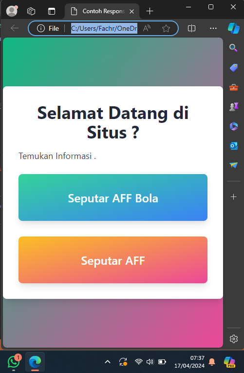

Cara Pengerjaan :
1. Membuat background berwarna biru yang di gradasikan dengan pink dengan cara mengetikkan kode `<body class="bg-gradient-to-br from-green-500 to-pink-500 min-h-screen flex items-center justify-center">`
2. Lalu membuat box yang berisikan teks "Selamat Datang DI situs ?" dan "Temukan Informasi." dan dua container di dalamnya dengan cara `<h1 class="text-4xl font-bold mb-4 text-center text-gray-800">`,`<p class="text-lg text-gray-700 mb-6">Temukan Informasi .</p>` dan dua box didalammnya
3. Lalu membuat dua kolom dengan tulisan "Seputar AFF Bola" dan "Seputar AFF" dengan cara  mengetikkan `<div class="grid grid-cols-1 md:grid-cols-2 gap-8"`,`<h2 class="text-2xl font-semibold text-white">Seputar AFF Bola</h2>` dan `<h2 class="text-2xl font-semibold text-white">Seputar AFF</h2>`.
4. Lalu mengatur posisi seluruh boxnya dengan kode `<div class="flex items-center justify-center bg-gradient-to-br from-green-400 to-blue-500 p-8 rounded-lg shadow-lg">`

Dan berikut ialah hasil setelah mengatur responsivenya :
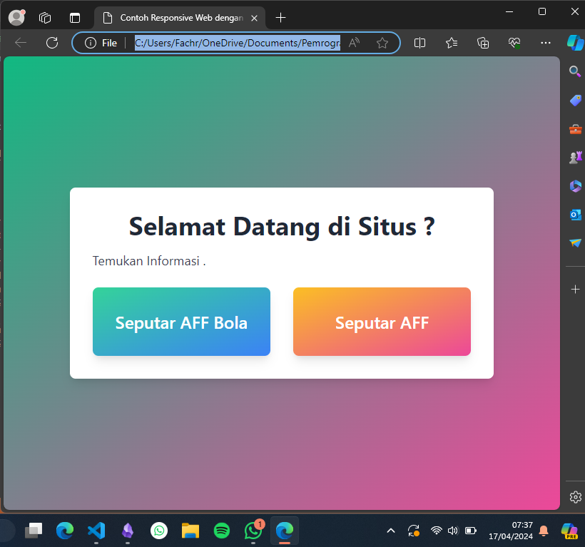

1. untuk mengatur responsivenya kita menggunakan kode 
```
<div class="grid grid-cols-1 md:grid-cols-2 gap-8">`

```
### Implementasi

**Kode Program**
```html
<!DOCTYPE html>
<html lang="en">

<head>
    <meta charset="UTF-8">
    <meta http-equiv="X-UA-Compatible" content="IE=edge">
    <meta name="viewport" content="width=device-width, initial-scale=1.0">
    <title>Web dengan Tailwind CSS</title>
    <link href="style.css" rel="stylesheet">
    <link href="google.css" rel="stylesheet">
</head>

<body class="bg-deku bg-cover">
    <div class="container mx-auto ml-1">
        <nav class="p-4 -mt-4 ">
            <div class="container flex justify-between items-center">
                <span class=" flex flex-wrap">
                    
                    <ul class="flex space-x-4  pt-2 pl-2 mt-3 font-bold">
                        <li><a href="#" class="bg-blue-900 text-white rounded-md px-3 py-2 text-sm font-medium0 m-3"
                                aria-current="page">Home</a></li>
                        <li><a href="#" class="text-blue-900 m-3">About</a></li>
                        <li><a href="#" class="text-blue-900 m-3">Services</a></li>
                        <li><a href="#" class="text-blue-900 m-3">Contact</a></li>
                    </ul>
                </span>
                <div class="p-4 -mr-10 font-bold">
                    <button class="bg-blue-900 text-white rounded-md px-3 py-2 text-sm font-medium0 m-3 p-4">
                            <a href="#" class="rounded-md">Sign In</a>
                    </button>
                    <button class="bg-transparent text-blue-900 rounded-md px-3 py-2 text-sm font-medium">
                        <a href="#" class="rounded-none">Sign Up</a>
                    </button>
                </div>
            </div>
        </nav>
        <div class="container mt-5 ">
            <div class="grid grid-cols-1 md:grid-cols-2 gap-4">
                <div class="text">
                    <h1 class="text-3xl font-bold">Selamat Datang di Website <br>Orang Sad Boy</h1>
                    <p>Lorem ipsum dolor sit amet consectetur adipisicing elit. Veniam sequi quae sed magni eos. Rerum
                        quaerat voluptate eum, amet quisquam fugiat est repudiandae illo, accusantium eius, officia
                        voluptatibus sint deleniti?Lorem ipsum, dolor sit amet consectetur adipisicing elit. Optio,
                        quisquam fugiat. Quo voluptatum quas est veritatis illo et ex molestiae eum, assumenda natus
                        laborum quidem adipisci, iure, suscipit quasi quibusdam?</p>
                </div>
                <div class="carousel">
                    <div class="max-w-2xl mx-auto h-full">

                        <div id="default-carousel" class="relative aspect-auto" data-carousel="static">

                            <div class="overflow-hidden relative h-56 rounded-lg sm:h-64 xl:h-80 2xl:h-96">

                                <div class="hidden duration-700 ease-in-out" data-carousel-item>
                                    <span
                                        class="absolute top-1/2 left-1/2 text-2xl font-semibold text-white -translate-x-1/2 -translate-y-1/2 sm:text-3xl ">Primer
                                        Slide</span>
                                    
                                </div>

                                <div class="hidden duration-700 ease-in-out" data-carousel-item>
                                    
                                </div>

                                <div class="hidden duration-700 ease-in-out" data-carousel-item>
                                    
                                </div>
                            </div>


                            <div class="flex absolute bottom-5 left-1/2 z-30 space-x-3 -translate-x-1/2 ">
                                <button type="button" class="w-3 h-3 rounded-full" aria-current="false"
                                    aria-label="Slide 1" data-carousel-slide-to="0"></button>
                                <button type="button" class="w-3 h-3 rounded-full" aria-current="false"
                                    aria-label="Slide 2" data-carousel-slide-to="1"></button>
                                <button type="button" class="w-3 h-3 rounded-full" aria-current="false"
                                    aria-label="Slide 3" data-carousel-slide-to="2"></button>
                            </div>

                            <button type="button"
                                class="flex absolute top-0 left-0 z-30 justify-center items-center px-4 h-full cursor-pointer group focus:outline-none"
                                data-carousel-prev>
                                <span
                                    class="inline-flex justify-center items-center w-8 h-8 rounded-full sm:w-10 sm:h-10 bg-white/30  group-focus:ring-4 group-focus:ring-white  group-focus:outline-none">
                                    <svg class="w-5 h-5 text-white sm:w-6 sm:h-6" fill="none" stroke="currentColor"
                                        viewBox="0 0 24 24" xmlns="http://www.w3.org/2000/svg">
                                        <path stroke-linecap="round" stroke-linejoin="round" stroke-width="2"
                                            d="M15 19l-7-7 7-7"></path>
                                    </svg>
                                    <span class="hidden">Anterior</span>
                                </span>
                            </button>
                            <button type="button"
                                class="flex absolute top-0 right-0 z-30 justify-center items-center px-4 h-full cursor-pointer group focus:outline-none"
                                data-carousel-next>
                                <span
                                    class="inline-flex justify-center items-center w-8 h-8 rounded-full sm:w-10 sm:h-10 bg-white/30 0 group-focus:ring-4 group-focus:ring-white  group-focus:outline-none">
                                    <svg class="w-5 h-5 text-white sm:w-6 sm:h-6" fill="none" stroke="currentColor"
                                        viewBox="0 0 24 24" xmlns="http://www.w3.org/2000/svg">
                                        <path stroke-linecap="round" stroke-linejoin="round" stroke-width="2"
                                            d="M9 5l7 7-7 7"></path>
                                    </svg>
                                    <span class="hidden">Siguiente</span>
                                </span>
                            </button>
                        </div>

                        <p class="mt-5">
                        </p>
                        <script src="https://unpkg.com/flowbite@1.4.0/dist/flowbite.js"></script>
                    </div>
                </div>
            </div>
        </div>
        <script src="https://unpkg.com/flowbite@1.4.0/dist/flowbite.js"></script>
        <script src="https://cdn.tailwindcss.com"></script>
</body>

</html>
```

#### Hasil :

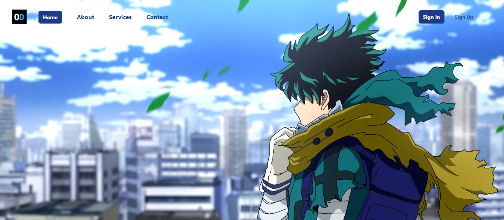


