# Mengenal Version Control System
Version Control System adalah sistem yang mengelola suatu perubahan pada file dokumen, source code, atau kumpulan informasi lainnya. VCS mencatat setiap perubahan pada file yang dikerjakan oleh seseorang
# Apa itu Git & Github?
**Git** merupakan *software* berbasis _Version Control System_ (VCS) yang bertugas untuk mencatat perubahan seluruh _file_ atau _repository_ suatu _project_ Bukan hanya pencipta kodenya saja seperti di version control biasa.Sebenarnya, Git hanya bisa digunakan melalui command line sehingga kurang ramah untuk pemula. Namun, dengan GitHub, Anda bisa menggunakan Git melalui user interface (UI) yang mudah dipahami.

Sedangkan, **GitHub** adalah website yang digunakan untuk menyimpan dan mengelola kode suatu project. Anda juga dapat membuat atau mengupload kode Anda ke server GitHub dan kemudian melakukan coding secara online.Hal tersebut dimungkinkan karena GitHub dibangun atas dua sistem utama, yaitu **version control** dan **Git**.
# Membuat Akun Github
1. Pertama, kunjungi website GitHub di [github.com](https://github.com/)
2. Klik “Sign Up” di pojok kanan atas, untuk mendaftar
3. 
4. Kemudian, masukkan informasi yang dibutuhkan, seperti email, password, hingga username.
5. 
6. Setelah itu, Anda akan diminta memasukkan kode verifikasi yang dikirim ke email Anda. Jadi, cek inbox atau spam pada email Anda. Bila email GitHub belum masuk, Anda bisa klik Resend the code untuk mengirim ulang kodenya.
7. 
8. Kemudian masukkan kode verifikasi email, Anda bisa melakukan proses personalisasi akun. Jika tidak ingin melakukannya, klik Skip.
9. 
10. Jika berhasil, maka akan tampil dashboard github kamu.
11. 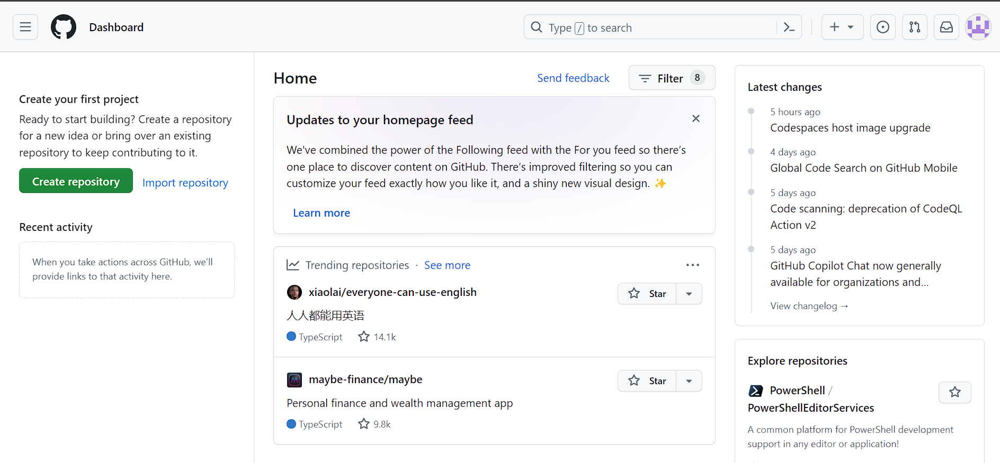


# Instalasi & Konfigurasi Git
## Desktop
### Instalasi
1. Unduh Git dengan membuka tautan [download git](https://git-scm.com/downloads)
2. Pilih **“Windows”**
3. 
4. Setelah itu tunggu hingga muncul berkas aplikasi yang terunduh otomatis atau jika tidak maka pilih unduhan sesuai dengan arsitektur komputer kamu. Kalau menggunakan 64 bit, unduh yang 64 bit. Begitu juga kalau menggunakan 32bit.
5. 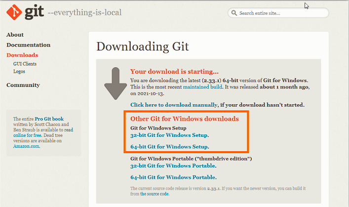
6. Setelah terunduh, lalu klik 2x berkas installer Git yang telah diunduh
7. 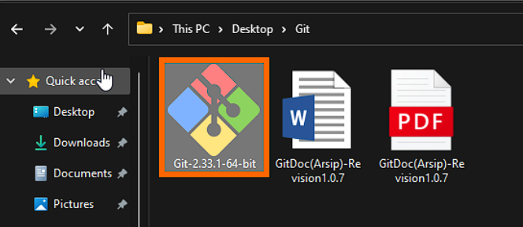
8. Tinjau Lisensi Publik Umum GNU, dan jika kamu sudah siap untuk menginstal, klik **Next.**
9. 
10. Selanjutnya menentukan lokasi instalasi. Biarkan saja secara default, kemudian klik Next.
11. Lalu pemilihan komponen, atur saja seperti di bawah ini, lalu Next.
12. 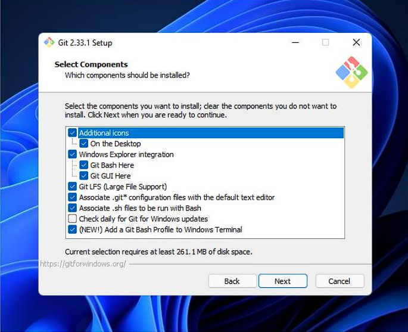
13. Installer akan menawarkan untuk membuat icon start menu di layar Desktop. Cukup klik Next.
14. Pilih editor teks yang ingin kamu gunakan ( Kita akan menggunakan Visual Studio Code ) untuk Git. Setelah itu klik Next
15. Langkah selanjutnya memungkinkan kamu untuk memilih nama yang berbeda untuk branch awal kamu. Standarnya adalah 'master'. Kecuali kamu bekerja dalam tim yang memerlukan nama berbeda, biarkan opsi default dan klik Next
16. 
17. Langkah instalasi ini memungkinkan kamu untuk mengubah lingkungan PATH instalasi. PATH adalah set standar direktori yang disertakan saat kamu menjalankan perintah dari CMD. Biarkan pilihannya di tengah (rekomendasi) dan klik Next .
18. Installer sekarang menanyakan klien SSH mana yang ingin kamu gunakan pada git. Git sudah hadir dengan klien SSH-nya sendiri, jadi jika Anda tidak membutuhkan yang spesifik, biarkan opsi default dan klik Next.
19. Opsi selanjutnya berkaitan dengan sertifikat server. Sebagian besar pengguna harus menggunakan default, klik Next.
20. Selanjutnya konfigurasi line ending. Biarkan saja seperti ini, kemudian klik Next.
21. Lalu pemilihan terminal emulator. Pilih saja yang paling bawah, kemudian klik Next.
22. Installer sekarang menanyakan apa yang git pull harus dilakukan oleh perintah tersebut. Opsi default disarankan Next untuk melanjutkan instalasi.
23. Selanjutnya kamu harus memilih alat kredensial mana yang akan digunakan. Git menggunakan alat kredensial untuk mengambil atau menyimpan kredensial. Biarkan opsi default dan klik Next.
24. Selanjutnya pemilihan opsi ekstra. Klik saja Next.
25. Instaler Git mungkin menawarkan untuk menginstal fitur eksperimental, tanpa centang apapun, langsung saja klik Install.
26. Setelah instalasi selesai, centang kotak untuk melihat Catatan Rilis atau Luncurkan Git Bash, lalu klik Selesai .
27. Untuk meluncurkan Git Bash, kamu tinggal mencari Start Menu Windows lalu Enter pada Git Bash.
28. 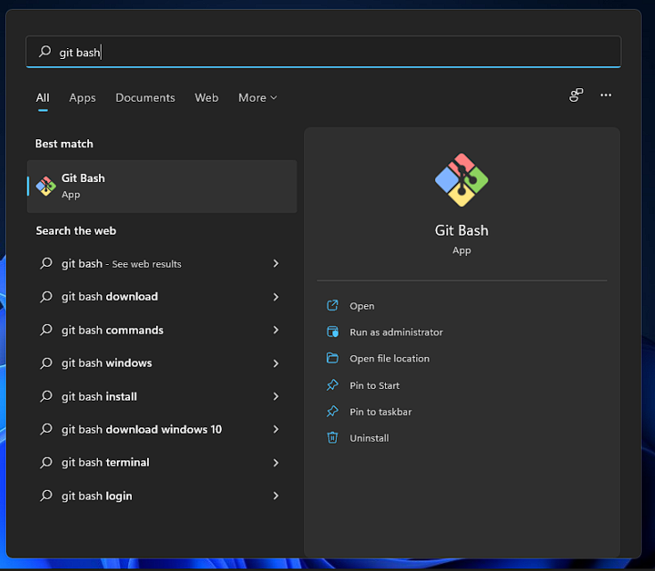
29. kemudian ketik perintah git –version
30. 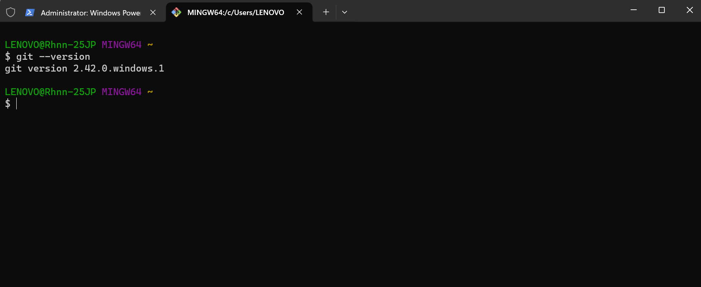
### Konfigurasi
Ada beberapa konfigurasi yang harus dilakukan sebelum mulai menggunakan Git, seperti menentukan _name_ dan _email_.

Jika kamu memiliki akun Github, Gitlab, Bitbucket atau yang lainnya…
maka _username_ dan _email_ harus mengikuti akun tersebut agar mudah diintegrasikan.

Silahkan lakukan konfigurasi sesuai dengan perintah ini.
```bash
git config --global user.name "USERNAME AKUN GITHUB"

git config --global user.email "akun-github@gmail.com"
```
Kemudian periksa konfigurasinya dengan perintah:
```bash
git config --list
```
Apabila berhasil tampil seperti gambar berikut ini, berarti konfigurasi berhasil.
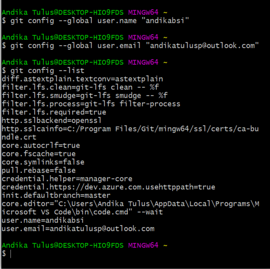


## Mobile


# Membuat Project Pertama
Pertama, Buat Folder bernama **“latihan-git”** dan Buka di Visual Studio Code
 ![400][assets/git-10.png]
 
Klik “Open Folder” lalu pilih folder yang telah kita buat tadi.


Jika terdapat pop up “Trust Folder Author” maka pilih “Yes, i trust the authors”

 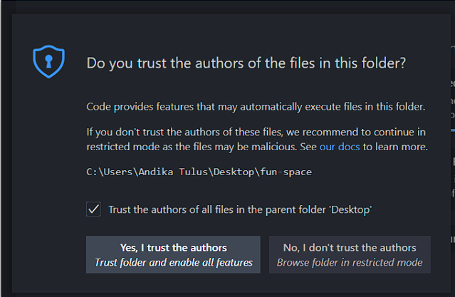

Buat File baru, kalian boleh memasukkan file apapun, disini saya membuat file “belajar.html”.


untuk membuat Repository secara Lokal atau Offline di komputer kita, ketik perintah berikut.
## `git init`
Perintah git init berfungsi untuk membuat Repository secara offline di komputer lokal atau para developer biasa menyebutnya sebagai “Initialisasi Repo Lokal”. Jika berhasil, maka akan terdapat output seperti gambar dibawah ini.


sebelum kita menggugah berkas project kita, kita dapat melihat status folder/file kita
dengan mengetikkan 
## `git status`

disini kita dapat melihat dimana status file kita bahwa terdapat file baru.

sekarang kita akan mengunggah berkas project kita ke lokal dengan perintah
## `git add .`
Perintah tersebut mengintruksikan git untuk menambahkan ( git add ) seluruh file ( . ) yang berada di folder project kita (latihan git) ke Staging Area. Staging Area adalah zona tak terlihat dimana seluruh file project bersiap untuk melalui tahap pengecekan terlebih dahulu riwayat perubahannya. Untuk pertama kali, jika kita menjalankan perintah diatas maka tidak akan mendapatkan output apapun.


selanjutnya yang harus kita lakukan adalah menyimpan riwayat atau catatan perubahannya, sebelum kita unggah ke repository online. Untuk melakukan hal tersebut, kita akan menggunakan perintah 
## `git commit –m "Tambah File HTML"`

Kita mengintruksikan kepada git agar git menyimpan seluruh perubahan ( git commit ) yang terjadi pada berkas project kita, dan perubahan tersebut bisa kita berikan judul ( -m “ Tambah File HTML” ) perubahannya.

Setelah menyimpan riwayat perubahannya, selanjutnya kita ke tahap akhir, yaitu mengunggah ( Push ) project kita dari Repository lokal ke Repository online ( Github )

sebelum kita mengunggah project kita, kita harus membuat repository di github nya.

> [! INFO] Istilah Repository
> **Repository** adalah folder untuk menyimpan berkas-berkas project kita secara online, bahkan setiap perubahannya akan disimpan secara otomatis. ( Seperti membuat Folder di Google Drive atau Onedrive )
### Membuat Repository Di Github
Untuk membuatnya, kita buka dan masuk menggunakan akun github yang telah didaftarkan di https://www.github.com - Sekarang setelah berhasil masuk, maka kita berada di halaman Dashboard github


Untuk membuat repository, maka klik **“Create Repository”**


Setelah itu akan ada beberapa form untuk memberikan beberapa informasi mengenai Folder (Kita sekarang akan menyebutnya sebagai Repository) yang akan kita buat.
1. Repository Name
	Ini adalah form untuk memberikan nama repository project kita ( Sering kita lakukan seperti membuat nama Folder ), disini kita akan memberi nama repositori “latihan-git”
2. Descriptions
	 Deskripsi untuk memberikan keterangan singkat tentang repository. Disini kita akan memberikan deskripsi “Belajar HTML”
3. Repository Visibility
	 Seperti pada umumnya, kita bisa menyetel repository kita dengan mode Privat ( Hanya bisa diakses oleh pemilik repository ) atau Public ( Bisa diakses semua orang, dan bisa dilakukan Pull, Fork, Clone dll oleh semua orang. )
4. Additional Options
	 Ada beberapa pengaturan tambahan dibawahnya, seperti:
	 - **Add Readme File** ( Membuat deskripsi repository secara detail dengan file Readme )
	 - **Add .gitignore** ( Jika ini diaktifkan, maka riwayat perubahan tidak akan dicatat oleh sistem Git )
	 - **Choose License** ( Memilih jenis lisensi untuk repository project )
![gambar][assets/github-rp.png]

Setelah semuanya diisi maka klik tombol **“Create Repository”** Jika berhasil maka akan tampil seperti ini


kemudian copy remote url nya
## `git remote add origin https://github.com/andirhn/latihan-git.git`
Kita mengintruksikan kepada git agar git menghubungkan ( remote ) dan menambahkan ( add ) repository berasal dari ( origin ) link Repository Github kita.

**Kesimpulannya** : Kita mengintruksikan git untuk menambahkan akses repository yang berasal dari Github ke komputer lokal kita dengan menggunakan perintah git remote add origin linkrepo-github


## `git push origin master`
setelah berhasil maka akan muncul output seperti ini


Silahkan kembali ke browser, dan refresh halaman Repository Github kita, maka kita akan melihat perubahannya.

Sebelummnya :


Setelah di push :


Baik, kita sekarang telah menambahkan berkas project kita di Repository Github, kamu bisa share link repository ke seseorang agar bisa melihat kode project aplikasi kamu.

# Kolaborasi Project
Beberapa hal yang harus kita lakukan dalam berkolaborasi dalam project dengan git, yang pasti dan perlu diketahui bahwa repository yang akan kita kontribusi adalah repository public, jika bersifat privat, maka akan ada **pengaturan khusus**.

> [! INFO] Info
> Karena disini saya menggunakan komputer yang sama maka saya harus mengubah konfigurasi git saya untuk memakai akun yang berbeda, namun jika kalian menggunakan komputer yang berbeda kamu mungkin perlu maupun tidak sama sekali melakukan konfigurasi tersebut. 

Pertama, kita salin URL repository untuk digunakan saat kloning repository ke lokal.
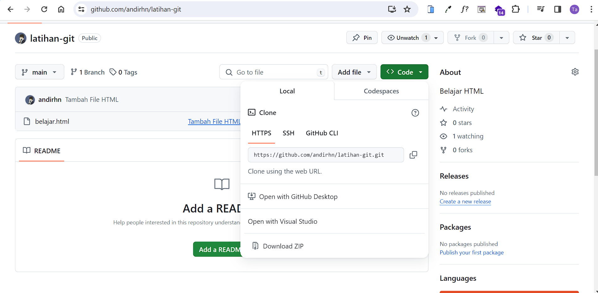

Kemudian, kloning repository ke lokal menggunakan perintah git clone.
```bash
git clone https://github.com/andirhn/latihan-git.git
```
Jika berhasil maka akan tampil seperti ini


Setelah itu, Akan muncul folder baru, itu adalah folder yang berhasil kita ambil dari repository dan sekarang folder nya sudah ada di komputer kita.

kemudian masuk ke folder repository dengan mengetik perintah berikut.
```bash
cd latihan-git
```

Selanjutnya, kita membuat perubahan di kode dari repository yang sudah kita clone, disini kita akan membuat file baru, yaitu `contact.html`


```html
<!DOCTYPE html>

<html lang="en">
  <head>
    <meta charset="UTF-8" />
    <meta name="viewport" content="width=device-width, initial-scale=1.0" />
    <title>Kontak</title>
  </head>
  <body>
    <center>
      <h1>List Kontak</h1>
    </center>
    <div class="container" style="width: 80%; margin: 0 auto;">
      <table
        border="1"
        cellpadding="10"
        cellspacing="0"
        align="center"
        width="100%"
        height="100%"
      >
        <thead>
          <th>Nama</th>
          <th>Nomor</th>
        </thead>
        <tr>
          <td>Angga</td>
          <td>+62 895-2752-9107</td>
        </tr>
      </table>
    </div>
  </body>
</html>
```
Setelah itu kita tambahkan ke staging area dengan perintah
```bash
git add .
```
Kemudian, kita commit dengan pesan "menambahkan file contact.html" berikut perintahnya.
```bash
git commit -m "menambahkan file contact.html"
```


Dan terakhir kita push ke repository langsung dengan perintah `git push origin`.
```bash
git push origin
```
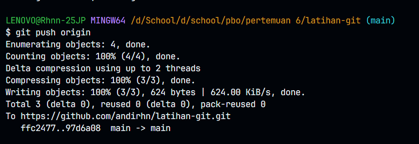

Sekarang bisa kita lihat bahwa saya telah berkontribusi dan berkolaborasi dengan rehan. Saya telah menambahkan “file baru yaitu contact.html” di projectnya
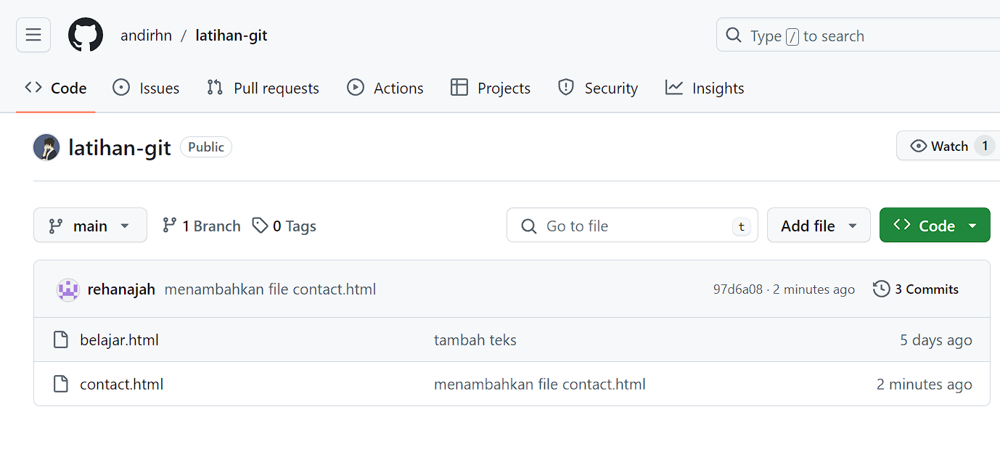

Dan saya ternyata ada ide baru, saya ingin menambahkan kodingan untuk halaman about, namun saya masih ragu apakah itu akan diperlukan atau tidak oleh rehan1.

Karena kita akan membuat branch untuk halaman_about, maka kita akan melakukan pembuatan branch dengan perintah berikut.

```bash
git checkout –b halaman_about
```

Artinya : kita untuk mengintruksikan kepada git agar membuat cabang baru dari cabang utama di repository dengan nama halaman_about.


Lalu kita akan membuat file baru bernama about.html dan kode halaman about.


```html
<!DOCTYPE html>
<html lang="en">
  <head>
    <title>Halaman About</title>
  </head>
  <body>
    <h1 align="center">About Me</h1>
    <ul>
      <li>
        <h2>Nama : Andi Muh Raihan Alkawsar</h2>
      </li>
      <li>
        <h2>Umur : 16 Tahun</h2>
      </li>
      <li>
        <h2>Sekolah : SMKN7 MAKASSAR</h2>
      </li>
      <li>
        <h2>Kelas : XI</h2>
      </li>
      <li>
        <h2>Jurusan : Rpl</h2>
      </li>
    </ul>
  </body>
</html>
```

Setelah itu save dan kita akan lakukan git add . agar semua berkas masuk ke staging area.
```bash
git add .
```

Lalu, kita commit dengan pesan commit “Uji Coba Halaman About”
```bash
git commit -m "Uji Coba Halaman About"
```

Dan terakhir kita push ke repository langsung dengan perintah.
```bash
git push origin halaman_about
```

Sekarang kita lihat di Repository github bahwa Branch yang saya buat telah ditambahkan ke repository milik rhn1.


# Melakukan Pembaruan & Penggabungan Project
beberapa hari telah berlalu, rehan2 membuat fitur baru yaitu membuat halaman about, nah maka dari itu pasti di repository rehan1 belum terupdate akan segala perubahan yang dilakukan oleh rehan2

Pertama yang akan kita lakukan adalah mengambil atau memperbarui segala perubahan yang dilakukan oleh rehan1 di github ke repository lokal milik rehan2.

Maka dari itu, kita akan melakukan `git pull`. Perintah ini digunakan untuk mengambil dan menggabungkan perubahan secara jarak jauh ke repository lokal.
```bash
git pull origin main
```
Artinya :
Kita mengintruksikan git untuk mengambil ( pull ) semua perubahan dari repository awal (origin) di branch utama (main) dan menggabungkannya ke repository lokal kita.

beberapa saat rhn1 tau bahwa rhn2 telah membuat fitur baru yaitu “halaman about”, namun rhn2 membuatnya di cabang ( branch ) lain.

Lalu rhn1 menyukai fitur yang telah di buat oleh rhn2, dan ingin menerapkannya ke program utama. Untuk menggabungkan cabang yang dibuat rhn2 kita akan menggunakan perintah git merge.
```bash
git merge origin/halaman_about
```


Terakhir kita push dan lihat di repository github kita telah digabungkan branch dengan branch sebelumnya, notifikasi pull request dan compare telah tiada artinya kita telah berhasil berkolaborasi.
```bash
git push origin main
```


# Perintah Perintah Dasar GIT
## `git init`
Perintah "git init" digunakan untuk memulai atau menginisialisasi repositori Git baru di dalam sebuah direktori. Saat Anda menjalankan perintah ini, Git akan membuat struktur dasar yang diperlukan untuk melacak perubahan dalam proyek Anda. Berikut adalah beberapa aspek yang diinisialisasi oleh "git init":

1. **Inisialisasi Repository:** Perintah "git init" menciptakan direktori ".git" di dalam direktori proyek. Direktori ini berisi semua informasi yang diperlukan oleh Git untuk mengelola repositori, termasuk database objek, konfigurasi, dan informasi lainnya.

2. **File Konfigurasi:** Git membuat file konfigurasi untuk menyimpan pengaturan spesifik repositori, seperti nama pengguna, alamat email, dan preferensi lainnya. File ini memungkinkan pengguna untuk menyesuaikan konfigurasi sesuai kebutuhan proyek.

3. **Branch Default ("master"):** Git juga membuat branch default yang disebut "master". Branch ini akan digunakan sebagai dasar untuk pengembangan proyek. Saat Anda membuat perubahan dan melakukan commit, riwayat versi akan dimulai dari branch ini.

4. **Staging Area ("index"):** Git membuat staging area atau index, yang memungkinkan Anda untuk mempersiapkan perubahan sebelum melakukan commit. Dengan menggunakan staging area, Anda dapat memilih perubahan yang akan dimasukkan ke dalam commit berikutnya.

5. **Status Awal:** Setelah inisialisasi, Anda dapat menggunakan perintah "git status" untuk melihat status perubahan dalam proyek. Git akan memberikan informasi tentang perubahan yang belum di-commit dan perubahan yang sudah di-stage.

Perintah "git init" biasanya hanya dijalankan sekali saat memulai proyek baru. Setelah inisialisasi, Anda dapat menggunakan berbagai perintah Git lainnya untuk mengelola perubahan, membuat commit, dan berkolaborasi dengan orang lain dalam pengembangan perangkat lunak.
## `git status
Perintah `git status` digunakan untuk menampilkan status perubahan yang terjadi dalam repositori Git. Ketika Anda menjalankan perintah ini dalam direktori yang sudah diinisialisasi sebagai repositori Git, Git akan memberikan informasi tentang perubahan yang belum di-commit, perubahan yang sudah di-stage, serta informasi lainnya terkait status proyek. Berikut adalah contoh output yang mungkin diberikan oleh perintah `git status`:

```bash
On branch master
Your branch is up to date with 'origin/master'.

Changes not staged for commit:
  (use "git add <file>..." to update what will be committed)
  (use "git restore <file>..." to discard changes in working directory)
    modified:   file1.txt
    modified:   file2.txt

no changes added to commit (use "git add" and/or "git commit -a")
```

Penjelasan dari output di atas:

- `On branch master`: Menunjukkan bahwa kita sedang berada di branch "master".
- `Your branch is up to date with 'origin/master'`: Menunjukkan bahwa branch lokal "master" sudah terkini dengan branch "master" di repositori remote ("origin").
- `Changes not staged for commit`: Memberikan daftar perubahan yang belum di-stage untuk commit.
- `modified: file1.txt`: Menunjukkan bahwa file1.txt telah mengalami perubahan.
- `modified: file2.txt`: Menunjukkan bahwa file2.txt juga telah mengalami perubahan.
- `no changes added to commit`: Memberitahu bahwa tidak ada perubahan yang telah di-stage untuk commit.
## `git add`
Perintah `git add` digunakan untuk menambahkan perubahan (modifikasi atau penambahan file) ke dalam staging area. Staging area adalah tempat persiapan sebelum Anda melakukan commit. Dengan menggunakan `git add`, Anda memberitahu Git bahwa perubahan tertentu siap untuk di-commit.

Berikut adalah beberapa contoh penggunaan perintah `git add`:

1. **Menambahkan Semua Perubahan:**
   ```bash
   git add .
   ```
   Perintah ini akan menambahkan semua perubahan (modifikasi atau penambahan file) dalam direktori kerja ke dalam staging area.

2. **Menambahkan Perubahan pada File Tertentu:**
   ```bash
   git add namafile.txt
   ```
   Menggantilah "namafile.txt" dengan nama file yang ingin Anda tambahkan ke dalam staging area. Anda juga dapat memberikan daftar file yang dipisahkan oleh spasi.

3. **Menambahkan Perubahan pada Direktori Tertentu:**
   ```bash
   git add namadirektori/
   ```
   Perintah di atas akan menambahkan semua perubahan dalam direktori tertentu ke dalam staging area.

4. **Menambahkan Perubahan Interaktif:**
   ```bash
   git add -i
   ```
   Perintah ini membuka antarmuka interaktif yang memungkinkan Anda memilih perubahan mana yang ingin ditambahkan ke dalam staging area.
## `git commit`
Perintah `git commit` digunakan untuk membuat snapshot permanen dari perubahan yang telah di-stage (dengan menggunakan `git add`). Saat Anda menjalankan `git commit`, Git akan membuat catatan baru dalam sejarah proyek Anda. Berikut adalah contoh penggunaan perintah `git commit` beserta beberapa opsi yang umum digunakan:

1. **Membuat Commit Tanpa Melibatkan Editor Eksternal:**
   ```bash
   git commit -m "Pesan commit yang menjelaskan perubahan"
   ```
   Opsi `-m` digunakan untuk menambahkan pesan commit langsung dari baris perintah. Pesan commit sebaiknya memberikan ringkasan singkat tentang perubahan yang Anda buat.

2. **Membuat Commit dengan Pesan Lebih Detail:**
   ```bash
   git commit
   ```
   Jika Anda tidak menggunakan opsi `-m`, Git akan membuka editor teks untuk memungkinkan Anda menulis pesan commit yang lebih detail. Setelah menulis pesan, simpan dan keluar dari editor untuk menyelesaikan commit.

3. **Mengubah Pesan Commit Terakhir:**
   ```bash
   git commit --amend
   ```
   Opsi ini memungkinkan Anda mengubah pesan commit terakhir. Editor teks akan terbuka, dan Anda dapat mengedit pesan sebelum menyimpan perubahan.

4. **Menggabungkan Staging dan Pembuatan Commit:**
   ```bash
   git commit -a -m "Pesan commit"
   ```
   Opsi `-a` akan menggabungkan langkah-langkah `git add` dan `git commit` menjadi satu langkah. Ini akan secara otomatis meng-add semua perubahan yang telah dilakukan dan membuat commit.

5. **Membuat Commit dengan Penandaan Waktu Tertentu:**
   ```bash
   git commit --date="YYYY-MM-DD HH:MM:SS"
   ```
   Opsi ini memungkinkan Anda menentukan tanggal dan waktu kapan commit dibuat. Gantilah "YYYY-MM-DD HH:MM:SS" dengan format yang sesuai.

6. **Membuat Commit Tanpa Menambahkan Perubahan ke dalam Staging Area Terlebih Dahulu:**
   ```bash
   git commit -a -m "Pesan commit" --no-verify
   ```
   Opsi `--no-verify` akan memungkinkan Anda untuk membuat commit tanpa menjalankan skrip hook pra-commit yang mungkin terkonfigurasi dalam proyek Anda.

Itu adalah beberapa opsi umum yang dapat digunakan bersama dengan perintah `git commit`. Pilih opsi yang sesuai dengan kebutuhan proyek Anda.
### Aturan Standar Menulis Pesan Git Commit yang Baik
Pesan komit Git adalah salah satu bagian terpenting dari sebuah komit. Mereka memberikan wawasan mengapa kode tertentu ditambahkan ke basis kode. Itulah mengapa penting untuk mempelajari cara menulis pesan Git commit yang baik.

menggunakan Komitmen Konvensional yang merupakan praktik bagus di antara tim teknik. Komitmen Konvensional adalah konvensi pemformatan yang menyediakan seperangkat aturan untuk merumuskan struktur pesan komit yang konsisten seperti:
```
<type>[optional scope]: <description>

[optional body]

[optional footer(s)]
```
Tipe komit dapat mencakup hal berikut:

- `feat`– fitur baru diperkenalkan dengan perubahan
- `fix`– perbaikan bug telah terjadi
- `chore`– perubahan yang tidak terkait dengan perbaikan atau fitur dan tidak mengubah file src atau pengujian (misalnya memperbarui dependensi)
- `refactor`– kode yang difaktorkan ulang yang tidak memperbaiki bug atau menambahkan fitur
- `docs`– pembaruan dokumentasi seperti README atau file penurunan harga lainnya
- `style`– perubahan yang tidak mempengaruhi arti kode, kemungkinan terkait dengan format kode seperti spasi, titik koma yang hilang, dan sebagainya.
- `test`– termasuk tes baru atau koreksi sebelumnya
- `perf`– peningkatan kinerja
- `ci`– terkait integrasi berkelanjutan
- `build`– perubahan yang mempengaruhi sistem build atau ketergantungan eksternal
- `revert`– mengembalikan komit sebelumnya
#### Perbandingan Pesan Commit
##### Bagus
- `feat: improve performance with lazy load implementation for images`
- `chore: update npm dependency to latest version`
- `Fix bug preventing users from submitting the subscribe form`
- `Update incorrect client phone number within footer body per client request`
##### Buruk
- `fixed bug on landing page`
- `Changed style`
- `oops`
- `I think I fixed it this time?`
#### Kesimpulan
Menulis pesan komit yang baik adalah keterampilan yang sangat bermanfaat untuk dikembangkan, dan membantu Anda berkomunikasi dan berkolaborasi dengan tim Anda. Komit berfungsi sebagai arsip perubahan. Mereka bisa menjadi naskah kuno untuk membantu kita menguraikan masa lalu, dan membuat keputusan yang masuk akal di masa depan.
## `git push`
Perintah `git push` digunakan untuk mengirimkan perubahan lokal yang sudah di-commit ke repositori remote. Ini berarti bahwa perubahan yang telah Anda lakukan pada branch lokal akan diperbarui di repositori remote sehingga dapat diakses oleh orang lain yang berkolaborasi dalam proyek yang sama. Berikut adalah contoh penggunaan perintah `git push`:

1. **Push ke Branch yang Sama di Repositori Remote:**
   ```bash
   git push origin nama-branch
   ```
   Menggantilah "nama-branch" dengan nama branch yang ingin Anda push. Ini akan mengirimkan perubahan pada branch lokal ke branch yang sama di repositori remote.

2. **Push ke Branch yang Berbeda di Repositori Remote:**
   ```bash
   git push origin nama-branch- lokal:nama-branch-remote
   ```
   Jika Anda ingin push branch lokal ke branch yang berbeda di repositori remote, gunakan sintaks di atas. Gantilah "nama-branch-lokal" dengan nama branch lokal dan "nama-branch-remote" dengan nama branch di repositori remote.

3. **Push ke Branch Default (Biasanya "master"):**
   ```bash
   git push origin master
   ```
   Jika branch lokal Anda adalah "master" atau branch default lainnya, Anda dapat menggunakan perintah di atas untuk push ke branch tersebut di repositori remote.

4. **Push Semua Branch:**
   ```bash
   git push --all origin
   ```
   Perintah ini akan mengirimkan semua branch lokal yang belum ada di repositori remote ke repositori remote.

5. **Push dengan Force:**
   ```bash
   git push -f origin nama-branch
   ```
   Opsi `-f` atau `--force` digunakan untuk memaksa push perubahan bahkan jika itu akan menimpa perubahan di repositori remote. Hati-hati saat menggunakan opsi ini karena dapat menyebabkan kehilangan perubahan.

6. **Push dengan Tag:**
   ```bash
   git push origin --tags
   ```
   Jika Anda telah membuat tag dan ingin mengirimkannya ke repositori remote, gunakan perintah di atas.

Pastikan untuk memahami implikasi dari perintah `git push`, terutama jika Anda menggunakan opsi-opsi seperti `--force`. Push dengan hati-hati untuk menghindari masalah dan konflik yang tidak diinginkan dalam kolaborasi tim.
## `git pull`
Perintah `git pull` digunakan untuk mengambil (pull) perubahan terbaru dari repositori remote dan menggabungkannya dengan branch lokal yang aktif. Ini memungkinkan Anda untuk memperbarui proyek Anda dengan perubahan yang telah dilakukan oleh orang lain dalam repositori remote. Berikut adalah beberapa contoh penggunaan perintah `git pull`:

1. **Pull dari Branch Default (Biasanya "master"):**
   ```bash
   git pull origin master
   ```
   Perintah di atas akan mengambil perubahan dari branch "master" di repositori remote (`origin`) dan menggabungkannya dengan branch lokal yang aktif.

2. **Pull dari Branch yang Berbeda:**
   ```bash
   git pull origin nama-branch
   ```
   Gantilah "nama-branch" dengan nama branch di repositori remote yang ingin Anda pull.

3. **Pull dan Rebase:**
   ```bash
   git pull --rebase origin master
   ```
   Opsi `--rebase` digunakan untuk menjalankan rebase setelah mengambil perubahan dari repositori remote. Ini memungkinkan Anda untuk menggabungkan perubahan Anda dengan perubahan terbaru dari remote secara lebih bersih.

4. **Pull Semua Perubahan:**
   ```bash
   git pull --all
   ```
   Perintah ini akan mengambil perubahan dari semua branch di repositori remote dan menggabungkannya dengan branch lokal yang aktif.

5. **Pull dengan Force:**
   ```bash
   git pull --force origin master
   ```
   Opsi `--force` digunakan untuk memaksa pull perubahan dari repositori remote bahkan jika itu akan menimpa perubahan lokal. Harap berhati-hati menggunakan opsi ini karena dapat menyebabkan kehilangan perubahan lokal.

6. **Pull dengan Membatalkan Perubahan Lokal:**
   ```bash
   git pull origin master --rebase
   ```
   Opsi `--rebase` juga dapat digunakan untuk menjalankan rebase saat pull dan mengatasi konflik dengan menggabungkan perubahan lokal.

Setelah menjalankan `git pull`, pastikan untuk memeriksa apakah ada konflik atau perubahan lain yang perlu diatasi sebelum melanjutkan bekerja pada proyek Anda.
## `git clone`
Perintah `git clone` digunakan untuk membuat salinan lengkap (clone) dari repositori Git yang ada. Ini memungkinkan Anda untuk menduplikasi seluruh sejarah versi dan struktur direktori dari repositori remote ke komputer lokal Anda. Berikut adalah contoh penggunaan perintah `git clone`:

1. **Clone Repositori Default (Biasanya "master"):**
   ```bash
   git clone <url-repositori>
   ```
   Gantilah `<url-repositori>` dengan URL repositori Git yang ingin Anda clone. Perintah ini akan membuat salinan dari branch default (biasanya "master") ke direktori saat ini.

2. **Clone ke Direktori Tertentu:**
   ```bash
   git clone <url-repositori> nama-direktori
   ```
   Jika Anda ingin menentukan direktori tempat repositori akan di-clone, tentukan `nama-direktori` setelah URL repositori.

3. **Clone dengan Nama Branch yang Berbeda:**
   ```bash
   git clone -b nama-branch <url-repositori>
   ```
   Jika repositori memiliki branch selain yang default dan Anda ingin clone branch tertentu, gunakan opsi `-b`.

4. **Clone secara Rekursif (Dengan Submodul):**
   ```bash
   git clone --recursive <url-repositori>
   ```
   Opsi `--recursive` digunakan jika repositori memiliki submodul (submodule) dan Anda ingin clone seluruh repositori beserta submodule-submodule-nya.

5. **Clone dengan Hanya Sejarah Terakhir (Shallow Clone):**
   ```bash
   git clone --depth 1 <url-repositori>
   ```
   Opsi `--depth` digunakan untuk membuat "shallow clone", yang hanya mengambil sejarah terakhir dari repositori. Ini dapat mengurangi jumlah data yang diunduh.

6. **Clone dengan Menggunakan SSH:**
   ```bash
   git clone git@github.com:username/nama-repo.git
   ```
   Jika repositori mendukung akses SSH, Anda dapat menggunakan URL SSH untuk clone.

Setelah menjalankan `git clone`, Anda akan memiliki salinan lengkap repositori Git di direktori yang telah Anda tentukan. Anda dapat mulai bekerja di proyek tersebut dan membuat perubahan seperti biasa. Jangan lupa untuk menyesuaikan URL repositori dengan alamat yang sesuai dengan repositori Git yang ingin Anda clone.
## `git branch`
Perintah `git branch` digunakan untuk menampilkan daftar branch yang ada dalam repositori Git, dan memberikan informasi tentang branch mana yang sedang aktif. Berikut adalah beberapa contoh penggunaan perintah `git branch`:

1. **Melihat Daftar Branch:**
   ```bash
   git branch
   ```
   Perintah ini akan menampilkan daftar branch yang ada dalam repositori Git, dengan branch yang aktif ditandai dengan bintang (`*`).

2. **Membuat Branch Baru:**
   ```bash
   git branch nama-branch
   ```
   Untuk membuat branch baru dengan nama tertentu, gunakan perintah di atas. Namun, branch baru tersebut belum aktif, Anda perlu beralih ke branch tersebut dengan perintah `git checkout` atau `git switch`.

3. **Mengganti Branch Aktif:**
   ```bash
   git checkout nama-branch
   ```
   atau menggunakan perintah `git switch` (mulai dari Git versi 2.23):
   ```bash
   git switch nama-branch
   ```
   Perintah ini mengganti branch aktif ke branch dengan nama yang ditentukan.

4. **Membuat dan Beralih ke Branch Baru (dalam satu langkah):**
   ```bash
   git checkout -b nama-branch
   ```
   atau menggunakan perintah `git switch` (mulai dari Git versi 2.23):
   ```bash
   git switch -c nama-branch
   ```
   Perintah ini membuat branch baru dan langsung beralih ke branch tersebut.

5. **Menghapus Branch:**
   ```bash
   git branch -d nama-branch
   ```
   Perintah ini digunakan untuk menghapus branch setelah memastikan bahwa perubahan di branch tersebut sudah di-merge ke branch lainnya.

6. **Menghapus Branch dengan Paksa:**
   ```bash
   git branch -D nama-branch
   ```
   Jika branch yang ingin dihapus belum di-merge dan Anda ingin memaksa penghapusan, gunakan opsi `-D`.

7. **Melihat Branch Remote:**
   ```bash
   git branch -r
   ```
   Perintah ini menampilkan daftar branch di repositori remote (hanya nama branch, tanpa lokal).

8. **Melihat Semua Branch (Lokal dan Remote):**
   ```bash
   git branch -a
   ```
   Perintah ini menampilkan semua branch, baik yang ada di repositori lokal maupun di repositori remote.

Perintah `git branch` sangat berguna untuk menjelajahi dan mengelola branch dalam proyek Git. Pastikan untuk memahami status branch Anda sebelum membuat perubahan atau melakukan tindakan seperti penghapusan.
## `git remote`
Perintah `git remote` digunakan untuk menampilkan informasi tentang remote repositories yang terkait dengan repositori Git lokal. Remote repositories adalah repositori yang terletak di tempat lain (umumnya di server atau hosting Git) dan dihubungkan dengan repositori lokal Anda. Berikut adalah beberapa contoh penggunaan perintah `git remote`:

1. **Menampilkan Daftar Remote Repositories:**
   ```bash
   git remote
   ```
   Perintah ini akan menampilkan daftar nama remote repositories yang telah ditambahkan ke repositori lokal Anda.

2. **Menampilkan Informasi Lebih Detail:**
   ```bash
   git remote -v
   ```
   Opsi `-v` (atau `--verbose`) menampilkan URL fetch dan push untuk setiap remote repository, memberikan informasi yang lebih detail.

3. **Menambahkan Remote Repository Baru:**
   ```bash
   git remote add nama-remote url-repository
   ```
   Perintah ini digunakan untuk menambahkan remote repository baru ke repositori lokal. Gantilah "nama-remote" dengan nama yang Anda tentukan dan "url-repository" dengan URL repositori Git.

4. **Mengganti Nama Remote Repository:**
   ```bash
   git remote rename nama-remote baru-remote
   ```
   Jika Anda ingin mengganti nama remote repository yang sudah ada, gunakan perintah di atas. Gantilah "nama-remote" dengan nama yang ingin Anda ganti dan "baru-remote" dengan nama baru.

5. **Menghapus Remote Repository:**
   ```bash
   git remote remove nama-remote
   ```
   Perintah ini digunakan untuk menghapus remote repository yang sudah ditambahkan sebelumnya. Gantilah "nama-remote" dengan nama remote yang ingin dihapus.

6. **Melihat Informasi Fetch dan Push Remote Repository:**
   ```bash
   git remote show nama-remote
   ```
   Perintah ini menampilkan informasi lebih lanjut tentang remote repository tertentu, termasuk refetch dan push URL, dan branch yang di-track.

7. **Mengganti URL Remote Repository:**
   ```bash
   git remote set-url nama-remote url-baru
   ```
   Jika Anda perlu mengganti URL remote repository yang sudah ditambahkan sebelumnya, gunakan perintah di atas.

8. **Menghapus Semua Referensi ke Remote Repository:**
   ```bash
   git remote rm nama-remote
   ```
   Perintah ini menghapus semua referensi ke remote repository tertentu dari repositori lokal.

Perintah `git remote` membantu Anda mengelola dan berinteraksi dengan remote repositories dalam proyek Git. Pastikan untuk memahami konfigurasi remote repository Anda sebelum membuat perubahan untuk menghindari masalah kolaborasi dan pengembangan.
# Best Practices
## Inisialisasi Repository
```bash
git init
git add .
git commit -m "feat: initial commit"
git remote add origin <URL REMOTE REPOSITORY>
git push origin master
```
Keterangan:
1. **git init**: Memulai repositori Git di direktori proyek Anda.
2. **git add .** : Menambahkan semua file yang telah diubah atau baru ke dalam staging area.
3. **git commit -m "feat: initial commit"**: Menyimpan perubahan ke repositori dengan pesan "feat: initial commit", menandakan komit awal proyek.
4. **git remote add origin `<URL REMOTE REPOSITORY>`**: Menghubungkan repositori lokal dengan repositori jarak jauh (remote repository).
5. **git push origin master**: Mengunggah semua komit ke remote repository di branch master.
## Jika Ada Perubahan Pada Repository
```bash
git status
git add .
git commit -m "fix: add missing use statement for HomeController"
git push origin master
```
Keterangan
1. **git status**: Menampilkan status perubahan di repositori lokal.
2. **git add .**: Menambahkan semua perubahan ke staging area.
3. **git commit -m "fix: add missing use statement for HomeController"**: Menyimpan perubahan dengan pesan komit yang menjelaskan perbaikan yang dilakukan.
4. **git push origin master**: Mengirimkan komit-komit baru ke remote repository untuk diperbarui.
# Daftar Referensi
- Dokumentasi Github (https://docs.github.com/)
- Petani Kode - Belajar Git Pemula (https://www.petanikode.com/tutorial/git/)
- Medium (https://medium.com/@fahmiprasetiiio/belajar-git-untuk-pemula-7625c686c68f)