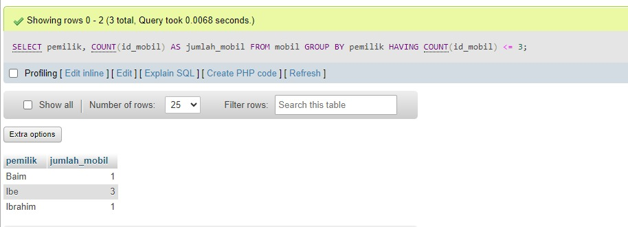

# Hasil Tantangan
## Data Tabel


# Perubahan Struktur Tabel
## Before 

## After 

# Perubahan Data Tabel Pegawai dan Cabang
## Pegawai
### Before

### After 

## Cabang
### Before

### After

# Query Relasi
```PHP
SELECT s.nama, n.nilai
FROM nilai AS n
INNER JOIN siswa AS s ON s.nis = n.nis
WHERE n.nilai > 75;
```
## Hasil 


# Tugas Basis Data
## tampilkan jumlah data mobil dan kelompok kan berdasarkan warna nya sesuai dengan tabel mobil kalian
### Query 
```
SELECT warna, COUNT(*) AS jumlah_mobil
FROM mobil
GROUP BY warna;
```
### Analisis
- `SELECT warna, COUNT(*) AS jumlah_mobil`: Memilih kolom warna dan menghitung jumlah mobil `(COUNT(*))` untuk setiap warna. Hasil perhitungan ini diberi alias jumlah_mobil.
- `FROM mobil`: Mengambil data dari tabel mobil.
- `GROUP BY warna`: Mengelompokkan hasil berdasarkan kolom warna.

### Hasil
 

## berdasarkan query ini tampilkan yang lebih Kecil dari 3 atau sama dengan 3 pemilik mobil nya
### Query
```
SELECT pemilik, COUNT(id_mobil) AS jumlah_mobil
FROM mobil
GROUP BY pemilik
HAVING COUNT(id_mobil) <= 3;
```
### Analisis
- `SELECT pemilik, COUNT(id_mobil) AS jumlah_mobil`:
- `pemilik`: Menampilkan nama pemilik mobil.
- `COUNT(id_mobil) AS jumlah_mobil`: Menghitung jumlah mobil yang dimiliki oleh setiap pemilik, dan menampilkan hasilnya dengan alias `jumlah_mobil`.
- `FROM mobil`:Mengambil data dari tabel mobil.
- `GROUP BY pemilik`:Mengelompokkan data berdasarkan kolom pemilik, sehingga setiap pemilik dikelompokkan bersama dengan jumlah mobil yang mereka miliki.
- `HAVING COUNT(id_mobil) <= 3`:Menyaring hasil kelompok untuk hanya menyertakan pemilik yang memiliki jumlah mobil kurang dari atau sama dengan 3.

### Hasil 


## tampilkan smua pemilik dengan jumlah mobilnya yang memiliki atau sama dengan 3 mobil
### Query
```
SELECT pemilik, COUNT(id_mobil) AS jumlah_mobil
FROM mobil
GROUP BY pemilik
HAVING COUNT(id_mobil) >= 3;
```
### Analisis
- `SELECT pemilik, COUNT(*) AS jumlah_mobil`: Memilih kolom `pemilik` dan menghitung jumlah mobil (`COUNT(*)`) untuk setiap pemilik. Hasil perhitungan ini diberi alias `jumlah_mobil`.
- `FROM mobil`: Mengambil data dari tabel `mobil`.
- `GROUP BY pemilik`: Mengelompokkan hasil berdasarkan kolom `pemilik`.
- `HAVING COUNT(*) >= 3`: Menyaring hasil kelompok yang jumlah mobilnya lebih besar atau sama dengan 3.
### Hasil 


## berdasarkan query yang ada pada praktikum 5 bagian 7 tampilkan data pada table mobil dengan mengelompokan berdasarkan pemiliknya.hitung menggunakan sum total pendapatan pemilik berdasarkan harga rental
### Query
```
SELECT pemilik, SUM(harga_rental) AS total_pendapatan
FROM mobil
GROUP BY pemilik;

```
### Analisis
- `SELECT pemilik, SUM(harga_rental) AS total_pendapatan`: Memilih kolom pemilik dan menghitung total pendapatan (SUM(harga_rental)) untuk setiap pemilik. Hasil perhitungan ini diberi alias total_pendapatan.
- `FROM mobil`: Mengambil data dari tabel mobil.
- `GROUP BY pemilik`: Mengelompokkan hasil berdasarkan kolom pemilik.
### Hasil 


## Berdasarkan praktikum 5 query no 8 tampilkan jumlah pemasukan pemilik berdasarkan harga rental kelompokkan berdasarkan pemiliknya dan seleksi yang total pemasukannya atau harga rentalnya mencapai lebih besar atau sama dengan 300k
### Query 
```
SELECT pemilik, SUM(harga_rental) AS total_pendapatan
FROM mobil
GROUP BY pemilik
HAVING SUM(harga_rental) >= 300000;
```
### Analisis
- `SELECT pemilik, SUM(harga_rental) AS total_pendapatan`: Memilih kolom pemilik dan menghitung total pendapatan (SUM(harga_rental)) untuk setiap pemilik. Hasil perhitungan ini diberi alias total_pendapatan.
- `FROM mobil`: Mengambil data dari tabel mobil.
- `GROUP BY pemilik`: Mengelompokkan hasil berdasarkan kolom pemilik.
- `HAVING SUM(harga_rental) >= 300000`: Menyaring hasil kelompok yang total pendapatannya lebih besar atau sama dengan 300.000.

### Hasil


## Berdasarkan praktikum 6 no 12 tampilkan data data pemasukan pemilik mobil kelompokkan berdasarkan pemiliknya
### Query
```
SELECT pemilik, SUM(harga_rental) AS total_pendapatan
FROM mobil
GROUP BY pemilik;
```
### Analisis

- **`SELECT pemilik, SUM(harga_rental) AS total_pendapatan`**: Memilih kolom `pemilik` dan menghitung total pendapatan (`SUM(harga_rental)`) untuk setiap pemilik. Hasil perhitungan ini diberi alias `total_pendapatan`.
- **`FROM mobil`**: Mengambil data dari tabel `mobil`.
- **`GROUP BY pemilik`**: Mengelompokkan hasil berdasarkan kolom `pemilik`.
### Hasil 

## Berdasarkan praktikum 5 no 16 tampilkan pemasukan  terbesar dan pemasukan terkecil kelompokkan berdasarkan pemiliknya dan seleksi data pemilik yg tampil atau memiliki jumlah mobil lebih besar dari 1
### Query
```
SELECT pemilik, 
       MAX(total_pendapatan) AS pemasukan_terbesar, 
       MIN(total_pendapatan) AS pemasukan_terkecil
FROM (
    SELECT pemilik, SUM(harga_rental) AS total_pendapatan
    FROM mobil
    GROUP BY pemilik
    HAVING COUNT(id_mobil) > 1
) AS subquery
GROUP BY pemilik;
```
### Analisis
- Subquery:
- `SELECT pemilik, SUM(harga_rental) AS total_pendapatan FROM mobil GROUP BY pemilik HAVING COUNT(id_mobil) > 1`: Mengelompokkan data berdasarkan pemilik dan menghitung total pemasukan (SUM(harga_rental)) untuk setiap pemilik, kemudian menyaring hasil hanya untuk pemilik yang memiliki lebih dari 1 mobil (HAVING COUNT(id_mobil) > 1).
- Outer query:
- `SELECT pemilik, MAX(total_pendapatan) AS pemasukan_terbesar, MIN(total_pendapatan) AS pemasukan_terkecil FROM subquery GROUP BY pemilik`: Dari hasil subquery, mengelompokkan lagi berdasarkan pemilik dan menghitung pemasukan terbesar (MAX(total_pendapatan)) dan terkecil (MIN(total_pendapatan)) untuk setiap pemilik.

### Hasil 
