# Koneksi Database
## Query
```Php
<?php

//koneksi ke database
$koneksi = mysqli_connect('localhost', 'root', '', 'rental_fadhil');

if ($koneksi) {
    echo "<br> koneksi aman <br>";
} else {
    echo "error, tidak bisa koneksi ke database";
}
?>
```

### Analisis
- `<? Php` tag pembuka php
- `mysqli_connect()` adalah fungsi yang digunakan untuk membuat koneksi ke server MySQL.
- `'localhost'` adalah hostname dari server MySQL. Biasanya `localhost` digunakan jika server MySQL berjalan di mesin yang sama dengan server web.
- `'root'` adalah username yang digunakan untuk login ke server MySQL.
- `''` adalah tempat untuk password username `root`. karena kosong artinya tidak ada password yang di berikan. 
- `'rental_fadhil'` adalah nama database yang ingin diakses.
- `if ($koneksi)`memeriksa apakah variabel $koneksi berhasil mengembalikan resource koneksi (bernilai true jika berhasil).
- `echo "<br> koneksi aman <br>"`; menampilkan pesan "koneksi aman" jika koneksi berhasil.
- `else` digunakan jika koneksi gagal.
- `echo "error, tidak bisa koneksi ke database";`menampilkan pesan kesalahan jika koneksi gagal.
- `?>` adalah tag penutup php
### Hasil
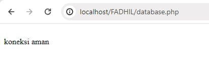

# Tampilkan Data
## Query
```php
<?php
// Koneksi ke database
$koneksi = mysqli_connect('localhost', 'root', '', 'rental_fadhil');

if ($koneksi) {
    echo "<br>koneksi aman<br>";
} else {
    echo "Error, tidak bisa koneksi ke database";
    exit;
}

// Query untuk mengambil data mobil beserta pemiliknya
$query = "SELECT no_plat, pemilik FROM mobil";
$result = mysqli_query($koneksi, $query);

// Cek apakah query berhasil
if ($result) {
    $select = mysqli_fetch_all($result, MYSQLI_ASSOC);

    echo 'Berikut mobil-mobil beserta pemiliknya<br>';

    if (!empty($select)) {
        $a = 1;
        foreach ($select as $key => $data) {
            echo $a++ . ". " . htmlspecialchars($data['no_plat']) . " : " . htmlspecialchars($data['pemilik']) . '<br>';
        }
    } else {
        echo "Tidak ada data mobil yang tersedia.<br>";
    }
} else {
    echo "Error: " . mysqli_error($koneksi);
}

// Tutup koneksi ke database
mysqli_close($koneksi);
?>
```
### Analisis
- `mysqli_connect('localhost', 'root', '', 'rental_fadhil')`: adalah fungsi untuk menghubungkan ke database MySQL.
- `'localhost'`: Nama host, biasanya "localhost" jika database ada di server yang sama dengan server web.
- `'root'`: Nama pengguna database.
- `''`: Kata sandi pengguna database. Kosong dalam hal ini.
- `'rental_fadhil'`: Nama database yang akan dihubungkan.
- `if ($koneksi)`: Mengecek apakah koneksi ke database berhasil.Jika berhasil, mencetak pesan "koneksi aman".
Jika gagal, mencetak pesan "Error, tidak bisa koneksi ke database" dan menghentikan skrip dengan exit.
- `$query`: Mendefinisikan query SQL untuk mengambil kolom no_plat dan pemilik dari tabel mobil.
- `$result = mysqli_query($koneksi, $query)`: Menjalankan query SQL tersebut pada koneksi database $koneksi.
- `if ($result)`: Mengecek apakah query berhasil dieksekusi.
- `$select = mysqli_fetch_all($result, MYSQLI_ASSOC)`: Mengambil semua hasil query dalam bentuk array asosiatif
- echo 'Berikut mobil-mobil beserta pemiliknya<br>';: Menampilkan pesan pengantar.
- `if (!empty($select))`: Mengecek apakah ada data yang diambil dari query.
- `$a = 1;`: Menginisialisasi counter untuk penomoran.
- `foreach ($select as $key => $data)`: Iterasi melalui setiap baris data hasil query.
- `htmlspecialchars($data['no_plat'])`: Menghindari masalah XSS dengan mengonversi karakter khusus HTML dalam nilai no_plat.
- `htmlspecialchars($data['pemilik'])`: Menghindari masalah XSS dengan mengonversi karakter khusus HTML dalam nilai pemilik.
- Menampilkan nomor urut, plat nomor, dan pemilik mobil.
- `else`: Jika tidak ada data yang diambil, menampilkan pesan "Tidak ada data mobil yang tersedia."
- Jika query gagal dieksekusi, mencetak pesan error dengan penjelasan dari fungsi mysqli_error.
- `mysqli_close($koneksi)`: Menutup koneksi ke database.
### Hasil 
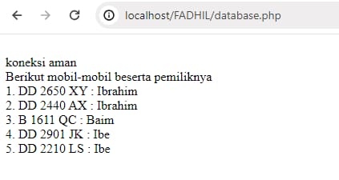

# Tambahkan Data 
## Query
```Php
<?php
include 'database.php';

if ($_SERVER["REQUEST_METHOD"] == "POST") {
    $no_plat = $_POST['no_plat'];
    $no_mesin = $_POST['no_mesin'];
    $warna = $_POST['warna'];
    $pemilik = $_POST['pemilik'];
    $peminjam = $_POST['peminjam'];
    $harga_rental = $_POST['harga_rental'];

    $query = "INSERT INTO mobil (no_plat, no_mesin, warna, pemilik, peminjam, harga_rental) VALUES ('$no_plat', '$no_mesin', '$warna', '$pemilik', '$peminjam', '$harga_rental')";
    
    if (mysqli_query($koneksi, $query)) {
        header("Location: index.php");
    } else {
        echo "Error: " . $query . "<br>" . mysqli_error($koneksi);
    }
}
?>

<!DOCTYPE html>
<html>
<head>
    <title>Tambah Data Mobil</title>
</head>
<body>
    <h1>Tambah Data Mobil</h1>
    <form method="post" action="tambah.php">
        <label>No Plat:</label><br>
        <input type="text" name="no_plat"><br>
        <label>No Mesin:</label><br>
        <input type="text" name="no_mesin"><br>
        <label>Warna:</label><br>
        <input type="text" name="warna"><br>
        <label>Pemilik:</label><br>
        <input type="text" name="pemilik"><br>
        <label>Peminjam:</label><br>
        <input type="text" name="peminjam"><br>
        <label>Harga Rental:</label><br>
        <input type="number" name="harga_rental"><br>
        <input type="submit" value="Tambah">
    </form>
</body>
</html>
```
### Penjelasan
- `include 'database.php';`: mengimpor file database.php, yang mungkin berisi informasi koneksi ke database (seperti hostname, username, password, dan nama database).
- `if ($_SERVER["REQUEST_METHOD"] == "POST") {`: memeriksa apakah metode request adalah POST. Ini berarti bahwa form telah disubmit oleh pengguna.
- `$no_plat = $_POST['no_plat'];  ​$no_mesin = $POST['no_mesin']; ​$warna = $POST['warna'];$pemilik = $_POST['pemilik'];  ​$peminjam = $_POST['peminjam'];$harga_rental = $_POST['harga_rental'];` : Baris-baris ini mengambil data dari form yang telah disubmit menggunakan metode POST dan menyimpannya dalam variabel PHP. Variabel ini akan digunakan untuk menyusun query SQL.
- `$query = "INSERT INTO mobil (no_plat, no_mesin, warna, pemilik, peminjam, harga_rental) VALUES ('$no_plat', '$no_mesin', '$warna', '$pemilik', '$peminjam', '$harga_rental')";`: Baris ini membentuk query SQL yang akan menyisipkan data ke dalam tabel mobil. Data diambil dari variabel yang sudah diisi sebelumnya.
- `if (mysqli_query($koneksi, $query)) {    header("Location: index.php");`: Baris ini menjalankan query SQL. Jika eksekusi query berhasil, pengguna akan dialihkan ke halaman index.php.
- `} else {     echo "Error: " . koneksi)  }}`:Jika eksekusi query gagal, baris ini akan menampilkan pesan error yang menjelaskan kesalahan yang terjadi. mysqli_error($koneksi) menampilkan pesan kesalahan yang diberikan oleh MySQL.
- ``<!DOCTYPE html>`
`<html>`
`<head>`
    `<title>Tambah Data Mobil</title>`
`</head>`
`<body>`
 `<h1>Tambah Data Mobil</h1>`: Bagian ini adalah awal dari dokumen HTML. Deklarasi `<!DOCTYPE html>`menentukan tipe dokumen sebagai HTML5. Elemen html adalah root dari dokumen HTML. Elemen head berisi informasi meta, seperti title yang menentukan judul halaman. Elemen body berisi konten halaman web yang akan ditampilkan kepada pengguna.
 - `<form method="post" action="tambah.php">`: **Baris ini memulai form HTML**. Form ini menggunakan metode POST untuk mengirimkan data ke `tambah.php` saat disubmit.
 - `<label>No Plat:</label><br>`
       `<input type="text" name="no_plat"><br>`
        `<label>No Mesin:</label><br>`
        `<input type="text" name="no_mesin"><br>`
        `<label>Warna:</label><br>`
        `<input type="text" name="warna"><br>`
        `<label>Pemilik:</label><br>`
        `<input type="text" name="pemilik"><br>`
        `<label>Peminjam:</label><br>`
       ` <input type="text" name="peminjam"><br>`
        `<label>Harga Rental:</label><br>`
        `<input type="number"` `name="harga_rental"><br>`:
        Baris-baris ini membuat elemen input dalam form. Setiap pasangan `<label>` dan `<input>` membuat label dan field input untuk data mobil yang berbeda (no plat, no mesin, warna, pemilik, peminjam, harga rental). `<br>` digunakan untuk membuat baris baru setelah setiap elemen input.
- `<input type="submit" value="Tambah">`
    `</form>`
- `</body> </html>`: Baris ini menambahkan tombol submit yang ketika diklik akan mengirimkan data form ke tambah.php. Form kemudian ditutup dengan tag `</form>`. Bagian body dan html ditutup dengan tag penutup masing-masing.
### Hasil
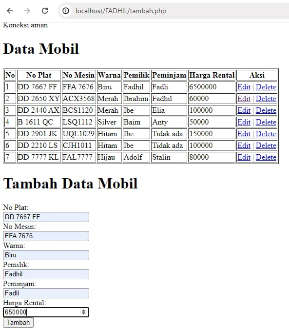
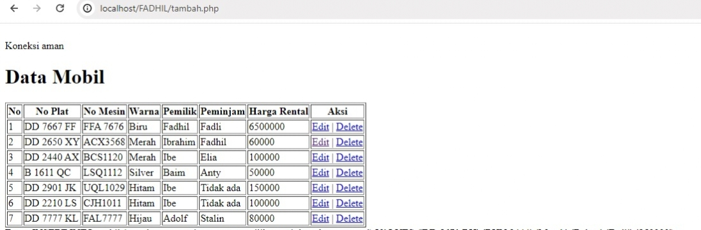

# Ubah Data 
## Query
```php
<?php
include 'database.php';

if (isset($_GET['id'])) {
    $id = $_GET['id'];
    $result = mysqli_query($koneksi, "SELECT * FROM mobil WHERE id_mobil = $id");
    $data = mysqli_fetch_assoc($result);
}

if ($_SERVER["REQUEST_METHOD"] == "POST") {
    $id = $_POST['id_mobil'];
    $no_plat = $_POST['no_plat'];
    $no_mesin = $_POST['no_mesin'];
    $warna = $_POST['warna'];
    $pemilik = $_POST['pemilik'];
    $peminjam = $_POST['peminjam'];
    $harga_rental = $_POST['harga_rental'];

    $sql = "UPDATE mobil SET no_plat = '$no_plat', no_mesin = '$no_mesin', warna = '$warna', pemilik = '$pemilik', peminjam = '$peminjam', harga_rental = '$harga_rental' WHERE id_mobil = $id";

    if (mysqli_query($koneksi, $sql)) {
        echo "Data berhasil diubah";
    } else {
        echo "Error: " . mysqli_error($koneksi);
    }

    header("Location: index.php");
    exit();
}
?>

<!DOCTYPE html>
<html>
<head>
    <title>Ubah Data Mobil</title>
</head>
<body>
    <h1>Ubah Data Mobil</h1>
    <form method="post" action="">
        <input type="hidden" name="id_mobil" value="<?php echo $data['id_mobil']; ?>">
        No Plat: <input type="text" name="no_plat" value="<?php echo $data['no_plat']; ?>"><br>
        No Mesin: <input type="text" name="no_mesin" value="<?php echo $data['no_mesin']; ?>"><br>
        Warna: <input type="text" name="warna" value="<?php echo $data['warna']; ?>"><br>
        Pemilik: <input type="text" name="pemilik" value="<?php echo $data['pemilik']; ?>"><br>
        Peminjam: <input type="text" name="peminjam" value="<?php echo $data['peminjam']; ?>"><br>
        Harga Rental: <input type="number" name="harga_rental" value="<?php echo $data['harga_rental']; ?>"><br>
        <input type="submit" value="Ubah">
    </form>
</body>
</html>
```
### Penjelasan
- ` include 'database.php';`: Baris ini mengimpor file database.php, yang kemungkinan besar berisi informasi koneksi ke database.
- `if (isset($_GET['id'])) {$id = $_GET['id']; $result = mysqli_query($koneksi,"SELECT` `* FROM mobil WHERE id_mobil = $id");` `$data=mysqli_fetch_assoc($result);}`: Baris ini memeriksa apakah ada parameter id yang dikirim melalui GET. Jika ya, maka:`$id mengambil nilai dari parameter id`.`mysqli_query($koneksi, "SELECT * FROM mobil WHERE id_mobil = $id")`menjalankan query SQL untuk mendapatkan data mobil dengan id_mobil yang sesuai.`mysqli_fetch_assoc($result)` mengambil hasil query sebagai array asosiatif dan menyimpannya di `$data`.
- `if ($_SERVER["REQUEST_METHOD"] == "POST") {`:Baris ini memeriksa apakah metode request adalah POST. Ini berarti form telah disubmit oleh pengguna.
- ``$id = $_POST['id_mobil'];$no_plat = $_POST['no_plat'];`
`$no_mesin = $_POST['no_mesin']$warna = $_POST['warna'];` `$pemilik = $_POST['pemilik']; $peminjam = $_POST['peminjam']; $harga_rental = $_POST['harga_rental'];` : Baris-baris ini mengambil data dari form yang telah disubmit menggunakan metode POST dan menyimpannya dalam variabel PHP. Variabel ini akan digunakan untuk menyusun query Sql untuk mengupdate data. 
- `$sql = "UPDATE mobil SET no_plat = '$no_plat', no_mesin = '$no_mesin', warna = '$warna', pemilik = '$pemilik', peminjam = '$peminjam', harga_rental = '$harga_rental' WHERE id_mobil = $id";` : Baris ini membentuk query SQL yang akan memperbarui data di tabel mobil berdasarkan id_mobil. Data diambil dari variabel yang sudah diisi sebelumnya.
- `if (mysqli_query($koneksi, $sql)) { echo "Data berhasil diubah";} else {  echo "Error: " . mysqli_error($koneksi);}`:Baris ini menjalankan query SQL. Jika eksekusi query berhasil, menampilkan pesan "Data berhasil diubah". Jika ada kesalahan, menampilkan pesan error yang dihasilkan oleh MySQL.
- `header("Location: index.php");exit();}` : Baris ini mengalihkan pengguna ke index.php setelah data berhasil diubah. exit() digunakan untuk menghentikan eksekusi script setelah header redirection.
- `<!DOCTYPE html> <html> <head> <title>Ubah Data Mobil</title> </head><body> <h1>Ubah Data Mobil</h1>` : Bagian ini adalah awal dari dokumen HTML. Deklarasi <!DOCTYPE html> menentukan tipe dokumen sebagai HTML5. Elemen html adalah root dari dokumen HTML. Elemen head berisi informasi meta, seperti title yang menentukan judul halaman. Elemen body berisi konten halaman web yang akan ditampilkan kepada pengguna. h1 digunakan untuk menampilkan judul halaman.
- `<form method="post" action="">` : Baris ini memulai form HTML. Form ini menggunakan metode POST untuk mengirimkan data ke halaman yang sama (karena action kosong).
- `<input type="hidden" name="id_mobil" value="<?php echo $data['id_mobil']; ?>">` : Baris ini membuat elemen input tersembunyi yang berisi `id_mobil`. Ini penting untuk mengidentifikasi mobil mana yang sedang diedit.
- `No Plat: <input type="text"name="no_plat" value="<?php echo $data['no_plat']; ?>"><br>No Mesin: <input type="text" name="no_mesin" value="<?php echo $data['no_mesin']; ?>"><br>Warna: <input type="text" name="warna" value="<?php echo $data['warna']; ?>"><br>Pemilik: <input type="text" name="pemilik" value="<?php echo $data['pemilik']; ?>"><br>Peminjam: <input type="text" name="peminjam" value="<?php echo $data['peminjam']; ?>"><br>Harga Rental: <input type="numbername="harga_rental" value="<?php echo$data['harga_rental']; ?>"><br>`: Baris-baris ini membuat elemen input dalam form. Setiap input field diisi dengan nilai yang ada di $data, sehingga pengguna dapat melihat dan mengedit data yang sudah ada.`<br>`digunakan untuk membuat baris baru setelah setiap elemen input.
- `<input type="submit" value="Ubah"></form></body>
  `</html>`: Baris ini menambahkan tombol submit yang ketika diklik akan mengirimkan data form. Form kemudian ditutup dengan tag `</form>`. Bagian `body` dan `html` ditutup dengan tag penutup masing-masing.
### Hasil 
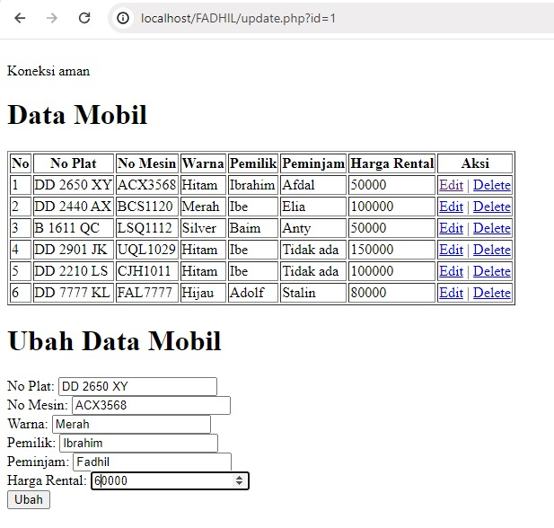
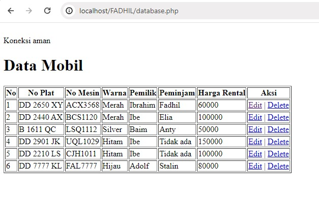
# Hapus Data 
## Query
```php
<?php
include 'database.php'; // Pastikan file database.php ada dan bisa di-include

if (isset($_GET['id'])) {
    $id = $_GET['id'];

    // Jalankan query DELETE
    $sql = "DELETE FROM mobil WHERE id_mobil = $id";

    if (mysqli_query($koneksi, $sql)) {
        echo "Data berhasil dihapus";
    } else {
        echo "Error: " . mysqli_error($koneksi);
    }

    // Redirect ke halaman utama setelah menghapus data
    header("Location: database.php");
    exit();
} else {
    echo "ID tidak ditemukan";
}
?>
```
### Penjelasan
- `<?phppemb include 'database.php'; // Pastikan file database.php ada dan bisa di-include`: tag pembuka php berisi kode untuk koneksi ke database.
- `if (isset($_GET['id'])) { $id = $GET['id'];`: Baris ini memeriksa apakah parameter id dikirim melalui URL (menggunakan metode GET). Jika ada, nilai parameter tersebut disimpan dalam variabel $id.
- `// Jalankan query DELETE $sql = "DELETE FROM mobil WHERE id_mobil = $id";`: Baris ini membuat query SQL untuk menghapus data dari tabel mobil dengan kondisi id_mobil sama dengan nilai $id.
- `if (mysqli_query($koneksi, $sql)) {  ​echo "Data berhasil dihapus";} else {  ​echo "Error: " . mysqli_error($koneksi);}`: Baris ini menjalankan query SQL yang telah dibuat sebelumnya. Jika query berhasil dijalankan, maka akan menampilkan pesan "Data berhasil dihapus". Jika terjadi kesalahan, maka akan menampilkan pesan "Error:" diikuti dengan pesan kesalahan yang diperoleh dari mysqli_error().
- `// Redirect ke halaman utama setelah menghapus data header("Location: database.php");  exit();}`: Baris ini akan mengarahkan pengguna ke halaman database.php setelah data berhasil dihapus. exit() digunakan untuk menghentikan eksekusi skrip PHP.
- `} else {    echo "ID tidak ditemukan";}?>`: Jika parameter id tidak ditemukan dalam URL, maka akan menampilkan pesan "ID tidak ditemukan" Dan tag penutup php
### Hasil

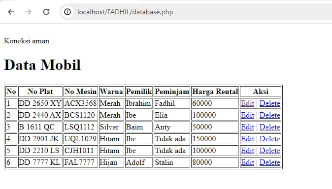
# Session/Login
## Query Login
```php
<?php

session_start();

if (isset($_POST['submit'])) {
    $username = $_POST['username'];
    $password = $_POST['password'];

    $koneksi = mysqli_connect('localhost', 'root', '', 'pemilu_test') or die('error koneksi');

    $result = mysqli_query($koneksi, "SELECT * FROM user 
                            WHERE username = '$username' AND password = '$password'");

    $data = mysqli_fetch_assoc($result);

    if (isset($data)) {
        $_SESSION['username'] = $data['username'];
        $_SESSION['nama'] = $data['nama'];
        $_SESSION['status'] = 'login';
        header('Location: user.php');
    } else {
        echo "Username dan Password Salah";
    }
}


?>
<!DOCTYPE html>
<html>

<head>
    <title>Login Session</title>
</head>

<body>

    <form method="post">
        <label>Username</label>
        <input type="text" name="username">
        <br>
        <label>Password</label>
        <input type="text" name="password">
        <br>
        <button type="submit" name="submit">Login</button>
    </form>

</body>

</html>
```
## Query Log out
```php
<?php
session_start();

session_destroy();
session_unset();

header('Location: login.php');
```
### Penjelasan Login
- `session_start();` :  Memulai atau melanjutkan sesi pengguna.
- `if (isset($_POST['submit'])) {` : Memeriksa apakah form telah disubmit.
- `$username = $_POST['username'];$password = $POST['password']; ` : Mengambil username dan password dari form.
- `$koneksi = mysqli_connect('localhost', 'root', '', 'pemilu_test') or die('error koneksi');` : Menghubungkan ke database pemilu_test.
- `$result = mysqli_query($koneksi, "SELECT * FROM user WHERE username = '$username' AND password = '$password'");` : Menjalankan query untuk memeriksa username dan password.
- `$data = mysqli_fetch_assoc($result);`: Mengambil data pengguna dari hasil query.
- `if (isset($data)) {  ​$SESSION['username'] = $data['username'];  ​$SESSION['nama'] = $data['nama'];$_SESSION['status'] = 'login'; header('Location: user.php');} else { echo "Username dan Password Salah";}`: Jika cocok, mengatur variabel sesi dan mengarahkan ke user.php. Jika tidak cocok, menampilkan pesan kesalahan.
```html
<!DOCTYPE html>
<html>
<head>
    <title>Login Session</title>
</head>
<body>
    <form method="post">
        <label>Username</label>
        <input type="text" name="username">
        <br>
        <label>Password</label>
        <input type="text" name="password">
        <br>
        <button type="submit" name="submit">Login</button>
    </form>
</body>
</html>

```
Menampilkan form login untuk memasukkan username dan password.
### Penjelasan Log out 
- Sesi Dimulai: Jika belum ada sesi yang berjalan, `session_start()` akan memulai sesi baru atau melanjutkan sesi yang ada.
- Sesi Dihancurkan: `session_destroy()` akan menghapus data sesi dari server, mengakhiri sesi pengguna saat ini.
- Variabel Sesi Dihapus: `session_unset()` memastikan bahwa semua variabel sesi yang ada dihapus.
- Pengalihan ke Halaman Login: `header('Location: login.php')` mengarahkan pengguna ke halaman login, yang biasanya berarti pengguna perlu masuk kembali untuk mengakses bagian yang dilindungi dari situs.

### Hasil
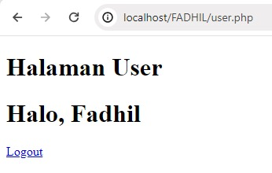
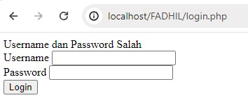
# Upload dan Download
## Query Download 
```php
<?php
include "koneksi.php";

$query = mysqli_query($koneksi, 'SELECT * FROM mobil');

$data = [];
$data[] = ["id_mobil", "no_plat","no_mesin", "warna", "pemilik","peminjam","harga_rental"];
while ($row = mysqli_fetch_assoc($query)) {
    $data[] = [
        $row['id_mobil'],
        $row['no_plat'],
        $row['no_mesin'],
        $row['warna'],
        $row['pemilik']
        $row['peminjam']
        $row['harga_rental']
    ];
}

$namafile = "excel_data.xls";
header("Content-Type: application/vnd.ms-excel");
header("Content-Disposition: attachment;filename=\"$namafile\"");
header("Cache-Control: max-age=0");

$output = fopen("php://output", "w");

foreach ($data as $row) {
    fputcsv($output, $row, "\t");
}

fclose($output);
exit;
```
### Penjelasan
- `include "koneksi.php";`: Memuat konfigurasi dan koneksi ke database dari file koneksi.php.
- `$query = mysqli_query($koneksi, 'SELECT * FROM mobil');` : Menjalankan query untuk mendapatkan semua data dari tabel mobil.
- `$data = [];$data[] = ["id_mobil", "no_plat","no_mesin", "warna", "pemilik","peminjam","harga_rental"];` : Membuat array kosong dan menambahkan nama-nama kolom sebagai header.
- `while ($row =  mysqli_fetch_assoc($query)) {  $data[] = [$row['id_mobil'], $row['no_plat'],  $row['no_mesin'],   row['pemilik'], $row['peminjam'],  $row['harga_rental'] ];}` : Mengambil setiap baris data dari hasil query dan menambahkannya ke array $data.
- `$namafile = "excel_data.xls"; header("Content-Type: application/vnd.ms-excel");header("Content-Disposition: attachment;filename=\"$namafile\"");header("Cache-Control: max-age=0");` : Mengatur header untuk memberitahu browser bahwa file yang dihasilkan adalah file Excel yang dapat diunduh.
- `$output = fopen("php://output", "w");foreach ($data as $row) {fputcsv($output, output);exit;` : Membuka stream untuk output, menulis data ke output sebagai file CSV dengan pemisah tab, dan menutup stream tersebut.

### Hasil 
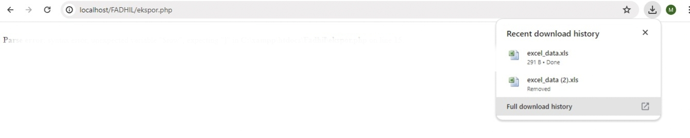
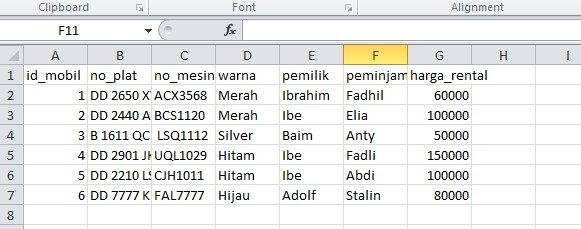

## Query Upload
```php
<!DOCTYPE html>
<html lang="en">

<head>
    <meta charset="UTF-8">
    <meta name="viewport" content="width=device-width, initial-scale=1.0">
    <title>index tabel</title>
</head>

<body>

    <h2>Data Mobil</h2>
    <a href="tambah.php">+Tambah Data Baru</a><br><br>
    <p>
        <a href="ekspor.php">Eksport Excel</a>
    </p>
    <table border="5">
        <tr>
            <th>id_mobil</th>
            <th>Gambar</th>
            <th>no_plat</th>
            <th>no_mesin</th>
            <th>warna</th>
            <th>pemilik</th>
            <th>peminjam</th>
            <th>harga_rental</th>
            <th>aksi</th>
        </tr>

        <?php
        include "koneksi.php";
        $i = 1;
        $query = mysqli_query($koneksi, "SELECT * FROM mobil");
        while ($data = mysqli_fetch_array($query)) {
            ?>

            <tr>

                <td><?php echo $i; ?></td>
                <td>
                    " width="100">
                </td>

                <td><?php echo $data['no_plat']; ?></td>
                <td><?php echo $data['no_mesin']; ?></td>
                <td><?php echo $data['warna']; ?></td>
                <td><?php echo $data['pemilik']; ?></td>
                <td><?php echo $data['peminjam']; ?></td>
                <td><?php echo $data['harga_rental']; ?></td>
                
                

                <td>
                    <a href="update.php?id=<?= $data['id_mobil']; ?>">Ubah</a> |
                    <a href="delete.php?id=<?= $data['id_mobil']; ?>">Hapus</a> |
                </td>
            </tr>
            <?php
            $i++;
        }
        ?>
    </table>
</body>

</html>
```
### Penjelasan
- `<!DOCTYPE html>`: Mendefinisikan versi HTML yang digunakan, ini HTML5.
- `<html lang="en">`: Menentukan bahasa dokumen sebagai bahasa Inggris.
- `<head>`: Berisi informasi meta seperti tag meta, judul, dan referensi ke file eksternal.
- `<meta charset="UTF-8">`: Mendefinisikan pengkodean karakter sebagai UTF-8, standar untuk pengkodean karakter.
- `<meta name="viewport" content="width=device-width, initial-scale=1.0">`: Menyetel area pandang untuk desain web responsif.
- `<title>index tabel</title>`: Menyetel judul dokumen HTML.
- `<body>`: Berisi konten yang ditampilkan pada halaman web.
- `<h2>Data Mobil</h2>`: Membuat heading level 2 dengan teks "Data Mobil".
- `<a href="tambah.php">+Tambah Data Baru</a><br><br>`: Membuat hyperlink ke "tambah.php" dengan teks "+Tambah Data Baru" diikuti dengan dua baris baru.
- `<p><a href="ekspor.php">Eksport Excel</a></p>`: Membuat paragraf dengan hyperlink ke "ekspor.php" dengan teks "Eksport Excel".
- `<table border="5">`: Membuat tabel dengan ketebalan batas 5 piksel.
- `<tr>...</tr>`: Mewakili baris dalam tabel.
- `<th>...</th>`: Mendefinisikan sel header (kolom) dalam tabel.
- `<td>...</td>`: Mendefinisikan sel data dalam tabel.
- `<?php ... ?>`: Menyematkan kode PHP ke dalam dokumen HTML untuk konten atau logika dinamis.
- `include "koneksi.php";: Termasuk file "koneksi.php" yang berisi koneksi database.
- `$query = mysqli_query($koneksi, "SELECT * FROM mobil");`: Menjalankan kueri SQL untuk mengambil data dari tabel "mobil" di database yang terhubung.
- `while ($data = mysqli_fetch_array($query)) { ... }`: Mengulang setiap baris hasil kueri dan menampilkannya dalam tabel.
- `" width="100">`: Menampilkan gambar yang bersumber dari folder "img" menggunakan URL gambar yang diambil dari database.
- `<a href="update.php?id=<?= $data['id_mobil']; ?>">Ubah</a> | <a href="delete.php?id=<?= $data['id_mobil']; ?>">Hapus</a> |`: Membuat hyperlink untuk memperbarui dan menghapus data mobil tertentu menggunakan parameter ID dari setiap baris data.
### Hasil
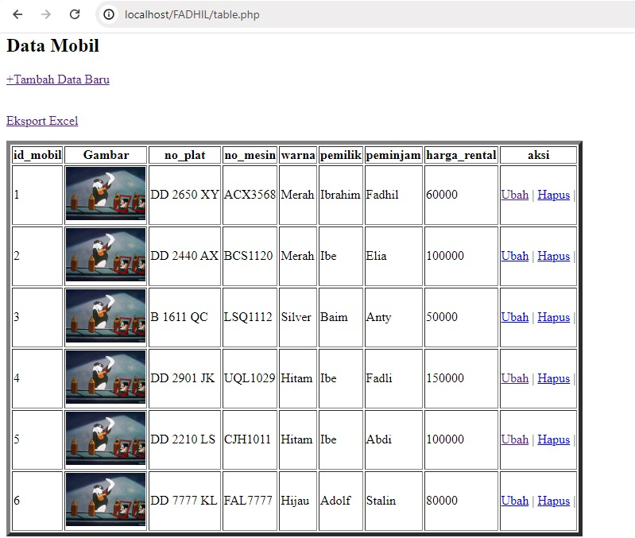