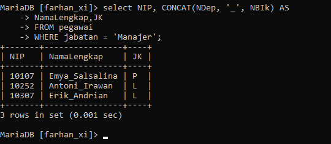
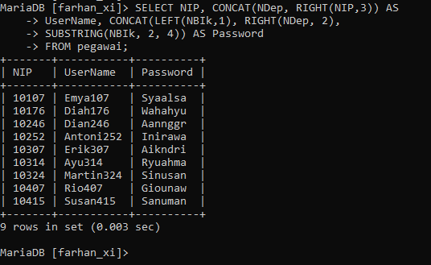

# PRAKTIKUM 6
## 1

### Program
```Mysql
SELECT NIP, CONCAT(NDep, " ", NBik) AS NamaLengkap
    -> FROM pegawai
    -> WHERE Jabatan ='Sales';
```
### Analisis
- `Select`= untuk memilih kolom mana saja yang ingin dipilih untuk ditampilkan/digabung
- `NIP`= Merupakan nama kolom yang dipilih untuk ditampilkan 
- `CONCAT (NDEP,NBLK)`= Menggabungkan beberapa data dalam kolom yang dipilih menjadi satu kolom `(NDEP)`adalah  nama kolom yang dipilih untuk digabungkan datanya `(" ")` Adalah spasi yang diberikan diantara dua kolom yang gabungan yang di pilih.`(data ! Bukan kolom) (NBLK)` adalah nama kolom yang dipilih untuk digabungkan datanya 
- `AS NamaLengkap`= untuk mengganti nama dari kolom hasil `CONCAT(NDEP, " ",NBLK)` menjadi `NamaLengkap` untuk Sementara 
- `FROM pegawai`= untuk memilih dari tabel  mana yang datanya ingin ditampilkan pegawai adalah nama dari tabel yang dipilih
- `WHERE`= Kondisi yang harus dipenuhi oleh suatu data agar bisa ditampilkan
- `(Jabatan = 'Sales')`= kondisi dari where yang harus dipenuhi. Jadi yang barisan data yang Kolom jabatannya berisi Sales, Maka kolom `NIP` dan gabungan kolom : `NDEP` dan `NBLK` akan ditampilkan
- `Hasilnya`= Jadi, kolom yang ingin ditampilkan adalah `NIP dan NDEP, NBLK, NDEP dan NBLK` ingin digabung menggunakan `CONCAT`, Perintah `Concat`Menggabung data tanpa spasi, maka kita harus memasukkan pemisah secara manual yaitu `(" ")` Diantara `NDEP dan NBLK`. Adapun kondisi dari where yaitu hanya barisan data yang kolom jabatannya berisi sales yang bisa ditampilkan kolom NIP dan NDEP, NBLK. Kolom gabungan dari NDEP dan NBLK juga diubah namanya menjadi NamaLengkap, untuk sementara. (" ") Merupakan data yang kita masukkan yaitu spasi, yang bekerja  sebagai pemisah antara NDEP dan NBLK  yang merupakan kolom yang ingin di gabung. 
### Hasil

Tabel Pegawai

# 2

# Analisis
- SELECT = untuk memilih kolom mana saja yang ingin dipilih untuk ditampilkan/didabund.
- NIP = merupakan nama kolom Yang dipilih untuk ditampilkan.
- CONCAT (NDEP,'', NBIF) = menggabungkan beberapa data dalam kolom Yang dipilih menjadi satu data kolom.
  (NDEP) adalah nama kolom Yang dipilih untuk disabunikan datanya.
  ('-') merupakan data biasa Yang dimasukkan. Yaitu Jaris bawah. Aletalkkan diantara NDEP, dan NBIk untuk sebalai pemisah antara kedua kolom Yang ingin digabungkan tersebut.
 (NBIK) adalah nama kolom Yang dipilih untuk disabun ikan datanya. bersama NDEP.
- AS Namalengkap untuk mengganti nama dari kolom hasil CONCAT (NDEP, '`_`' , NBIK) menjadi NamaLengkap untuk sementara.
- JK = merupakan nama kolom yang dipilih untuk ditampilkan.
- From Pegawai untuk memilih dari tabel mana Yang datanya ingin ditampilkan. Pegawai adalah nama dari tabel Yang dipilih.
- WHERE = kondisi yang harus dipenuhi oleh suatu data agar bisa ditampilkan. 
- Jabatan = "Manajer") kondisi dari WHERE Yang harus dipenuhi. jadi barisan data Yang Kolom Jabatan nya berisi Manajer, maka kolom NIP, NDEP, NBIk dan Ik dari barisan data tersebut akan tampil.
- Hasilnya Hampir sama seperti No 1., kecuali Yang berbeda adalah data yang dipilih untuk sebagai pemisah adalah '`_`' Yaitu garis bawah. Dan ada Juga kolom Yang ingin ditampilkan juga adalah JK, Hanya barisan data Yang kolom Jabatan nya berisi Manajer yang kolom JK nya bisa tampil, sesuai dengan Kondisi WHERE. 
 Adapun kondisi Yang berbeda Yaitu kolom Jabatan = Manajer, barisan data Yang mempenuhi data tersebut maka kolom NIP, dan NDep, NBIk dari barisan data tersebut akan tampil...
# 3

# Analisis

- SELECT = untuk memilih kolom mana saja yang ingin dipilih untuk ditampilkan /digabung
- NIP = merupakan nama kolom yang dipilih untuk ditampilkan.
- CONCAT (NDEP, RIGHT (NIP, 3)) = untuk menggabungkan beberapa data dalam kolam Yang dipilih menjadi satu data kolom.
  (NDEP) = merupakan nama kolom Yang dipilih untuk digabungkan.
- RIGHT (NIP, 3) merupakan Perintah untuk memotong data sejumlah 3 karakter dari kanan Pada kolom     NIP. seperti 10107 Jadi yang diambil adalah 107. 
- As username = untuk mengganti nama dari kolom hasil CONCAT (NDep, RIGHT (NIP, 3)) menjadi username untuk sementara.
- CONCAT (LEFT (NBIK, 1), RIGHT (NDep, 2), SUBSTRING (NBIk, 2, 4)) = untuk menggabungkankan beberapa data dalam kolom Yang dipilih menjadi satu kolom data. 
 LEFT (NBIK, 1) = untuk memotong data sejumlah 1 Karakter dari kiri Pada kolom NBIk. Seperti Salsalina Jadi Yang diambil adalah S 
  RIGHT (NDEP, 2) = untuk memotong data sejumlah karakter dari kanan Pada kolom NDep, seperti Emya Jadi Yang diambil adalahYa
 SUBSTRING (NBIK, 2, 4) = untuk memotong data sejumlah 4. karakter Yang dimulai dari karakter ke-2 Yant dihitung dari kiri. seperti salšalina Jadi Yand diambil adalah alsa.
- As Password = untuk mengganti nama dari kolom hasil CONCAT menjadi Password untuk Sementara.
- From pegawai untuk memilih dari tabel mana Yang datanta ingin ditampilkan. pegawai adalah nama tabel yang dipilih.
Hasilnya = Jadi badi kolom "username" dan "Password" mereka memakai Perintah Yang unik seperti LEFT, RIGHT dan SUBSTRING. semisal di UserName Yang ingin digabung NDep dan NIP (tapi 3 karakter dari kanan). NDep nya Emya dan NIP terpotong adalah 107 Jadi digabung Emya 107 dan begitu seterusnya Pada kolom "userName".
Sedangkan di PasswoRD" Kolom NBIK (tapi 1 karakter dari kiri), kolom NDEP (tapi 2 karakter kanan), dan kolom NBIK (tapi 4 karakter setelah 2 karakter dari kiri). Jadi S, Ya, dan alsa Jadi Syaalsa dan besitu seterusnya Pada kolom "Password".
# 4


# Analisis

- CREATE TABLE anika = merupakan Perintah untuk membuat sebuah Tabel dalam databaSe Yang digunakan.
   angka adalah nama tabel Yang Ingin dibuat.
- (Indeks int (10) PRIMARY KEY NOT NULL,) = Indeks adalah nama kolom Yang ingin dibuat dalam tabel Yang Ingin dibuat.
    int(10) = merupakan tipe data dari kolom Indeks yang ditentukan dengan rande Selbanyak 10 karakter. (tipe data untuk bilangan bulat /numerik/angka). 
    PRIMARY KEY = Constraint dari kolom Indeks, merupakan kunci induk dari tabel angka.
    NOT NULL = Constraint kolom Indeks, memberikan Perintah kepada suatu kolom agar datanya tidak boleh kosong.

- (Nilai float(10) NOT NULL) = Nilai adalah nama kojom Yang ingin dibuat dalam tabel Yang ingin dibuat.
    float (10) = merupakan tipe data dari kolom Nilai yang ditentukan dengan range sebanyak 10 Karakter. (untuk bilangan desimal / Pecahan /numerik, angka).
    NOT NULL = constraint kolom Nilai, memberikan Perintah kepada suatu kolom agar datanya tidak boleh kosong.

- Hasilnya = akan membuat tabel bernama angka yang berisi kolom Indeks bertipe data integer dan merupakan kunci induk dari tabel angka, Adapun kolm Nilai Yang bertipe data, float Yang tidak boleh kosong.
# 5


- `SELECT` = untuk memilih kolom mana Sara Yand indin dililih untuk ditampilkan
- `*`=merupakan tanda untuk memilih semya kolom Pada tabel Yang dipilih,
- `From angka`= untuk memilih dari tabel mana Yang datanya ingin ditampilkan.
angka adalah nama tabel Yang dipilih.
Hasilnya= merupakan isi dari tabel angka, Di kolom Indeks terdapat 1, 2,3,4.5,6,3,8
dan pada kolom Nilai terdapat 574, 57.4, 5.74, 0.577,315, 31.5, 3.15, 0.315.
# 6


- `SELECT` = untuk memilih Kolom mana Saja Yang ingin dipilih untuk ditampilkan/dihitung.
- `Indeks` = merupakan nama kolom Yang dipilih untuk ditampilkan.
- `Nilai` = nama kolom Yang ingin ditampilkan,
`CEILING` (Nilai) = untuk membulatkan bilangan Pecahan ke atas. Nilai adalah kolom
Yang dipilih untuk dibulatkan datanya Jadi semisal 57.4 dibulatkan ke atas jadi 58.
- `AS ceilval` = untuk mengganti nama dari kolom hasil CEILING (nilai) menradi ceival untuk sementara,
- `FlooR (Nilai)` =untuk membulatkan kolom Yang dipilih bilangan desimal ke bawah nilai adalah kolom Yang dililih untuk dibulatkan datanya Jadi semisal 57.4 dibulatkan ke bawah Jadi 57.
- `As Fival`= untuk mengganti nama, dari, kolom hasil Floor (Nibi) menjodi Flval sementara.
`ROUND (Nilai, 2)` = membulatkan bilangan dari kolom Nilai Sampai Jumlah digit tertentu
Sesuai dengan Pilihan yang dibuat Yaitu 2.semisal 574 dibulatkan 2 kali jadi 574.00.
- `As Rnd2val` = untuk mengganti nama dari kolom hasil `ROUND (Nilai, 2)` menjadi `Rnd2val`
untuk sementara.
-  `ROUND (nilai, 0)` = untuk membulatkan bilangan dari kolom nilai sampai jumlah tertentu Yaitu 0. Semisal 574 dibulatkan 0 kali jadi 574 karena o kali berarti tidak dibulatkan.
-  `AS Rndoval` = untuk mengganti nama dari kolom hasil `ROUND (Nilai,0)` menjadi `Rndoval` untuk sementara.
- `ROUND (Nilai,-1)` = untuk membulatkan bilangan dari kolom nilai sampai Jumlah tertentu Yaitu -1. semisal 574 jika dibawah 5 maka Jadi 570 Jika diatasnya Jadi 580.
- `As Rnd-1val` = untuk mengganti nama dari kolom hasil `ROUND (Nilai, -1)` menjadi Rnd-1val. untuk sementara.
- `FROM angka` = untuk memilih dari tabel mana yang datanya ingin ditampilkan angka adalah nama tabel Yang dipilih.
- `Hasilnya` = merupakan hasil bulatan berbagai nilai memakai `ceiling`, `fror` dan `ROUND`.