# Soal 1
## Query
```mysql
CREATE DATABASE sekolah_fadil

USE sekolah_fadil

 create table tabel_guru (
    -> id_guru int(10) primary key,
    ->  nama_depan varchar(25) not null,
    -> nama_belakang varchar(25) not null,
    -> mapel varchar(25) not null,
    -> jabatan varchar(50) not null,
    -> usia int(10) not null,
    -> tanggal_lahir date not null);
```
## Analisis 
**Q 1**
- `Create`:  digunakan untuk membuat objek baru dalam basis data, seperti tabel, database, atau indeks.
- `database`: sebuah data base yang ingin kita buat. 
- `sekolah_fadil`: nama database yang telah di buat. 
- `;`: menandakan akhir dari perintah yang diberikan.
**Kesimpulan**:
`create database sekolah_fadil;` digunakan untuk membuat sebuah database baru dengan sebuah nama `"sekolah_fadil"`Dan diakhiri tanda titik koma. 
**Q2**
- `USE`: Perintah yang digunakan untuk memilih atau beralih ke sebuah database tertentu.
- `sekolah_fadil` : adalah nama database yang ingin kita gunakan atau aktifkan. 
- `;`: menandakan akhir dari perintah yang diberikan. 
**Kesimpulan**:
`USE sekolah_fadil;` digunakan untuk memilih atau beralih ke database yang bernama `sekolah_fadil` dan diakhiri tanda titik koma. 
**Q3**
- `CREATE TABLE tabel_guru (` :Digunakan untuk membuat tabel baru dalam database.`tabel_guru` Nama dari tabel baru yang  dibuat.
- `id_guru int(10) primary key`:Membuat kolom id_guru dengan tipe data integer, panjang maksimum 10 digit, dan menetapkannya sebagai kunci utama (primary key) tabel. 
- `nama_depan varchar(25) not null`:Membuat kolom nama_depan dengan tipe data karakter, panjang maksimum 25 karakter, dan menetapkan bahwa kolom ini tidak boleh kosong (not null).
- `nama_belakang varchar(25) not null`:Membuat kolom nama_belakang dengan tipe data karakter, panjang maksimum 25 karakter, dan menetapkan bahwa kolom ini tidak boleh kosong (not null).
- `mapel varchar(25) not null`: Membuat kolom mapel dengan tipe data karakter, panjang maksimum 25 karakter, dan menetapkan bahwa kolom ini tidak boleh kosong (not null).
- `jabatan varchar(50) not null`: Membuat kolom jabatan dengan tipe data karakter, panjang maksimum 50 karakter, dan menetapkan bahwa kolom ini tidak boleh kosong (not null).
- `usia int(10) not null`:Membuat kolom usia dengan tipe data integer, panjang maksimum 10 digit, dan menetapkan bahwa kolom ini tidak boleh kosong (not null).
- `tanggal_lahir date not null`:Membuat kolom tanggal_lahir dengan tipe data tanggal dan menetapkan bahwa kolom ini tidak boleh kosong (not null).
- `);`: Menandakan akhir dari definisi tabel.
**Kesimpulan**
Perintah `CREATE TABLE tabel_guru (id_guru int(10) primary key, nama_depan varchar(25) not null, nama_belakang varchar(25) not null, mapel varchar(25) not null, jabatan varchar(50) not null, usia int(10) not null, tanggal_lahir date not null);` digunakan untuk membuat sebuah tabel baru dengan nama "tabel_guru" dalam database yang aktif. Tabel ini memiliki beberapa kolom dengan tipe data yang telah ditentukan dan aturan seperti kunci utama (primary key) dan tidak boleh kosong (not null), dan diakhiri dengan tanda titik koma.
## Hasil 
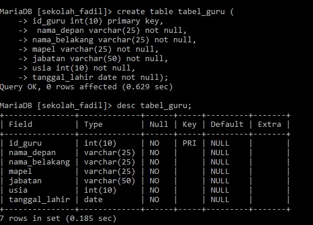
# Soal 2
## Query
```mysql
INSERT INTO tabel_guru values
    -> (1,"Adrianty",NULL,"Pemrograman Web","Ketua Jurusan",34,1982-06-29),
    -> (2,"Ibrahim","Mallombasang","Basis Data","Kepala Sekolah",21,2000-09-21),
    -> (3,"Muhammad","Yusuf","Pemodelan Perangkat Lunak",NULL,28,1992-12-24),
    -> (4,"Rusdyansyar",NULL,"Pemrograman Berorientasi Objek","Asisten Kepala Sekolah",25,1996-01-21);
```
## Analisis
- `INSERT INTO`: Digunakan untuk menambahkan baris baru ke dalam tabel.
- `tabel_guru`: Nama tabel yang akan ditambahkan datanya.
- `VALUES`: Kata kunci yang digunakan untuk menentukan nilai-nilai yang akan dimasukkan ke dalam tabel.
- Baris 1: `(1, "Adrianty", NULL, "Pemrograman Web", "Ketua Jurusan", 34, '1982-06-29')`**:
- Nilai-nilai yang akan dimasukkan ke dalam baris pertama tabel `tabel_guru`:
    - `id_guru`: 1 ​`nama_depan`: "Adrianty" ​`nama_belakang`: NULL (kosong) `mapel`: "Pemrograman Web"`jabatan`: "Ketua Jurusan"`usia`: 34`tanggal_lahir`: '1982-06-29' (dalam format string)
- Baris 2: (2, "Ibrahim", "Mallombasang", "Basis Data", "Kepala Sekolah", 21, '2000-09-21'):
- Nilai-nilai yang akan dimasukkan ke dalam baris kedua  tabel tabel_guru:`id_guru`: 2`nama_depan`: "Ibrahim" `nama_belakang`: "Mallombasang"`mapel`: "Basis Data"
`jabatan`: "Kepala Sekolah"`usia`: 21`tanggal_lahir`: '2000-09-21'
- Baris 3: (3, "Muhammad", "Yusuf", "Pemodelan Perangkat Lunak", NULL, 28, '1992-12-24'):
- Nilai-nilai yang akan dimasukkan ke dalam baris ketiga tabel tabel_guru:`id_guru`: 3`nama_depan`: "Muhammad" `nama_belakang`: "Yusuf"`mapel`: "Pemodelan Perangkat Lunak" jabatan: NULL (kosong)`usia`: 28`tanggal_lahir`: '1992-12-24'
- Baris 4: (4, "Rusdyansyar", NULL, "Pemrograman Berorientasi Objek", "Asisten Kepala Sekolah", 25, '1996-01-21'):
- Nilai-nilai yang akan dimasukkan ke dalam baris keempat tabel tabel_guru:`id_guru`: 4`nama_depan`: "Rusdyansyar"
`nama_belakang`: NULL (kosong)`mapel`: "Pemrograman Berorientasi Objek"`jabatan`: "Asisten Kepala Sekolah"
`usia`: 25`tanggal_lahir`: '1996-01-21'
**Kesimpulan**
`INSERT INTO tabel_guru values(1,"Adrianty",NULL,"Pemrograman Web","Ketua Jurusan",34,1982-06-29),(2,"Ibrahim","Mallombasang","Basis Data","Kepala Sekolah",21,2000-09-21),(3,"Muhammad","Yusuf","Pemodelan Perangkat Lunak",NULL,28,1992-12-24),(4,"Rusdyansyar",NULL,"Pemrograman Berorientasi Objek","Asisten Kepala Sekolah",25,1996-01-21);` digunakan untuk memasukkan data ke dalam tabel tabel_guru. Setiap baris data diwakili oleh satu set nilai yang dipisahkan oleh koma, dan setiap nilai sesuai dengan kolom dalam tabel dalam urutan yang sama. Jika nilai NULL dimasukkan, itu menunjukkan bahwa tidak ada nilai yang tersedia untuk kolom tersebut.
## Hasil 
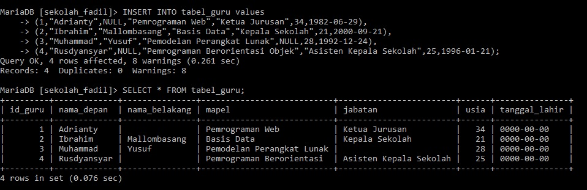

# Soal 3
## Query 
```mysql
INSERT INTO  tabel_guru VALUES
    -> (5,"Muhammad","Fadhil","Sejarah Indonesia","Siswa",17,2006-10-31);
```
## Analisis
- `INSERT INTO tabel_guru`: adalah perintah untuk memasukkan baris baru ke dalam tabel dengan nama "tabel_guru". 
- `VALUES`: menandakan bahwa nilai-nilai yang akan dimasukkan ke dalam tabel sedang diidentifikasi.
- `(5, "Muhammad", "Fadhil", "Sejarah Indonesia", "Siswa", 17, 2006-10-31)`: Ini adalah nilai-nilai yang akan dimasukkan ke dalam tabel. Setiap nilai ini sesuai dengan kolom tabel secara berurutan.
**Kesimpulan**
Perintah `INSERT INTO` digunakan untuk memasukkan baris baru ke dalam tabel database. Nilai-nilai yang dimasukkan harus sesuai dengan urutan kolom dalam tabel tersebut.dan `(5,"Muhammad","Fadhil","Sejarah Indonesia","Siswa",17,2006-10-31);` Nilai yang akan di masukkan ke tabel_guru
## Hasil 
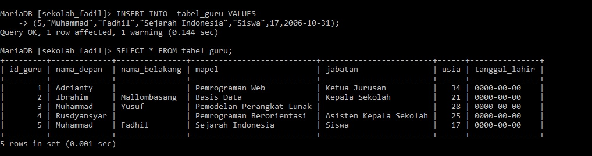

# Soal 4
## Query 
```mysql
SELECT * FROM tabel_guru;
```
## Analisis
- `SELECT *`: adalah perintah untuk memilih semua kolom dari tabel.
- `FROM tabel_guru`:  menunjukkan tabel yang akan diambil datanya, dalam hal ini, tabelnya adalah "tabel_guru".
**Kesimpulan**
Perintah `"SELECT * FROM tabel_guru;"` akan mengambil semua data dari tabel "tabel_guru".


## Hasil 
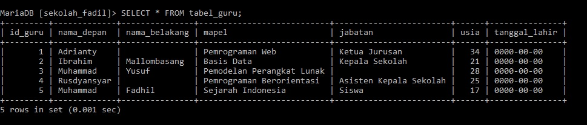
# Soal 5

## Query
```mysql
SELECT * FROM tabel_guru WHERE id_guru = 4;
```
## Analisis
- `SELECT *`: adalah perintah untuk memilih semua kolom dari tabel.
- `FROM tabel_guru`:  menunjukkan tabel yang akan diambil datanya, dalam hal ini, tabelnya adalah "tabel_guru".
- `WHERE id_guru = 4`: adalah kondisi yang ditentukan untuk memfilter baris. Bagian ini menunjukkan bahwa kita hanya ingin memilih baris di mana nilai kolom `id_guru` sama dengan 4.
**Kesimpulan**
`SELECT * FROM tabel_guru WHERE id_guru = 4;` akan mengambil semua kolom dari tabel "tabel_guru" hanya untuk baris di mana nilai kolom id_guru adalah 4.
## Hasil 
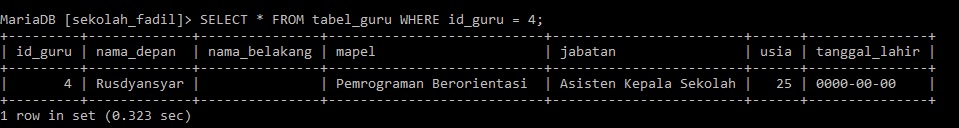
# Soal 6
## Query
```mysql
UPDATE tabel_guru SET nama_belakang = "Ganteng" WHERE id_guru = 2 ;
```
## Analisis
- `UPDATE tabel_guru`: adalah perintah untuk memperbarui data dalam tabel dengan nama "tabel_guru".
- `SET nama_belakang = "Ganteng"`: menentukan kolom yang akan diperbarui dan nilai baru yang akan diatur. Dalam hal ini, kolom `nama_belakang` akan diperbarui menjadi "Ganteng". 
- `WHERE id_guru = 2`: adalah kondisi yang menentukan baris mana yang akan diperbarui. Hanya baris dengan `id_guru` sama dengan 2 yang akan diperbarui.
**Kesimpulan**
`UPDATE tabel_guru SET nama_belakang = "Ganteng" WHERE id_guru = 2;`akan memperbarui kolom nama_belakang menjadi "Ganteng" hanya untuk baris di mana id_guru adalah 2.
## Hasil 
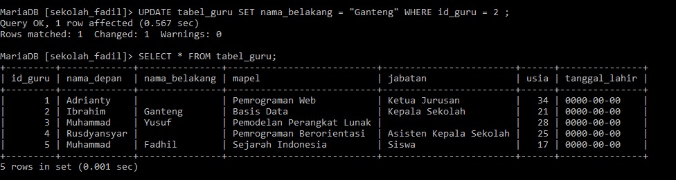
# Soal 7
## Query
```mysql
DELETE FROM tabel_guru WHERE id_guru = 5;
```
## Analisis
- `DELETE FROM tabel_guru`: adalah perintah untuk menghapus data dari tabel dengan nama "tabel_guru".
- `WHERE id_guru = 5`: adalah kondisi yang menentukan baris mana yang akan dihapus. Hanya baris dengan `id_guru` sama dengan 5 yang akan dihapus.
**Kesimpulan**
`DELETE FROM tabel_guru WHERE id_guru = 5;` akan menghapus baris dari tabel "tabel_guru" di mana nilai kolom id_guru adalah 5.
## Hasil
**Sebelum**

**Sesudah**
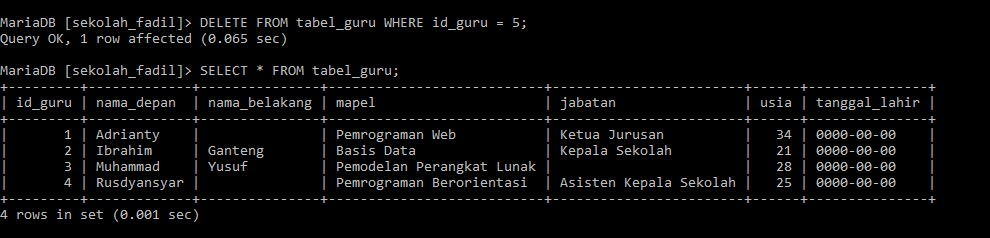
# Soal 8
## Query 
```mysql
SELECT * FROM tabel_guru
    -> WHERE mapel LIKE "Pem%" AND usia < 30
    -> ORDER BY usia ASC;
```
## Analisis
- `SELECT *`: adalah perintah untuk memilih semua kolom dari tabel.
- `FROM tabel_guru`: menunjukkan tabel yang akan diambil datanya, dalam hal ini, tabelnya adalah "tabel_guru".
- `WHERE mapel LIKE "Pem%" AND usia < 30`: adalah kondisi yang harus dipenuhi oleh baris yang dipilih. Kondisi ini terdiri dari dua bagian:
- `mapel LIKE "Pem%"`: memfilter baris di mana nilai kolom `mapel` dimulai dengan "Pem". `%` adalah wildcard yang mencocokkan nol atau lebih karakter apa pun setelah "Pem".
 - `usia < 30`: memfilter baris di mana nilai kolom `usia` kurang dari 30.
- `ORDER BY usia ASC`: menentukan bagaimana hasil yang dipilih harus diurutkan. `ORDER BY usia` akan mengurutkan hasil berdasarkan kolom `usia`, dan `ASC` (ascending) berarti urutan dari yang terkecil ke yang terbesar.
**Kesimpulan**
`SELECT * FROM tabel_guru WHERE mapel LIKE "Pem%" AND usia < 30 ORDER BY usia ASC;` akan mengambil semua kolom dari tabel "tabel_guru" untuk baris di mana nilai kolom `mapel` dimulai dengan "Pem" dan nilai kolom `usia` kurang dari 30. Hasilnya kemudian akan diurutkan berdasarkan kolom `usia` dari yang terkecil ke yang terbesar.
## Hasil
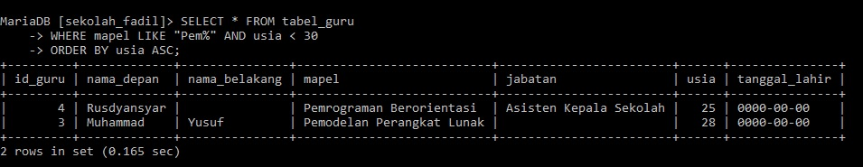
# Soal 9
## Query
```mysql
SELECT id_guru,nama_depan FROM tabel_guru WHERE nama_depan LIKE "%i%";
```
## Analisis
- `SELECT id_guru, nama_depan`: adalah perintah untuk memilih kolom tertentu dari tabel. Dalam hal ini, hanya kolom `id_guru` dan `nama_depan` yang akan dipilih.
- `FROM tabel_guru`: menunjukkan tabel yang akan diambil datanya, dalam hal ini, tabelnya adalah "tabel_guru".
- `WHERE nama_depan LIKE "%i%"`: adalah kondisi yang harus dipenuhi oleh baris yang dipilih.
 - `nama_depan LIKE "%i%"`: memfilter baris di mana nilai kolom nama_depan mengandung huruf "i". % adalah wildcard yang mencocokkan nol atau lebih karakter sebelum dan sesudah "i".
 **Kesimpulan**
  `SELECT id_guru, nama_depan FROM tabel_guru WHERE nama_depan LIKE "%i%";` akan mengambil kolom id_guru dan nama_depan dari tabel "tabel_guru" untuk baris di mana nilai kolom nama_depan mengandung huruf "i".
## Hasil
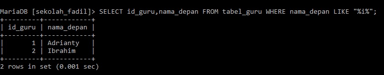
# Soal 10
## Query 
```mysql
SELECT CONCAT_WS (" ",nama_depan,nama_belakang) AS nama_lengkap FROM tabel_guru;
```
## Analisis
- `SELECT`: adalah perintah untuk memilih data dari tabel.  
- `CONCAT_WS(" ", nama_depan, nama_belakang)`: adalah fungsi yang digunakan untuk menggabungkan beberapa string menjadi satu, dengan delimiter tertentu.
- `CONCAT_WS`: Singkatan dari "Concatenate With Separator", menggabungkan nilai-nilai kolom dengan separator yang ditentukan.
- `" "`: adalah separator yang akan digunakan untuk menggabungkan nilai-nilai. Dalam hal ini, separatornya adalah spasi.
- ​`nama_depan`:  adalah kolom pertama yang akan digabungkan.
- `nama_belakang`: adalah kolom kedua yang akan digabungkan.
- `AS nama_lengkap`: adalah alias yang memberikan nama sementara untuk kolom yang dihasilkan. Dalam hal ini, hasil penggabungan akan diberi nama nama_lengkap.
- `FROM tabel_guru`: menunjukkan tabel yang akan diambil datanya, dalam hal ini, tabelnya adalah "tabel_guru".
**Kesimpulan**
 `SELECT CONCAT_WS(" ", nama_depan, nama_belakang) AS nama_lengkap FROM tabel_guru;`akan mengambil data dari tabel "tabel_guru", menggabungkan kolom nama_depan dan nama_belakang dengan spasi di antara mereka, dan hasilnya akan diberi alias nama_lengkap. 


## Hasil
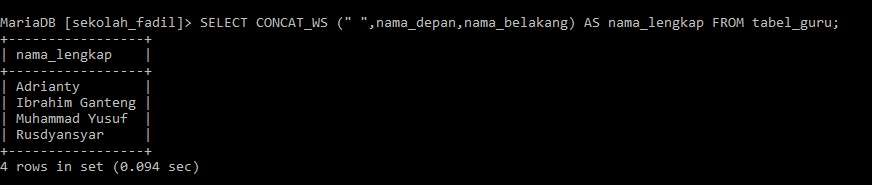
# Soal 11
## Query
```mysql
ALTER TABLE tabel_guru ADD COLUMN status ENUM("PNS","PPPK","Honorer") NOT NULL;

INSERT INTO tabel_guru Values
    -> (5,"Muhammad","Fadhil","Sejarah Indonesia","Dosen",24,2004-04-24,"Honorer");
```
## Analisis
- `ALTER TABLE tabel_guru`: adalah perintah untuk mengubah struktur tabel yang bernama "tabel_guru". 
- `ADD COLUMN`: menunjukkan bahwa kita akan menambahkan kolom baru ke tabel.
- `status ENUM("PNS", "PPPK", "Honorer")`: mendefinisikan kolom baru yang akan ditambahkan.
- `status`: Nama kolom baru yang akan ditambahkan.
- `ENUM("PNS", "PPPK", "Honorer")`: Tipe data kolom baru adalah ENUM, yang berarti kolom ini hanya dapat berisi salah satu dari nilai yang ditentukan: "PNS", "PPPK", atau "Honorer".
- `NOT NULL`: menunjukkan bahwa kolom baru tidak boleh berisi nilai NULL, sehingga setiap baris harus memiliki salah satu nilai yang diizinkan oleh ENUM.
- `INSERT INTO tabel_guru`: adalah perintah untuk memasukkan baris baru ke dalam tabel yang bernama "tabel_guru".
- `VALUES`: menandakan bahwa nilai-nilai yang akan dimasukkan ke dalam tabel sedang diidentifikasi.
- `(5, "Muhammad", "Fadhil", "Sejarah Indonesia", "Dosen", 24, 2004-04-24, "Honorer")`: adalah nilai-nilai yang akan dimasukkan ke dalam tabel. Setiap nilai ini sesuai dengan kolom tabel secara berurutan.
**Kesimpulan**
`ALTER TABLE`: Mengubah tabel "tabel_guru" dengan menambahkan kolom baru bernama status yang hanya dapat berisi salah satu dari tiga nilai: "PNS", "PPPK", atau "Honorer". Kolom ini tidak boleh kosong (NULL).
`INSERT INTO`: Menambahkan baris baru ke tabel "tabel_guru" dengan nilai-nilai yang sesuai dengan kolom-kolom tabel tersebut, termasuk nilai baru untuk kolom status.
## Hasil 
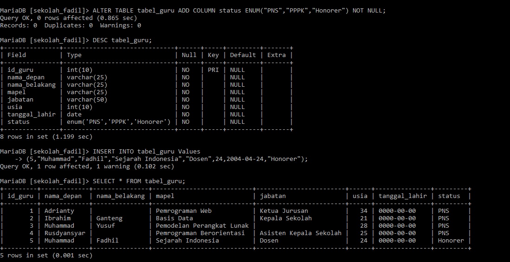
# Soal 12
## Query
```mysql
SELECT nama_depan, MAX(usia) AS usia  FROM tabel_guru;
```
## Analisis
- `SELECT`: adalah perintah untuk memilih data dari tabel.
- `nama_depan`: menunjukkan bahwa kita ingin memilih kolom `nama_depan`.
- `MAX(usia)`: adalah fungsi agregat yang digunakan untuk mendapatkan nilai maksimum dari kolom `usia`.
- `AS usia`: adalah alias yang memberikan nama sementara untuk hasil dari `MAX(usia)`. Hasilnya akan diberi nama `usia`.
- `FROM`: menunjukkan tabel yang akan diambil datanya.
- `tabel_guru`: adalah nama tabel yang datanya akan diambil.
**Kesimpulan**
`SELECT nama_depan, MAX(usia) AS usia FROM tabel_guru;`berusaha untuk mengambil dua kolom dari tabel "tabel_guru":`Kolom nama_depan` dari setiap baris.
`Nilai maksimum`dari kolom usia di seluruh tabel, dengan hasilnya diberi alias usia.
## Hasil 
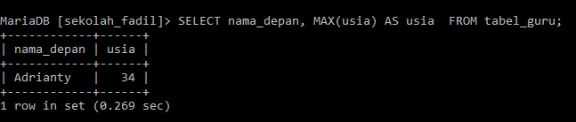
