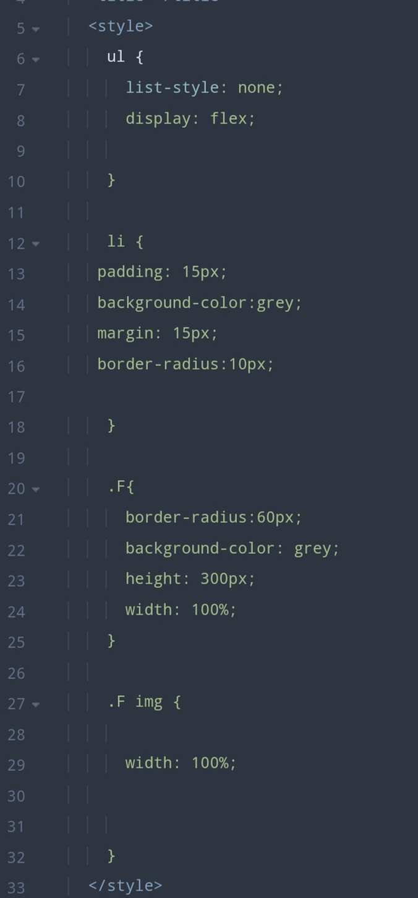

# Anatomi CSS
## Penjelasan
- `Selector`: Apa yang ingin di modifikasi
- `Property`: Bagian apa yang ingin dimodifikasi
- `Property value`: bentuk modifikasinya seperti apa
Contoh diatas, yang ingin di modifikasi adalah seluruh tag `<p>` pada komponen warna teksnya menjadi warna merah. 
- `p` merupakan selector yang dimana selector adalah sebuah penanda yang digunakan untuk memberikan tanda terhadap tag html yang ingin di modifikasi
- `color` merupakan property yang di mana property digunakan untuk menambahkan atau mengatur ukuran teks, jenis font, warna teks, warna background, dan sebagainya
- `red` adalah nilai dari property
**Kode**
```CSS

    p {
      color : red ; 
    }
```
**Hasil**

**Penjelasan**
- `Selector`: Apa yang ingin di modifikasi
- `Property`: Bagian apa yang ingin dimodifikasi
- `Property value`: bentuk modifikasinya seperti apa
Contoh diatas, yang ingin di modifikasi adalah seluruh tag `<p>` pada komponen warna teksnya menjadi warna merah. 
Contoh lain, yang ingin dimodifikasi adalah seluruh jendela pada komponen kusennya menjadi terbuka. 
**Hasil**


# Percobaan Pertama
## Penjelasan
- `<!DOCTYPE html>`: Mendefinisikan jenis dokumen HTML yang digunakan, dalam hal ini HTML5.
- `<html>`: Elemen utama yang memuat seluruh konten dokumen.
-  `<head>`: Bagian yang berisi informasi tambahan tentang dokumen, seperti judul dan link ke stylesheet eksternal.
- `<title>`: Menentukan judul halaman web yang akan ditampilkan di tab browser.
- `<style>`: Bagian di mana Anda dapat menambahkan aturan CSS untuk mengubah tampilan elemen HTML di halaman.
- `p { color: red; }`: Aturan CSS yang mengubah warna teks pada semua elemen `<p>` menjadi merah.
- `<body>`: Bagian yang berisi konten aktual halaman web, seperti teks, gambar, atau elemen lainnya.
- `<p>Welcome CSS</p>`: Elemen paragraf dengan teks "Welcome CSS", yang akan ditampilkan dengan warna merah karena aturan CSS yang telah ditentukan sebelumnya.
**Kode**
```HTMl
<!Doctype html>
<html>
  <head>
    <style> 
    p {
      color : red ; 
    }
    </style>
   </head>
   <body>
    <p> WELCOME CSS </p>
    <p> WELCOME CSS </p>
     </body>
</html>

```
### Hasil

#  Percobaan Kedua
## Kode CSS
```CSS
button{
Width:150px;
Height:50px;
Color: white;
text-align: right ;
margin-top :50px;
}
```
## Color
### Before

### After 

Color adalah memberikan warna kepada tulisan yang dimana sebelum di kasih color atau warna tulisan nya berwarna hitam. setelah dikasih color atau warna tulisan klik aku berwarna putih
## TEXT-ALIGN

### Before

### After 


Text-align adalah memberikan perataan kepada teks dimana saat kita menggunakan text-align = right  membuat posisi teks lebih ke samping kanan. 
## margin-top 
### Before

### After


Margin top digunakan untuk menentukan jarak antara batas atas suatu elemen dengan elemen di atasnya.

# Pemanggilan CSS
### Inline 
**Penjelasan**
- `color: red;`: Properti ini mengatur warna teks menjadi merah.
- `border-color: red;: Properti ini mengatur warna border menjadi merah.
- `font-weight: bold;`: Properti ini membuat teks menjadi tebal (bold).
- `padding-left: 10px;`: Properti ini menambahkan jarak (padding) sebesar 10 piksel di sebelah kiri teks.
- `padding-right: 10px;`: Properti ini menambahkan jarak (padding) sebesar 10 piksel di sebelah kanan teks.
```CSS
.F {
  color : red;
  border-color : red ;
  font-weight: bold ;
  padding-left:10px;
  padding-right:10px;

}

```
**Hasil**

### Kesimpulan
`class .F` akan membuat teks menjadi tebal dan berwarna merah, dengan border dan padding sebesar 10 piksel di sebelah kiri dan kanan teks.
### Internal
**Penjelasan**
Property yang kita atur untuk mengubah padding, margin, color, backgrounddan lain lain tidak perlu bikin file baru css cukup bisa di satukan di file html yang diketik dibawah title dengan ketik `<style>`.

```CSS
 <style>
      ul {
        list-style: none;
        display: flex;
        
      }
      
      li {
     padding: 15px;
     background-color:grey;
     margin: 15px;
     border-radius:10px;

      }
      
      .F{
        border-radius:60px;
        background-color: grey;
        height: 300px;
        width: 100%;
      }
      
      .F img {
      width: 100%;  
      }

```
**Hasil**

### Kesimpulan
Property yang kita atur untuk mengubah padding, margin, color, backgrounddan lain lain tidak perlu bikin file baru css cukup bisa di satukan di file html yang diketik dibawah title dengan ketik `<style>`.
### External
**Penjelasan**
`<link rel="stylesheet" href="Style.CSS">`: Menautkan dokumen HTML dengan file CSS eksternal bernama "Style.CSS", sehingga dokumen HTML dapat menerapkan gaya yang didefinisikan dalam file CSS tersebut.
**Code**
```HTML
<!DOCTYPE html>
<html>
<head>
    <title>Belajar CSS3</title>
    <link rel="stylesheet" href="Position.css">
</head>
<body>
</body>
</html>


```
**Hasil**

### Kesimpulan
`<link rel="stylesheet" href="Style.CSS">`: Menautkan dokumen HTML dengan file CSS eksternal bernama "Style.CSS", sehingga dokumen HTML dapat menerapkan gaya yang didefinisikan dalam file CSS tersebut.
# Selektor CSS
### Elemen Selector 
**Penjelasan**
`h1`: Ini adalah elemen selector yang menargetkan semua elemen `<h1>` dalam dokumen HTML untuk menerapkan aturan gaya tertentu, seperti warna teks biru dan margin atas sebesar 10000 piksel.
**Code**
```css 
<h1>Halo RPL 1</h1>
h1 {
  color: blue;
  margin-top: 10000px;
}


```
**Hasil**

Memberikan H 1 pada teks Halo RPL 1 dan memberikan warna biru pada teks dan memberikan jarak pada elemen atas sebesar 10000px.
### Class Selector
**Penjelasan**
- `<!DOCTYPE html>`: Mendefinisikan tipe dokumen sebagai HTML versi 5. 
- `<html>`: Menandakan awal dan akhir dari dokumen HTML.
- `<head>`: Berisi informasi tambahan tentang dokumen HTML, seperti judul dan tautan ke file CSS.    
- `<title>CSS</title>`: Menentukan judul dokumen yang akan ditampilkan di tab browser.
- `<link rel="stylesheet" href="Style.CSS">`: Menautkan dokumen HTML dengan file CSS eksternal bernama "Style.CSS", sehingga dokumen HTML dapat menerapkan gaya yang didefinisikan dalam file CSS tersebut.
- `<body>`: Berisi konten yang akan ditampilkan kepada pengguna.  
- `<p class="biru"> ini warna biru </p>`: Elemen ini hanya memiliki satu kelas CSS, yaitu "biru". Oleh karena itu, elemen tersebut akan menerapkan gaya yang telah ditentukan untuk kelas "biru" dalam file CSS atau dalam bagian gaya internal/inline yang berkaitan dengan kelas tersebut. Dan memberikan warna biru. 

**Code**
```HTML
 <!DOCTYPE html>
 <html>
  <head>
    <title>CSS</title>
    <link rel="stylesheet" href="Style.CSS">
    
  </head>
  <body>
    
    
    <p class="biru" >ini warna biru </p>
    
     </body>
  
</html>


```
**Hasil**
 
### Kesimpulan
Memeberikan warna biru pada teks ini warna biru menggunakan elemen `class`. 

### ID Selector
**Penjelasan**
- `<!DOCTYPE html>`: Mendefinisikan tipe dokumen sebagai HTML versi 5. 
- `<html>`: Menandakan awal dan akhir dari dokumen HTML.
- `<head>`: Berisi informasi tambahan tentang dokumen HTML, seperti judul dan tautan ke file CSS.    
- `<title>CSS</title>`: Menentukan judul dokumen yang akan ditampilkan di tab browser.
- `<link rel="stylesheet" href="Style.CSS">`: Menautkan dokumen HTML dengan file CSS eksternal bernama "Style.CSS", sehingga dokumen HTML dapat menerapkan gaya yang didefinisikan dalam file CSS tersebut.
- `<body>`: Berisi konten yang akan ditampilkan kepada pengguna.  
- Elemen `<p id="hijau"> ini warna hijau </p>` memiliki atribut `id` yang menentukan identitas uniknya dalam dokumen HTML. Dengan demikian, fungsi dari atribut `id` ini adalah untuk memberikan cara yang unik untuk merujuk atau menargetkan elemen tersebut dalam CSS. Dan memberikan warna hijau pada teks. 
**Code**
```HTML
<!DOCTYPE html>
<html>
  <head>
    <title>CSS</title>
    
    <link rel="stylesheet" href="Style.CSS">
    
  </head>
  <body>
    <p id="hijau" > ini warna hijau </p>
  </body>
  
</html>

```
**Hasil**

### Kesimpulan
Memeberikan warna hijau pada teks ini warna hijau menggunakan elemen `id`. 
# TEXT 

## Text align Left 
`text-align` dengan nilai `left` digunakan untuk mengatur teks agar tersusun sejajar dengan sisi kiri dari elemen tempat teks tersebut berada.
## Text align Right
`text-align` dengan nilai `right` digunakan untuk mengatur teks agar tersusun sejajar dengan sisi kanan dari elemen tempat teks tersebut berada. 
## Text justify
`text-align` dengan nilai `justify` digunakan untuk mengatur teks agar terlihat rata di kedua sisi (baik kiri maupun kanan) dari elemen tempat teks tersebut berada.
### Penjelasan
`text-align` dengan nilai `center` digunakan untuk mengatur teks agar terletak di tengah dari elemen tempat teks tersebut berada.berarti teks akan diatur agar berada di tengah secara horizontal dalam elemen tersebut, dengan ruang yang sama di sisi kiri dan kanan.
### Kode
```CSS
 <p> selamat datang</p>
 p{
  text-align : center ;
  }
```
### Hasil
**Before**

**After**

### Kesimpulan
Selamat datang" yang terdapat dalam elemen `<p>` akan diatur menjadi rata tengah secara horizontal di dalam elemen tersebut, karena properti CSS text-align: center; diterapkan pada elemen `<p>`. 

## TEXT decoration
### None
`text-decoration: none`; digunakan untuk menghilangkan dekorasi teks, seperti garis bawah atau garis tengah. Ini berarti teks yang terdapat di dalam elemen tersebut tidak akan memiliki dekorasi tambahan seperti garis bawah, garis tengah, atau gaya lain yang biasanya ditampilkan secara default oleh browser.
### Overline
`Text-decoration: overline;`adalah properti CSS yang digunakan untuk menambahkan garis di atas teks. Ketika properti ini diterapkan pada sebuah elemen teks, teks tersebut akan memiliki garis di atasnya.
### Line-throught
`Text-decoration: line-through`; adalah properti CSS yang digunakan untuk menambahkan garis tengah di tengah teks. Ketika properti ini diterapkan pada sebuah elemen teks, teks tersebut akan memiliki garis yang melintasi di tengahnya.

### Penjelasan
`Text-decoration: underline`; adalah properti CSS yang digunakan untuk menambahkan garis di bawah teks. Ketika properti ini diterapkan pada sebuah elemen teks, teks tersebut akan memiliki garis di bawahnya.
### Code
```CSS
text-decoration : underline;
```

### Hasil
**Before**

**After**

### Kesimpulan
Selamat datang" Dan Terima kasih yang terdapat dalam elemen `<p>` akan membuat tulisan mempunyai garis bawah di teks. karena properti CSS text-decoration : underline ; diterapkan pada elemen `<p>`. 

## Text-Transform
## Text-transform lowercase
`Text-transform: lowercase;` adalah properti CSS yang digunakan untuk mengubah teks menjadi huruf kecil (huruf kecil). Ketika properti ini diterapkan pada sebuah elemen teks, semua karakter huruf dalam teks tersebut akan diubah menjadi huruf kecil.
## text-transform capitalize
`Text-transform: capitalize`; adalah properti CSS yang digunakan untuk mengubah teks agar setiap kata dalam teks tersebut dimulai dengan huruf kapital. Ketika properti ini diterapkan pada sebuah elemen teks, huruf pertama dari setiap kata dalam teks tersebut akan diubah menjadi huruf kapital, sedangkan huruf lainnya akan tetap dalam format huruf kecil.
## text-transform none
`Text-transform: none;`adalah properti CSS yang mengembalikan teks ke format aslinya tanpa transformasi apapun. Ini berarti teks akan ditampilkan sesuai dengan format yang sudah ditulis dalam elemen HTML tanpa adanya perubahan pada huruf besar atau huruf kecilnya.

### Penjelasan
`Text-transform: uppercase;` adalah properti CSS yang digunakan untuk mengubah teks menjadi huruf besar (kapital). Ketika properti ini diterapkan pada sebuah elemen teks, semua karakter huruf dalam teks tersebut akan diubah menjadi huruf kapital.
### Kode
```CSS
p{
  
  text-transform : uppercase ;
  
 }
```

### Hasil
**Before**

**After**

### Kesimpulan
teks yang ada di dalam elemen `<p>` akan diubah menjadi huruf kapital semua. Dengan menerapkan properti `text-transform: uppercase;`, semua huruf dalam teks tersebut akan diubah menjadi huruf besar (uppercase).

## Text-indent
`Text-indent` adalah properti CSS yang digunakan untuk mengatur jarak atau indentasi awal dari paragraf atau teks di dalam sebuah elemen
###  Kode 
```CSS
.halaman-1{
       Text-indent:​100 px ;
       }
```
**Before**
 

**After**

### Kesimpulan
`text-indent: 100px;`, Anda memberikan indentasi sebesar 100 piksel dari kiri pada setiap baris teks yang menggunakan class tersebut.
## Letter Spacing
Letter spacing adalah properti CSS yang digunakan untuk mengatur jarak antara karakter (huruf) dalam teks.

## Line-height
Line height adalah properti CSS yang digunakan untuk mengatur tinggi baris di dalam sebuah elemen teks.

## Word Spacing
Word spacing adalah properti CSS yang digunakan untuk mengatur jarak antara kata-kata dalam teks

# Background
## Background-color
Background-color adalah properti CSS yang digunakan untuk mengatur warna latar belakang dari sebuah elemen HTML contoh warna aqua.

### Kode program
```CSS
.halaman-1{
    
       Background-color :aqua ;
       }
```

### Hasil
**Before**

**After**

### Kesimpulan
`Background-color: aqua;`, di gunakan untuk membuat latar belakang dari elemen tersebut akan diubah menjadi warna aqua.

## Background-image
Background-image adalah properti CSS yang digunakan untuk menentukan gambar yang akan digunakan sebagai latar belakang dari sebuah elemen HTML.
### Kode Program
```CSS
.halaman-1{
    
       background-image: url("Camera/F.png"); 
       }
```
### Hasil
**Before**

### Kesimpulan
elemen yang memiliki kelas "halaman-1" akan memiliki gambar latar belakang yang ditentukan oleh URL "Camera/F.png".

## Background-repeat
Background-repeat adalah properti CSS yang digunakan untuk mengatur bagaimana gambar latar belakang akan diulang (repeated) jika ukuran gambar tersebut lebih kecil dari ukuran elemen yang ditetapkan.
## Background-attachment fixed
`background-attachment: fixed;` adalah properti CSS yang digunakan untuk mengontrol apakah gambar latar belakang akan tetap diam atau bergulir bersama konten saat pengguna menggulir halaman.
### Kode program
```CSS
.halaman-1{
    
     background-attachment: fixed ;
       }
```

### Hasil
**Before**


**After**

### Kesimpulan
elemen yang memiliki kelas "halaman-1" akan scrol terhadap gambar layar belakang.
## Background-Size
Background-size adalah properti CSS yang digunakan untuk mengatur ukuran dari gambar latar belakang sebuah elemen HTML.
### Kode Program
```CSS
.halaman-1{
    
     background-size: 100%;
       }
```
### Hasil
**Before**

**After**

### Kesimpulan
properti `background-size: 100%;`, ukuran gambar latar belakang akan diatur sedemikian rupa sehingga seluruh area latar belakang elemen tersebut tercakup oleh gambar tersebut.
## Background-Position
Background-position adalah properti CSS yang digunakan untuk menentukan posisi awal atau titik referensi dari gambar latar belakang yang diterapkan pada sebuah elemen HTML.
### Kode program
```CSS
.halaman-1{
    
     background-position: 50px;
       }

```

### Hasil
**Before**

**After**

### Kesimpulan
properti `background-position: 50px;`, gambar latar belakang akan dimulai dari posisi 50 piksel dari sisi kiri elemen tersebut dan tetap berada di posisi vertikal tengah secara default.

# Font
## Font Size
Font-size adalah properti CSS yang digunakan untuk mengatur ukuran font teks dalam sebuah elemen HTML.

### Kode Program
```CSS
.halaman-1{
    
     font-size : 100px;
       }
```
### Hasil
**Before**

**After**

### Kesimpulan
properti font-size: 100px;, ukuran font dalam elemen tersebut akn diperbesar menjadi 100 piksel.
## Font-style italic
Font-style adalah properti CSS yang digunakan untuk menentukan gaya huruf (font style) dari sebuah teks.
italic: Menampilkan teks dalam gaya miring (italic), jika font tersebut mendukung.
### Kode program
```CSS
.halaman-1{
    
     font-style: italic ;
       }
```

### Hasil
**Before**

**After**

### Kesimpulan
properti `font-style: italic;`, teks dalam elemen tersebut akan ditampilkan dengan gaya huruf miring.

## Font-weight Bold
`font-weight: bold;` dalam CSS, teks dalam elemen yang diberi aturan tersebut akan ditampilkan dengan ketebalan huruf yang lebih tebal dari biasanya. 
### Kode program
```CSS
.halaman-1{
    
     font-weight: bold ;
       }
    

```
## Hasil
**Before**

**After**

### Kesimpulan
`font-weight: bold;`, teks dalam elemen tersebut akan memiliki gaya huruf tebal.

## Font-family justify
`Font-family justify`properti ini mengatur teks agar rata di kedua sisi, sehingga ruang antara kata-kata disesuaikan untuk mengisi seluruh lebar elemen dengan cara yang seragam. 

# Box Model
## Border-Width
`Border-width`digunakan untuk menentukan lebar border dari sebuah elemen.

## Border-style solid
`border-style: solid;` adalah properti CSS yang mengatur gaya border menjadi garis lurus dan solid.
### Kode program
```CSS
img{
   ​​​​border-style: solid;
    }
```
### Hasil

**After**

### Kesimpulan
`border-style: solid;` adalah properti CSS yang mengatur gaya border menjadi garis lurus dan solid dan memberikan warna putih pada pinggir gambar.

## Border-color orangered
`border-color: orangered`; adalah properti CSS yang mengatur warna border dari sebuah elemen menjadi oranye merah (orangered). 
## Kode program
```CSS
.F{
      border-color: orangered;
      }
```
## Hasil 
**Before**

**After**

### Kesimpulan
Mengatur warna atau memberikan warna orangered pada pinggiran  border 
# Padding
## Padding-left
`padding-left` adalah properti CSS yang digunakan untuk menentukan jarak atau ruang tambahan di sebelah kiri konten dalam sebuah elemen. 
### Kode Program
```CSS
F{
    
    padding-left: 29px;
    }
```
### Hasil
**Before**

**After**

### Kesimpulan
elemen HTML yang memiliki kelas "F" akan memiliki ruang tambahan di bagian kiri sebesar 29 piksel.  Dan membuat tulisan klik disini tidak terlalu ke kiri. 
## Padding-bottom
`padding-bottom` adalah properti CSS yang digunakan untuk menentukan jarak atau ruang tambahan di bagian bawah konten dalam sebuah elemen. 
### Kode Program
```CSS
.F{

    padding-bottom: 25px;
    }
```
### Hasil
**Before**

**After**

### Kesimpulan
 elemen HTML yang memiliki kelas "F" akan memiliki ruang tambahan di bagian bawah sebesar 25 piksel.  Dan membuat tulisan klik disini tidak terlalu ke bawah. 
## Padding-Right
`padding-right` adalah properti CSS yang digunakan untuk menentukan jarak atau ruang tambahan di sebelah kanan konten dalam sebuah elemen. 
### Kode Program
```CSS
.F{
    
    padding-right: 29px;
    }
```
### Hasil
**Before**

**After**

### Kesimpulan
elemen HTML yang memiliki kelas "F" akan memiliki ruang tambahan di bagian kanan sebesar 29 piksel.  Dan membuat tulisan klik disini tidak terlalu ke kanan. 
## Padding-top
`padding-top`adalah properti CSS yang digunakan untuk menentukan jarak atau ruang tambahan di bagian atas konten dalam sebuah elemen.
### Kode program
```CSS

.F{
    
    padding-top: 20px;
    }
```
### Hasil
**Before**

**After**

### Kesimpulan
elemen HTML yang memiliki kelas "F" akan memiliki ruang tambahan di bagian atasnya sebesar 20 piksel.  Dan membuat tulisan klik disini tidak terlalu ke atas. 
# Margin
## Margin-Left
`margin-left`adalah properti CSS yang digunakan untuk menentukan jarak atau ruang tambahan di sebelah kiri dari sebuah elemen terhadap elemen lain di sekitarnya. 
### Kode Program
```CSS
img{
    
    margin-left: 600px;
    }
```
### Hasil
**Before**

**After**

### Kesimpulan
`margin-left: 600px;` pada elemen `img`, Anda akan memberikan jarak 600 piksel antara batas kiri elemen gambar dan batas kiri elemen. 
## Margin-Top
`margin-top` adalah properti CSS yang digunakan untuk menentukan jarak atau ruang tambahan di bagian atas dari sebuah elemen terhadap elemen lain di atasnya.
### Kode Program
```CSS
img{
    
    margin-top: 50px;
    }
```
### Hasil
**Before**


**After**

### Kesimpulan
atura gaya ini memengaruhi tata letak (layout) elemen-elemen HTML dengan tag "F" dengan menambahkan margin di bagian atas sebesar 60 piksel.
## Margin-Right
`margin-right` adalah properti CSS yang digunakan untuk menentukan jarak atau ruang tambahan di sebelah kanan dari sebuah elemen terhadap elemen lain di sekitarnya.
### Kode program
```CSS
F{
    
    margin-right: 60px;
    }
```
### Hasil
**Before**


**After**


### Kesimpulan
elemen-elemen HTML dengan tag "F" akan memiliki jarak atau spasi tambahan sebesar 60 piksel di sebelah kanan. 
## Margin-Bottom
`margin-bottom` adalah properti CSS yang digunakan untuk menentukan jarak atau ruang tambahan di bagian bawah dari sebuah elemen terhadap elemen lain di bawahnya. 

### Kode program
```CSS
.F{

    Margin-bottom: 90px
}

```
### Hasil
**Before**

**After**

### Kesimpulan
elemen-elemen yang memiliki kelas "F" akan memiliki jarak atau spasi sebesar 90 piksel di bagian bawahnya.
# Pseudo-classes

##  Hover
- `button:hover`: adalah pseudo-class selector yang menargetkan tombol (button) ketika pengguna mengarahkan kursor ke atasnya (hover) atau diklik. 
- `background-color: red;`: Properti ini menetapkan warna latar belakang tombol menjadi merah ketika tombol sedang di-hover.
- `color: white;`: Properti ini menetapkan warna teks pada tombol menjadi putih ketika tombol di-hover.
- `height: 100px;`: Properti yang digunakan untuk membuat  tinggi (height) tombol menjadi 100 piksel ketika tombol di-hover.
- `width: 100px;`: Properti yang digunakan untuk membuat lebar (width) tombol menjadi 100 piksel ketika tombol di-hover.
### Kode program
```CSS
button:hover{
  background-color:red;
  color:white;
  height:100px;
  
  width:100px;

}
```
## Hasil
**Before**

**After**

### Kesimpulan
Setiap property memberikan perubahan yang berbeda dari hover akan memberikan perubahan saat di klik, width dan height untuk mengatur lebar dan tinggi, background-color red memberikan warna merah ketika diklik, dan color white digunakan untuk memberikan warna putih pada teks. 

## Active
`button:active`: adalah pseudo-class selector yang menargetkan tombol (`button`) ketika tombol tersebut sedang dalam keadaan "active", atau tombol sedang ditekan. 
`color: yellow;`: Properti memberikan warna kuning pada teks ketika tombol sedang active atau tombol sedang ditekan. 
### Kode program
```CSS
button:active{
  color: yellow ;
}
```
### Hasil


### Kesimpulan
Teks klik akan berganti warna menjadi kuning jika ditekan dan berputar. 

# Transition 
### Penjelasan
+ `Transition`:  untuk mengatur pertunjukan perubahan, mengubah penampilan elemen dari satu keadaan ke keadaan lain, memberikan dinamika visual yang menarik dalam desain web Anda.
+ `Transition-delay`: properti ini memberikan momen kejutan atau antisipasi sebelum perubahan yang dijanjikan terjadi, menambah dramatisasi pada tampilan elemen.
- `Transition-duration`: menentukan lamanya waktu ketika elemen berubah, memungkinkan Anda untuk mengatur seberapa lama penonton (pengguna) menikmati perubahan tersebut.
- `Transition-property`: menentukan apa yang akan berubah, seperti warna, ukuran, atau posisi, menciptakan efek transisi yang beragam dan menarik.
- `Transition-timing-function`:  properti ini mengatur ritme perubahan, menentukan apakah transisi akan bergerak dengan lembut dan halus seperti aliran air, atau tiba-tiba dan dramatis seperti petir yang menyambar.
### Kode program
```CSS
button:hover{
  
  transition:all 0.9s ease-in;
  
}
```
**Before**

**After**

### Kesimpulan
`transition` dalam desain web memberikan kemampuan untuk mengatur perubahan visual pada elemen-elemen dengan mulus dan menarik. Dan berbeda sesuai dengan properti diatas. 
# Transform
### Penjelasan
- `transform: scale(0.5);`= Mengubah ukuran elemen menjadi setengah dari ukuran aslinya.
- `transform: scalex(0.5);`= Hanya mengubah skala elemen secara horizontal menjadi setengah dari ukuran aslinya.
- `transform: rotate(45deg);`= Memutar elemen sebesar 45 derajat searah jarum jam.
- `transform: skewX(-25deg);`= Membengkokkan elemen secara horizontal sebesar -25 derajat (ke arah kiri).
- `transform: skew(25deg,5deg);`= Membengkokkan elemen sebesar 25 derajat secara horizontal (ke kanan) dan 5 derajat secara vertikal (ke atas).
- `transform: translate(50px,52px);`= Menggeser elemen sebesar 50 piksel ke kanan dan 52 piksel ke bawah.
- `transform: matrix(0.7,-0.5,0.5,0.4,0.5,0.7);`= Menggambarkan transformasi menggunakan matriks 2D den
### Kode Program
```CSS
button:active{
  
  transform:matrix(0.7,-0.5,0.5,0.4,0.5,0.7);
  }
```
### Hasil
**Before**


**After**


### Kesimpulan
Setiap properti transform mengubah tampilan elemen dengan cara yang berbeda-beda sesuai dengan property. 

# Flexbox 
## Flex Container
### Display Flex
`display: flex`, kita dapat dengan mudah mengatur tata letak elemen-elemen di dalamnya dengan properti-properti seperti `flex-direction`, `justify-content`, `align-items`, dan lain-lain.

### Kesimpulan
`display: flex`, kita dapat dengan mudah mengatur tata letak elemen-elemen di dalamnya menggunakan properti-properti seperti `flex-direction`, `justify-content`, `align-items`, dan properti lainnya yang terkait dengan model tata letak flexbox.


### Flex-Direction
- `flex-direction: column;`: Mengatur tata letak dari flex container menjadi vertikal, sehingga flex items diatur dari atas ke bawah.
- `flex-direction: column-reverse;`: Mengatur tata letak dari flex container menjadi vertikal terbalik, sehingga flex items diatur dari bawah ke atas.
- `flex-direction: row;`: Mengatur tata letak dari flex container menjadi horizontal, sehingga flex items diatur dari kiri ke kanan.
- `flex-direction: row-reverse;`: Mengatur tata letak dari flex container menjadi horizontal terbalik, sehingga flex items diatur dari kanan ke kiri.
### Kode Program
```CSS
.box-container{
  
  flex-direction: column;
  
}
```
## Hasil
**Before**

**After**


### Kesimpulan
Setiap properti flex-direction mengubah tampilan elemen dengan cara yang berbeda-beda sesuai dengan property. 
Contoh`column` untuk tata letak vertikal dari atas ke bawah.
`column-reverse` untuk tata letak vertikal terbalik dari bawah ke atas. `row` untuk tata letak horizontal dari kiri ke kanan.`row-reverse` untuk tata letak horizontal terbalik dari kanan ke kiri.
### Align-Items
- `align-items: center;`: Flex items akan diatur di tengah-tengah sumbu silang dari flex container.
- `align-items: flex-start;`: Flex items akan diatur pada awal sumbu silang dari flex container.
- `align-items: flex-end;`: Flex items akan diatur pada akhir sumbu silang dari flex container.
- `align-items: baseline;`: Flex items akan diatur sedemikian rupa sehingga garis dasar dari teks pada masing-masing item berada pada level yang sama.
- `align-items: stretch;`: Flex items akan diperpanjang untuk mencapai tinggi maksimal flex container, mengisi ruang kosong di sepanjang sumbu silang.
### Kode Program
```CSS
.box-container{
  
  align-items:center ;
  
}
```
### Hasil
**Before**

**After**

### Kesimpulan
Setiap properti align-items mengubah tampilan elemen dengan cara yang berbeda-beda sesuai dengan property. 
Contoh`center` untuk menempatkan flex items di tengah-tengah sumbu silang.`flex-start` untuk menempatkan flex items di awal sumbu silang.`flex-end` untuk menempatkan flex items di akhir sumbu silang.`baseline` untuk menempatkan flex items sehingga garis dasar teks masing-masing item berada pada level yang sama.`stretch` untuk memperpanjang flex items sehingga mencapai tinggi maksimal flex container, mengisi ruang kosong di sepanjang sumbu silang.
### Justify-Content
 - `justify-content: flex-start;`: Mengatur fleks item ditempatkan di bagian awal (mulai) dari sumbu utama flex container.
- `justify-content: flex-end;`: Mengatur fleks item ditempatkan di bagian akhir (akhir) dari sumbu utama flex container.
- `justify-content: center;`: Mengatur fleks item ditempatkan di tengah-tengah sumbu utama flex container.
- `justify-content: space-around;`: Mengatur fleks item didistribusikan secara merata di sekitar sumbu utama flex container, dengan ruang yang sama di antara mereka.
- `justify-content: space-between;`: Mengatur fleks item didistribusikan secara merata di sepanjang sumbu utama flex container, dengan ruang yang sama di antara fleks item pertama dan terakhir, tetapi tidak ada ruang di antara fleks item yang berdekatan.
### Kode Program
```CSS
.box-container{
  
  justify-content: center ;
}
```
### Hasil

### Kesimpulan
Setiap properti justify-Content mengubah tampilan elemen dengan cara yang berbeda-beda sesuai dengan property. 
Contoh`flex-start` untuk menempatkan flex items di awal (mulai) sumbu utama.`flex-end` untuk menempatkan flex items di akhir (akhir) sumbu utama.`center` untuk menempatkan flex items di tengah-tengah sumbu utama.`space-around` untuk mendistribusikan flex items secara merata di sekitar sumbu utama dengan ruang yang sama di antara mereka.`space-between` untuk mendistribusikan flex items secara merata di sepanjang sumbu utama dengan ruang yang sama di antara flex items pertama dan terakhir, tetapi tidak ada ruang di antara flex items yang berdekatan.

## Flex Items
### Penjelasan

- `flex-grow: 1;`: menentukan seberapa besar elemen akan tumbuh relatif terhadap elemen lain dalam kontainer flex. Nilai 1 berarti elemen akan memperluas untuk mengisi ruang yang tersedia dalam kontainer.
- `flex-basis: auto;`:  menentukan ukuran awal elemen sebelum faktor-faktor flex-grow dan flex-shrink diterapkan.
- `flex-shrink: 1;`:  menentukan seberapa besar elemen akan menyusut jika kontainer flex terlalu kecil untuk menampung semua elemen. Nilai `1` berarti elemen akan menyusut dengan tingkat yang sama dengan elemen-elemen lain dalam kontainer flex.
### Kode Program
```CSS
.box-item-1 {
  flex-grow: 1;
  flex-basis: auto; 
}
```
### Hasil
**Before**

**After**

### Kesimpulan
`flex-shrink: 1;`, `flex-basis: auto;`, dan `flex-grow: 1;`, elemen tersebut akan menyusut jika perlu, ukuran awalnya akan disesuaikan dengan konten di dalamnya, dan akan memperluas untuk mengisi ruang yang tersedia dalam kontainer flex jika ada ruang tambahan.

## Tantangan Flex Box
### Penjelasan HTML
- `<!DOCTYPE html>`: Deklarasi ini menandakan bahwa dokumen ini menggunakan HTML5.
- `<html lang="en">`: Elemen `<html>` adalah elemen root dari dokumen HTML, dengan atribut `lang` yang menunjukkan bahasa dokumen adalah bahasa Inggris.
- `<head>`: Bagian dari dokumen yang berisi metadata dan informasi tentang dokumen tersebut.
- `<title>F?</title>`: Menetapkan judul halaman yang akan ditampilkan di tab browser.
- `<link rel="stylesheet" href="Tugassbox.css">`: Menyertakan file CSS eksternal untuk styling halaman.
- `<body>`: Bagian dari dokumen yang berisi konten utama yang akan ditampilkan di halaman web.
- `<div class="main-container">`: Elemen `<div>` dengan class `main-container` yang digunakan sebagai kontainer utama.
- `<div class="hero-container">`: Elemen `<div>` dengan class `hero-container` yang berisi konten hero.
- `<div class="item p">`: Elemen `<div>` dengan class `item` dan `p` yang digunakan untuk mengelompokkan teks dan tombol.
- `<p>`: Elemen paragraf yang berisi teks sambutan. `<br>` digunakan untuk membuat baris baru dalam teks.
- `<b>Web Fadhil</b>`: Elemen `<b>` yang digunakan untuk menampilkan teks "Web Fadhil" dengan gaya tebal.
- `<button>Klik disini</button>`: Elemen tombol dengan teks "Klik disini".
- `<div class="img-container">`: Elemen `<div>` dengan class `img-container` yang digunakan untuk mengelompokkan gambar.
- ``: Elemen gambar dengan atribut `src` yang menunjuk ke lokasi gambar dan atribut `alt` yang memberikan teks alternatif "Gambar".
## Penjelasan CSS
- `margin: 0;`: Menghilangkan margin default dari elemen `body`.
- `font-family: Arial, sans-serif;`: Menetapkan font utama untuk halaman menjadi Arial, dengan fallback `sans-serif`.
- `background-color: purple;`: Memberikan warna latar belakang ungu pada halaman.
- `display: flex;`: Menggunakan flexbox untuk mengatur tata letak kontainer.
- `justify-content: center;`: Memusatkan konten secara horizontal.
- `align-items: center;`: Memusatkan konten secara vertikal.
- `height: 100vh;`: Mengatur tinggi kontainer menjadi 100% dari tinggi viewport.
 - `display: flex;`: Menggunakan flexbox untuk mengatur tata letak kontainer.
- `justify-content: space-between;`: Menyebar konten secara merata dengan ruang di antara elemen-elemen.
- `align-items: center;`: Memusatkan konten secara vertikal dalam kontainer.
- `width: 80%;`: Mengatur lebar kontainer menjadi 80% dari elemen induknya.
- `text-align: left;`: Mengatur teks agar rata kiri.
- `font-size: 24px;`: Menetapkan ukuran font dasar untuk elemen dengan class `.item.p`.
- `color: white;`: Mengatur warna teks menjadi putih.
- `.item.p p`: Mengatur gaya untuk elemen `<p>`di dalam elemen dengan class .item.p.
- `font-size: 36px;`: Mengatur ukuran font menjadi lebih besar.
- `color: white;`: Mengatur warna teks menjadi putih.
- `.item.p b`: gaya untuk elemen `<b>` di dalam elemen dengan class .item.p.
- `font-size: 36px;`: Mengatur ukuran font menjadi lebih besar.
- `color: white;`: Mengatur warna teks menjadi putih.
- `.item.p button`: Mengatur gaya untuk elemen tombol di dalam elemen dengan class `.item.p`.
- `background-color: orange;`: Mengatur warna latar belakang tombol menjadi oranye.
- `color: white;`: Mengatur warna teks tombol menjadi putih.
- `border: none;`: Menghilangkan border tombol.
- `padding: 10px 20px;`: Menambahkan padding di dalam tombol.
- `font-size: 16px;`: Menetapkan ukuran font untuk tombol.
- `border-radius: 5px;`: Membuat sudut tombol menjadi bulat.
- `cursor: pointer;`: Mengubah kursor menjadi pointer saat berada di atas tombol.
- `margin-top: 20px;`: Menambahkan margin atas pada tombol.
- `.item.p button:hover`: Mengatur gaya tombol saat kursor berada di atasnya.
- `background-color: darkorange;`: Mengubah warna latar belakang tombol menjadi oranye tua.
- `display: flex;`: Menggunakan flexbox untuk mengatur tata letak kontainer.
- `justify-content: flex-end;`: Menyusun konten ke sisi kanan kontainer.
- `.img-container img`: Mengatur gaya untuk elemen gambar di dalam elemen dengan class `.img-container`.
- `width: 350px;`: Mengatur lebar gambar menjadi 350 piksel.
- `height: 350px;`: Mengatur tinggi gambar menjadi 350 piksel.
- `border: 10px solid white;`: Menambahkan border putih dengan lebar 10 piksel di sekitar gambar.
- `border-radius: 50%;`: Membuat gambar menjadi berbentuk lingkaran dengan sudut melingkar.
### Kesimpulan
**Kesimpulan HTML**
Kode HTML tersebut berfungsi untuk menampilkan halaman web dengan sebuah kontainer utama yang berisi teks sambutan dan sebuah gambar. Elemen-elemen di dalam kontainer diatur menggunakan class CSS untuk memberikan gaya dan tata letak yang sesuai.
**Kesimpulan CSS**
Kode CSS tersebut berfungsi untuk mengatur tampilan dan tata letak halaman web dengan menggunakan flexbox untuk kontainer utama dan elemen hero, serta memberikan gaya khusus untuk teks, tombol, dan gambar. CSS ini membuat halaman web lebih menarik secara visual dan terstruktur dengan baik
### Kode Program
```HTML

<!DOCTYPE html>
<html lang="en">
<head>
    <title>F?</title>
    <link rel="stylesheet" href="Tugassbox.css">
</head>
<body>
    <div class="main-container">
        <div class="hero-container"> 
            <div class="item p">
                <p>Selamat Datang <br> di <b>Web Fadhil</b></p>                <button>Klik di sini</button>
            </div>
            <div class="img-container">
                
            </div>
        </div>
    </div>
</body>
</html>

```

```CSS
body {
    margin: 0;
    font-family: Arial, sans-serif;
    background-color: purple;
}

.main-container {
    display: flex;
    justify-content: center;
    align-items: center;
    height: 100vh;
}

.hero-container {
    display: flex;
    justify-content: space-between;
    align-items: center;
    width: 80%;
}

.item.p {
    text-align: left;
    font-size: 24px;
    color: white;
}

.item.p p {
    font-size: 36px;
    color: white;
}

.item.p b {
    font-size: 36px;
    color: white;
}

.item.p button {
    background-color: orange;
    color: white;
    border: none;
    padding: 10px 20px;
    font-size: 16px;
    border-radius: 5px;
    cursor: pointer;
    margin-top: 20px;
}

.item.p button:hover {
    background-color: darkorange;
}

.img-container {
    display: flex;
    justify-content: flex-end;
}

.img-container img {
    width: 350px;
    height: 350px;
    border: 10px solid white;
    border-radius: 50%;
}


```
### Hasil


# Tantangan Transition
## Penjelasan
- `background-color: purple;` pada `body`: Mengatur warna latar belakang halaman (body) menjadi ungu.
-  background-color: purple; pada .main-container: Mengatur warna latar belakang kontainer utama (main-container) menjadi ungu.
- `.box-item-1` dan `.box-item-2`: Keduanya memiliki properti-properti seperti:
- ​​`font-size: 50px;`: Mengatur ukuran font menjadi 50 piksel.
- ​`color: white;`: Mengatur warna teks menjadi putih.
- `margin-top: 10px;`: Menambahkan jarak 10 piksel di atas elemen.
- `.F:hover`: Ini adalah aturan CSS untuk ketika elemen dengan class `.F` sedang dihover (mouse berada di atasnya). Properti yang diberikan adalah:
- background-color: purple;: Mengubah warna latar belakang menjadi ungu ketika dihover.
- `margin-left: 200px;`: Menggeser elemen ke kanan sejauh 200 piksel.
- `padding-left: 29px; padding-top: 20px; padding-bottom: 25px; padding-right: 29px;`: Menambahkan padding pada sisi-sisi elemen.
- `color: orangered;`: Mengubah warna teks menjadi oranye kemerahan.
- `border-color: orangered;`: Mengubah warna border menjadi oranye kemerahan.
- `margin-top: 50px; margin-right: 60px; margin-bottom: 90px;`: Menambahkan jarak atas, kanan, dan bawah elemen.
- `transition: all 0.9s ease-in;`: Menambahkan efek transisi pada perubahan properti.
- `button:active`: adalah aturan CSS untuk ketika tombol sedang dalam keadaan aktif. Properti yang diberikan adalah:
- `transform: rotate(45deg);`: Memutar tombol sebesar 45 derajat ketika tombol ditekan.
- `img`: Properti-properti yang diberikan pada gambar adalah:
- `width: 250px; height: 250px;`: Mengatur lebar dan tinggi gambar menjadi 250 piksel.
- `border-radius: 200px;`: Membuat sudut-sudut gambar menjadi bulat dengan radius 200 piksel.
- `border-color: white; border-style: solid;`: Mengatur border dengan warna putih dan stye solid.
- `margin-left: 400px; margin-top: -400px;`: Menggeser gambar ke kanan sejauh 400 piksel dan ke atas sejauh -400 piksel.
### Kode Program
```HTML
<!DOCTYPE html>
<html>
<head>
    <title>Belajar CSS3</title>
    <link rel="stylesheet" href="Tugassbox.css">
</head>
<body class="main-container">
    <div class="hero-container">
    <div class="box-container">
    <h1 class="item box-item-1">
    Selamat Datang
    </h1>
    
    <h1 class="item box-item-2">
    di <b>Web Fadhil</b>
    </h1>
    <div class="item box-item-3">
    <button class="F">Klik disini</button>
    </div>
    </div>
    
    <div class="box-container">
    <div class="item-box">
    
    </div>
        </div>
    </div>
</body>
</html>
```


```CSS
body{
  background-color:purple;
}
.main-container {
    background-color: purple;
}
.box-item-1{
    font-size: 50px;
    color: white;
    margin-top:10px;
    }
.box-item-2{
   font-size: 50px;
    color: white;
    margin-top:10px;
}

.F:hover {
    background-color: purple;
    margin-left:200px;
    padding-left:29px;
    padding-top:20px;
    padding-bottom:25px;
    padding-right:29px;
    color: orangered;
    border-color:orangered;
    margin-top: 50px; 
    margin-right:60px;
    margin-bottom:90px;
   transition:all 0.9s ease-in; 
}
 button:active{ 
  transform:rotate(45deg);
  }
img{
    width: 250px;
    height: 250px;
    border-radius: 200px;
    border-color: white;
    border-style: solid;
    margin-left: 400px;
    margin-top: -400px;
}
```
### Hasil
**Before**

**After**

### Kesimpulan
Memberikan gaya atau menggeser dimana klik disini posisi awal berasa samping  kiri di bawah selamat datang di web Fadhil dimana jika di klik maka posisi klik disini pindah ke sebelah kanan pas di bawah fadhil dan gambarnya ikut juga geser. 
# Position
## Position Relative
### Penjelasan
- `background-color: aqua;`: Memberikan warna latar belakang elemen menjadi aqua. 
- `position: relative;`: Menetapkan posisi elemen relatif terhadap posisi defaultnya. 
- `top: 20px;`: Menggeser elemen 20 piksel ke bawah dari posisi defaultnya.
- `left: 30px;`: Menggeser elemen 30 piksel ke kanan dari posisi defaultnya. 
### Kode Program
```css
box-1{
  background-color:aqua;
  position:relative;
  top:20px;
  left:30px; 
}
```
### Hasil 
**BEFORE**

**AFTER**

### Kesimpulan
elemen dengan kelas "box-1" mengatur latar belakang menjadi warna aqua dan menggeser elemen 20 piksel ke bawah dan 30 piksel ke kanan dari posisi defaultnya.
## Position Absolute
### Penjelasan

- `background-color: purple;`: Mengatur latar belakang elemen menjadi warna ungu (purple).
- `position: absolute;`: Menetapkan elemen ke dalam konteks posisi yang dihitung relatif terhadap elemen induk yang memiliki posisi non-static. 
- `top: 15px;`: . elemen 15 piksel dari atas relatif terhadap posisi elemen induk yang ditetapkan dalam konteks posisi absolut.
- `left: 10px;`: Menggeser elemen 10 piksel dari kiri relatif terhadap posisi elemen induk yang ditetapkan dalam konteks posisi absolut.
### Kode Program
```CSS
.box-2{
  background-color:purple;
  position:absolute;
  top:15px;
  left:10px; 
}
```
### Hasil 
**BEFORE**

**AFTER**

### Kesimpulan
kelas "box-2" menetapkan latar belakangnya menjadi warna ungu (purple) dan mengatur posisinya secara absolut,dimana elemen digeser 15 piksel dari atas dan 10 piksel dari kiri.

## Position Fixed
### Penjelasan
- `top: 50px;`: Menggeser elemen 50 piksel ke bawah dari posisi defaultnya.
- `left: 30px;`: Menggeser elemen 55 piksel ke kanan dari posisi defaultnya. 
- `background-color: aqua;`: Mengatur latar belakang elemen menjadi warna aqua.
- `position: fixed;`: Mengatur elemen dalam posisi tetap, yang berarti elemen akan tetap berada pada lokasi yang sama saat kita scroll. 
### Kode Program
```CSS
box-1{
  background-color:aqua;
  position:Fixed;
  top:50px;
  left:55px; 
}
```
### Hasil 
**BEFORE**

**AFTER**

### Kesimpulan
position: fixed, elemen akan tetap berada pada posisinya yang ditentukan jika discrool.properti top dan left digunakan untuk menentukan jarak elemen dari tepi atas dan kiri. 

## Position Sticky
### Penjelasan
- `background-color: aqua;`: Mengatur latar belakang elemen menjadi warna aqua.
- `Position: sticky;`: Mengatur elemen dalam posisi "sticky", yang berarti elemen akan berperilaku seperti posisi relatif sampai mencapai posisi tertentu saat discrool kemudian akan tetap berada di tempat.elemen akan "melekat" pada posisi yang telah ditentukan saat jarak scroll mencapai nilai tertentu.
 - `top: 50px;`: Menggeser elemen sejauh 50 piksel dari atas elemen induk yang memiliki posisi tetap.
- `left: 55px;`: Menggeser elemen sejauh 55 piksel dari sisi kiri elemen induk yang memiliki posisi tetap.
### Kode Program
```CSS
box-1{
  background-color:aqua;
  position:Sticky;
  top:50px;
  left:55px; 
}
```
### Hasil 
**BEFORE**

**AFTER**

### Kesimpulan
`position: sticky`, elemen akan seperti posisi relatif sampai jarak scroll mencapai nilai tertentu. elemen akan tetap berada pada posisi yang telah ditentukan saat jarak scroll mencapai nilai tertentu, sambil tetap mengikuti pergeseran scroll di bawahnya.
# Tantangan Position
- `body {...}`: Mengatur warna latar belakang halaman menjadi biru.
- `.card {...}`: Menetapkan tata letak dan tampilan untuk kartu, seperti lebar maksimum, warna latar belakang putih, dan sudut lengkung.
- `img {...}`: Mengatur ukuran dan sudut lengkung untuk gambar, membuatnya penuh lebar dan tingginya 25rem.
- `.content {...}`: Menambahkan jarak dan posisi relatif untuk konten dalam kartu.
- `.content p:first-child {...}`: Mengubah warna teks untuk paragraf pertama di dalam konten menjadi abu-abu.
- `.content h2 {...}`: Menghilangkan margin atas dari judul kedua di dalam konten.
- `button {...}`: Mengatur tampilan tombol, termasuk tinggi, padding, dan posisi teks.
- `.thumbs-up {...}`: Menetapkan tampilan tombol suka, termasuk posisi, ukuran, dan latar belakang gambar. Namun, ada kesalahan pada pengaturan latar belakang gambar yang perlu diperbaiki.
### Kesimpulan
berfungsi untuk menampilkan sebuah card berisi gambar, teks, dan tombol dalam halaman web dengan latar belakang biru. Card ini menampilkan informasi seperti gambar, tanggal, judul, dan deskripsi, serta memiliki tombol untuk menyukai
### Kode Program 
```html
<!DOCTYPE html>
<html lang="en">
<head>
    <meta charset="UTF-8">
    <meta name="viewport" content="width=device-width, initial-scale=1.0">
    <title>Document</title>
    <style>
        body{
            background-color: blue;
        }
        .card {
  max-width: 400px;
  background: white;
  border-radius: 10px;
  margin: 0 auto; 
  display: flex;
  flex-direction: column;
  align-items: center;
}

img {
  width: 100%;
  height: 25rem;
  border-top-left-radius: 10px;
  border-top-right-radius: 10px;
}

.content {
  padding: 20px;
  position: relative;
}

.content p:first-child {
  color: #888;
}

.content h2 {
  margin-top: 0;
}

button{
height: 50px;
  padding: 10px;
  border: none;
  border-radius: 5px;
  width: 100%;
  text-align: left;
  flex-direction: row;
}

.thumbs-up {
  position: absolute;
  margin-top: -45px;
  right: 10px;
  width: 50px;
  height: 50px;
  background-image: url("Camera/like.jpg"); 
  background-size: cover;
  border-radius: 50px;
}


    </style>
</head>
<body>
    <div class="card">
        
        <div class="content">
            <button class="thumbs-up"></button>
          <p>Kamis, 19 oktober 2025</p>
          <h2>Potongan teks Lorem Ipsum standar</h2>
          <p>Sed posuere consectetur est at lobortis. Aenean eu leo quam.</p>
          <div>
        </div>
    </div>
    <button>Read more</button>
    </div>      
    </div>
</body>
</html>
```

### Hasil
